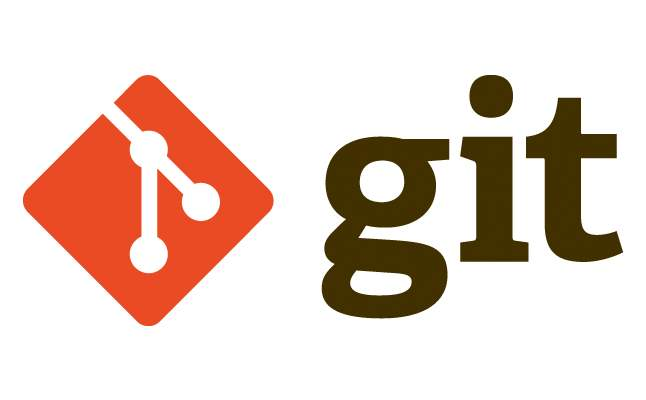

# 1. git介绍

## 1.1. 版本控制系统

- 集中式版本控制系统

  > 集中式版本控制系统，版本库是集中存放在中央服务器的，而干活的时候，用的都是自己的电脑，所以要先从中央服务器取得最新的版本，然后开始干活，干完活了，再把自己的活推送给中央服务器。
  >
  > 集中式版本控制系统最大的毛病就是必须联网才能工作，如果在局域网内还好，带宽够大，速度够快，可如果在互联网上，遇到网速慢的话，那就GG了.  

  

- 分布式版本控制系统

  > 分布式版本控制系统根本没有“中央服务器”，每个人的电脑上都是一个完整的版本库，这样，你工作的时候，就不需要联网了，因为版本库就在你自己的电脑上。
  >
  > 既然每个人电脑上都有一个完整的版本库，那多个人如何协作呢？
  >
  > 分布式版本控制系统通常也有一台充当“中央服务器”的电脑，但这个服务器的作用仅仅是用来方便“交换”大家的修改，没有它大家也一样干活，只是交换修改不方便而已。

  

# 2. 创建本地版本库

> 版本库又名仓库，英文名**repository**，你可以简单理解成一个目录，这个目录里面的所有文件都可以被Git管理起来，每个文件的修改、删除，Git都能跟踪，以便任何时刻都可以追踪历史，或者在将来某个时刻可以“还原”。

## 2.1 概念

- 工作区

  - 存储版本库的目录
  - 要提交的代码需要放到工作区中

- 版本库

  - 工作区中一个名字为  .git 的隐藏目录

- 暂存区

  - 暂存区在版本库中, 也就是说在 .git 目录中
  - 对应是叫stage或者 index的文件
  
  
  
  
  
  - 提交代码的流程
    - 要在工作区中创建新文件
    - 将工作区中的新文件添加到暂存区
      - 文件只需要往暂存区添加一次
    - 将暂存区数据提交到版本仓库
      - 版本仓库中有很多节点, 依次记录着我们提交的各个版本

## 2.2 操作步骤

- 创建版本库

  - 找一个存储代码的空目录

  - 在这个目录中单击鼠标右键

    

  - 直接确定

    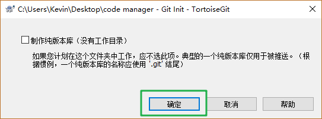

  - 这个目录就是创建出来的版本库

    

- 添加新文件

  - 工作区鼠标右键

    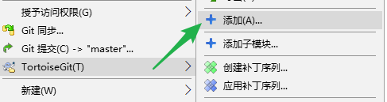

    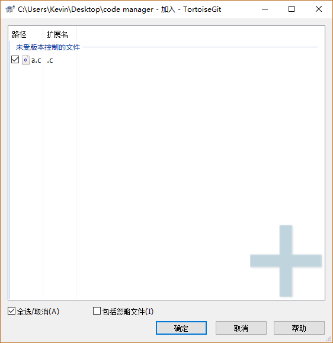

  

- 提交文件

  - 工作区鼠标右键
  
    
  
  - 填写日志信息, 提交
  
    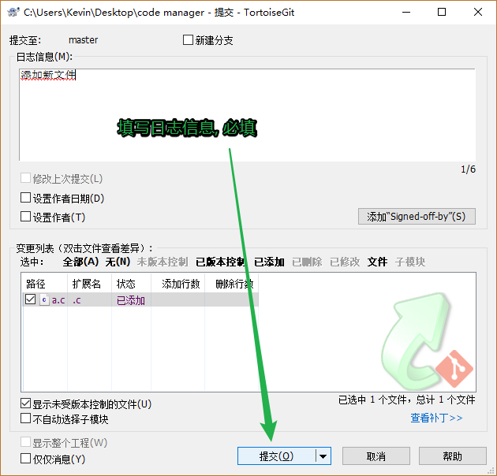
  
  

# 3. 修改文件

- 修改工作区文件

  - 对源文件修改确认没问题就可以再次提交

    

  - 每提交一次, 在git仓库中会添加一个新的节点, ==> 增加了一个版本

- 还原修改

  - 可以还原的场景:
    - 修改了工作区的文件, 但是还没有提交之前, 如果提交了, 使用这个功能就无法还原了
    - 还原成功之后, 修改就无法找回了

  

- 查看修改历史

  - 可以看到提交 的各个版本

    

- 差异比较

  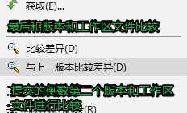

- 删除文件

  - 删除工作区文件 

    

  - 删除代码仓库中的文件

    

    

  - 最后提交就可以了

# 4. 练习: 添加一个本地项目到仓库

- 设置文件忽略

  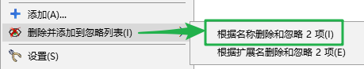

  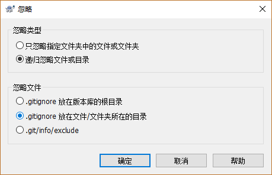

- 提交忽略的文件或目录

  

# 5. 添加远程仓库

## 5.1 添加远程仓库

在线代码托管平台 

- Github: https://github.com/
- 码云: https://gitee.com/

创建仓库

- 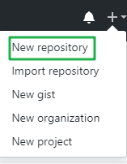
- 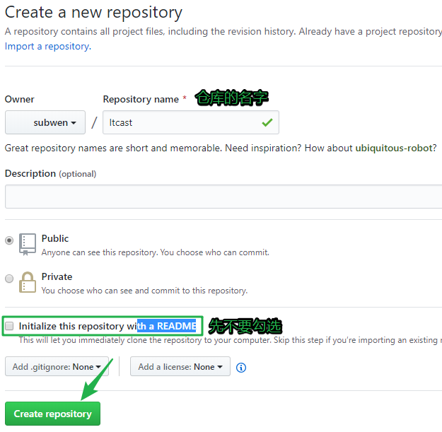

## 5.2 本地仓库同步到远程仓库

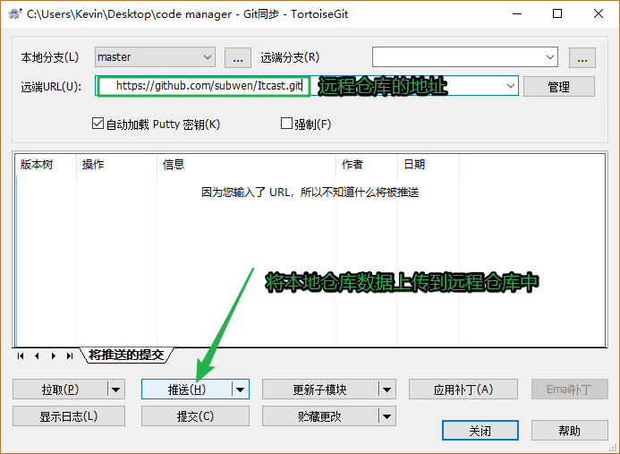

## 5.3 克隆远程仓库到本地

- 找一个本地目录, 存储下载的项目, 鼠标右键

  

- 填写远程地址

  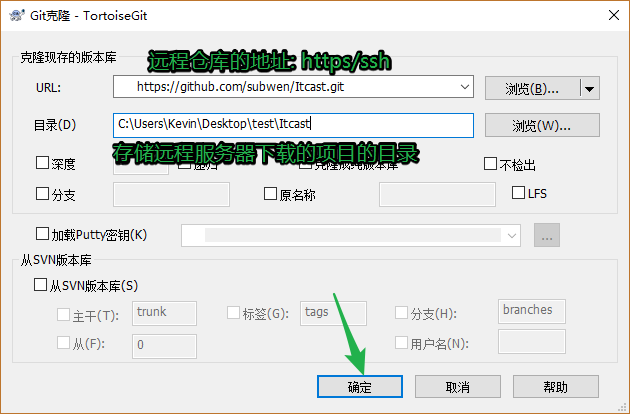

- 设置常用地址

  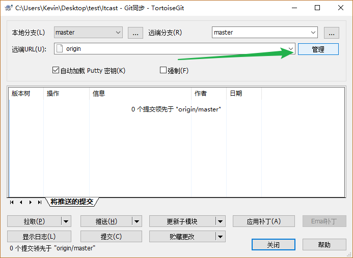

  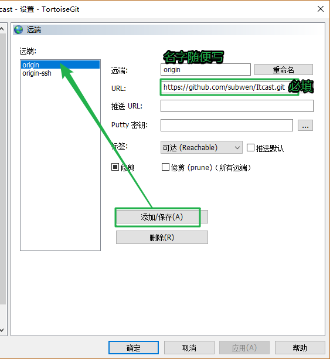

## 5.4 ssh设置

- 在本地生成一个密钥对

  - 随便找一个目录, 鼠标右键

    

  - 在弹出的终端中执行一个命令, 生成密钥对

    ```shell
    $ ssh-keygen -t rsa
    ```

  - 设置私钥

    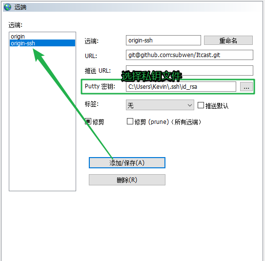

- 将公钥部署到github账号中 -> 服务器上

  - 选择账号头像的setting选项

  - 添加ssh key

    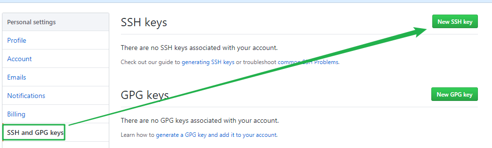

  - 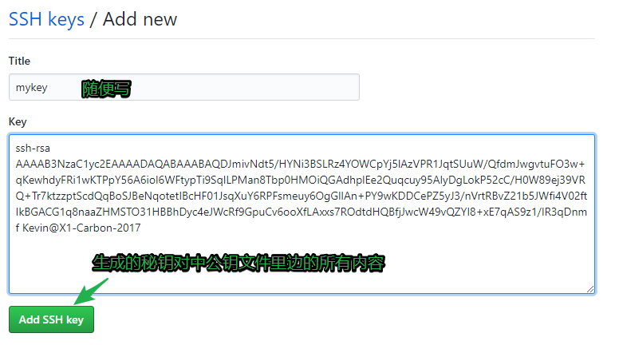

  - 使用ssh遇到的错误

    

    > 解决方案: 需要替换ssh工具, 默认使用的ssh工具是 TortoiseGit, 替换成 Git 的ssh工具

    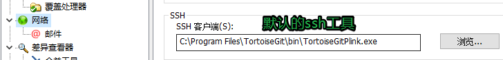

    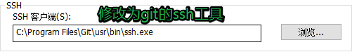

# 6. 分支管理

> 分支就是科幻电影里面的平行宇宙，当你正在电脑前努力学习Git的时候，另一个你正在另一个平行宇宙里努力学习SVN。
>
> 如果两个平行宇宙互不干扰，那对现在的你也没啥影响。不过，在某个时间点，两个平行宇宙合并了，结果，你既学会了Git又学会了SVN！
>
> 在版本仓库中有一个默认的分支: master, 当前仓库中有文件之后, 默认分支就被创建了


## 6.1 创建分支


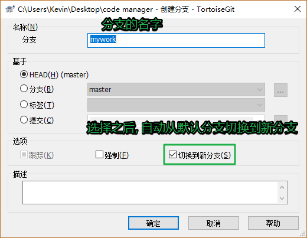

## 6.2 切换分支


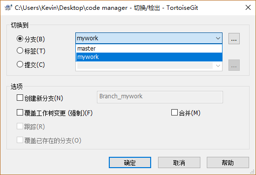

## 6.3 合并分支

> 要将数据合并到哪个分支, 就先切换到哪个分支上, 然后选择待合并分支


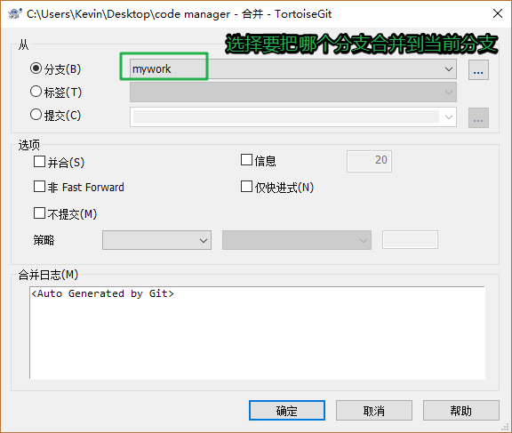

## 6.4 解决冲突

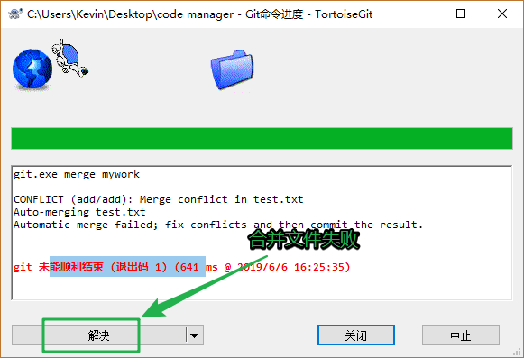

- 冲突文件发生冲突之后的文件格式

  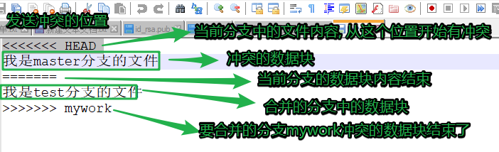

- 手动修改发生冲突的文件, 之后解决冲突

  

  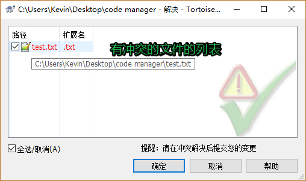

  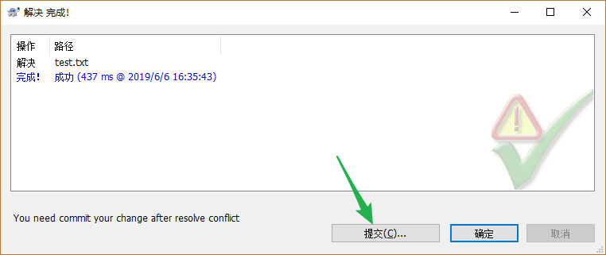

  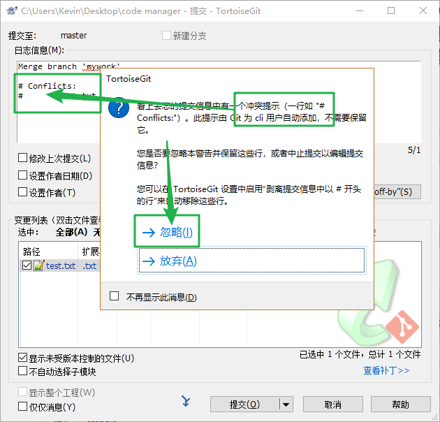

# 7. 推送文件

> 有一个远程的仓库-> github, 这不是一个空的仓库, 需要将本地的版本库提交到远程仓库
>
> - 直接将本地仓库内容推送到远程仓库会失败
> - 远程仓库:
>   - 不是空的, ==> 这个仓库中有一个默认的分支 master
> - 本地仓库:
>   - 有一个默认的分支 ==> master
> - 推送
>   - 将本地分支master中记录的版本信息提交到远程仓库的master分支中
>     - 要进程分支的合并
>   - 本地的master分支和远程的master分支有没有关系?
>     - 除了名字相同, 每有任何关系 ==> 会导致合并失败

- 解决方案:

  - 首先将远程分支下载到本地 -> 得到了另外的一个分支

    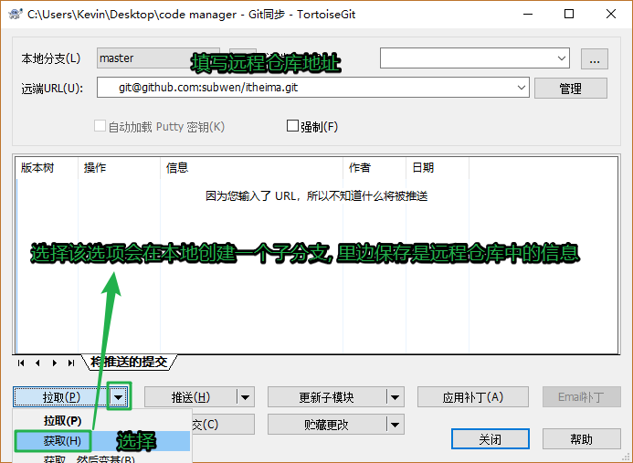

    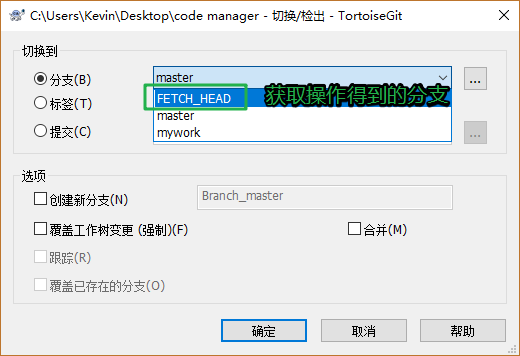

  - 强行将得到的分支合并到本地分支上

    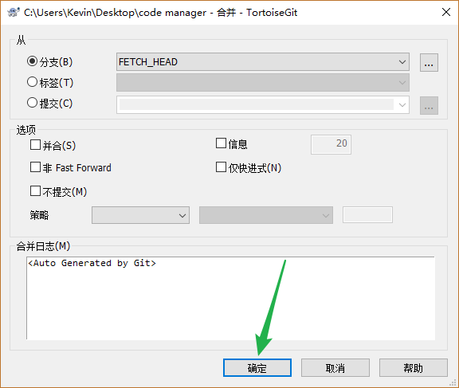

    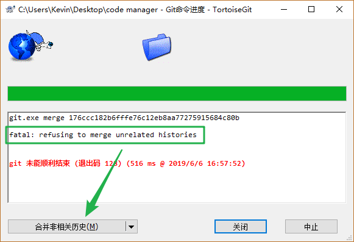

  - 合并成功(有可能要解决冲突), 再进行推送

    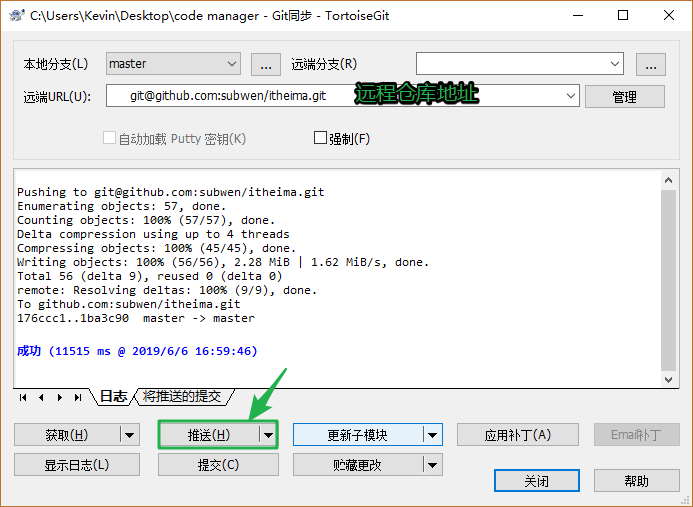

- 合并代码的一般步骤

  - 将远程仓库中的数据拉取到本地

    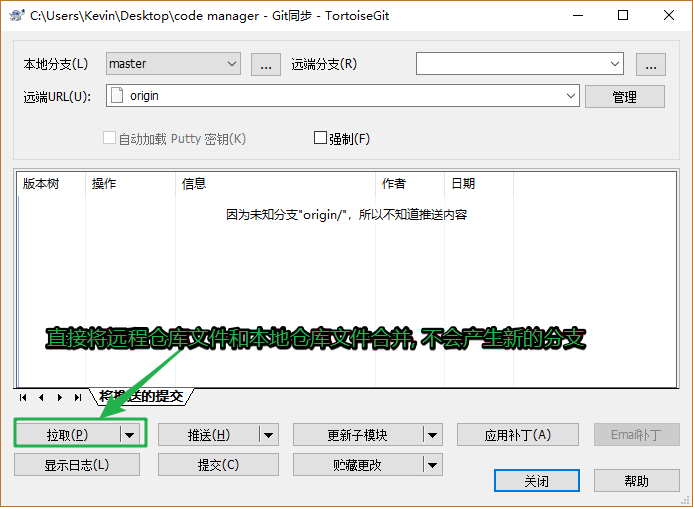

    - 有可能会冲突
    - 需要解决冲突

  - 推送