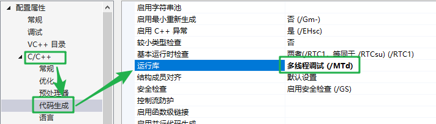
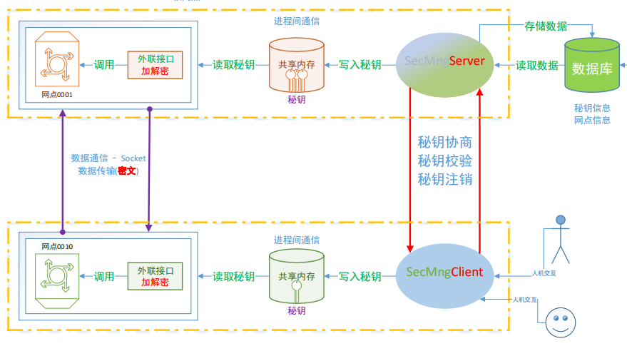

# 1. JsonCpp使用

```json
// json 是一种数据格式, 和语言无关
// 作用: 数据传输, 编写配置文件(程序运行的时候, 需要加载少量数据) 
// 格式: json数组, json对象
// josn数组 -> [], 元素类型, 可以相同, 可以不同
// 		支持的数据类型: int, float, double, string, bool, json数组, json对象
// json对象 -> {}, 里边是键值对
// 	键值: 必须是字符串
//  value值: int, float, double, string, bool, json数组, json对象

// 数组
[12, 19.8, true, "hello", ["a", "b", "c"], {"name":"xiaoming"}]
// 对象
{
    "father":"zhangsan",
    "mother":"李四",
    "other":{
        "爱好":["足球", "蓝求"],
        "isman":true,
        "age":12
    }
}
append(int )
append(bool )
```


## 1.1 安装

- windows 下的安装

  - `jsoncpp-0.10.7.tar.gz`

  - 解压, 进到解压目录

    - jsoncpp-0.10.7\makefiles\msvc2010

    - 使用vs编译这个项目

      

    - 在msvc2010下会生成Debug目录

      

    - 将  jsoncpp-0.10.7 下的`include`目录拷贝到本地磁盘目录, 方便vs包含

- jsoncpp在vs下的使用

  - 将生成的静态库 `lib_json.lib`放到创建的项目目录下 -> 这样就不用配置库路径了

    - 存储源文件的目录
    
  - 配置头文件目录
  
    
  
  - 设置在程序中加载的json库
  
    
  
    
  
  - 写程序
  
  - 测试

- Linux 下的安装

  - 准备安装包

    - `jsoncpp-0.10.7.tar.gz`
    - `scons-3.0.5.zip`

  - 解压缩

    ```shell
    $ tar zxvf jsoncpp-0.10.7.tar.gz
    $ unzip scons-3.0.5.zip
    ```

  - 安装scons -> 进入 `scons-3.0.5.zip` 的解压目录

    ```shell
    $ python setup.py install 
    ```

  - 安装 jsoncpp -> 进入 `jsoncpp-0.10.7.tar.gz` 的解压目录

    ```shell
    $ scons platform=linux-gcc 
    # 将生成的动态库/静态库拷贝到系统的库目录中, 需要管理员权限
    $ cp libs/linux-gcc-4.8.5/* /lib
    # 拷贝json的头文件到系统目录中, 需要管理员权限
    $ cp include/json/ /usr/include/ -r
    # 创建动态库的链接文件, 需要管理员权限
    ln -s /lib/libjson_linux-gcc-4.8.5_libmt.so /lib/libjson.so
    # 更新, 这样才能搜索到动态库 libjson.so。需要管理员权限
    $ ldconfig	
    # 测试
    $ ./bin/linux-gcc-4.8.5/test_lib_json 
    Testing ValueTest/checkNormalizeFloatingPointStr: OK
    Testing ValueTest/memberCount: OK
    Testing ValueTest/objects: OK
    Testing ValueTest/arrays: OK
    ..................
    Testing BuilderTest/settings: OK
    Testing IteratorTest/distance: OK
    Testing IteratorTest/names: OK
    Testing IteratorTest/indexes: OK
    All 53 tests passed
    ```

  - 编译 c++ 测试文件： json-test.cpp

    ```shell
    $ g++ json-test.cpp -ljson -o json
    ```

## 1.2 jsoncpp类的使用

- Value -> 对Json支持的数据类型进行封装

  ```c++
  // Json支持的数据类型
  Type = {int, double, float, string, char*, bool, JsonArray, JsonObject}
  // 构造函数
  Value(Type t);
  // 将Value对象转换成对应类型的数据
  Type asType();
  // 判断Value对象中存储的数据的类型
  bool isType();
  // 取值 
  // 格式化 -> 将对象转换为字符串
  // 适合于查看信息或者写文件
  std::string toStyledString() const;
  
  ```

  

- Reader

  ```c++
  // json格式字符串 -> Value对象
  bool parse(const std::string& document, Value& root, bool collectComments = true);
  bool parse(const char* beginDoc, const char* endDoc, 
             Value& root, bool collectComments = true);
  bool parse(std::istream& is, Value& root, bool collectComments = true);
  ```

  

- FastWriter

  ```c++
  // 将Value对象中的数据格式化 -> 字符串
  // 适合于网络数据的发送
std::string write(const Value& root);
  ```
  
  

# 2. 秘钥协商客户端



- 客户端的配置文件

  ```json
  // clientID, serverID, IP, Port
  {
      "clientID":"bj_tbd_001",
      "serverID":"bj_gugong_001",
      "serverIP":"127.0.0.1",
      "ServerPort":8888
  }
  ```
  
  
  
- 数据分析

  ```c++
  struct RequestMsg
  {
  	int cmdType;	
      string clientID;
      string serverID;
      string sign;
      string data; 
  };
  
  // 数据分析
  cmdType: 客户端给服务器发送请求的类型
  	1: 秘钥协商
  	2: 秘钥检验
  	3: 秘钥注销
  clientID: 当前客户端的身份
  serverID: 要连接的服务器的身份的标识
  sign: 携带的数据的签名
  data: 给服务器发送的数据
  ```

  

- 逻辑处理

  - 秘钥协商
    - 做一个选择的界面-> 让用户选择要操作的功能
      - 协商/校验/注销
    - 大的主题: 得到对称加密的秘钥 (最终要得到的)
    - 在客户端生成rsa密钥对, 公钥发送给服务器
    - 从磁盘将公钥数据读到内存
      - 发送之前可以对公钥数据签名 -> 密文
    - 初始化客户端发送的数据变量
    - 将准备好的数据序列化 -> 字符串
    - 网络通信
      - 连接服务器
      - 发送序列化之后的数据
      - 接收服务器回复的数据
      - 将接收的数据反序列化 -> 原始数据
    - 判断状态
    - 使用私钥将服务器公钥加密的数据解密 
      - 得到对称加密的秘钥
    - 将秘钥写入共享内存

# 3. 秘钥协商服务器

- 数据分析

  ```c
  struct RespondMsg
  {
  	bool status;
      int seckeyID;
      string clientID;
      string serverID;
      string data;
  };
  
  status: 服务器对客户端发出的请求的处理状态
  	true: 成功
  	false: 失败
  seckeyID: 生成的秘钥的编号, 从数据库中读取
  clientID: 回复的数据属于哪个客户端
  serverID: 当前服务器的ID
  data: 服务器给客户端回复的数据
  ```

  

- 逻辑处理

  - 秘钥协商
  
    - 启动服务器
  
      - 创建监听套接字
      - 绑定
      - 设置监听
  
    - 等待并接受连接请求 -> accept
  
      - 主线程处理 accept
  
    - 子线程 -> 通信
  
      - 建立连接之后, 处理客户端的请求
  
    - 子线程中处理逻辑
  
      - 接收客户端发送的数据
  
      - 将收到的数据解码 -> 反序列化 -> 结构体
  
      - 需要读 客户端发送的 cmdType 变量
  
        - switch(cmdType)
  
          {
  
          ​	case 1: 
  
          ​		秘钥协商();
  
          ​		break;
  
          }
  
    - 秘钥协商函数的实现
  
      - 校验签名
  
      - 从 data中读公钥
  
        - 公钥写到磁盘文件 -> 文件名(clientID)
  
        - 通过公钥加密一个 对称加密的秘钥  -> 密文
  
          - 对称加密的秘钥 -> 生成一随机字符串(16byte, 24byte, 32byte)
        
    - 初始化向客户端回复的数据结构体
      
      -  序列化要发送的结构体数据 -> 字符串
      
      -   发送序列化的字符串
      
      - 写共享内存
      
      - 写数据库
      
      - 释放资源     
      
        ​          

# Centos升级gcc/g++

## gcc 4.9

```shell
$ wget https://copr.fedoraproject.org/coprs/rhscl/devtoolset-3/repo/epel-6/rhscl-devtoolset-3-epel-6.repo -O /etc/yum.repos.d/devtoolset-3.repo
$ yum -y install devtoolset-3-gcc devtoolset-3-gcc-c++ devtoolset-3-binutils
$ scl enable devtoolset-3 bash
```

## gcc 5.2

```shell
$ wget https://copr.fedoraproject.org/coprs/hhorak/devtoolset-4-rebuild-bootstrap/repo/epel-6/hhorak-devtoolset-4-rebuild-bootstrap-epel-6.repo -O /etc/yum.repos.d/devtoolset-4.repo
$ yum install devtoolset-4-gcc devtoolset-4-gcc-c++ devtoolset-4-binutils -y
$ scl enable devtoolset-4 bash
```

## gcc 6.3

```shell
$ yum -y install centos-release-scl
$ yum -y install devtoolset-6-gcc devtoolset-6-gcc-c++ devtoolset-6-binutils
$ scl enable devtoolset-6 bash
```

> 需要注意的是scl命令启用只是临时的，退出shell或重启就会恢复原系统gcc版本。
> 如果要长期使用gcc 6.3的话：

```shell
$ echo "source /opt/rh/devtoolset-6/enable" >>/etc/profile
```

> 这样退出shell重新打开就是新版的gcc了
> 其他版本同理，修改devtoolset版本号即可。

## gcc 7.3

```shell
$ yum -y install centos-release-scl
$ yum -y install devtoolset-7-gcc devtoolset-7-gcc-c++ devtoolset-7-binutils
$ scl enable devtoolset-7 bash
```

> 需要注意的是scl命令启用只是临时的，退出shell或重启就会恢复原系统gcc版本。
> 如果要长期使用gcc 7.3的话：

```shell
$ echo "source /opt/rh/devtoolset-7/enable" >>/etc/profile
```

