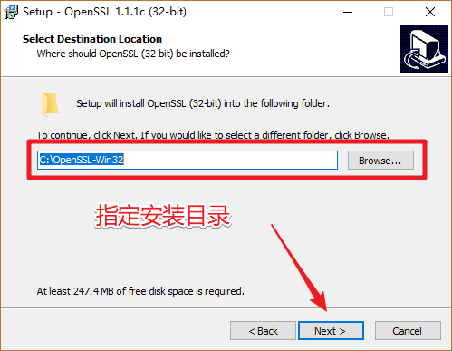
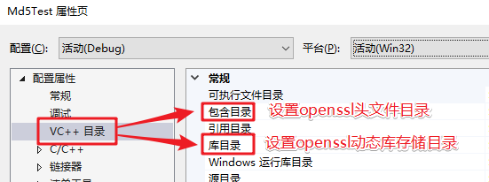

# 1. openssl的安装和使用

## 1.1 windows下安装openssl

> 下载地址: http://slproweb.com/products/Win32OpenSSL.html

选择合适的版本进行安装


以下以win32版本安装为例，安装步骤如下：




恭喜，OpenSSL安装完成。

将安装目录下的`bin`添加到系统环境变量中, 方便访问


## 1.2 Linux下安装OpenSSL

1. 下载安装包, 下载地址:  <https://www.openssl.org/source/>

2. 源码安装包解压缩

   - openssl-1.1.1c.tar.gzip 解压:

     ```shell
     $ tar zxvf openssl-1.1.1c.tar.gzip
     # 加压完成得到目录: openssl-1.1.1c
     ```

3. 进入解压目录`openssl-1.1.1c`, 安装（可参考安装文件INSTALL）:

   ```shell
   $ ./config
   $ make
   $ make test 		（可选）
   $ make install	 (使用管理员权限执行该命令)
   ```

4. 验证是否安装成功

   ```shell
   $ openssl version -a
   openssl: error while loading shared libraries: libssl.so.1.1: cannot open shared object file: No such file or directory
   # 根据之前讲的动态库知识解决动态库找不到的问题。
   ```

   > 执行命令， 正确的输出结果： 

   ```shell
   $ openssl version -a
   OpenSSL 1.1.1c  28 May 2019
   built on: Fri May 31 03:54:40 2019 UTC
   platform: linux-x86_64
   options:  bn(64,64) rc4(16x,int) des(int) idea(int) blowfish(ptr) 
   compiler: gcc -fPIC -pthread -m64 -Wa,--noexecstack -Wall -O3 -DOPENSSL_USE_NODELETE -DL_ENDIAN -DOPENSSL_PIC -DOPENSSL_CPUID_OBJ -DOPENSSL_IA32_SSE2 -DOPENSSL_BN_ASM_MONT -DOPENSSL_BN_ASM_MONT5 -DOPENSSL_BN_ASM_GF2m -DSHA1_ASM -DSHA256_ASM -DSHA512_ASM -DKECCAK1600_ASM -DRC4_ASM -DMD5_ASM -DAES_ASM -DVPAES_ASM -DBSAES_ASM -DGHASH_ASM -DECP_NISTZ256_ASM -DX25519_ASM -DPOLY1305_ASM -DNDEBUG
   OPENSSLDIR: "/usr/local/ssl"
   ENGINESDIR: "/usr/local/lib/engines-1.1"
   Seeding source: os-specific
   ```

## 1.2  VS中使用openssl

> 打开VS, 创建一个空的控制台应用程序


> 设置项目属性, 打开项目的属性面板



> 添加openssl头文件目录


> 选择安装目录下的 `include`目录, 里边存储了openssl的头文件


> 添加openssl的库目录


> 配置完毕


## 1.3. 测试

### 1.3.1 VS中的相关设置

> 打开项目属性窗口, 添加openssl相关的库到项目中
>
> ==**项目属性 -> 链接器 -> 输入 -> 附件依赖项**==
>
> - **libssl.lib**
> - **libcrypto.lib**


> 测试代码如下:

```c
#define _CRT_SECURE_NO_WARNINGS
#include <openssl/md5.h>		// md5 头文件
#include <stdio.h>
#include <string.h>
#include <stdlib.h>

void getMD5(const char* str, char* result)
{
	MD5_CTX ctx;
	// 初始化
	MD5_Init(&ctx);
	// 添加数据
	MD5_Update(&ctx, str, strlen(str));
	// 计算结果
	unsigned char md[16] = { 0 };
	MD5_Final(md, &ctx);
	for (int i = 0; i < 16; ++i)
	{
		sprintf(&result[i * 2], "%02x", md[i]);
	}
}

int main()
{
	char result[33] = { 0 };
	getMD5("hello, md5", result);
	printf("md5 value: %s\n", result);
	system("pause");

	return 0;
}
```

```shell
#输出结果: 
`md5 value: 33b3bc8e05b4fcc16bd531dd9adac166`
```

### 1.3.2 Linux下的使用和测试

1. 编程应用程序,  测试代码如上, 文件名为  `md5_test.c`

2. 通过gcc编译源文件

   ```shell
   $ gcc md5_test.c -o md5 -lcrypto
   执行该命令, 需要加载openssl的动态库
   	- libssl.so
   	- libcrypto.so
   ```


# 2. protobuf的安装

## 2.1 windows 平台 （vs2017）

- 安装protobuf
  - 下载protobuf的C++版本的源代码，地址：https://github.com/google/protobuf/releases 
    - 下载 protobuf-cpp-3.8.0.zip/tar.gz 这个包
  - 解压源码 （路径不要带中文）

- 安装cmake，下载地址：https://cmake.org/download/

- 使用cmake 生成 vs2017 工程

  

  

  > 执行完这一步之后，需要稍等一小会儿。


- 进入 vs2017 工程目录，使用vs2017打开，`F7` 编译
- 编译完成 ，在 vs2017工程目录 /Debug 目录下，可以看到生成的库文件
- 将生成的动态库和头文件放到自定义目录中备用
- 在vs中指定头文件目录和库目录(根据自己上一步实际的存储目录进行指定)
- 修改vs其他配置（这个很重要 ） 
  - 修改预处理器定义： 
    - 项目属性->c/c++ -> 预处理器 -> 预处理器定义 添加这个`PROTOBUF_USE_DLLS `宏定义 


## 2.2 在linux下的安装

参考资料: <https://github.com/protocolbuffers/protobuf/tree/master/src>

> 一键安装:`sudo apt-get install autoconf automake libtool curl make g++ unzip -y`


- 下载源码安装包: `protobuf-cpp-3.8.0.tar.gz`

- 解压缩

  ```shell
  $ tar zxvf protobuf-cpp-3.8.0.tar.gz
  ```

- 安装 -> 进入到解压目录

  ```shell
  $ cd protobuf-3.8.0
  $ sudo ./configure
  $ sudo make
  	$ sudo make check	# (可选)make的同时检测安装的东西能不能用
  $ sudo make install
  ```


# 3 JsonCpp

## 3.1 安装

- `jsoncpp-0.10.7.tar.gz`

- 解压, 进到解压目录

  - jsoncpp-0.10.7\makefiles\msvc2010

  - 使用vs编译这个项目

    

  - 在msvc2010下会生成Debug目录

    

  - 将  jsoncpp-0.10.7 下的`include`目录拷贝到本地磁盘目录, 方便vs包含

- jsoncpp在vs下的使用

  - 将生成的静态库 `lib_json.lib`放到创建的项目目录下 -> 这样就不用配置库路径了

    - 存储源文件的目录

  - 配置头文件目录

    

  - 设置在程序中加载的json库

    

    

  - 写程序

  - 测试

    3.2 Linux 下的安装

  - 准备安装包

    - `jsoncpp-0.10.7.tar.gz`
    - `scons-3.0.5.zip`

  - 解压缩

    ```shell
    $ tar zxvf jsoncpp-0.10.7.tar.gz
    $ unzip scons-3.0.5.zip
    ```

  - 安装scons -> 进入 `scons-3.0.5.zip` 的解压目录

    ```shell
    $ python setup.py install 
    ```

  - 安装 jsoncpp -> 进入 `jsoncpp-0.10.7.tar.gz` 的解压目录

    ```shell
    $ scons platform=linux-gcc 
    # 将生成的动态库/静态库拷贝到系统的库目录中, 需要管理员权限
    $ cp libs/linux-gcc-4.8.5/* /lib
    # 拷贝json的头文件到系统目录中, 需要管理员权限
    $ cp include/json/ /usr/include/ -r
    # 创建动态库的链接文件, 需要管理员权限
    ln -s /lib/libjson_linux-gcc-4.8.5_libmt.so /lib/libjson.so
    # 更新, 这样才能搜索到动态库 libjson.so。需要管理员权限
    $ ldconfig	
    # 测试
    $ ./bin/linux-gcc-4.8.5/test_lib_json 
    Testing ValueTest/checkNormalizeFloatingPointStr: OK
    Testing ValueTest/memberCount: OK
    Testing ValueTest/objects: OK
    Testing ValueTest/arrays: OK
    ..................
    Testing BuilderTest/settings: OK
    Testing IteratorTest/distance: OK
    Testing IteratorTest/names: OK
    Testing IteratorTest/indexes: OK
    All 53 tests passed
    ```

  - 编译 c++ 测试文件： json-test.cpp

    ```shell
    $ g++ json-test.cpp -ljson -o json
    ```


## 3.2 使用

```json
// json 是一种数据格式, 和语言无关
// 作用: 数据传输, 编写配置文件(程序运行的时候, 需要加载少量数据) 
// 格式: json数组, json对象
// josn数组 -> [], 元素类型, 可以相同, 可以不同
// 		支持的数据类型: int, float, double, string, bool, json数组, json对象
// json对象 -> {}, 里边是键值对
// 	键值: 必须是字符串
//  value值: int, float, double, string, bool, json数组, json对象

// 数组
[12, 19.8, true, "hello", ["a", "b", "c"], {"name":"xiaoming"}]
// 对象
{
    "father":"zhangsan",
    "mother":"李四",
    "other":{
        "爱好":["足球", "蓝求"],
        "isman":true,
        "age":12
    }
}
append(int )
append(bool )
```

