# 1 编译器

## 1.1 编译器通用

## 1.1.1 宏

```c++
# c++11和ISO c99 支持
	system("pause"); /* 阻塞/暂停功能 */
	return EXIT_SUCCESS; /* 返回正常的退出 0 */
	f9a2d881-5ee5-11eb-8b02-813fedf98f76
        
```

### 1.1.2 const修饰/extern链接inline内联函数

```c++
const int vaule = 10; /* const全局变量(常量区不能直接或间接修改), 局部变量为符号表键值对不可以修改*/

'内部链接属性'
	extern int a = 10; // C++默认内部链接
	/* 全局变量定义也是为默认的extern(表示已在其他源文件中定义,不用分配空间,直接使用其他源文件的a变
	量) */
	extern int add(int a, int b); /*函数声明(已在其他源文件中声明定义,直接使用其他源文件的函数) */
	static int b =10; //静态 全局变量为内部链接只能在本文件使用

# const分配内存请情况
	/* 对 const 修饰的变量取地址会临时分配内存将符号表的值放入内存,指针修改内存不影响符号表 */

# extern
	/* 修饰的可以链接外部的 const 变量自定义数据类型(struct结构体)普通变量用于初始化 const 修饰
	变量的值 */

#inline 内联函数 
	/* 代替宏定义/宏函数,避免宏定义缺陷(运算完整性),声明和实现都要加关键字inline */
	/* 内联函数没有函数入口和堆栈操作不能使用以下限制,和宏一样直接把源代码替换在调用内联函数的地方 */
	/* 类函数默认是内联函数,操作不当会变成否则会变成普通函数,不能存在任何形式的循环语句
    不能存在过多的条件判断语句,函数体不能过于庞大,不能对函数进行取操作址 */

#define cat(a,b) a##b // 将两个字符变量名合并在一起 -- cat(a,b) -> a##b --> ab //
```

## 1.2 VS编译器特有宏

```c++
#预定义宏
	__FILE__ /* 宏所在文件的源文件名(路径) */
	__LINE__ /* 宏所在行的行号 */
	__DATE__ /* 代码编译的日期 */
	__TIME__ /* 代码编译的的时间 */
	__func__ /* 宏所在的当前函数 */
	__cplusplus /* */
	__CHAR_UNSIGNED /* 如果char类型为无符号,该宏定义为1否则未定义 */
	__COUNTER__ /* 从0开始,每次使用都会递增1 */
	_DEBUG /* 如果设置了/lDd/mDd/mTd改宏定义为1否则未定义*/
	__FUNCTION__ /* 函数名称 不含修饰名 */
	__FUNCDNAME__ /* 函数名称 包含修饰名 */
	__FUNCSIG__ /* 包含了函数签名的函数名 */
	_WIN32 /* 当编译为32位ARM,64位ARM,X86或64定义为1 否则未定义 */
	_WIN64 /* 当编译为64位ARM或X64定义为1 否则未定义 */
	__TIMESTAMP__ /* 最后一次源代码修改时间和日期 */
```

## 1.3 Dll

```c++
'dll导出'
	extern "C" _declspec(dllexport) int function(int x, int y);

'dll导入'
	extern "C" __declspec(dllimport) __stdcall int function(int x, int y);
	extern "C" __declspec(dllimport) int function(int x, int y);

' .def'
	EXPORTS
	function @12 NONAME
```

# 2 C / .c

## 2.1 标准头文件

```c++
#include<stdio.h> /* 系统标准输入输出头文件 */
#include<stdlib.h> /* 外部系统程序条用头文件 */
#include<time.h> /* 获取当前系统时间 */
#include<string.h> /* 字符串处理函数头文件 */
#include<system> /* 调用系统函数 */
#include<sys/ty pes.h> /* 获取文件属性头文件 */
#include<sys/stat.h> /* 获取文件属性头文件 */
#include<stddef.h> /* 获取偏移量属性头文件 */
#include<stdarg.h>
```

```c++
void __declspec(naked) func1()
{
	__asm
	{
	......
	}
}
// VS引用汇编.asm文件

// Win32自定义生成工具
	命令行: ml /c /coff %(fileName).asm
	输出: %(fileName).obj;%(OutPuts)

// 64位
命令行: ml64 /Fo $(IntDir)%(fileName).obj /c %(fileName).asm
输出: $(IntDir)%(fileName).obj;%(Outputs)
```

```c++
'调用约定'
	__cdecl 从右至左入栈 调用者清理栈
	__stdcall 从右至左入栈 自身清理堆栈
	__fastcall ECX/EDX传送前两个,剩下:从右至左入栈 自身清理堆栈
```

## 2.2 数据类型

### 2.2.1 基础数据类型

> sizeof(变量名) 计算数据类型在内存中的大小(Byte)

```c++
char^1 	/* 字符型(1字节) */
    
short int^2 <= int^4 <= long int^4 <= long long int^8
/* 短整型(2字节) <= 整型(4字节) <= 长整型(4字节) <= 长长整形(8字节) */

float^4 <= double^8
/* 单精度浮点型(4字节)7位有效数值 <= 双精度浮点型(8字节)15~16位有效数字 */
```

```c++
char 1字节 -128 ~ 127 (-2^7 ~ 2^7-1)
unsigend char 1字节 0 ~255 (0 ~2^5-1)
short 2字节 -32768 ~ 32767 (-2^15 ~ 2^15-1)
unsigned short 2字节 0 ~ 65535 (0 ~ 2^16-1)
int 4字节 -2147483648 ~ 2147483647 (-2^31 ~ 2^31-1)
unsigned int 4字节 0 ~ 4294967295 (0 ~ 2^32-1)
long 4字节 -2147483648 ~ 2147483647 (-2^31 ~ 2^31-1)
unsigned long 4字节 0 ~ 4294967295 (0 ~ 2^32-1)
    
#原码补码
signed int a = 20 /* 有符号位(系统默认) */
unsigned int a =20 /* 无符号位 */
```

### 2.2.2 数据类型转换

```c++
"判断类型"
#include <ctype.h>
	bool a=isalnum("1"); /* 检查所传的字符是否是字母和数字如果是返回非0,否则返回0 */

"字符串里的数字转换为int类型"
	int a=atoi("8888"); /* 将字符串8转换为数字的8*/
```

### 2.3.3 位运算

```c++
'位运算'
	<<  /* 左移运算符(在二进制里，向左位移几倍就是乘以2的N次方)，正数不零，负数补1 */
	>>  /* 右移运算符(在二进制里，向右位移几倍就是乘以2的N次方)，正数不零，负数补1 */
	~  /* 求反运算符(在二进制里，改变符号位，所有的0变1，1变0) */
	&  /* 与运算(在二进制位里比较两个数，两个数同位中同时是1时结果才为1) */
	|  /* 或运算(在二进制位里比较两个数，两个数同位中有一个是1结果就为1) */
	^  /* 异或运算(在二进制位里比较两个数，两个数同位相同结果就位0) */
```

### 2.3.4 extern/static关键字

```c++
#define NAME number; /* #define 常量名 值 */
const int vaule = 10; 	/* const 全局变量(常量区不能直接或间接修改), 局部变量(堆区可以间接修改) */
extern int a = 10; /* 全局变量定义也是为默认的extern , 默认外部链接 */

extern int add(int a, int b); /* 函数声明 */
extern "C"{ int add();int sub();} // 声明这个函数时C语言风格函数,c++调用时用C语言风格调用
extern "C"{ #include "ios.h"} /* 头文件里的函数/变量按照C风格进行处理 */
static int b =10; /* 静态 全局变量为内部链接只能在本文件使用(地址在函数代码段里面) */
```

## 2.3 普通语句

```c++
break; /* 直接跳出当前循环层 */
continue /* 结束本轮循环并开始下一轮循环 */
exit(1); /* 正常退出 */
abort(); /* 非正常退出,弹出框 */
```

## 2.4 函数

```c++
	void __declspec(naked) func(){ ..... } /* 裸函数 */
```

### 2.4.1 标准输入输出函数

```c++
scanf("%d", &a); /* 标准输入函数,&取地址符号 */
scanf("%s, a[ ] "); /* 输入字符串,遇到空格结束 */
printf("%d\n",a); /* 标准输出函数,打印 */
ptintf("%p\n", &a); /* 以十六进制打印变量内存地址 */
' 打印格式: '
	%o /* 将数据按照八进制输出 */
	%x /* 将数据按照十六进制小写输出 */
	%X /* 将数据按照十六进制大写输出 */
	%d /* 将数据按照十进制类型输出 */
	%p /* 以十六进制打印内存地址 */
	%s /* 输出 字符数组 */
	%c /* 输出 char 型 */
	%5.2f /* 输出 float 类型 (小数点前面保留5位.2 小数点后面保留2位小数) */
	%lf /* 输出 double 型 */
	%hd /* 输出 short 类型 */
	%d /* 输出 int 类型 */
	%l /* 输出 long 类型 */
	%ll /* 输出 long long 类型 */
	%hu /* 输出 unsigend short 类型 */
	%u /* 输出 unsigend int 类型 */
	%lu /* 输出 unsigend long 类型 */
	%llu /* 输出 unsigeng long long 类型 */
    
'无显示输入'
	#include <conio.h>
	int _getch() /* 有的平台无法使用 */
```

### 2.4.2数学函数

#### 2.4.2.1 取绝对值

```c
#include <math.h>
	abs(a-b); /* 取整数的绝对值 */
	fabs(a); /* 取浮点数的绝对值 */
	sqrt(a+b); /* 开平方 */
	pow(x,y) /* x 和 y 是浮点数 */
```

#### 2.4.2.2 随机数

```c
#include <time.h> /* 引入随机数头文件 */
	srand((unsigned int)time(NULL)); /* 置随机数种子(强转无符号整型) */
	int a = rand(); /* 生成随机数,并定义a接受 */
```

### 2.4.3 获取操作系统时间函数

```c
	struct tm {
		int tm_sec; /* seconds after the minute - [0,59] 秒数 */
		int tm_min; /* minutes after the hour - [0,59] 分 */
		int tm_hour; /* hours since midnight - [0,23] 时 */
		int tm_mday; /* day of the month - [1,31] 日 */
		int tm_mon; /* months since January - [0,11] 月 */
		int tm_year; /* years since 1900 年 */
		int tm_wday; /* days since Sunday - [0,6] 周一至周日 */
		int tm_yday; /* days since January 1 - [0,365] */
		int tm_isdst; /* daylight savings time flag */
	};
	time(time_t*); /* 返回从1970-1-1到现在的秒数,传出参数存放返回秒数的地址 */
	localtime(time_t*); /* 将秒数转换为时分秒的结构体,返回值是结构体*/

例:
	time_t t; // time_t [long long int]
	time(&t);
	struct tm* timeInfo=localtime(&t);
	printf("%d\n",timeInfo->tm_sec);
```

### 2.4.4 字符串处理函数

```c++
#include <string.h>
getchar(); 		// 从键盘接收一个字符并显示出来(按回车结束阻塞,但是只接收第一个字符)
getch();	 	// 从键盘接收一个字符但不显示出来
getche(); 		// 有返回的显示(接收一个字符停止阻塞)
gets(string); 	/* 接收字符串并保存在变量里字符串可以带空格遇到换行符或结束标志结束. /getchar强
					化 */
puts(string); 	/* 获取输出字符串变量,输出完后自动\n换行. /printf强化 */
fgets(string, sizeof, stdin); 	/* 从指定的文件内读入字符,直到出现换行结尾或 sizeof -1结
					束最后一个加上\0结束<字符串, 指定最大读取长度, 文件指针> */
fputs(string, stdout); /* 将指定的字符串写入到指定的文件中遇到\0,字符串结束符不写入文件 */
scanf("%[^\n]", string) /* 输入字符串,遇到\n结束,适用于字符串中带空格 */
sscanf(string1, "%s %d", string2, &a); //将 1 中的数据读取出来,并转换后放入 2 和 a中 */
	%*s 或者 %*d /* 跳过数据(字符串,整型) */
	%[width]s /* 读取指定宽度(长度)的数据 */
	%[a-z] /* 匹配 a 到 z 中的任意字符 */
	%[aBc] /* 匹配 a B c 中的一员 */
	%[^a] /* 匹配非 a 的任意字符 */
	%[^a-z] /* 读取除 a-z 以外的所有字符 */
printf(%s, string); /* 输出自字符串 */
sprintf(string1, "%s %d", strint2, string3); /* 将 3 和 2 的数据格式化后放入 1 中*/
strlen(string); /* 字符串的有效长度遇到\0计\0前面的 */
strcpy(string1, string2); /* 将源字符串2拷贝进目标字符串1中 */
strncpy(string1, string2, number); /* 拷贝相应数量的源字符串2放入目标字符串1中,无结束标志\0 */
string1[number] = '\0'; /* 手动添加结束标志否则数据溢出出现乱码 */
strcat(string1, string2); /* 将字符串2追加到字符串1中 */
string(string1, " "); /* 字符串追加空格 */
strncat(string1, string2, number); /* 追加相应数量的源字符串2放入目标字符串1中,有结束标志\0 */
strcmp(string1, string2); /* 比较字符ASCII码大小(返回值>0 <0 0 或者 1 0 -1 大于小于等于) */
strncmp(string1, string2, number) /* 取相应数字的字符比较字符ASCII码大小(返回值 >0 <0 0
								或者 1 0 -1) */
stricmp(string1, string2); /* 以大小写不敏感方式比较两个字符串 */
strchr(string, 'c'); /* 在字符串 1 中查找 字符2 出现的位置,返回位置地址 */
strchr(string, "abcde"); /* 匹配多个字符*/
strrchr(string,'c'); /* 在字符串 1 中查找 字符2 最后出现的位置,返回位置地址*/
strstr(string1, string2); /* 在字符串 1 中查找 字符串2 出现的位置的地址,返回位置地址 */
strtok(string, "string"); /* 字符串分割,遇到 "string" 进行切割 */
strspn(string, "string"); /* 在 1 中查找非 2 字符集里的字符出现的第一个位置,返回下标 */
strcspn(string, "string"); /* 在 1 中找 2 里面所包含的字符出现的第一个位置,返回下标*/
strpbrk(string1, string2); /* 在 1 中找 2 里面所包含的字符出现的第一个位置,返回字符串 */
atof(string); /* 把一个以小数形式的字符串转化为浮点型 */
atoi(string); /* 跳过前面的所有空格将字符串中的数字和正负号转化为整形(long类型) */
_wtoi(wchar_t); /* 转换宽字符串为整型 */
isalnum(char); /* 判断此字符是不是字符数字0-9 a-z A-Z *
```

### 2.4.5函数不定量参数

```c++
#include <stdarg.h>
/* 返回的命令行参数是字符串类型 */
int print(const char *format, ...)
{
	va_list args;
	const char *args1;
	va_start(args, format);
	args1 = va_arg(args,const char *);
	va_end(args);
	printf("format=%s args1=%s", format, args1);
}
```

## 2.5 指针/内存

> 32位系统中4个字节,64位系统8个字节

### 2.5.1  指针类型

```c++
'整型指针'
	int* p;

'字符指针'
	char* p;

'数组指针'
	int (*p)[n];

'指针数组'
	int* p[n];

'指针函数'
	int* pAdd(int,int); //指针函数是指一个返回指针的函数

'函数指针'
	int (*func)(int,int)=Add; // 函数指针的类型取决于返回值类型
	func(1,2);
	typedef char(*pFunc)(int,int); // 声明一个函数指针类型
	using pFunc = char(*)(int,int); // 声明一个函数指针类型
	pFunc a = (pFunc)add;

```

### 

### 2.5.1 static静态变量/函数

```c++
static int a = 10; /* 静态全局变量(只能初始化一次),作用域只是本文件 */
static void fun1( ); /* 静态函数(声明时不能与extern使用),作用域只是本文件 */
```

### 2.5.2 内存四区

```c++
#代码区 /* 程序指令 */

#数据区(静态区,全局区)
	初始化的数据 /* 初始化的全局变量, 初始化的静态全局变量, 初始化的静态全局变量 */
	未初始化的数据(默认初始值未0)/* 未初始化的静态局部变量,未初始化的全局变量,未初始化的静态全局变量 */

常量 
	/* 字符串常量, define定义的常量 */
  
#堆区 
	/* 变量, 数组, 结构体, 指针, 枚举, 函数形参, const常量*/

#栈区 
	/* 音频文件, 视频文件, 图像文件, 文本文件, 大数据 */
```

#### 2.5.2.1 申请堆区内存

```c++

// C
	#include <stdlib.h>
	int* p1 = (int*)malloc(sizeof(int)*x);
	int* p2 = (int*)calloc(x,sizof(int)); //申请内存并初始化为0
	int* p3 = (int*)realloc(p2,sizof(int)); //重新分配 p2内存的大小，原数据不丢失
	free(p1); p1=NULL;

// C++
	#include <iostream>
	int* p1 = new int; // 申请一个int内存大小的堆空间,如果是类,用new会调用构造函数,malloc不会调用构造函数
	int* p2 = new int[x]; // 申请x个int元素大小的内存空间
	delete p1; p1=NULL;
	delete[] p2; p2=NULL;
```

#### 2.5.2.2 内存空间字符串函数 

```c++
#include <string.h>
memset(p, 0, sizeof); /* 重置开辟的空间会重置每个字节(int)类型有效重置0<目标, 重置值, 字节大小> */
memcpy(p, src, size); /* 拷贝相应路径的值放入目标地址中, 源地址和目标地址不能发生重叠,字符大小 */
memmove( ); 	/* 和 memcpy() 用法一样,效率偏低, 源地址和目标地址可以发生重叠 */
memcmp(p1, p2, size); /* 比较 p1 p2 所指向的前 n 个字节 (等于 = 大于> 小于< ) */
```

## 


## 2.6 复合类型/结构体

### 2.6.1 结构体 

```c++
# 结构体变量
	struct info { }namev; /* 结构体定义,结构体名称 */
	namev.name = value; /* 结构体变量(赋值字符串需要用 strcpy() 赋值) */

#结构体指针
	struct info { }stu; /* 结构体定义 */
	struct info *s = &stu /* 指针指向stu变量 */
	s->name = value; /* 给指针成员赋值 */

offsetof(struct info, name); /* 获取结构体成员相对于结构体首地址的偏移量 */
```

### 2.6.2 共用体/联合体 (union)

> 用法与结构体一样,大小是最大成员大小,所有成员公用一块内存

### 2.6.3 枚举(enum)

> 书写格式与结构体一样,用于流程控制

## 2.7 C语言文件操作 

### 2.7.1 打开方式/基本函数

```c++
int fclose(fp); /* 关闭文件,操作完文件 */
FILE *fp = fopen("URL", "r"); /* 打开文件,返回值为空打开失败 <需打开文件的路径, 打开文件的设置>,
	r/rb(以只读模式打开一个文本文件(不创建文件,文件不存在会报错)),
	w/wb(以写的方式打开文件(文件存在会清空文件,不存在则会创建一个文件)),
	a/ab(以追加方式打开文件(在文本末尾添加内容,文件不存在会创建文件)),
	r+/rb+(以可读, 写的方式打开文件(不创建新文件)),
	w+/wb+(以可读, 写的方式打开文件(如果文件存在则清空文件,文件不存在创 建一个文件)), 
	a+/ab+(以添加方式打开文件,打开文件并在末尾跟该文件(文 件不存在创建文件)) 
	+b的是操作二进制文件 */
FILE* _fsopen(const char* filename, const char* mode, int shflag); /* 以独占模式打开*/

// ---> fgetpos()和fsepos()配对使用,fgetpos和fsetpos配对使用
char ch = fgetc(fp); /* 读取文件中的一个字符,顺序读取(使用while循环遍历整个文件断文件是
	否结尾feof判断文件是否结尾EOF判断字符是否结尾) */
fscanf(FILE* fp, char* temp); /* 从文件 fp 中读取字符串,并转换格式化数据与 scanf
用法一样 */
fgets(temp, size, fp); /* 从指定文件夹读入对应大小或者遇到\n,保存到temp中,字符串实际大小
大于对应设置大小,再次读取从上次读取结尾处,遇换行后时直接多次调用(多次调用需使用memset重置) */
fprintf(FILE* fp, char* temp); /* 转换格式化字符串temp(用法与printf()一样),将结果保存
搭配fp中,遇\0结束 */
	fprintf(fp, "%d %s", 111); /* 第三个变量是存放数据的变量,或者常量 */
fputs(str, fp); /* 将str所指定的字符串写入fp文件夹中,字符串结束符,\0不写入返回值0成功 -1失败 */
fputc('A',fp); /* 将一个字符写入文件中,会覆盖之前的内容 */

feof(fp); /* 检测是否读取到文件结尾,返回值非 0 以到结尾, 0 未结尾 */
fseek(fp, size, SEEK_SET); /* 移动文件 指定(size) 光标位置,从指定光标位置开始读写 */
	/* SEEK_SET 光标位置从文件开头位置移动 size 个字节 */
	/* SEEK_CUR 光标位置从当前位置位置移动 size 个字节 */
	/* SEEK_END 光标位置从文件末尾位置位置往前移动 size 个字节 (size为负数) */
long ftell(FILE *fp); /* 用于得到文件位置指针当前位置相对于文件首的偏移字节数 */
int len = ftell(FILE *fp); /* 返回当前光标位置 */
rewind(fp); /* 把文件光标的读写位置移动到文件开头 */
rename(const char *oldname, const char *newname); /* 文件重命名[要重命名的文件,新的文件名] */
remove( const char *path ); /* 删除文件[文件路径] */
int Findbyte(FILE* fp, char* bydata); /*按字节搜索数据*/


```

### 2.7.2 二进制文件读写操作 

```c++
fwrite(ptr, size, num, fp); /* 按照块级写入文件(覆盖写入)<要写入的数据, 一次写入的大
							小, 写入次数, 要写入的文件> */
fread(ptr, size, num, fp); /* 按照块级读取文件 */
```

### 2.7.3 文件属性/状态

```c++
# 获取文件状态
stat("URL", s); /* 获取文件状态,返回结构体 <文件名, 保存文件信息的结构体> */
	struct stat s = {0}; /* 定义接收结构体 */
	stat("URL", &s); /* 将 path 文件状态信息保存到 s */
	int size = s.st_size; /* 得到结构体中的成员变量 */

# 结构体成员变量
	st_dev /* 文件的设备编号 */
	st_ino /* 节点 */
	st_mode /* 文件的类型和存取权限 */
	st_nlink /* 连接到该文件的硬链接数量,刚建立的文件值为1 */
	st_uid /* 用户ID */
	st_gid /* 组ID */
	st_rdev /* 若此文件为设备文件,则为其设备编号(设备类型) */
	st_size /* 文件字节数(文件大小) */
	st_blksize /* 块大小(文件系统的I/O 缓冲区大小) */
	st_blocks /* 块数 */
	st_atime /* 最后一次访问时间 */
	st_mtime /* 最后一次修改时间 */
	st_ctime /* 最后一次改变时间(指属性) */
```

### 2.7.4 文件 重命名/删除 函数

```c++
remove(fp); /* 删除文件 成功返回值0, 失败-1 */
rename(aname, bname); /* 修改文件名 <旧文件名, 新文件名> 成功返回值0, 失败-1 */
```

### 2.7.5 结构成员偏移量

```c++
offsetof(struct a, b) /* 获取成员b相对于结构体开头a的偏移量 */
fflush(fp); /* 更新缓冲区,将缓冲区的数据立马写到文件 */
```

# 3 C++


## 3.1 C++头文件/c++调用C函数/c++导入库

### 3.1.1 标准头文件

```c++
#include <iostream> /* 系统标准输入输出头文件 */
#include <string> /* string类型使用必须引用 */
#include <stdexcept> /* 标准异常头文件 */
#include <iomanip> /* io man ip */
#include <fstream> /* 文件读写头文件 */
#include <locale> /* 字节 */
#include <cctypc> /* 字符串处理函数 */

using namespace std; /* 使用 std 命名空间 */
```

### 3.1.2 C++引用C

```c++
extern "C"{ int add();int sub();}
	/* 声明这个函数时C语言风格函数,c++调用时用C语言风格调用(.c不用) */
extern "C"{ #include "ios.h"} 	/* 头文件里的函数/变量按照C风格进行处理 */

	#ifdef __cplusplus /* 调用时判断是不是cpp调用,如果是就以C语言方式调用(extren "C")*/
	extren "C"
	{
	#endif
		int add(); /*会用C语言方式调用 */
	#ifdef __cplusplus
	}
	#endif

```

### 3.1.3 c++导入

```c++
// 导入 lib 库
1 '配置导入库的目录位置'
	1)"设置"->"VC++目录"->"库目录(.lib)"/"包含目录(.h)"

2 '导入库'
	1) #pragma comment(lib, "xxx.lib")
	2) "属性"->"链接器"->"输入"->"附加依赖项"->"xxx.lib;"
```

## 3.2 C++ I/O函数

| 类名       | 作用                                 | 在哪个头文件中声明 |
| ---------- | ------------------------------------ | ------------------ |
| ios        | 抽象基类                             | iostream           |
| istream    | 通用输入流和其他输入流的基类         | iostream           |
| ostream    | 通用输出流和其他输出流的基类         | iostream           |
| iostream   | 通用输入输出流和其他输入输出流的基类 | iostream           |
| ifstream   | 输入文件流类                         | fstream            |
| ofstream   | 输出文件流类                         | fstream            |
| fstream    | 输入输出文件流类                     | fstream            |
| istrstream | 输入字符串流类                       | strstream          |
| ostrstream | 输出字符串流类                       | strstream          |
| strstream  | 输入输出字符串流类                   | strstream          |

### 3.2.1 标准输出流

```c++
// #include <iostream>
# cout << "string " << endl; /* 标准的输出 (从缓冲区输出到屏幕) */
cout.flush() ; /* 刷新缓冲区, linux有效 */
cout.put() ; /* 向缓冲区写字符,一个字符 */
cout.write(buf, sizeof(buf)) ; /* 将字符数组输出到显示设备 */

cout.width(sizeof) ; /* 设置字符段的宽度 */
cout.fill('*') ; /* 设置填充空格字符 * */
cout.setf(ios::left); /* 设置输出格式状态 */
	ios::left /* 输出数据向左对齐 */
	ios::right /* 输出数据向右对齐 */
	ios::internal /* 数值的符号向左对齐, 数值向右对齐 */
	ios::dec /* 设置整数的基数为 10 */
	ios::oct /* 设置整数的基数为 8 */
	ios::hex /* 设置整数的基数为 16 */
	ios::showbase /* 显示整数基数(8为0开头, 16为 0x开头) */
	ios::showpoint /* 强制输出浮点数的小点和尾数0 */
	ios::uppercase /* 输出16进制输出字母为大写 */
	ios::showpos /* 对正数显示 '+' 号 */
	ios::scientific /* 浮点数以科学计数法格式输出 */
	ios::fixed /* 浮点数以定点(小数)格式输出 */
	ios::unitbuf /* 每次输出后刷新所有的流 */
	ios::stdio /* 每次输出后清除 stduot, stderr */
cout.unsetf(ios::dec); /* 卸载 十进制 */
	ios::dec /* 设置整数的基数为 10 */
	ios::oct /* 设置整数的基数为 8 */
	ios::hex /* 设置整数的基数为 16 */

'输出二进程内容'
	#include <bitset>
	std::bitset<要显示的二进制位数>(要显示的变量);
	{
	int test{0xFFFF };
	std::cout<<std::bitset<32>(test)<<endl;
    }
```

### 3.2.2 标准输入流

```c++
# cin >> "string"; /* 标准输入( 从输入设备输入到缓冲区) */
cin.get() 					/* 一次只能读一个字符 (C语言的 getchar()) */
cin.get(buf, sizeof(buf));	 /* 可以读取字符串, 换行符遗留在缓冲区  */
cin.getline(buf, sizeof(buf));	 /* 获取字符串,换行符未遗留在缓冲区中,并且从缓冲区中清除重载 */
cin.igonre( )	 /*忽略缓冲区字符(无参默认忽略一个字符,可以提供int类型参数,根据参数忽略个数) */
cin.peek() 		/* 查看缓冲区中的第一个字符,并不取走 */
cin.putback(buf)	 /* 将从缓冲区取出的buf放回缓冲区中,并且放回原位 */
cin.fail() ; 	/* 查看缓冲区的标志位, 0为正常 1为异常 */
cin.clear() ; 	/* 重置标志位 */
cin.sync() ;	 /* 清空缓冲区(vs2013可用,vs2015以上版本无效) cin.getline 清空缓冲区 */
```

### 3.2.3 C++文件读写 

```c++
#include <fstream>
    
std::ofstream fp("/a.txt", ios::out | ios::trunc); //创建文件写入对象,并指定路径 打开方式
	fp.open("/a.txt", ios::out | ios::trunc); //给已创建的文件写入对象设置路径和打开方式
		// ios::out 以输出(写)方式打开(默认),如果已有同名文件,将其原有内容删除
	if(fp.is_open()) //判断文件对象是否打开成功,返回值为 bool 值
	fp.close(); //关闭文件对象

std::ifstream ifs("/a.txt", ios::in) //创建文件读取对象,指定路径 打开方式
	ifs.open("/a.txt", ios::in) //给已创建的文件读取对象设置路径和打开方式
		ios::in //以输入(读)方式打开
	if(ifs.is_open()) //判断文件对象是否打开成功,返回值为 bool 值,打开成功为 true
```


### 3.2.3 string函数

```c++
std::string a{"abcdcfghijklmn"};
	std::string::length() /* 字符串的长度 */
	std::string::substr() /* 截取字符串 */
		std::string a1 = a.substr(5); /* 从下标位置为5开始截取一直到结尾 */
		std::string a2 = s.substr(5, 3); /* 从下标为5开始截取长度为3位 */
	std::string::compare() /* 比较字符串 */
		a.compare("Hello"); /* 比较字符串大小，返回int类型的值(相等0,小于负数，大于正数) */
		a.compare(5,4,"cdef"); /* 比较字符串大小 (起始位置,参与比较的长度,被比较的字符串) */
		a.compare(5,4, "cdef safasf",0,4)
			/* (起始位置,参与比较的长度,被比较的字符串,被比较字符串的起始位置， 长度)*/
	std::string::find() /* 搜索字符串,如果没找到返回 std::string::npos */
		a.find("dcfgh"); /* 搜索文本出现的位置 */
		a.find("dcfgh",3); /* 从位置3开始搜索 dcfgh */
	std::string::rfind() /* 从后往前搜索字符串 */
	std::string::insert() /* 插入字符串 */
	std::string::insert(3,"ddddddd"); /* 从位置3的地方插入字符串 */
	std::string::insert(3,2,'d'); /* 从位置3的地方插入2个字符 */
	std::string::insert(3,'daasdasdsaa',3,5); /* 从字符串位置3的地方截取5个字符插入位置a 3的
									地方 */
	std::string::c__str()
		const char* baseStr = str.c_str(); /* 返回常量指针,查看字符串存放地址 */
	std::string::date()
		const char* baseStr = str.c_str(); /* 查看字符串存放地址，返回常量指针(c++17改成非
											常量指针) */
	std::string::length() /* 查看字符串长度 */
	std::string::replace() /* 替换字符串 */
		string str(""id=user;);
		str.eplace(3,4,"zhangsan"); /* 被替换内容起始位置,被替换的长度,替换掉内容 */
		str.eplace(3,4,6,'*'); /* 被替换内容起始位置,被替换的长度,替换后的字符长度,替换掉内容 */
		str.eplace(3,4,"zangsan",7); /* 被替换内容起始位置,被替换的长度,要替换内容,要替换
									内容的长度 */
		str.eplace(3,4,"zangsan",5,3); /* 被替换内容起始位置,被替换的长度,要替换内容,截取要
										替换内容的起 始位置,要替换内容的长度 */
	std::string::erase() /* 删除字符串 */
		str.erase(); /* 删除所有内容 */
		str.erase(3); /* 从位置3开始后面全部删除 */
		str.erase(3,4); /* 要删除内容的起始位置,要删除的长度 */
		str.clear(); /* 删除所有内容 *
```

### 3.2.4 字符串处理函数

```c++
' #include <cctyoe> '
	int isupper(char) /* 判断字符是都为大写字母 */
	int islower(char) /* 判断字符是否为小写字母 */
	int isalpha(char) /* 看看字符是否为字母 */
	int isdigit(char) /* 看看字母是否为数字 */
	int isalnum(char) /* 看看字符是否为字母或者数字 */
	int isspace(char) /* 看看字符是不是空白 */
	int isblank(char) /* 看看字符是不是空格 */
	int ispunct(char) /* 看看字符是不是标点符号 */
	int isprint(char) /* 看看字符能不能打印 */
	int iscntrl(char) /* 看看字符是不是控制字符 */
	int isgraph(char) /* 看看字符是不是图形字符 */
	int tolower(char) /* 将字符转换为小写 */
	int toupper(char) /* 将字符转换为大写 */
    
std::to_string(123); /* 可以把数字转换成字符串 */
std::stoi("123456"); /* 可以把字符串转换成数字 */
std::stringstream /* #include <sstream> 字符串流处理函数
	（std::cout<< 形式处理 string函数) */
```


### 3.2.5 不定量参数函数

```c++
'接受不定量参数函数'
	' #include <cstdarg> '
	int Add(unsingned count, .....)
	{
		char* arg{}; /* va_list arg; */
    	va_Start(arg,count); /* 接收传入参数的位置(接收参数位置的指针,参数个数) */
		int x = va_arg(arg, int); /* 读取参数(参数位置指针,参数类型),每调用一
									次函数，函数指针指向会自动指向下一个参数 */
		x = va_arg(arg, int);
		std::cout<<x<<(char)10;
		va_end(arg); /* 释放指针的内存 */
	}
	void main()
	{
		int a= Add(3,1231,123213,131) /* 第一个参数是参数个数 */
	}
```

### 3.2.6 函数调用约定

```c++
'__fastcall'
	int __fastcall a(int, int); /* 被调用函数自己恢复栈平衡,通过寄存器来传参,运行速度较快,
								x64系统默认 */

'__stdcall'
	int __stdcall a(int, int) /* 调用函数压栈,并且负责恢复栈平衡 */

'__thiscall' /* ---C++中,类的访问 */

'naked call' /* ---不常用调用约定,用于实模式驱动开发 */
```

## 3.3 c++数据类型

### 3.3.1 c++数据类型转换

```c++
'查看变量类型'
	typeid(变量名).name()
```

```c++
# char类型字符串 (const char* 可以隐式转换成 string)
	string::c_str(); //string转const char *类型 (st为 string类型的变量 )
	int a = static_cast<int>(temp); //静态类型转换(允许内置的数据类型转换)
	dynamic_cast<int>(temp); /*动态类型转换(不允许内置的数据类型转换, 不可父类指针转子类指针)*/

comst_cast //(只能操作指针和引用)
	int *a = const_cast<int *>(p); //将非const修饰的指针常量和引用加上const,有sonst的卸掉const
	const int *a = const_cast <const int *>(p);
	const int &num = const_cast <const int &>(numF);
	int &num = const_cast<int &>(numF); //修改const 修饰的 引用

reinterpret_cast //重新解释转换(不安全)
```

```c++
'字符数据类型'
	char 1字节 ascii字符
	wchar_t 2字节 宽字节字符
	char16_t 2字节 utf_16字符 u
	char32_t 4字节 utf_32字符 u
    
'推断类型
	auto x {0}; // auto 不能用const修饰，auto 根据初始值推断出x的类型
	decltype(a-b) x; /* 依据a-b推断出x的类型，decltype可以保留const和引用类型,
						如果是引用必须有指向变量 */

'std::array'
	' # include <array>'
	std::array <int, 3> studentId {0}; // array 数组创建声明
		studentId[0]; // 直接使用下标访问数组元素
		studentId.at(1); // 访问数组下标为1的元素
		studentId.size(); // 求数组有几个元素
		studentId.fill{9}; // 设置数组每个子元素的值为 99
```


#### 3.3.1.1 静态类型转换

```c++
'静态转换 static_cast'
/* static_cast<目标数据类型>(源) */
    
    // 内置数据类型转换  char 转 double
    double d = static_cast<double>('a');

	// 对象转换_指针,引用(父转子,子转父)
	Base* base = NULL;
	Son* son = static_cast<Son*>(base);	//父转子
	base = static_cast<Base*>son;	//子转父
```


#### 3.3.1.2 动态类型转换

> 不允许内置数据类型转换
>
> 对象转换,如果父类发生多态(父类指针指向子类对象,子类重写父类虚函数),可以父转子,否则不与允许转换

```c++
'动态类型转换 dynamic_cast'
/* dynamic_cast<目标数据类型>(源) */
    	Son* son = NULL;
    	Base* Base = dynamic_cast<Base*>son;	// 允许子转父,总是安全的

		auto s = new son();		//当声明auto,想当于类型不明确,因为son可以有很多子类,不一定是Base
		auto b = dynamic_cast<EchRole*>(s);		// 转换可能失败
```


#### 3.3.1.3  常量类型转换

> 不能直接对非指针和非引用的变量使用cost_cast操作符去直接 限定/移除 const
>
> 只能对指针和引用经行操作

```c++
'常量转换  const_cast'
    
    const int* p =NULL;
	int* np = const_cast<int*>(p);
	const int *pp = const_cast<const int*>(np);
```


#### 3.3.1.4 重新解释转换

> 最不安全的一种转换机制,    类似于强转的万能型转换

```c++
'重新解释转换  reinterpret_cast'
```


### 3.3.2 自定义数据类型(typedef/using)

```c++
'自定义变量名称取别名'
	#define A TypeName // 以后代码中的A可以被替换为TypeName
	typedef TypeName A; // 以后TypeName类型的名字可以用A替换
	using A=TypeName; // 以后TypeName类型的名字可以用A替换

'自定义函数指针类型'
	char* add(int a, int b); // 函数指针的类型取决于函数的返回值类型
	typedef char(*pfAdd)(int,int);
	pfAdd a = add;
	using pFAdd = char(*)(int,int);
	pFAdd a = (pFAdd)add;
	a(1,2); // 使用指针直接调用函数
```

### 3.3.3 枚举类型

```c++
	enum class 类型:基本类型 // 自定义数据类型
	{
		选项..1,
		选项..2,
	};
	/*
	枚举类型基本类型默认为int, 基本类型只能设置为整型， 枚举类型计算是必须强转为int类型，
	成员值默认为上一项的值+1
	*/
```

### 3.3.4 引用/通配符/运算符

```c++
# 引用
	const int &a = 10; //const 修饰编译器会开辟临时内存,并将值放进去,后续利用指针修改const修饰值
	int &b = a; //对 a 变量取别名(小名),不能直接赋值,必须是合法空间
	
# :: //双冒号,作用域运算符(全局作用域)
	a>b ? a : b; /* 三目运算符,c语言三目运算符返回的是变量里面的值, C++返回的值 */
	namespace /* 命名空间,必须定义在全局下(可以放 函数 变量 结构体 类... ,命名空间可以互相嵌套) */
```

## 3.4类

### 3.4.1 类属性

> 类内部的成员函数编译器默认前面加 inline 内联函数关键字
>
> `explicit` 防止构造函数中的隐形类型转换
>
> 空类占位一个字节

```c++
# 权限
	public //公共权限
	protected //保护权限
	private //私有权限
        
#静态成员变量和静态成员函数
	static int m_Age; //静态成员变量,这个类的所有实例化对象共享数据(只能类内声明,类外初始化)
	int Person::m_Age = 10; // 类外实现
	static void func(){ }; //,类静态成员函数,不可访问普通成员变量

#创建对象与清除(new运算符和delete运算符)
	Person *p1 = new Person; //创建新对象,放在堆区空间,不会自动释放,构造函数自行初始化
	delete p1; //配合 new 用, 释放对象空间内存,释放对象数组必须 delete[] p1;
```

```c++
#this指针 //对this取 * 返回的永远是类对象本体
	mutable int m_Height;/* mutable关键字, 修改该成员属性允许在常函数/常对象中可以修改该成员的值*/
        
'常函数'
	void func() const;	  /* const修饰this指针，this指针指向的成员变量的值不能被修改 */
'常对象'
    const Person p1;		/* 使用const限定的对象,常对象不能调用普通成员函数,只能调用常函数*/
	/* p1.m_Height = 10;          m_Height用mutable关键字修饰 */
```

```c++
# 友元
	/* 友元可以是全局函数,类成员函数,类 */
	/* 全局友元函数不是类的成员,不带this指针 */
	/* 友元函数可以访问对象任意成员属性,包括私有属性 */

'友元函数(全局)'
    friend void func();

'友元类'
	friend class cc;

'友元函数(类成员函数)'
    friend void cc::func();

```


### 3.4.2 构造/析构/拷贝函数

> 在堆区申请一块内存 存放类时,new这个类会调用它的构造函数,malloc不会调用构造函数

```c++
# 构造函数(初始化) //没有返回值,没有void,与类名相同,重载,可以设置参数,系统默认调用
	/* 可以通过在构造函数中 初始化列表的方式初始化类成员*/
	/* Person::Person(string name, person 父) : m_name(name), M_父(父) {}*/
	/* explicit 防止有参构造函数中的隐形类型转换 */

# 拷贝构造函数 //没有返回值,没有void,与类名相同,参数用 const 修饰

# 析构函数(清理) //没有返回值,没有void,,类名前面加 ~,,不可以重载,没有参数.系统默认调用

```

### 3.4.3 封装/继承/多态

#### 3.4.3 .1 继承

> `class 子类 : 继承方式 父类1, 继承方式 父类2`

```c++
'继承中的构造和析构'
	/* 当创建子类对象并且子类对象中有其他类成员的时候构造函数调用顺序(父类-->成员类-->自身) */
	/* 析构函数的调用顺序正好相反(自身->成员对象->父类) */

'继承中的同名函数/成员变量'
    /* 当子类中的成员变量或函数与父类中的成员变量或函数重名时,子类对象会隐藏掉父类中同名的成员变量或函数.
       如果想访问父类成员变量或函数,必须加作用域---> 子类.父类::func(); */
    /* 静态成员变量或函数:可以通过子类对象和类名访问的方式访问 
    	子类类名::父类类名::静态成员函数();  --> 父类类名表示限定作用域 */
```


#### 3.4.3.2 多态

> `多态:父类指针指向子类对象,子类重写父类虚函数`
>
> 父类型声明 | 子类型重写虚函数
>
> 查看对象模型(开发者命令行): `cl /d1 reportSingleClassLayoutbmin "main.cpp"`

##### 3.4.3.2.1 虚基类/虚函数

```c++
#菱形继承 //菱形继承,两个父类继承在上一集的父类,子类继承同一种类数据无意义,在两个父类继承时使用虚基类
	virtual 虚基类\虚函数 /* 里面包含 vbptr指针(虚基类指针),指向 vbtable(虚基类表),
						表中索引1记 录vbptr地址到继承数据的偏移量 (继承数据 = &vbptr + 偏移量) */
		class Animal{ int m_Age; };
		class Sheep : virtual public Animal{ };
		class Tuo : virtual public Animal{ };
		class sheep_Tuo : public Sheep, public Tuo{ }; // 只会继承一份 m_Age 下来
```

##### 3.4.3.2.2  纯虚函数和抽象类

> 当类中有了纯虚函数(纯虚函数函数直接等于0  `virtual int func() = 0;` ),这个类属于抽象类
>
> 抽象类无法实例化对象,当子类继承抽象类,子类必须重写父类中的纯虚函数,否则子类也是抽象类无法实例化

```c++
class TestClass
{
	virtual int retStance(int) = 0;		// 当有纯虚函数时,此类为抽象类,不允许实例化
}

class TestCla : public TestClass
{
    int retStance(int a1){ return 0;}			// 子类必须重写纯虚函数,否则子类也是抽象类
}
```

3.5.3.2.3  虚析构和纯虚析构

> 析构和纯虚析构与普通析构函数调用顺序是一样的,先调用父类析构再调用子类析构
>
> 虚析构和纯虚析构的作用:`当父类指针指向子类对象时,释放内存时只会调用父类的析构导致内存泄漏,有了虚析构会释放完父类再释放子类`
>
> 虚析构和纯虚析构的区别:`虚析构可以被实例化,类中有了纯虚析构此类也是抽象类,无法被实例化,父类的纯虚析构在类内声明,必须在类外实现 `

```c++
class TestClass
{
    TestClass(){};
    virtual ~TestClass()=0;		// 类中有了纯虚析构,属于抽象类,不能被实例化
}
TestClass::~TestClass()			/*父类纯虚析构在类内声明,必须在类外实现*/ 
{
    return;
}

Class TestCla : public TestClass
{
    TestCla(){};
     ~TestCla(){};
}
```


### 3.4.4 重载 /重定义/重写  

> `重载`: `同一作用域下, 函数名相同, 参数个数 顺序 类型不同`
> `重定义(隐藏) `:有继承关系,子类重新定义父类中同名成员函数(`非virtual函数`), 将父类中同名成员函数隐藏掉
> `重写(覆盖) `:有继承关系,子类重写父类中的虚函数(`返回值类型 函数名 形参列表一致`)

#### 3.4.4.1重载

##### 3.4.4.1.1函数重载

> ​	`同一作用域下, 函数名相同, 参数个数 顺序 类型不同,返回值不能做重载条件`

##### 3.4.4.1.2 运算符重载

> 不要重载 `逻辑与 && ` 和 `逻辑或 ||`, 无法实现短路特性
>
> `<<`和`>>`只能通过`全局函数`配合`友元函数`进行重载
>
> `=`,`[]`,`()`和`->`操作符只能通过成员函数进行重载

```c++
'运算符重载 operator+'
    /*可以通过运算符进行函数重载,不同类型数据相加*/
    Person Person::operator+(Person& p1)；
    Person Person::operator+(int i);

	/*#通过成员函数重载运算符 */
    	Person Person::operator+(Person& p1)
		{
    		Person p;
    		p.m_A = this->m_A+p1.m_A;
    		p.m_B = this->m_A+p1.m_B;
    		return p;
		}
		Person p1;
		Person p2;
		Person p3 = p1.operator+(p2);	/* 简化为 p3 = p1+p2; */
	
    /* 全局函数重载运算符*/
		Person operator+(Person& p1, Person& p2)
        {
            Person p;
            p.m_A=p1.m_A+p2.m_A;
            p.m_B=p1.m_B+p2.m_B;
            return p;
        }
		Person p1;
		Person p2;
        Person p3 = operator+(p1, p2);		/* 简化为 p3 = p1+p2; */
```

```c++
'左移运算符重载'
class Person
{
	friend std::ostream& operator<<(std::ostream& cout, Person& p);
public:
	explicit Person(int v1, int v2) : m_A(v1), m_B(v2) {}
private:
	int m_A;
	int m_B;
};
	
std::ostream& operator<<(std::ostream& cout, Person& p)
{
	using namespace std;
	cout << "m_A="<<p.m_A << " m_B=" << p.m_B << endl;
	return cout;
}

int main()
   {
       Person p1(10, 20);
	std::cout << p1 << std::endl;
   }
```

```c++
'++运算符重载'
class Person
{
	friend std::ostream& operator<<(std::ostream& cout, Person& p);
public:
	explicit Person(int v1, int v2) : m_A(v1), m_B(v2) {}
	Person(const Person&);
	Person& operator++()		// 前置++
    {
        this->m_A++;
		this->m_B++;
		return (*this);
    }
	Person operator++(int)		// 后置++,通过占位参数来区分后置++}
    {
        Person temp = *this;
		this->m_A++;
		this->m_B++;
		return temp;
    }
private:
	int m_A;
	int m_B;
};

std::ostream& operator<<(std::ostream& cout, Person& p)
{
	using namespace std;
	cout << "m_A=" << p.m_A << " m_B=" << p.m_B << " endl" << endl;
	return cout;
}
Person& Person::operator++()
{
	this->m_A++;
	this->m_B++;
	return (*this);
}

main{
	Person p1(10, 20);
	std::cout << ++p1 << std::endl;
	p1++;	// std::cout << p1++ << std::endl; 不知道什么原因,有时候不能运行
	std::cout << p1 << std::endl;
}
```

```c++
'指针运算符重载--->智能指针'
    /* 定义一个新类,里面维护创建类的指针,重载->和*运算符,返回创建类的对象或指针*/
class run
{
	a(int v1): m_age(v1);
    dbg(){};
	m_age;
}

class smartPointer
{
	run* ptr;
    
	smartPointer(run* p)
	{
		this->ptr = p;
	}
	~smartPointer()
	{
		if(this->ptr)
		{
			delete ptr;
			ptr =NULL;
		}
	}
	run* operator->()
	{
		return ptr;
	}
	run& operator*()
	{
		return *ptr
	}
}

int main()
{
	smartPointer sm(new run(18));
    sm->m_age = 12;
    sm->dbg();
}
```

```c++
'=运算符重载- 赋值运算符'
/* 当有成员属性指向堆区的时候,可能 需要重载operator=和拷贝构造函数  */
```

```c++
'[]运算符重载'
```

```c++
'关系运算符重载 ><=='
```

```c++
'() 重载---->仿函数'
```

### 3.4.5 工厂模式

> 工厂模式分为：`简单工厂模式(单例模式)`, `工厂模式`, `抽象工厂模式`

#### 3.4.5 .1  简单工厂模式

> 简单工厂模式--单例模式

#### 3.4.5 .2 工厂模式

> 1): 首先创建一个工厂模式的基类
>
> 

## 3.5 模板

> 模板必须能确定T的类型才可以使用,不能单独使用
>
> `template <typename T>` 与 `template<class T>`是等价的,函数和类模板都可以任意使用两种中的一种


### 3.5.1 函数模板

```c++
	template <typename T>T call(T a,T b,T c){};		'函数模板的例外处理(指针)'
	template<>int* call(int*,int*);
```

```c++
'函数模板结构'
template <typename T>T call(T a,T b,T c) //函数模板化
	/* template <typename T>T call(T,T,T) */		
	/* template <typename T>T* call(T* a,T* b,T* c) */
	/* template <typename T1,typename T2,typename TR>TR call(T1 a,T2 b) */
	template <typename T> T call(T a,T b,T c)
	{
		return a+b+c;
	}

'函数模板设置默认参数'
	template <typename TR=int,typename T1,typename T2>TR call(T1 a,T2 b){}
	template <typename T1,typename T2，typename TR=T1>TR call(T1 a,T2 b){}

'函数模板调用'
	call(1,2,3);			/* 自动类型推导,必须可以推导出明确的类型*/
	call<int>(1,2,3); 		/* 指定类型，通过<typename T>强制所有参数按照指定类型处理 */

'非类型的模板参数'
	template <int Max=200,int Min=100,typename T1>bool call(T1& a,T1 b){ }

	decltype(auto) bigger(int& a, int& b)->decltype(a>b?a:b) { return a>b?a:b; } 		//decltype返回引用
		// decltype()用return的值
	auto bigger(int& a, int& b)->decltype(a>b?a:b) { return a>b?a:b; } // auto 返回值
```

```c++
/* 当两个自定义类型(类...)进行比较时比较时,模板不知道怎么进行比较,利用模板具体化实现*/

template<typename T> void cmpare(T& 1, T&2) { return a==b;}		// 函数模板通用实现
template<> void cmpare(Person& a, Person& b){ };				// 模板的具体化参数 实现,解决特殊数据类型
```


### 3.5.2类模板

> 类模板分不做分文件编写,成员函数类内声明,类外实现,都写在.hpp中  (hpp:  .h和.cpp的集合 )
>
> 类模板编译时,第一次展开只会展开到.h  找不到cpp中的函数实现会报错

```c++
template<class T1, class T2 = int> //类模板	/* 类模板可以设置默认数据类型*/
class Person
{
public:
    Person(T1 name, T2 age = 10) { }			/* 设置默认参数*/
    T1 m_name;
    t2 m_age;
};

'类模板做继承'
    template<class T>
    class base
    { }

	template<class T1, class T2>
	class son : public base<T2>		
    { }
        
'类模板的成员函数类外实现'
    template<class T1, class T2>
    class Person
    {
        Person(T1 m_A, T2 m_B);
    }
    
	template<class T1, class T2> 		/*成员函数类外实现 */
	Person<T1,T2>::Person(T1 m_A, T2 m_B){ }

	Person<int,int>::Person(int m_A, T2 m_B){ } 		/* 指定某种类型*/
	

'类模板的模板函数'
	template<class T> :: T callFunc()
```

```c++
'类模板碰到友元函数'
    
template<class T1, class T2>class Person;					/* 让编译器看到类模板的声明,让函数模板的限定参数使用*/
template<class T1, class T2>void ShowPerson(Person<T1,  T2>&p);	 /* 先让编译看到函数模板的申明,类中友元使用*/

template<class T1, class T2>
class Person
{
    //friend void ShowPerson(Person<T1,  T2>&p); //如果这样声明,在替换的时候会直接把t1和t2的类型替换上去,变成普通函数
    friend void ShowPerson<>(Person<T1,  T2>&p); // 声明成函数模板
}

template<class T1, class T2>
void ShowPerson(Person<T1,  T2>&p)		/* 这样才能与友元配用,访问某些特定的数据类型*/
{
    std::cout<<&Person<< std::endl;
}


```

### 3.5.3  智能指针

> 智能指针也是用模板来实现的
>
> ​	shared_ptr(共享智能指针): 允许多个指针指向同一个对象
>
> ​	unique_ptr(唯一智能指针): 独占所指向的对象
>
> ​	weekptr(共享智能指针管理): 管理shared_ptr(共享智能指针)
>
> ​	auto_ptr: 早期版本拥有c++17之后废弃

```cpp
	#include <iostream>
	int* p1 = new int; // 申请一个int内存大小的堆空间,如果是类,用new会调用构造函数,malloc不会调用构造函数
	int* p2 = new int[x]; // 申请x个int元素大小的内存空间
	delete p1; p1=NULL;
	delete[] p2; p2=NULL;
```

#### 3.5.3.1 唯一智能指针

```c++
#include <memory>

std::unique_ptr<T>::std::unique_ptr<T>(T*);
std::unique_ptr<T>::std::unique_ptr<T>( std::make_unique<T>() );
	// std::unique_ptr <int> ptr( std::make_unique<int>(5) ); //指针里的值初始化为5
	// td::unique_ptr <int[]> ptr{ std::make_unique<int[]>(5) }; //申请5个元素的数组指针

std::unique_ptr<T>::reset();		// 重置管理的指针, 会释放旧指针里的内存空间并将指针指向 null
T* std::unique_ptr<T>::get();		// 获取智能指针管理的内存
T* std::unique_ptr<T>::release();		// 获取智能指针管理的内存,并将智能指针的指针指向nullptr
std::unique_ptr<T> std::move(std::unique_ptr<T>);	// 将一个唯一智能指针管理的内存的所有权转交给另一个唯一智能指针

// unique_ptr删除器: 能够释放数组,一般不需要自己手写删除器,如果要写,可以使用lambda表达式写
```

#### 3.5.3.2 共享智能指针

```cpp
#include <iostream>
#include <memory>

std::shared_ptr<T>::std::shared_ptr<T>();
std::shared_ptr<T>::std::shared_ptr<T>(T*, class _Dx _Dt);		// 传入是指针的话,直接对这个指针进行管理
std::shared_ptr<T>::std::shared_ptr<T>( std::make_shared<T>(...) );
// make_shared<T>() 不支持数组, 调用的T的构造函数,(...)可以传参
	// 函数原型: shared_ptr<T> make_shared<T>(Args&&... args);
	// shared_ptr<int> ptrA(make_shared<int>(5) ); 		//指针里的值初始化为5
	// shared_ptr<int> ptrA = make_shared<int>(5);
	// shared_ptr<int[]> ptrC(new int[5]{ 1,2,3,4,5} );	 //申请5个元素的数组指针
std::shared_ptr<T>::std::shared_ptr<T>(std::shared_ptr<T>);	//使用另一个智能指针初始化,不知道是不是直接管理里面的指针

T* std::shared_ptr<T>::get()const noexcept;			// 返回存储的对象指针
long std::shared_ptr<T>::use_count()const noexcept;	// 返回当前指针共有多少个对象调用
bool std::shared_ptr<T>::unique();		// 如果当前智能指针是唯一指向指针，返回true,否则返回false, C++14
void std::shared_ptr<T>::reser();		// 重置管理的指针, 如果旧指针引用计数为0了,会释放旧指针里的内存空间
void std::shared_ptr<T>::reser(T*);		// 重置管理的指针, 如果旧指针引用计数为0了,会释放旧指针里的内存空间

/* shared_ptr删除器: 类似于类的析构函数,删除智能指针管理的内存. shared_ptr的默认删除器,删除不了new []的数组内存 */
std::shared_ptr<T>::default_delete();					// 默认的删除器回调函数
	/* std::shared_ptr<T>::std::shared_ptr<T>(new T[10], [](T* array){	 // 使用lambda表达式重载删除器回调函数
    		delete[] array;
        });  */
```


## 3.7 C++ exception 异常

> 当程序出现异常,而没有任何处理时,程序会自动调用 terminate函数,使程序中断

```c++
try(尝试异常代码)		throw(抛出)		catch(捕获)

#exception 所有标准异常基类
void fucn(int a)
{
    if(a == 0){throw -1;} //判断是否发生异常返回 抛出异常
}

int test()
{
    try 
    { 
        fucn(0);		//可能出现异常的函数(代码段)
    } 
	catch (int){ }	// int类型异常
    catch(...){ } 	//其他类型异常

}

'异常的接口声明'
    void func() throw(){ }					// 不允许抛出异常
    void func() throw(int,double){ }		// 函数中只允许抛出int和ouble类型的异常

'异常的接收'
    class Execp;
    // throw Execp()	catch(Execp e)		// 调用拷贝构造函数,创建新的异常对象,异常处理当前函数执行完毕两亿一起释放
	// throw Execp()	catch(Execp& e)		// 引用接收,不调用拷贝,推荐使用
	// throw &Execp()	catch(Execp* e)		// 对象在抛出异常后就直接释放,处理函数会接收到野指针
	// throw new Execp()	catch(Execp* e)	// 要管理释放的操作
```

```c++
'系统标准异常'
#include <stdexcept>
class exception;		// 系统异常父类

	catch(exception& e)
    {
        std::cout<< e.what()<<endl;			// 打印系统的错误信息
    }
```


## 3.9 STL(容器/迭代器/算法)

> STL六大组件:容器,算法,迭代器,仿函数,适配器,空间配置器

### 3.9.1 容器

> STL容器相当于类模板,所有的STL容器都有自己专属的迭代器
>
> 容器: vector, list, deque, set, map)
>
> 序列式容器:序列式容器强调值的排序方式,保存每个值放入时的固定位置
>
> 关联容器:会重新按照某个逻辑重新自动排序(从大到小等等)，set、map

```c++
# 序列式容器, 关联容器
	// std::vector
	'#include <vector/容器名>'
	vector<int> v; //创建容器并声明迭代器 v
	v.push_back(10); //插入数据
	v.end(); //关闭容器

		std::vector <int> studentId {0,1,2,3} //申明vector容器，并初始化
		std::vector <int> studentId (5,500); //声明容器，有5个元素，每个元素都初始化为500
		studentId.assign(5,100); //初始化容器，有5个元素，每个元素都初始化为500
		studentId.push_back(100); //添加容器元素并赋值
		studentId.clear(); //清空容器元素
		studentId.empty(); //返回bool类型，判断是否为空元素
```

#### 3.9.1.1 string

```c++
/* string构造函数*/
string::string();						//创建一个空的字符串 例如: string str;      
string::string(const string& str);		//使用一个string对象初始化另一个string对象
string::string(const char* s);			//使用字符串s初始化
string::string(int n, char c);			//使用n个字符c初始化 

/* string赋值操作*/
string& string::operator=(const char* s);		//char*类型字符串 赋值给当前的字符串
string& string::operator=(const string &s);		//把字符串s赋给当前的字符串
string& string::operator=(char c);				//字符赋值给当前的字符串
string& string::assign(const char *s);			//把字符串s赋给当前的字符串
string& string::assign(const char *s, int n);	//把字符串s的前n个字符赋给当前的字符串
string& string::assign(const string &s);		//把字符串s赋给当前字符串
string& string::assign(int n, char c);			//用n个字符c赋给当前字符串
string& string::assign(const string &s, int start, int n);	//将s从start开始n个字符赋值给字符串

/* string存取字符操作*/
char& string::operator[](int n);		//通过[]方式取字符
char& string::at(int n);				//通过at方法获取字符

/*string拼接操作*/
string& string::operator+=(const string& str);	//重载+=操作符
string& string::operator+=(const char* str);	//重载+=操作符
string& string::operator+=(const char c);		//重载+=操作符
string& string::append(const char *s);			//把字符串s连接到当前字符串结尾
string& string::append(const char *s, int n);	//把字符串s的前n个字符连接到当前字符串结尾
string& string::append(const string &s);		//同operator+=()
string& string::append(const string &s, int pos, int n);	//把字符串s中从pos开始的n个字符连接到当前字符串结尾
string& string::append(int n, char c);			//在当前字符串结尾添加n个字符c

/* string查找和替换*/
int string::find(const string& str, int pos = 0) const; //查找str第一次出现位置,从pos开始查找
int string::find(const char* s, int pos = 0) const;  //查找s第一次出现位置,从pos开始查找
int string::find(const char* s, int pos, int n) const;  //从pos位置查找s的前n个字符第一次位置
int string::find(const char c, int pos = 0) const;  //查找字符c第一次出现位置
int string::rfind(const string& str, int pos = npos) const;//查找str最后一次位置,从pos开始查找
int string::rfind(const char* s, int pos = npos) const;//查找s最后一次出现位置,从pos开始查找
int string::rfind(const char* s, int pos, int n) const;//从pos查找s的前n个字符最后一次位置
int string::rfind(const char c, int pos = 0) const; //查找字符c最后一次出现位置
string& string::replace(int pos, int n, const string& str); //替换从pos开始n个字符为字符串str
string& string::replace(int pos, int n, const char* s); //替换从pos开始的n个字符为字符串s

/* string比较操作*/
/* compare函数在>时返回 1，<时返回 -1，==时返回 0。
比较区分大小写，比较时参考字典顺序，排越前面的越小。大写的A比小写的a小。*/
int string::compare(const string &s) const;//与字符串s比较
int string::compare(const char *s) const;//与字符串s比较

/* string子串*/
string string::substr(int pos = 0, int n = npos) const;//返回由pos开始的n个字符组成的字符串

/* string插入和删除操作*/
string& string::insert(int pos, const char* s); //插入字符串
string& string::insert(int pos, const string& str); //插入字符串
string& string::insert(int pos, int n, char c);//在指定位置插入n个字符c
string& string::erase(int pos, int n = npos);//删除从Pos开始的n个字符

/* string和c-style字符串转换*/
//string 转 char*
	string str = "itcast";
	const char* cstr = str.c_str();
//char* 转 string 
	char* s = "itcast";
	string str(s);

```

#### 3.9.1.2 vector


### 3.9.2 迭代器

> STL迭代器相当于重载了 operator* ->  ++ -- ...
>
> 双向迭代器:
>
> 随机访问迭代器:支持跳跃式的访问容器中的元素

```c++
#迭代器(iterator)
	vector<>::iterator p1 = vector<>::begin(); //起始迭代器, 指向容器中第一个元素的地址
	vector<>::iterator p2 = vector<>::end();   //结束迭代器, 指向容器中最后一个元素的下一个位置的地址
		for(vectot<int>::iterator it = v.begin(); it != v.end(); it++) 
        { std::cout<< *it<< std::endl; }

容器::begin();		//起始迭代器, 指向容器中第一个元素的地址
容器::end();			 //结束迭代器, 指向容器中最后一个元素的下一个位置的地址
容器::erase();		// 截断
	
```

### 3.9.3 算法 < algorithm>

> STL算法相当于函数模板 
>
> 质变算法:会改变容器里面值的排序
>
> 非质变算法:不会改变容器里面值的排序

```c++
#算法(sort, find, copy, for_each)
	for_each(vi.begin(), v.end(), callback); /*起始位置, 结束位置(判断起始位置等于结束位
												置,等于结束遍历), 回调函数(功能实现)*/
```

# 4 Qt

> Qt命名规范
>
> 类名:  `大写字母开头, 单词与单词之间首字母大写`
>
> 变量/函数名: `小写字母开头,单词与单词之间首字母大写`

**Qt快捷键**

| 编译运行                 | Ctrl + R             |
| ------------------------ | -------------------- |
| 编译                     | Ctrl + B             |
| 注释                     | Ctrl + /             |
| 查找                     | Ctrl + F             |
| 自动对齐                 | Ctrl + I             |
| 代码整行移动             | Ctrl + Shift +方向键 |
| 头文件/源文件   快速切换 | F4                   |
| 帮助文档                 | F1                   |

Qt程序打包编译

```cpp
/* 
1): 将.exe文件单独拷贝出来
2): 在开始菜单中，打开QT命令行窗口构建工具 <<Qt 6.1.2 (MinGW 8.1.0 64-bit)>>
3): 打开.exe文件所在文件路径 [cd F:\Qt\code\CoinFlip\CoinFlip_export]
4): 输入如下命令行：[windeployqt 程序名]  --->这一步操作是将所需的库文件全都拷贝到exe程序的当前文件(配饰好环境可以直接执行)

*/
```


## 4.0 Qt数据类型

### 4.0.1 QString

```c++
'QString转char*'
    QString::toUtf8().data();		// QString::toUtf8()转换成QByteArray,QByteArray::data()获取字符串
'字符串格式化拼接'
    QString::QString("int i=%1 int j=%2").arg(num).arg(num);		// 拼接de%1和%2对后面参数顺序是绑定的
'数字转QString'
    QString::number(num);

bool QString::isEmpty();		// 判断字符串是否为空 ""，为空返回真
```


## 4.1  信号和槽

> 自定义信号:` 在类的signals权限下声明不需要实现, 返回值类型void, 可以有参数可以发生重载, emit调用触发信号`
>
> 自定义槽函数:`在类的public slots权限下(Qt5版本后可以直接写在public下/全局函数/lambda表达式),可以有参数可以发生重载,有声明必须实现`
>
> `信号可以连接信号`, `信号和槽可以用disconnect断开链接`,
>
> `多个信号可以链接同一个槽函数`，`一个信号可以绑定多个槽函数`
>
> `信号的参数可以多余槽函数(反之不行), 信号和槽函数的参数类型顺序必须对应,`

```c++
// connect(信号发起者, 信号, 信号接收者, 槽函数/处理函数地址);
template <typename Func1, typename Func2>
connect(Object *sender, Func1 signal, QObject *context, Func2 slot);

	connect(QPushButton* btn, &QPushButton::cliecked, QWidget* widget, &QWidget::close); 	
			// connect(按钮对象, 点击事件入口,窗口对象, 关闭事件入口)

// 断开已有链接(信号发起对象的指针, 信号函数地址, 信号接收者对象的指针, 槽函数/处理函数地址)),怎么连的怎么断
disconnect(Object *sender, Func1 signal, QObject *context, Func2 slot);
```

```c++
// 例
'自定义信号和槽'
class ss{
public:
signals:
    void signalFunc();
	void signalFunc(int code);
}

class aa{
public:
public slots:
    void respFunc(){
        qDebug() << "槽函数响应";
    }
    void respFunc(int code){
		qDebug() << "槽函数响应,代码值"<< code;
    }
}

void testFunc(ss* s, aa* a)
{
    //connect(s, SIGNAL(signalFunc(int)), a, SLOT(respFunc(int)));	qt4版本及一下写法
    //connect(s, &ss::signalFunc, a, &aa::respFunc); // 绑定自定义信号和槽,函数没有发生重载产生二义性时可以直接使用
    
    connect(s, (void(ss:: *)(int))&ss::signalFunc, a, (void(aa::*)(int))&aa::respFunc);  // 产生二义性必须明确指出
    connect(s, (void(ss:: *)())&ss::signalFunc, s,  (void(ss:: *)(int))&ss::signalFunc);  // 信号可以链接信号
    disconnect(s, (void(ss:: *)(int))&ss::signalFunc, a, (void(aa::*)(int))&aa::respFunc); // 断开链接
    
    emit s->signalFunc(1);							// 触发信号
    
}

```


### 4.1.2  Lambda表达式

> 属于c++11新特性

```c++
// (参数传递方式)[参数]->返回值类型 {函数体}();
()[]->int{  return 1;}();			// () 参数传递方式,=值传递,&引用传递   []参数   ->int返回值类型 {}
connect(btn, &QPushButton::clicked, this, [=](){
   	.......
});
```


## 4.2 控件

### 4.2.0  资源文件

> 添加资源文件到项目中
>
> 1)  新建:    新建 --> Qt  -->  QtResource File 文件(生成资源文件.qrc)
> 2)  添加资源:  Add Prefix(添加资源分类区)  -->  Add Files(添加图片)
> 3)  使用资源: ": + 前缀名(资源分区) + 文件名"   QIcon* iocn = new QIcon(":/new/window/image/avpuilauncher.ico")

```cpp
#include <QIcon>
class Q_GUI_EXPORT QIcon
    
// 构造函数
QIcon::QIcon(const QIcon &other);
QIcon::QIcon(const QString &fileName);		// (文件路径)
QIcon::QIcon(QIconEngine *engine);

// 设置图标
void QMainWindow::setWindowIcon(const QIcon &icon);				//  设置窗口图标
void QAction::setIcon(const QIcon &icon);						// 设置菜单项图标
void QAbstractButton::setIcon(const QIcon &icon);				// 设置按钮图标
```


### 4.2.1 窗口类

```c++
#include <QWidget>
class Q_WIDGETS_EXPORT QWidget : public QObject, public QPaintDevice
class Q_WIDGETS_EXPORT QMainWindow : public QWidget
    
Qwidget::show();                             //显示窗口
Qwidget::hide();						// 隐藏窗口
Qwidget::setParent(QWidget* parent);          //设置父窗口
Qwidget::resize(int w, int h)                  // 重置窗口高宽
Qwidget::setWindowTitle(const QString &);       //设置窗口标题
Qwidget::move(int ax, int ay);                    // 移动坐标
Qwidget::setFixedSize(int w, int h);           //设置固定的宽和高
Qwidget::width();							// 获取当前窗口的宽
```

#### 4.2.1.0 对话框

##### 4.2.1.0.1  模态和非模态

> 模态对话框:  至于顶层,其他窗口无法被操作了,  `创建在堆上,否则会一闪而视`
>
> 非模态对话框:  可以对其他窗口继续操作, `可以当作局部变量创建在栈上`

```cpp
#include <QDialog>
// 常用的
enum WidgetAttribute {
  	Qt::WA_DeleteOnClose 				= 55;			// 当窗口关闭时,释放窗口对象
	Qt::WA_TransparentForMouseEvents 	= 51;			// 鼠标事件穿透给父对象
    };
class Q_WIDGETS_EXPORT QDialog : public QWidget

// 构造函数
QDialog(QWidget *parent = nullptr, Qt::WindowFlags f = Qt::WindowFlags());

void QWidget::show();				// 直接显示,创建非模态对话框,创建在堆上,否则会一闪而视
virtual int QDialog::exec();		// 消息循环阻塞函数,创建模态对话框,当作局部变量创建在栈上
void QWidget::setAttribute(Qt::WidgetAttribute, bool on = true);	// 设置对话框属性

```

```cpp
'例'
void TestFunc(QMainWindow* mainWindow)
{
    QDialog dl1 = new QDialog(this);	// 非模态对话框显示,创建在堆上
	dl1.show();					
    QDialog dl(this);
    dl.exec();					// 模态对话框阻塞显示,创建在栈上
}

```

##### 4.2.1.0.2   标准对话框

```cpp
#include <QDialog>
class Q_WIDGETS_EXPORT QDialog : public QWidget

class Q_WIDGETS_EXPORT QInputDialog : public QDialog	// 允许用户输入一个值,并将其值返回
class QPageSetupDialog									// 为打印机提供纸张相关的选项
class QPrintDialog									// 打印机配置
class QPrintPreviewDialog							// 打印预览
class QProgressDialog								// 显示操作过程
```

###### 信息框控件

```c++
'信息框控件'
#include <QMessageBox>
enum StandardButton {
        //与 QDialogButtonBox::StandardButton 和 QPlatformDialogHelper::StandardButton保持同步
	QMessageBox::NoButton         = 0x00000000,
	QMessageBox::Ok               = 0x00000400,
	QMessageBox::Save             = 0x00000800,
	QMessageBox::SaveAll          = 0x00001000,
	QMessageBox::Open             = 0x00002000,
	QMessageBox::Yes              = 0x00004000,
	QMessageBox::YesToAll         = 0x00008000,
	QMessageBox::No               = 0x00010000,
	QMessageBox::NoToAll          = 0x00020000,
	QMessageBox::Abort            = 0x00040000,
	QMessageBox::Retry            = 0x00080000,
	QMessageBox::Ignore           = 0x00100000,
	QMessageBox::Close            = 0x00200000,
	QMessageBox::Cancel           = 0x00400000,
	QMessageBox::Discard          = 0x00800000,
	QMessageBox::Help             = 0x01000000,
	QMessageBox::Apply            = 0x02000000,
	QMessageBox::Reset            = 0x04000000,
	QMessageBox::RestoreDefaults  = 0x08000000,

	QMessageBox::FirstButton      = Ok,                // internal
	QMessageBox::LastButton       = RestoreDefaults,   // internal
	QMessageBox::YesAll           = YesToAll,          // obsolete
	QMessageBox::NoAll            = NoToAll,           // obsolete
	QMessageBox::Default          = 0x00000100,        // obsolete
	QMessageBox::Escape           = 0x00000200,        // obsolete
	QMessageBox::FlagMask         = 0x00000300,        // obsolete
	QMessageBox::ButtonMask       = ~FlagMask          // obsolete
	};
class Q_WIDGETS_EXPORT QDialog : public QWidget
class Q_WIDGETS_EXPORT QMessageBox : public QDialog		// 模态对话框,用于显示信息,询问问题等
    
// 构造函数
QMessageBox::QMessageBox(QWidget *parent = nullptr);
QMessageBox::QMessageBox(Icon icon, const QString &title, const QString &text,
                StandardButtons buttons = NoButton, QWidget *parent = nullptr,
                Qt::WindowFlags flags = Qt::Dialog | Qt::MSWindowsFixedSizeDialogHint);

// 下面的对话框是静态成员函数不需要创建对象实体,返回按钮类型的StandardButton编号
// 错误对话框,静态内联函数不需要对象(父窗口,标题,内容,按键类型,默认权重的按钮)
inline static StandardButton QMessageBox::critical(QWidget *parent, const QString &title, const QString& text,
					StandardButton buttons = Ok, StandardButton defaulButton = NoButton);

// 警告对话框(父窗口,标题,内容,按键类型,默认权重的按钮)
inline static int QMessageBox::warning(QWidget *parent, const QString &title, const QString& text,
                             StandardButton buttons = Ok, StandardButton defaulButton = NoButton);

// 提示对话框(父窗口,标题,内容,按键类型,默认权重的按钮)
inline static StandardButton QMessageBox::information(QWidget *parent, const QString &title,const QString& text,
                          StandardButton buttons = Ok, StandardButton defaulButton = NoButton);

// 询问对话框(父窗口,标题,内容,按键类型,默认权重的按钮)
inline static int QMessageBox::question(QWidget *parent, const QString &title,const QString& text,
					StandardButton button= StandardButton(Yes|NO) , StandardButton defaulButton = NoButton);

```

###### 颜色选择对话框

```c++
'颜色选择对话框'
#include <QColorDialog>
enum GlobalColor {
        color0,
        color1,
        black,
        white,
        darkGray,
        gray,
        lightGray,
        red,
        green,
        blue,
        cyan,
        magenta,
        yellow,
        darkRed,
        darkGreen,
        darkBlue,
        darkCyan,
        darkMagenta,
        darkYellow,
        transparent
    	};
class Q_GUI_EXPORT QColor
{
	QColor(int r, int g, int b, int a = 255);	// 颜色
	red();		// 获取红色色度
    green();	// 获取蓝色色度
	blue();		// 获取绿色色度
}

class Q_WIDGETS_EXPORT QDialog : public QWidget
class Q_WIDGETS_EXPORT QColorDialog : public QDialog	// 选择颜色对话框

// 静态成员函数,不需要创建对象也能直接访问
// 弹出选择颜色对话框,返回选择的Qt颜色类(默认选中的颜色，父对象,对话框标题)
static QColor QColorDialog：：getColor(const QColor &initial = Qt::white, QWidget *parent = nullptr,
                const QString &title = QString(),  ColorDialogOptions options = ColorDialogOptions() );
```

###### 文件选择对话框

```cpp
'文件选择对话框'
#include <QFileDialog>
class QFont
    
class Q_WIDGETS_EXPORT QFileDialog : public QDialog		// 选择文件或者目录

// 静态成员函数,不需要创建对象也能直接访问
/* 弹出文件选择对话框,返回文件绝对路径名(父对象, 对话框标题, 默认打开的目录, 过滤格式"Word(*.doc);;cpp文件(*.cpp)", )*/
static QString QFileDialog::getOpenFileName(QWidget *parent = nullptr,const QString &caption = QString(),
					const QString &dir = QString(), const QString &filter = QString(), 
                      QString *selectedFilter = nullptr, Options options = Options());
```

###### 字体选择对话框

```cpp
'字体选择对话框'
#include <QFontDialog>
class Q_GUI_EXPORT QFont
{
    // 构造函数(字体,字号, 加粗, 倾斜)
    QFont(const QString &family, int pointSize =-1, int weiget=-1, bool italic=false);
    QString family() const;			// 返回QFont的字体
    int pointSize() const;			// 返回QFont的字号
}
    
class Q_WIDGETS_EXPORT QFontDialog : public QDialog		// 选择字体

// 静态成员函数,不需要创建对象也能直接访问
/* getFont(bool, 默认字体...) */
static QFont QFontDialog::getFont(bool *ok, const QFont &initial, QWidget *parent = nullptr, 
                     const QString &title = QString(), FontDialogOptions options = FontDialogOptions());
```


#### 4.2.1.1基础控件

> 部件只能拥有一个的用set..的函数,可以有多个的用add..的函数

```c++
#include <QMainWindow>
class Q_WIDGETS_EXPORT QMainWindow : public QWidget
    
void QMainWindow::setMenuBar(QMenuBar* menuBar);		// 设置窗口的菜单栏(菜单栏指针),没有菜单栏默认不会显示
void QMainWindow::addToolBar(QToolBar *toolbar);	// 将工具栏添加到窗口(工具栏指针),默认停靠上面
void QMainWindow::setStatusBar(QStatusBar* statusbar);		// 添加状态栏到窗口
void QMainWindow::addDockWidget(Qt::DockWidgetArea area, QDockWidget *dockwidget);	// 添加浮动窗口到窗口
void QMainWindow::setCentralWidget(QWidget *widget);		// 设置中间部件
```


##### 4.2.1.1.1 菜单栏

```c++
菜单栏只有一个
```

```c++
#include <QMenuBar>
class Q_WIDGETS_EXPORT QMainWindow : public QWidget
class Q_WIDGETS_EXPORT QMenuBar : public QWidget
class Q_WIDGETS_EXPORT QMenu : public QWidget
class Q_GUI_EXPORT QAction : public QObject

// 菜单创建
QMenuBar* QMainWindow::menuBar() const;			// 创建菜单栏
void QMainWindow::setMenuBar(QMenuBar* menuBar);		// 设置窗口的菜单栏(菜单栏指针),没有菜单栏默认不会显示
// 菜单栏
QMenu* QMenuBar::addMenu(const QString &title);					// 添加菜单栏(菜单栏标题)
QMenu* QMenuBar::addMenu(const QIcon &icon, const QString &title); // 添加菜单栏(图标, 菜单栏标题)
// 菜单项
QAction* QMenu::addAction(const QString &text);			// 菜单栏添加菜单项
QAction* QMenu::addSeparator();							// 在两个菜单项之间添加分割线
```

```c++
'例'
void TestFunc(QMainWindow* mainWindow)
{
	QMenuBar* bar = NULL;
	QMenu* menu = NULL;
	QAction* action1 = NULL;
    QAction* action2 = NULL;
    
	bar =  menuBar();			// 创建菜单栏
	mainWindow->setMenuBar(bar);	// 设置窗口的菜单栏
	menu= bar->addMenu("文件");		// 添加菜单栏
	action1 = menu->addAction("第一项"); 	//添加菜单项
	menu->addSeparator();				// 在两个菜单项之间添加分割线
    action2 = menu->addAction("第二项");	//添加菜单项
}

```


##### 4.2.1.1.2 工具栏

> 工具栏可以拥有多个

```c++
#include <QToolBar>

enum ToolBarArea {
  	Qt::NoToolBarArea = 0			// 不允许停靠
	Qt::LeftToolBarArea = 0x1,		// 左停靠
	Qt::RightToolBarArea = 0x2,		// 右停靠
  	Qt::TopToolBarArea = 0x4,		// 上停靠
  	Qt::BottomToolBarArea = 0x8,	// 下停靠
  	Qt::ToolBarArea_Mask = 0xf,		// 掩码
  	Qt::AllToolBarAreas = ToolBarArea_Mask,
    };
enum ToolBarAreaSizes {
	NToolBarAreas = 4
    };
class Q_WIDGETS_EXPORT QWidget : public QObject, public QPaintDevice
class Q_WIDGETS_EXPORT QToolBar : public QWidget
class Q_WIDGETS_EXPORT QMainWindow : public QWidget
class Q_GUI_EXPORT QAction : public QObject

// QToolBar 构造函数
QToolBar::QToolBar(QWidget *parent = nullptr);
QToolBar::QToolBar(const QString &title, QWidget *parent = nullptr);
// 添加工具栏窗口到窗口
void QMainWindow::addToolBar(QToolBar *toolbar);	// 将工具栏添加到窗口(工具栏指针),默认停靠上面
void QMainWindow::addToolBar(Qt::ToolBarArea area, QToolBar *toolbar);	// 将工具栏添加到窗口(停靠方向, 工具栏指针)
// 工具栏操作
void QToolBar::setAllowedAreas(Qt::ToolBarAreas areas);			// 设置工具栏只允许停靠的方向
void QToolBar::setFloatable(bool floatable);					// 是否允许工具栏浮动
void QToolBar::setMovable(bool movable);						// 是否允许工具栏移动,设置后之后浮动停靠将禁用
// 工具栏菜单项
void QWidget::addAction(QAction *action);						// 将已有的菜单项添加到菜单栏
QAction* QToolBar::addAction(const QString &text);				// 工具栏添加菜单项(标题)
QAction* QToolBar::addAction(const QIcon &actionIcon, const QString &text);	// 工具栏添加菜单项(图标, 标题)
```

```c++
'例'
void TestFunc(QMainWindow* mainWindow)
{
	QToolBar* toolBar=NULL;
    QAction* action1 = NULL;
    
	toolBar = new QToolBar(this);				// 创建菜单栏
    mainWindow->addToolBar(Qt::LeftToolBarArea, toolBar);	// 将工具栏添加到窗口
    action1 = toolBar->addAction("haha");		// 添加菜单项
}
```


##### 4.2.1.1.3状态栏

```c++
#include <QStatusBar>
class Q_WIDGETS_EXPORT QStatusBar: public QWidget

QStatusBar::QStatusBar(QWidget *parent = nullptr);	// 构造函数创建(二选一)	
QStatusBar* QMainWindow::statusBar() const;			// 创建窗口状态栏(二选一)
void QMainWindow::setStatusBar(QStatusBar* statusbar);		// 添加状态栏到窗口

void QStatusBar::addWidget(QWidget* widget, int stretch = 0);		// 从左到右添加控件到状态栏
void QStatusBar::addPermanentWidget(QWidget *widget, int stretch = 0); // 从右到左添加控件到状态栏
```

```c++
'例'
void TestFunc(QMainWindow* mainWindow)
{
	QStatusBar* stBar = NULL;
	QLabel* lab = NULL;
    
	stBar = new QStatusBar;
	this->setStatusBar(stBar);
    lab= new QLabel("ccc");
    stBar->addWidget(lab);		// 从左到右添加文本控件
    stBar->addPermanentWidget(lab);	// 从右到左添加文本控件
}
```


##### 4.2.1.1.4 浮动窗口

```c++
铆接部件又称浮动窗口,浮动窗口可以拥有多个
浮动窗口的停靠是以中心部件为参考点的
```

```c++
#include <QDockWidget>
enum DockWidgetArea {
	Qt::NoDockWidgetArea = 0			// 不能停靠
	Qt::LeftDockWidgetArea = 0x1,		// 左停靠
	Qt::RightDockWidgetArea = 0x2,
	Qt::TopDockWidgetArea = 0x4,
	Qt::BottomDockWidgetArea = 0x8,		// 下停靠

	Qt::DockWidgetArea_Mask = 0xf,		// 掩码
	Qt::AllDockWidgetAreas = DockWidgetArea_Mask,
	};
enum DockWidgetAreaSizes {
	NDockWidgetAreas = 4
	};
class Q_WIDGETS_EXPORT QDockWidget : public QWidget

// 构造函数
QDockWidget::QDockWidget(QWidget *parent = nullptr, Qt::WindowFlags flags = Qt::WindowFlags());
QDockWidget::QDockWidget(const QString &title, QWidget *parent = nullptr,
                         Qt::WindowFlags flags = Qt::WindowFlags());

// 添加浮动窗口到主窗口
void QMainWindow::addDockWidget(Qt::DockWidgetArea area, QDockWidget *dockwidget);	// (停靠位置, 浮动窗口指针)
void QMainWindow::addDockWidget(Qt::DockWidgetArea area, QDockWidget *dockwidget,
                       Qt::Orientation orientation);

// 浮动窗口操作
void QDockWidget::setAllowedAreas(Qt::DockWidgetArea area);			// 设置浮动窗口只允许停靠的位置
```

##### 4.2.1.1.5 核心部件

```c++
void QMainWindow::setCentralWidget(QWidget *widget);		// 设置中间部件
```

#### 4.2.2.2其他控件

##### 4.2.2.2.1 按钮控件

```c++
#include <QPushButton> 
class Q_WIDGETS_EXPORT QAbstractButton : public Qwidget{};
class Q_WIDGETS_EXPORT QPushButton : public QAbstractButton{};
 
QPushButton::QPushButton(QWidget* parent = nullptr);
//创建按钮(显示文本, 父窗口),如果父窗户没有设置高宽,父窗口会大小会被同步
QPushButton::QPushButton(const QString& text, QWidget* parent = nullptr); 
QAbstractButton::setText(const QString &text);  		//设置文本
```

##### 4.2.2.2.2文本控件

```c++
enum WidgetAttribute {
  	Qt::WA_DeleteOnClose 				= 55;			// 当窗口关闭时,释放窗口对象
	Qt::WA_TransparentForMouseEvents 	= 51;			// 鼠标事件穿透给父对象
    };
enum AlignmentFlag {		// 对齐方式
	Qt::AlignLeft = 0x0001,
	Qt::AlignLeading = AlignLeft,
	Qt::AlignRight = 0x0002,
	Qt::AlignTrailing = AlignRight,
	Qt::AlignHCenter = 0x0004,
	Qt::AlignJustify = 0x0008,
	Qt::AlignAbsolute = 0x0010,
	Qt::AlignHorizontal_Mask = AlignLeft | AlignRight | AlignHCenter | AlignJustify | AlignAbsolute,
	Qt::AlignTop = 0x0020,
	Qt::AlignBottom = 0x0040,
	Qt::AlignVCenter = 0x0080,
	Qt::AlignBaseline = 0x0100,
        // Note that 0x100 will clash with Qt::TextSingleLine = 0x100 due to what the comment above
        // this enum declaration states. However, since Qt::AlignBaseline is only used by layouts,
        // it doesn't make sense to pass Qt::AlignBaseline to QPainter::drawText(), so there
        // shouldn't really be any ambiguity between the two overlapping enum values.
	Qt::AlignVertical_Mask = AlignTop | AlignBottom | AlignVCenter | AlignBaseline,
	Qt::AlignCenter = AlignVCenter | AlignHCenter
	};
#include <QLabel>
class Q_WIDGETS_EXPORT QFrame : public QWidget
class Q_WIDGETS_EXPORT QLabel : public QFrame

// QLabel构造函数
QLabel::QLabel(QWidget *parent=nullptr, Qt::WindowFlags f=Qt::WindowFlags());
QLabel::QLabel(const QString &text, QWidget *parent=nullptr, Qt::WindowFlags f=Qt::WindowFlags());

QLabel::setAlignment(Qt::Alignment);			// 设置文本对齐方式
void QWidget::setAttribute(Qt::WidgetAttribute attribute, bool on=true);		// 设置标签属性
setGeometry(QRect);										// 设置label范围并且移动位置
```

##### 4.2.2.2.3 文本框控件

```c++
#include <QTextEdit>
class Q_WIDGETS_EXPORT QFrame : public QWidget
class Q_WIDGETS_EXPORT QAbstractScrollArea : public QFrame
class Q_WIDGETS_EXPORT QTextEdit : public QAbstractScrollArea
    
// QTextEdit构造函数
QTextEdit::QTextEdit(QWidget *parent = nullptr);
QTextEdit::QTextEdit(const QString &text, QWidget *parent = nullptr);
```

### 4.2.2 UI界面

#### 4.2.2.1  Button按钮 

> Push Button: 普通按钮
>
> Tool Button: 工具按钮,常用于显示图片
>
> Radio Button: 单选按钮
>
> Check Box: 多选按钮

##### 4.2.2.1.1   不规则按钮

```cpp
// 显示自定义不规则有图片按钮
// 先创建自定义按钮类,设置构造函数传入图片的路径
MyPushButton::MyPushButton(QString imagePrth)
{
    QPixmap pix;
    pix.load(imagePrth);
    if(!imagePrth)
    {
        return;
    }
    this->setFixedSize(pix.width(), pix.height());	    // 设置按钮的大小
    this->setStyleSheet("QPushButton{border:0px;}");	// 设置按钮不规则样式(边距为0)
    this->setIcon(pix);								 // 将图片设置为背景图标
    this->setIconSize(QSize(pix.width(), pix.height()));// 设置背景图标大小
}
```


#### 4.2.2.2 Item Widgets

##### 	4.2.2.2.1  列表控件

> List Widget: 依赖于 QListWidgetItem 项

```c++
#include <QListWidget>
```

###### QListWidget

```cpp
class Q_WIDGETS_EXPORT QFrame : public QWidget
class Q_WIDGETS_EXPORT QAbstractScrollArea : public QFrame
class Q_WIDGETS_EXPORT QAbstractItemView : public QAbstractScrollArea
class Q_WIDGETS_EXPORT QListView : public QAbstractItemView
class Q_WIDGETS_EXPORT QListWidget : public QListView		// 文本栏

// 构造函数
QListWidget(QWidget *parent = nullptr);

// 操作函数
void QWidget::setFixedSize(int w, int h);	// 移动文本栏
void QWidget::setFixedSize(int w, int h);	// 设置大小
void QListWidget::addItem(QListWidgetItem *aitem);		// 添加单行文本内容
void QListWidget::addItems(const QStringList &labels); //QStringList==QList<QString>,
	/* QListWidget::addItems(QStringList()<<"1111"<<"2222"<<"3333");  一次性添加全部内容,不能设置对齐方式 */
```

```cpp
'例'
void TestFunc(QMainWindow* mainWindow)
{
    QListWidget* listWidget = new QListWidget(mainWindow);
    listWidget->setFixedSize(500, 400);
    listWidget->move(100, 100);

    QListWidgetItem* item01 = new QListWidgetItem("锄禾日当午");
    item01->setTextAlignment(Qt::AlignHCenter);
    listWidget->addItem(item01);
}
```


###### QListWidgetItem 

```c++
class Q_WIDGETS_EXPORT QListWidgetItem		// 项栏
    
enum AlignmentFlag {		// 对齐方式
	Qt::AlignLeft = 0x0001,
	Qt::AlignLeading = AlignLeft,
	Qt::AlignRight = 0x0002,
	Qt::AlignTrailing = AlignRight,
	Qt::AlignHCenter = 0x0004,
	Qt::AlignJustify = 0x0008,
	Qt::AlignAbsolute = 0x0010,
	Qt::AlignHorizontal_Mask = AlignLeft | AlignRight | AlignHCenter | AlignJustify | AlignAbsolute,
	Qt::AlignTop = 0x0020,
	Qt::AlignBottom = 0x0040,
	Qt::AlignVCenter = 0x0080,
	Qt::AlignBaseline = 0x0100,
        // Note that 0x100 will clash with Qt::TextSingleLine = 0x100 due to what the comment above
        // this enum declaration states. However, since Qt::AlignBaseline is only used by layouts,
        // it doesn't make sense to pass Qt::AlignBaseline to QPainter::drawText(), so there
        // shouldn't really be any ambiguity between the two overlapping enum values.
	Qt::AlignVertical_Mask = AlignTop | AlignBottom | AlignVCenter | AlignBaseline,
	Qt::AlignCenter = AlignVCenter | AlignHCenter
	};
    
// 项构造函数
QListWidgetItem::QListWidgetItem(QListWidget *listview = nullptr, int type = Type);
QListWidgetItem::QListWidgetItem(const QString &text, QListWidget *listview = nullptr, int type = Type);
QListWidgetItem::QListWidgetItem(const QIcon &icon, const QString &text,
                             		QListWidget *listview = nullptr, int type = Type);
QListWidgetItem::QListWidgetItem(const QListWidgetItem &other);

// 操作项
inline void QListWidgetItem::setTextAlignment(int alignment);			// 设置文本对齐(靠左,居中,靠右)
```

##### 4.2.2.2.2   树状控件

> Tree Widget: 

###### QTreeWidget

```cpp
#include <QTreeWidget>

class Q_WIDGETS_EXPORT QFrame : public QWidget
class Q_WIDGETS_EXPORT QAbstractScrollArea : public QFrame
class Q_WIDGETS_EXPORT QAbstractItemView : public QAbstractScrollArea
class Q_WIDGETS_EXPORT QTreeView : public QAbstractItemView
class Q_WIDGETS_EXPORT QTreeWidget : public QTreeView

// 构造函数
QTreeWidget(QWidget *parent = nullptr);

// 设置头
void QTreeWidget::setHeaderItem(QTreeWidgetItem *item);
void QTreeWidget::setHeaderLabels(const QStringList &labels);

// 将item放到控件顶层
void QTreeWidget::addTopLevelItem(QTreeWidgetItem *item);
int QTreeWidget::topLevelItemCount();
```

###### QTreeWidgetItem

```cpp
class Q_WIDGETS_EXPORT QTreeWidgetItem

// 构造函数
QTreeWidgetItem::QTreeWidgetItem(const QStringList &strings, int type = Type);

// 添加另一个QTreeWidgetItem节点挂到本节点下
void QTreeWidgetItem::addChild(QTreeWidgetItem *child);		
```

```cpp
'例'
void TestFunc(QMainWindow* mainWindow)
{
    QTreeWidget* qTreeWidget = NULL;
    QTreeWidgetItem *qLiItem = NULL;
    QTreeWidgetItem* child = NULL;

    qTreeWidget = new QTreeWidget(mainWindow);
    qTreeWidget->setFixedSize(500, 400);
    qTreeWidget->move(100, 100);

     // 设置头
    qTreeWidget->setHeaderLabels(QStringList()<<"英雄"<<"英雄介绍");
    // 设置子节点
    qLiItem = new QTreeWidgetItem(qTreeWidget, QStringList()<<"力量");
    //qLiItem = new QTreeWidgetItem("力量");
    //qTreeWidget->addTopLevelItem(qLiItem);
    // 设置子节点的子节点
    //child = new QTreeWidgetItem(qLiItem, QStringList()<<"刚被猪"<<"前排坦克,能在...");
    qLiItem->addChild(new QTreeWidgetItem(QStringList()<<"刚被猪"<<"前排坦克,能在..."));
    child = new QTreeWidgetItem(qLiItem, QStringList()<<"船长"<<"前排坦克,能肉...");
    qLiItem = new QTreeWidgetItem(qTreeWidget, QStringList()<<"敏捷");
    qLiItem->addChild(new QTreeWidgetItem(QStringList()<<"月骑"<<"中排...");)
    child = new QTreeWidgetItem(qLiItem, QStringList()<<"小鱼人"<<"前排...");
    qLiItem = new QTreeWidgetItem(qTreeWidget, QStringList()<<"智力");
    ........
}
    
```


##### 4.2.2.2.3  表格控件

```cpp
#include <QTableWidget>

class Q_WIDGETS_EXPORT QFrame : public QWidget
class Q_WIDGETS_EXPORT QAbstractScrollArea : public QFrame
class Q_WIDGETS_EXPORT QAbstractItemView : public QAbstractScrollArea
class Q_WIDGETS_EXPORT QTableView : public QAbstractItemView
class Q_WIDGETS_EXPORT QTableWidget : public QTableView

// 构造函数
QTableWidget::QTableWidget(QWidget *parent = nullptr);
QTableWidget::QTableWidget(int rows, int columns, QWidget *parent = nullptr);

void QTableWidget::setColumnCount(int columns);			// 设置表格有多少列
void QTableWidget::setRowCount(int rows);				// 设置行数
// 设置水平表头
void QTableWidget::setHorizontalHeaderItem(int column, QTableWidgetItem *item);
void QTableWidget::setHorizontalHeaderLabels(const QStringList &labels);

// 设置内容(行号,列数, 内容)
void setItem(int row, int column, QTableWidgetItem *item);
```

```cpp
'例'
void TestFunc(QMainWindow* mainWindow)
{
    QTableWidget* tableWidget = NULL;
    QTableWidgetItem* tableItem = NULL;

    tableWidget = new QTableWidget(this);
    tableWidget->setFixedSize(500, 400);
    tableWidget->move(100, 100);

    tableWidget->setColumnCount(3);	//设置列数
    tableWidget->setRowCount(5);	// 设置行数
    tableWidget->setHorizontalHeaderLabels(QStringList()<<"姓名"<<"性别"<<"年龄");  // 设置水平表头
    tableWidget->setItem(0, 0, new QTableWidgetItem("亚瑟"));
    tableWidget->setItem(0, 1, new QTableWidgetItem("男"));
    tableWidget->setItem(0, 2, new QTableWidgetItem("18"));
}
    
```


##### 4.2.2.2.4  其他控件

######  Containers

```cpp
Scroll Area 	// 滚动框控件
Tool Box 		// 分组栏控件
Tab Widget		// 标签页控件
stacked Widget	// 栈控件
    stackedWidget::setCurrentIndex(int index);		// 设置选中的页面
Frame			// 一般用来做边框用的
```

###### Input Widgets

```cpp
Combo Box		// 下拉框
    ComboBox::addItem(const QString &text, const QVariant &userData = QVariant());		// 添加下拉选项
	ComboBox::setCurrentIndex(int index);					// 设置下拉框的当前选中位置
	ComboBox::setCurrentText(const QString &text);		// 选中text内容的那个选项

Font Combo Box		// 字体下拉框
Line Edit			// 单行文本输入
    void  QLineEdit::setPlaceholderText(const QString &);		// 设置占位符文本,描述
Text Edit			// 文本编辑框(可以设置字体,颜色,倾斜...)
Plain Text Edit		//  编辑框(纯文本)
Spin Box			// 数字控制
Double Spin Box		// 小数控制
Time Edit			// 时钟
Date Edit			// 日期
Date/Time Edit		// 日期+时间
Horizontal Scrool Bar	// 水平滚动条
Vertical Scroll Bar		// 垂直滚动条
Key Sequence Edit		// 快捷键
    
Q
```

###### Display Widgets

```cpp
label		// 标签控件,也可以显示图片和gif动态图
    void label::setPixmap(const QPixmap &);			// 标签显示图片

	void label::setMovie(QMovie *movie);		// 显示gif动态图(使用徐包含<QMovie>头文件)
	label::start();							// 动态图开始播放
```

## 4.3  事件

### 4.3.1  鼠标事件

```cpp
#include <QMouseEvent>
enum MouseButton {
        Qt::NoButton         = 0x00000000,
        Qt::LeftButton       = 0x00000001,		// 左键被按下
        Qt::RightButton      = 0x00000002,		// 右键被按下
        Qt::MiddleButton     = 0x00000004,		// 中键被按下
        Qt::BackButton       = 0x00000008,
        Qt::XButton1         = BackButton,
        Qt::ExtraButton1     = XButton1,
        Qt::ForwardButton    = 0x00000010,
        Qt::XButton2         = ForwardButton,
        Qt::ExtraButton2     = ForwardButton,
        Qt::TaskButton       = 0x00000020,
        Qt::ExtraButton3     = TaskButton,
        Qt::ExtraButton4     = 0x00000040,
        Qt::ExtraButton5     = 0x00000080,
        Qt::ExtraButton6     = 0x00000100,
        Qt::ExtraButton7     = 0x00000200,
        Qt::ExtraButton8     = 0x00000400,
        Qt::ExtraButton9     = 0x00000800,
        Qt::ExtraButton10    = 0x00001000,
        Qt::ExtraButton11    = 0x00002000,
        Qt::ExtraButton12    = 0x00004000,
        Qt::ExtraButton13    = 0x00008000,
        Qt::ExtraButton14    = 0x00010000,
        Qt::ExtraButton15    = 0x00020000,
        Qt::ExtraButton16    = 0x00040000,
        Qt::ExtraButton17    = 0x00080000,
        Qt::ExtraButton18    = 0x00100000,
        Qt::ExtraButton19    = 0x00200000,
        Qt::ExtraButton20    = 0x00400000,
        Qt::ExtraButton21    = 0x00800000,
        Qt::ExtraButton22    = 0x01000000,
        Qt::ExtraButton23    = 0x02000000,
        Qt::ExtraButton24    = 0x04000000,
        Qt::AllButtons       = 0x07ffffff,
        Qt::MaxMouseButton   = ExtraButton24,
        // 4 high-order bits remain available for future use (0x08000000 through 0x40000000).
        Qt::MouseButtonMask  = 0xffffffff
    };

class Q_GUI_EXPORT QInputEvent : public QEvent
class Q_GUI_EXPORT QPointerEvent : public QInputEvent
class Q_GUI_EXPORT QSinglePointEvent : public QPointerEvent
class Q_GUI_EXPORT QMouseEvent : public QSinglePointEvent

inline MouseButton QSinglePointEvent::button() const;		// 获取鼠标操作的按键
inline MouseButton QSinglePointEvent::buttons() const;		// 获取鼠标持续操作按键和组合按键
```


```cpp
int QWidget::x() const;		// 获取控件被鼠标操作的坐标
int QWidget::y() const;		// 获取控件被鼠标操作的坐标

virtual void QWidget::enterEvent(QEvent* event);			// 鼠标进入事件
virtual void QWidget::leaveEvent(QEvent* event);			// 鼠标离开事件
void QWidget::setMouseTracking(bool enable)					// 设置鼠标追踪,鼠标从控件上移动触发(默认关闭)

/* 鼠标事件*/
virtual void mouseMoveEvent(QMouseEvent *ev);	// 鼠标按下时移动捕获,设置鼠标追踪可以不用按下直接捕获
virtual void mousePressEvent(QMouseEvent *ev);			// 鼠标按下
virtual void mouseReleaseEvent(QMouseEvent *ev);		// 鼠标释放
```

### 4.3.2 定时器事件


```cpp
#include <QTimerEvent>
'事件启动'
int QTimerEvent::TimerId();			// 获取定时器的ID
int QObject::startTimer(int interval, Qt::TimerType timerType = Qt::CoarseTimer);// 启动定时器事件,返回定时器ID(毫秒)
virtual void QObject::timerEvent(QTimerEvent *event);		// 重写继承在父类中回调例程
```

```cpp
'定时器类启动'
// 每隔固定时间抛出信号,抛出信号 timeout
class Q_CORE_EXPORT QTimer : public QObject

// 构造函数
QTimer::QTimer(QObject *parent = nullptr);

// 启动
void QTimer::start();
void QTimer::start(int msec);		// 启动定时器(n毫秒)
void QTimer::stop();				// 停止定时器
Qtimer::singleShot(int msec, void func());				// 延时加载
```

```cpp
'例'
void TestFunc(QMainWindow* mainWindow)
{
	QTimer* timer = new QTimer(mainWindow);
    timer->start(1000*2);
    connect(timer, &QTimer::timeout, [](){
        static int i = 0;
        qDebug()<<"第n次打印定时器事件"<<++i;
    });
    
	connect(btn, &QPushButton::clicked, [=](){
        qDebug()<<"定时器暂停";
        timer->stop();
    });
}
```

### 4.3.3  Event事件分发器

>  貌似所有的控件都有自己独立的Event事件分发器, 子控件的鼠标按下消息没有走主窗口的Event事件分发器

```cpp
enum Type {
	/*
	If you get a strange compiler error on the line with None,
	it's probably because you're also including X11 headers,
	which #define the symbol None. Put the X11 includes after
	the Qt includes to solve this problem.
	*/
	None = 0,                               // invalid event
	Timer = 1,                              // timer event
	MouseButtonPress = 2,                   // mouse button pressed
	MouseButtonRelease = 3,                 // mouse button released
	MouseButtonDblClick = 4,                // mouse button double click
	MouseMove = 5,                          // mouse move
	KeyPress = 6,                           // key pressed
	KeyRelease = 7,                         // key released
	FocusIn = 8,                            // keyboard focus received
	FocusOut = 9,                           // keyboard focus lost
	FocusAboutToChange = 23,                // keyboard focus is about to be lost
	Enter = 10,                             // mouse enters widget
	Leave = 11,                             // mouse leaves widget
	Paint = 12,                             // paint widget
	Move = 13,                              // move widget
	Resize = 14,                            // resize widget
	Create = 15,                            // after widget creation
	Destroy = 16,                           // during widget destruction
	Show = 17,                              // widget is shown
	Hide = 18,                              // widget is hidden
	Close = 19,                             // request to close widget
	Quit = 20,                              // request to quit application
	ParentChange = 21,                      // widget has been reparented
	ParentAboutToChange = 131,              // sent just before the parent change is done
	ThreadChange = 22,                      // object has changed threads
	WindowActivate = 24,                    // window was activated
	WindowDeactivate = 25,                  // window was deactivated
	ShowToParent = 26,                      // widget is shown to parent
	HideToParent = 27,                      // widget is hidden to parent
	Wheel = 31,                             // wheel event
	WindowTitleChange = 33,                 // window title changed
	WindowIconChange = 34,                  // icon changed
	ApplicationWindowIconChange = 35,       // application icon changed
	ApplicationFontChange = 36,             // application font changed
	ApplicationLayoutDirectionChange = 37,  // application layout direction changed
	ApplicationPaletteChange = 38,          // application palette changed
	PaletteChange = 39,                     // widget palette changed
	Clipboard = 40,                         // internal clipboard event
	Speech = 42,                            // reserved for speech input
	MetaCall =  43,                         // meta call event
	SockAct = 50,                           // socket activation
	WinEventAct = 132,                      // win event activation
	DeferredDelete = 52,                    // deferred delete event
	DragEnter = 60,                         // drag moves into widget
	DragMove = 61,                          // drag moves in widget
	DragLeave = 62,                         // drag leaves or is cancelled
	Drop = 63,                              // actual drop
	DragResponse = 64,                      // drag accepted/rejected
	ChildAdded = 68,                        // new child widget
	ChildPolished = 69,                     // polished child widget
	ChildRemoved = 71,                      // deleted child widget
	ShowWindowRequest = 73,                 // widget's window should be mapped
	PolishRequest = 74,                     // widget should be polished
	Polish = 75,                            // widget is polished
	LayoutRequest = 76,                     // widget should be relayouted
	UpdateRequest = 77,                     // widget should be repainted
	UpdateLater = 78,                       // request update() late
	EmbeddingControl = 79,                  // ActiveX embedding
	ActivateControl = 80,                   // ActiveX activation
	DeactivateControl = 81,                 // ActiveX deactivation
	ContextMenu = 82,                       // context popup menu
	InputMethod = 83,                       // input method
	TabletMove = 87,                        // Wacom tablet event
	LocaleChange = 88,                      // the system locale changed
	LanguageChange = 89,                    // the application language changed
	LayoutDirectionChange = 90,             // the layout direction changed
	Style = 91,                             // internal style event
	TabletPress = 92,                       // tablet press
	TabletRelease = 93,                     // tablet release
	OkRequest = 94,                         // CE (Ok) button pressed
	HelpRequest = 95,                       // CE (?)  button pressed
	IconDrag = 96,                          // proxy icon dragged
	FontChange = 97,                        // font has changed
	EnabledChange = 98,                     // enabled state has changed
	ActivationChange = 99,                  // window activation has changed
	StyleChange = 100,                      // style has changed
	IconTextChange = 101,                   // icon text has changed.  Deprecated.
	ModifiedChange = 102,                   // modified state has changed
	MouseTrackingChange = 109,              // mouse tracking state has changed
	WindowBlocked = 103,                    // window is about to be blocked modally
	WindowUnblocked = 104,                  // windows modal blocking has ended
	WindowStateChange = 105,
	ReadOnlyChange = 106,                   // readonly state has changed
	ToolTip = 110,
	WhatsThis = 111,
	StatusTip = 112,
	ActionChanged = 113,
	ActionAdded = 114,
	ActionRemoved = 115,
	FileOpen = 116,                         // file open request
	Shortcut = 117,                         // shortcut triggered
	ShortcutOverride = 51,                  // shortcut override request
	WhatsThisClicked = 118,
	ToolBarChange = 120,                    // toolbar visibility toggled
	ApplicationActivate = 121,              // deprecated. Use ApplicationStateChange instead.
	ApplicationActivated = ApplicationActivate, // deprecated
	ApplicationDeactivate = 122,            // deprecated. Use ApplicationStateChange instead.
	ApplicationDeactivated = ApplicationDeactivate, // deprecated
	QueryWhatsThis = 123,                   // query what's this widget help
	EnterWhatsThisMode = 124,
	LeaveWhatsThisMode = 125,
	ZOrderChange = 126,                     // child widget has had its z-order changed
	HoverEnter = 127,                       // mouse cursor enters a hover widget
	HoverLeave = 128,                       // mouse cursor leaves a hover widget
	HoverMove = 129,                        // mouse cursor move inside a hover widget
	// last event id used = 132
#ifdef QT_KEYPAD_NAVIGATION
	EnterEditFocus = 150,                   // enter edit mode in keypad navigation
	LeaveEditFocus = 151,                   // enter edit mode in keypad navigation
#endif
	AcceptDropsChange = 152,
	ZeroTimerEvent = 154,                   // Used for Windows Zero timer events
	GraphicsSceneMouseMove = 155,           // GraphicsView
	GraphicsSceneMousePress = 156,
	GraphicsSceneMouseRelease = 157,
	GraphicsSceneMouseDoubleClick = 158,
	GraphicsSceneContextMenu = 159,
	GraphicsSceneHoverEnter = 160,
	GraphicsSceneHoverMove = 161,
	GraphicsSceneHoverLeave = 162,
	GraphicsSceneHelp = 163,
	GraphicsSceneDragEnter = 164,
	GraphicsSceneDragMove = 165,
	GraphicsSceneDragLeave = 166,
	GraphicsSceneDrop = 167,
	GraphicsSceneWheel = 168,
	GraphicsSceneLeave = 220,
	KeyboardLayoutChange = 169,             // keyboard layout changed
	DynamicPropertyChange = 170,            // A dynamic property was changed through setProperty/property
	TabletEnterProximity = 171,
	TabletLeaveProximity = 172,
	NonClientAreaMouseMove = 173,
	NonClientAreaMouseButtonPress = 174,
	NonClientAreaMouseButtonRelease = 175,
	NonClientAreaMouseButtonDblClick = 176,
	MacSizeChange = 177,                    // when the Qt::WA_Mac{Normal,Small,Mini}Size changes
	ContentsRectChange = 178,               // sent by QWidget::setContentsMargins (internal)
	MacGLWindowChange = 179,                // Internal! the window of the GLWidget has changed
	FutureCallOut = 180,
	GraphicsSceneResize  = 181,
	GraphicsSceneMove  = 182,
	CursorChange = 183,
	ToolTipChange = 184,
	NetworkReplyUpdated = 185,              // Internal for QNetworkReply
	GrabMouse = 186,
	UngrabMouse = 187,
	GrabKeyboard = 188,
	UngrabKeyboard = 189,
	StateMachineSignal = 192,
	StateMachineWrapped = 193,
	TouchBegin = 194,
	TouchUpdate = 195,
	TouchEnd = 196,

#ifndef QT_NO_GESTURES
	NativeGesture = 197,                    // QtGui native gesture
#endif
	RequestSoftwareInputPanel = 199,
	CloseSoftwareInputPanel = 200,
	WinIdChange = 203,
#ifndef QT_NO_GESTURES
	Gesture = 198,
	GestureOverride = 202,
#endif
	ScrollPrepare = 204,
	Scroll = 205,
	Expose = 206,
	InputMethodQuery = 207,
	OrientationChange = 208,                // Screen orientation has changed
	TouchCancel = 209,
	ThemeChange = 210,
	SockClose = 211,                        // socket closed
	PlatformPanel = 212,
	StyleAnimationUpdate = 213,             // style animation target should be updated
	ApplicationStateChange = 214,
	WindowChangeInternal = 215,             // internal for QQuickWidget
	ScreenChangeInternal = 216,
	PlatformSurface = 217,                  // Platform surface created or about to be destroyed
	Pointer = 218,                          // Qt 5: QQuickPointerEvent; Qt 6: unused so far
	TabletTrackingChange = 219,             // tablet tracking state has changed
	// 512 reserved for Qt Jambi's MetaCall event
	// 513 reserved for Qt Jambi's DeleteOnMainThread event
	User = 1000,                            // first user event id
	MaxUser = 65535                         // last user event id
	};
class Q_CORE_EXPORT QEvent 
virtual bool event(QEvent* e);			// 事件分发器函数,可以重写

QEvent::type QEvent::type() const;	// 获取分发类型
```

```cpp
'例'
void TestFunc(QMainWindow* mainWindow)
{
    mainWindow->startTimer(1000*1);
}
bool MainWindow::event(QEvent *event)
{
    if(event->type() == QEvent::MouseButtonPress)
    {
        qDebug()<<"鼠标按下了";
        return true;
    }
    return QMainWindow::event(event);
}
```

### 4.3.4 事件过滤器

```cpp
'事件过滤器'

// 安装过滤器
void QObject::installEventFilter(QObject *filterObj);

// 重写eventFilter事件回调例程 (控件对象, 事件对象)
virtual bool QMainWindow::eventFilter(QObject *watched, QEvent *event);
```

```cpp
'例'
void TestFunc(MainWindow* mainWindow)
{
    mainWindow->btn->installEventFilter(mainWindow);
}

bool MainWindow::eventFilter(QObject *watched, QEvent *event)
{
    if(watched == this->stopBtn)
        if(event->type() == QEvent::MouseButtonPress)
         {
            qDebug()<<"按钮的鼠标按下了";
            return true;
         }
    return 	 QMainWindow::eventFilter(watched, event);
}

```

## 4.4 绘图/动画

### 4.4.1  绘制

> 绘制响应 paintEvent时间

```cpp
virtual void QWidget::paintEvent(QPaintEvent* event);		// 重写绘图事件
```

```cpp
#include <QPainter>	
enum RenderHint {		// 抗锯齿(清晰越高效越低率)
	QPainter::Antialiasing = 0x01,
	QPainter::TextAntialiasing = 0x02,
	QPainter::SmoothPixmapTransform = 0x04,
	QPainter::VerticalSubpixelPositioning = 0x08,
	QPainter::LosslessImageRendering = 0x40,
	};
class QPoint				// 坐标点类
class Q_CORE_EXPORT QRect		// 矩形坐标

class Q_GUI_EXPORT QPen	// 画笔类
class Q_GUI_EXPORT QBrush	// 画刷,给封闭团设置填充颜色(背景颜色)
class Q_GUI_EXPORT QPainter		// 绘制类
    
class Q_GUI_EXPORT QPixmap : public QPaintDevice	// 绘制图片 QPixmap/QBitmap/QImage/QPicture:  
 

    
QPainter::QPainter(QPaintDevice *);		// 构造函数,指定绘图设备(往哪儿画),在窗口类中传入this,在当前窗口画

// 设置画家
void QPainter::translate(qreal dx, qreal dy);		// 以当前的基准点移动绘制的坐标基准点
void QPainter::save();							// 保存绘制状态
void QPainter::restore();						// 重新加载绘制之前保存的状态
    
void QPainter::setPen(const QPen & pen);		// 设置画笔颜色
void QPainter::setPen(const QColor &color);	

void QPainter::setBrush(const QBrush &brush);		// 设置绘制的画刷
void QPainter::setBrush(Qt::BrushStyle style);

void QPainter::setRenderHint(RenderHint hint, bool on = true);		// 设置抗锯齿,清晰越高效率越低
void QPainter::setRenderHints(RenderHints hints, bool on = true);


// 画线
void QPainter::drawLine(const QPointF &p1, const QPointF &p2);			// 画线(点1坐标, 点2坐标)

// 画椭圆
void QPainter::drawEllipse(const QPoint &center, int rx, int ry);		// 椭圆(圆心, x半径, y半径)

// 画矩形
void QPainter::drawRect(int x, int y, int w, int h)；				// 矩形(x坐标,y坐标,宽度,高度)
void QPainter::drawRect(const QRect &r);

//画文字
void QPainter::drawText(const QPoint &p, const QString &s);			
void QPainter::drawText(const QRectF &r, const QString &text, const QTextOption &o); 	// 在某个矩形范围内画文字

// 画图片
void QPainter::drawPixmap(int x, int y, const QPixmap &pm);		// 画图
void QPainter::drawImage(int x, int y,const QImage &image);
void QPainter::drawPixmap(int x, int y, int w, int h, const QPixmap &pm);

void QWidget::repaint();									// 刷新窗口重新绘制,不推荐	
void QWidget::update();										// 刷新窗口重新绘制,效率更高
```

```cpp
'例'
void MainWindow::paintEvent(QPaintEvent* event)
{
    QPainter painter(this);		// 往当前窗口画, this== MainWindow*
    QPen pen(Qt::red);
    QBrush brush(Qt::cyan);

    pen.setWidth(3);
    pen.setStyle(Qt::DashLine);

    brush.setStyle(Qt::Dense4Pattern);
    
    painter.setPen(pen);
    painter.setBrush(brush);
    painter.drawLine(QPoint(0,0), QPoint(100, 100));
    painter.drawEllipse(QPoint(100, 100), 30, 30);
    painter.drawRect(50, 100, 50, 50);

    painter.drawText(QRect(10, 160, 100, 170)," 好好学习,天天向上" );
}
```


#### 4.4.1.1画笔

```cpp
enum PenStyle { // pen style
	NoPen,		// 实线
	SolidLine,	// 虚线
	DashLine,
	DotLine,
	DashDotLine,
	DashDotDotLine,
	CustomDashLine
#ifndef Q_MOC_RUN
	, MPenStyle = 0x0f
#endif
	};
class Q_GUI_EXPORT QPen	// 画笔类
    
QPen::QPen(const QColor &color);
void QPen::setWidth(int width);			// 设置笔宽
void QPen::setStyle(Qt::PenStyle);		// 设置笔风格
```

#### 4.4.1.2 画刷

```c++
enum GlobalColor { // 颜色
	Qt::color0,
	Qt::color1,
	Qt::black,
	Qt::white,
	Qt::darkGray,
	Qt::gray,
	Qt::lightGray,
	Qt::red,
	Qt::green,
	Qt::blue,
	Qt::cyan,
	Qt::magenta,
	Qt::yellow,
	Qt::darkRed,
	Qt::darkGreen,
	Qt::darkBlue,
	Qt::darkCyan,
	Qt::darkMagenta,
	Qt::darkYellow,
	Qt::transparent
	};
enum BrushStyle { // brush style 画刷风格
	Qt::NoBrush,
	Qt::SolidPattern,
	Qt::Dense1Pattern,
	Qt::Dense2Pattern,
	Qt::Dense3Pattern,
	Qt::Dense4Pattern,
	Qt::Dense5Pattern,
	Qt::Dense6Pattern,
	Qt::Dense7Pattern,
	Qt::HorPattern,
	Qt::VerPattern,
	Qt::CrossPattern,
	Qt::BDiagPattern,
	Qt::FDiagPattern,
	Qt::DiagCrossPattern,
	Qt::LinearGradientPattern,
	Qt::RadialGradientPattern,
	Qt::ConicalGradientPattern,
	Qt::TexturePattern = 24
	};
class Q_GUI_EXPORT QBrush	// 画刷

QBrush::QBrush(const QImage &image);
QBrush:QBrush(Qt::GlobalColor color, Qt::BrushStyle bs=Qt::SolidPattern);
QBrush::QBrush(const QColor &color, Qt::BrushStyle bs=Qt::SolidPattern);

void QBrush::setStyle(Qt::BrushStyle);		// 设置画刷风格
```

#### 4.4.1.3  绘图设备

> 绘图设备:  基类QPainterDevice,可以在当前屏幕,硬盘做设备  -->`Qt 3day Num11`
>
> QPixmap/QBitmap/QImage/QPicture:  
>
> ​	QPixmap:  专门为图像在屏幕上的显示做了优化
>
> ​	QBitmap: QPixmap的子类,用它画图片只有黑色和白色
>
> ​	QImage: 可以对像素级做访问
>
> ​	QPicture: 记录和重现绘制类的绘图指令

```cpp
class Q_GUI_EXPORT QPixmap : public QPaintDevice
    
QPixmap::scaled(int w, int h, Qt::AspectRatioMode = Qt::IgnoreAspectRatio, 
                Qt::TransformationMode=Qt::FastTransformation) const;	// 重置绘制图片的大小

```

```cpp
'例'
void MainWindow::paintEvent(QPaintEvent* event)
{
    //利用QPixmap做绘图设备
//    QPixmap pixMap(300, 300);
//    pixMap.fill(Qt::white);       // 设置背景底色
//    QPainter painter(&pixMap);    // 初始化绘制
//    painter.setPen(QPen(Qt::red));    // 设置画笔
//    painter.drawEllipse(QPoint(150, 150), 100, 100);  // 画椭圆
//    pixMap.save("C:\\Users\\11874\\Desktop\\out.png");    // 保存在磁盘上

    // 利用QImage做绘图设备,可以对像素级做访问
//    QImage img(300, 300, QImage::Format_RGB32);
//    img.fill(Qt::white);
//    QPainter painter(&img);
//    painter.setPen(QPen(Qt::blue));
//    painter.drawEllipse(QPoint(150, 150), 100, 100);
//    img.save("C:\\Users\\11874\\Desktop\\out.png");

    // 利用QPicture做绘图设备,记录和重现绘制类的绘图指令
//    QPicture pic
}

```

### 4.4.2 动画

```cpp
enum Type {
	QEasingCurve::Linear,
	QEasingCurve::InQuad, QEasingCurve::OutQuad, QEasingCurve::InOutQuad, QEasingCurve::OutInQuad,
	QEasingCurve::InCubic, QEasingCurve::OutCubic, QEasingCurve::InOutCubic, QEasingCurve::OutInCubic,
	QEasingCurve::InQuart, QEasingCurve::OutQuart, QEasingCurve::InOutQuart, QEasingCurve::OutInQuart,
	QEasingCurve::InQuint, QEasingCurve::OutQuint, QEasingCurve::InOutQuint, QEasingCurve::OutInQuint,
	QEasingCurve::InSine, QEasingCurve::OutSine, QEasingCurve::InOutSine, QEasingCurve::OutInSine,
	QEasingCurve::InExpo, QEasingCurve::OutExpo, QEasingCurve::InOutExpo, QEasingCurve::OutInExpo,
	QEasingCurve::InCirc, QEasingCurve::OutCirc, QEasingCurve::InOutCirc, QEasingCurve::OutInCirc,
	QEasingCurve::InElastic, QEasingCurve::OutElastic, QEasingCurve::InOutElastic, QEasingCurve::OutInElastic,
	QEasingCurve::InBack, QEasingCurve::OutBack, QEasingCurve::InOutBack, QEasingCurve::OutInBack,
	QEasingCurve::InBounce, QEasingCurve::OutBounce(弹跳效果), QEasingCurve::InOutBounce, QEasingCurve::OutInBounce,
	QEasingCurve::InCurve, QEasingCurve::OutCurve, QEasingCurve::SineCurve, QEasingCurve::CosineCurve,
	QEasingCurve::BezierSpline, QEasingCurve::TCBSpline, QEasingCurve::Custom, QEasingCurve::NCurveTypes
	};
enum DeletionPolicy {
	QAbstractAnimation::KeepWhenStopped = 0,	// 执行玩动画后对象保持
	QAbstractAnimation::DeleteWhenStopped		// 执行玩动画后对象删除
	};
class Q_CORE_EXPORT QAbstractAnimation : public QObject
class Q_CORE_EXPORT QVariantAnimation : public QAbstractAnimation
class Q_CORE_EXPORT QPropertyAnimation : public QVariantAnimation
    
// 构造函数
QPropertyAnimation::QPropertyAnimation(QObject *parent = nullptr);
// (做动画的对象, 做什么样的动画,父对象)
QPropertyAnimation::QPropertyAnimation(QObject *target, const QByteArray &propertyName, QObject *parent = nullptr);
	-propertyName= "geometry"		// geometry为几何图形
   
void QVariantAnimation::setDuration(int msecs);	// 设置时间间隔,如果动画时间未完成,获取的x和x坐标不准
void QVariantAnimation::setStartValue(const QVariant &value);	// 设置动画起始位置
void QVariantAnimation::setEndValue(const QVariant &value);		// 设置动画结束位置
void QVariantAnimation::setEasingCurve(const QEasingCurve &easing);		// 设置缓和曲线(QEasingCurve::OutBounce)
void QAbstractAnimation::start(QAbstractAnimation::DeletionPolicy policy = KeepWhenStopped);	//开始执行动画
```

```cpp
'例'
void QPushButton::zoom(MainWindow* mainWindow)
{
    QPropertyAnimation* animation = new QPropertyAnimation(this, "geometry", this);     // 创建动画类
    int iX=this->x(), iY=this->y(), iHeight=this->height(), iWidth=this->width();

    animation->setDuration(200);        // 设置动画效果使用时间,如果动画时间太长,短时间多次触发 时间太快,获取x和y会不准
    animation->setEasingCurve(QEasingCurve::OutBounce);     // 设置缓和曲线 弹跳效果

    // 向下弹
    animation->setStartValue(QRect(iX, iY, iWidth, iHeight));   // 设置动画起始位置(x, y ,width, height)
    animation->setEndValue(QRect(iX, iY+10, iWidth, iHeight));  // 设置动画结束位置(x, y ,width, height)
    animation->start();
    // 回弹
		/* 
		setStartValue和setEndValue 
		任意一个先调用时,this->y()获取到的是最初的y值 this->y() == iY
    	第二个调用的时用 this->y()获取到的是向下弹后的y值,原因未知
    animation->setEndValue(QRect(iX, this->y(), iHeight, iWidth));   	// this->y() == iY 最初的y
	animation->setStartValue(QRect(iX, this->y()+10, iHeight, iWidth)); // this->y() == iY+10 弹下后的i
    
		*/
	animation->setStartValue(QRect(iX, iY+10, iHeight, iWidth));
	animation->setEndValue(QRect(iX, iY, iHeight, iWidth));
    animation->start(QAbstractAnimation::DeleteWhenStopped);       // 动画执行完后删除对象
    return;
}
```

### 4.4.3 音乐

> 

```cpp
qmake: QT += multimedia		// 在multimedia模块， pro里面  QT       += core gui 后面加上 multimedia
#include <QSound>

QSound::QSound(const QString &fileName, Widget* parent=0);

QSound::play();					// 播放音乐
QSound::setLoops(int num);		// 循环播放(次数),传-1相当于无限循环		
```


## 4.5  文件

### 4.5.1 文件格式

```cpp
#include QTextCode

QTextCodec* codec = QTextCodec::codecForName("gbk");		// 要被转换的格式
QString QTextCodec::toUnicode(const QByteArray &)const;		// 返回QString，参数:要被转换的字符串
```

### 4.5.2  文件操作

```cpp
#include <QFile>
enum OpenModeFlag{		//     QFileDevice==QIODevice, 继承下来的
	QFileDevice::NotOpen = 0x0000,
	QFileDevice::ReadOnly = 0x0001,		// 读
	QFileDevice::WriteOnly = 0x0002,		// 覆盖写入
	QFileDevice::ReadWrite = ReadOnly | WriteOnly,	// 读写
	QFileDevice::Append = 0x0004,		// 追加写入
	QFileDevice::Truncate = 0x0008,
	QFileDevice::Text = 0x0010,
	QFileDevice::Unbuffered = 0x0020,
	QFileDevice::NewOnly = 0x0040,
	QFileDevice::ExistingOnly = 0x0080
	};

class Q_CORE_EXPORT QIODevice : public QObject, public QIODeviceBase
class Q_CORE_EXPORT QFileDevice : public QIODevice
class Q_CORE_EXPORT QFile : public QFileDevice

// 构造函数
QFile::QFile();
QFile::QFile(const QString &name);			// 文件类(文件路径)

void QFile::setFileName(const QString &name);		// 设置要打开的文件路径

//打开文件操作(打开权限),默认识别的文件格式是utf-8
bool QFile::open(OpenMode flags) override;		
bool QFile::open(FILE *f, OpenMode ioFlags, FileHandleFlags handleFlags=DontCloseHandle);
bool QFile::open(int fd, OpenMode ioFlags, FileHandleFlags handleFlags=DontCloseHandle);
void QFileDevice::close() override;			// 关闭文件
bool QIODevice::isOpen() const;			// 判断文件是否打开
bool QFileDevice::atEnd() const override;	// 判断是否读到文件尾

// 文件读写
/* QByteArray: Qt中的字符数组*/
long long  QIODevice::read(char *data, long long maxlen);	
QByteArray QIODevice::read(long long maxlen);		
QByteArray QIODevice::readAll();				// 一次性读完
```

### 4.5.3 文件信息

```cpp
class Q_CORE_EXPORT QFileInfo

// 构造函数
QFileInfo::QFileInfo(const QString &file);
QFileInfo::QFileInfo(const QFileDevice &file);
QFileInfo::QFileInfo(const QDir &dir, const QString &file);

// 设置要获取信息的文件路径
void QFileInfo::setFile(const QString &file);
void QFileInfo::setFile(const QFileDevice &file);
void QFileInfo::setFile(const QDir &dir, const QString &file);

bool QFileInfo::isFile() const;			// 是否是文件
bool QFileInfo::isDir() const;			// 是否是目录
bool QFileInfo::isHidden() const;		// 是否被隐藏
bool QFileInfo::isNativePath() const;	// 是否是本地路径
bool QFileInfo::isSymLink() const;		// 是否是符号链接
bool QFileInfo::isSymbolicLink() const;	
bool QFileInfo::isRoot() const;			// 是否是指向根目录的符号链接
QString QFileInfo::completeSuffix() const;		// 获取文件的后缀名
long long QFileInfo::size() const;		// 获取文件大小

QDateTime QFileInfo::birthTime() const;		// 文件创建时间
QDateTime QFileInfo::lastModified() const;	// 最后的修改日期
QDateTime QFileInfo::lastRead() const;		// 文件最后访问日期
```

#### 4.5.3.1 QDateTime

```cpp
class Q_CORE_EXPORT QDateTime

QString QDateTime:: (Qt::DateFormat format = Qt::TextDate) const;	
	// 可以指定格式  toString("yyyy/MM/dd hh:mm:ss")
```

## 4.6 其他库

## 4.6.1 Qt http网络

#### 4.6.1.1 Qt打开浏览器

```cpp
#include <QDesktopServices>

int main()
{
    QDesktopServices::openUrl(QUrl("http://192.168.88.128:7788"));
}
```

#### 4.6.1.2 Qt http网络请求

> `QNetworkAccessManager`, `QNetworkRequest`, `QNetworkReply` 三个类是Qt在网络访问比较常用的类
>
> 1. 创建QNetworkAccessManager对象
> 2. 创建QNetworkRequest对象，并用setXXX的方法，设置http的请求头
> 3. 调用QNetworkAccessManager对象的post或get方法，将请求发出去。函数返回一个QNetworkReply对象。
> 4. 将第3步的QNetworkReply对象的finish信号绑定到一个槽函数。
> 5. 在槽函数中通过QNetworkReply的readAll函数可以读取到服务器的响应数据

```cpp
qt.pro
    QT       += core gui
	QT +=network


//#include <QtNetwork/QNetworkAccessManager>
//#include <QtNetwork/QNetworkRequest>   
//#include <QtNetwork/QNetworkReply>
    
#include <QNetworkReply>
#include <QtNetwork/QtNetwork>		// 这个头文件包含上面的3个头文件

int main()
{
    std::string SendText = "{SiHey=hello}"
	QNetworkAccessManager Manager= new QNetworkAccessManager;
	QNetworkRequest requst;
    // 设置请求地址
	requst.setUrl(QUrl("http://192.168.88.128:7788/login/"));	
    // 设置内容(请求体)长度/ 内容(请求体)格式类型
    requst.setHeader(QNetworkRequest::ContentLengthHeader, sendText.toUtf8().length());
    requst.setHeader(QNetworkRequest::ContentTypeHeader, "application/json");
    // 发送数据(请求类,内容)
	QNetworkReply* reply=this->m_Manager->post(requst, sendText.toUtf8());
    // 设置消息返回后的槽函数
	connect(reply, &QNetworkReply::finished, this, [=](){
        // 判断当前消息是否是服务器回复的消息
        if( reply->error()!= QNetworkReply::NoError)
        {
            QMessageBox::information(this, QString ::number(reply->error()), "服务器连接失败");
            return;
        }
        // 将服务器返回的json消息转换成json格式
        // reply->readAll()智能被调用一次,调用后缓存数据就被清空了
        QJsonDocument json_doc = QJsonDocument::fromJson(reply->readAll());
    	QJsonObject json = json_doc.object();
         qDebug() << json["login_result"].toString()
    });
}
```


### 4.6.2  数据库操作

#### 4.6.2.1  数据库实例

```cpp
qmake:  QT += sql					// 	属于数据库操作sql模块的类, pro里面  QT       += core gui 后面加上 multimedia
#include <QSqlDatabase>		//数据库实例操作
#include <QSqlError>		// 获取sql错误错误
class Q_SQL_EXPORT QSqlDatabase;
```

```cpp
static QStringList QSqlDatabase::drivers();		// 获取qt支持的数据库的名字
// 添加一个数据库实例(数据库的类型,连接名);	// 如果在一个项目中有多个数据库连接,连接名不能重复
static QSqlDatabase QSqlDatabase::addDatabase(const QString& type,
                                 const QString& connectionName = QLatin1String(defaultConnection));
static QSqlDatabase QSqlDatabase::addDatabase(QSqlDriver* driver,
                                 const QString& connectionName = QLatin1String(defaultConnection));
static void QSqlDatabase::removeDatabase(const QString& connectionName);	// 删除一个实例

static QSqlDatabase QSqlDatabase::database(const QString& connectionName = QLatin1String(defaultConnection),
                                           bool open = true);	// 获取实例
static QSqlDatabase QSqlDatabase::cloneDatabase(const QSqlDatabase &other, 		// 克隆实例
                                                const QString& connectionName);
// 通过名字判定某个实例是否存在
static bool QSqlDatabase::contains(const QString& connectionName = QLatin1String(defaultConnection));
```

```cpp
void QSqlDatabase::setDatabaseName(const QString& name);	//设置远程数据库运行的实例名
void QSqlDatabase::setHostName(const QString& host);		// 设置远程数据库ip
void QSqlDatabase::setPort(int p);							// 设置端口
void QSqlDatabase::setUserName(const QString& name);		// 设置数据库登录用户
void QSqlDatabase::setPassword(const QString& password);	// 设置数据库登录密码
bool QSqlDatabase::open();			// 连接数据库,失败返回false, QSqlDatabase::laseError().text()可以获取错误信息
bool QSqlDatabase::open(const QString& user, const QString& password);	// 连接数据库
bool QSqlDatabase::transaction();		// 创建事务
bool QSqlDatabase::commit();			// 事务提交
bool QSqlDatabase::rollback();			// 事务回滚
```

#### 4.6.2.2  数据库数据

```cpp
qmake: QT += sql
#include <QSqlQuery>
class Q_SQL_EXPORT QSqlDatabase;//数据库实例操作
class Q_SQL_EXPORT QSqlQuery;	//数据库数据操作对象
class Q_CORE_EXPORT QVariant;	// 等同于 json类型

// 构造函数
QSqlQuery::QSqlQuery(QSqlResult* result);
QSqlQuery::QSqlQuery(QSqlDatabase db);
QSqlQuery::QSqlQuery(const QString& query=QString(), QSqlDatabase db=QSqlDatabase());// (sql语句,数据库实例);
QSqlQuery::QSqlQuery(const QSqlQuery& other);	// 拷贝构造

bool QSqlQuery::exec();						// 执行之前设置的sql语句,如果执行的是查询语句,结果集使用函数获得
bool QSqlQuery::exec(const QString& query);		// 执行指定的sql语句

bool QSqlQuery::next();						// 遍历结果集,每执行一次会当前指向行 指向加1
QVariant QSqlQuery::value(int index)const;		// 根据索引编号取出当前指向行对应字段(列)的数据,从0开始
QVariant QSqlQuery::value(const QString& name)const;	//根据字段名,取出对应列得数据
```

```cpp
// 例:
    qDebug() << QSqlDatabase::drivers();
    QSqlDatabase sqldb = QSqlDatabase::addDatabase("QMYSQL");
    sqldb.setDatabaseName("");
    sqldb.setHostName("192.168.1.1");
    sqldb.setPort(3306);
   sqldb.setUserName("test");
    sqldb.setPassword("123456");
    if(!sqldb.open())
    {
        qDebug()<< "数据库连接失败:" <<sqldb.lastError().text();
        return;
    }
    QSqlQuery sqlquery(sqldb);
    if(sqlquery.exec("select * from dept"))
    {
        while (sqlquery.next())
        {
            QVariant vi =sqlquery.value(0);
            int i_deptno = vi.toInt();

            vi = sqlquery.value(1);
            QString name = vi.toString();

            vi = sqlquery.value(3);
            QString loc = vi.toString();

            vi = sqlquery.value("deptno");
            int i_noc = vi.toInt();
            //上面的可以简化为:
            // int i_deptno = qlquery.value(0).toInt();
            // QString name = sqlquery.value(1).toString();
            // QString loc = sqlquery.value(2).toString();
            // int i_noc = sqlquery.value("deptno").toInt();
        }

    }
```

### 4.6.3 QTJson

> 1: 使用`QJsonDocument`创建整体的Json数据对象
>
> 2: 调用`QJsonDocument`的`array()`可以返回`QJsonArray`对象
>
> 3: 遍历`QJsonArray`对象可以取出`QJsonObject`对象
>
> 4: 操作符`[]`可以访问指定的key所对应的值

```cpp
#include <QJsonDocument>
#include <QJsonObject>

int main()
{
    QString UserName("abc");
    QString Password("123");
    
    QJsonObject json;
    json["username"] = UserName;
    json["password"] = Password;
    
    QJsonDocument json_doc(json);
    QDebug() << json_doc.toJson();
}
```

### 4.6.4 数字签名

> `QCryptographicHash`类用来将原始数据生成数字签名
>
> 1: 构造某个算法的签名生成器
>
> 2: 添加原始数据的生成器中
>
> 3: 调用生成函数得到数字签名

```cpp
int main()
{
    QString str("abc");
    
	QCryptographicHash md5_hash(QCryptographicHash::MD5);
    md5_hash.addData(str.toUft8());
    QString hashStr(md5_hash.result().toHex());
}

```

#### 4.6.5 Qt进程操作

> `QProcess` 用于启动外部和层序
>
> `startDetached`成员函数可以启动程序,并且跟被启动的程序脱离父子关系

```cpp
#include <QProcess>

int main()
{
    QProcess proce;
    QStringList argv;
    argv.push_back("192.168.64.148");
    argv.push_back("8899");
    proce.startDetached("client.exe", argv, "./");
    qApp->exit();
}

```


# 5 Windows应用开发

## 5.1 Windwos数据类型

```c++
'Windows数据类型'
	BOOL int
	BYTE unsigned char
	CHAR char
	INT int
	CONST const
	DWORD unsigned long
	DWORD32 unsigned int
	DOWRD64 unsigned long long
	HANDLE void*
	HINSTANCE 指针
	HKEY 指针
	HWND 			/* 句柄指针 */
	SC_HANDLE 		// 服务句柄
	HGLOBAL 		// 全局内存块句柄
```

### 5.1.1  Win32字符串处理函数

```cpp
'WCHAR转CHAR'
	char* pa = W2A(L"宽字符");		// 宏函数转换,宏函数需使用 USES_CONVERSION;
	WideCharToMultByte();		// API函数转换

'CHAR转WCHAR'
	WCHAR* A2W(CHAR*);			/* 宏函数, 宏函数需使用 USES_CONVERSION;*/
	MultiByteToWideChar();		// API函数

'窗口上的字符串操作' // strsafe.h
	int __cdecl wprintf(LPSTR lpout, LPCTSTR lpFmt, ...);	// 格式化字符串和数字,实际中使用StringCchPrintf
// 将格式化数据写入指定的字符串,结尾会自动填0
	STRSAFEAPI StringCchPrintf(STRSAFE_LPSTR pszDest, size_t cchDest,STRSAFE_LPCSTR pszFormat, ...);
// 计算字符串的长度,实际中使用StringCchLength或 StringCbLength
	int WINAPI lstrlen(LPCTSTR);

	HRESULT StringCchLength(LPCTSTR, size_t, size_t*); // 计算字符串长度
	HRESULT StringCchCat(LPSTR, size_t, LPCTSTR); // 字符串拼接
	HRESULT StringCchCopy(LPTSTR, size_t, LPCTSTR); // 字符串拷贝
```

## 5.2 Windows窗口

### 5.2.1 Windows消息类型

```cpp
' Windwos接收消息类型'
	WM_CREATE // 窗口被创建前发送的消息
	WM_INITDIALOG // 对话框窗口创建时的消息
	WM_PAINT // 窗口重绘消息
	WM_SETICON // 设置图标的类型
    
	WM_COMMAND // 标准控件 子控件被操作时返回给父窗口的消息
	WM_NOTIFY // 通用控件子控件发送给窗口的通知消息, 涵盖比WM_COMMAND更多操作消息
				/* lParam 指向了一个 NMHDR的结构 */
    WM_LBUTTONDOWN // 鼠标左键被按下
	WM_KEYDOWN // 键盘被按下
	WM_MOV // S鼠标移动
	WM_SIZE // 窗口大小调整
	WM_COMMAND // 子窗口(菜单)操作消息
    
	WM_CLOSE // 当用户点击关闭按钮的时候
	WM_DESTROY // 窗口销毁后得到的消息,但是进程并没有结束，转入'后台程序'
	WM_NCDESTROY // 非客户区
	WM_QUIT
    
	WM_VSCROLL // 窗口滚动条(垂直)触发消息
	WM_HSCROLL // 窗口滚动条(水平)触发消息
'Windwos发送消息类型'
	LVM_INSERTCOLUMN // 新建列表添加目录名
	LVM_SETEXTENDEDLISTVIEWSTYLE
'回调函数 消息结构体'
	NMHDR hNmhdr; // 后面的结构继承(包含) NMHDR
	NMLVCACHEHINT ;
	NMLVDISPINFO;
	NMLVFINDITEM;
'调试打印'
	TRACE（） // 与printf()用法一样
```

### 5.2.2  窗口操作API

```c++
"Windows入口函数"
	int WINPAI WinMain(HINSTANCE hInstance, HINSTANCE hPrevInstance,
	LPSTR szCmdLine, int iCmdShow){ return 0; }

'Windows窗口类'
	WNDCLASS windclass // Windows窗口类
	{
		UINT style; // 窗口的类型
		WNDPROC lpfnWndProc; // 窗口的消息处理函数
		.....................
	};

'Windows窗口函数'
	RegisterClass(windClass); // 注册窗口
	HWND CreateWindow(lpClassName, lpWindowName, dwStyle, x, y, .....); // 创建窗口
	showWindow(hwnd, nCmdShow); // 显示窗口
	UnregisterClass(); // 注销窗口类

'Windows消息循环'
	MSG msg;
	while(GetMessage(&msg, NULL, 0, 0)) // 接收消息队列消息
	{
		TranslateMessage(&msg); // 将虚拟键消息转换为字符消息
		DispatchMessage(&msg); // 将消息派送给窗口过程(消息回调)
	}

'Windwos消息处理函数'
	RegisterWindowMessageA( ) // 注册自定义消息
    LRESULT CALLBACK WindowProc(HWND hWnd, UINT uMsg, WPARAM wParam, LPARAMlParam)
	{
		// 如果我们不处理的消息返回给Windwos默认的消息处理函数进行处理
		return DefWindowProc(hwnd, uMsg, wParam, lParam);
	}
'窗口退出'
	DestroyWindow(HWND hWnd); // 销毁一个指定窗口
	PostQuitMessage(0); // 向系统表明有个线程有终止请求,通常用来响应WM_DESTROY消息
	InvalidateRect(HWND, LPRECT, BOOL); // 更新指定窗口指定区域
'对话框'
DialogBox(); 创建对话框
```

```cpp
#include<stdlib.h>
#include<Windows.h>

	GetCommandLineA(); /* 检索当前进程的命令行字符串,返回指向当前进程的命令行字符串的指针 */
	HANDLE GetStdHandle(DWORD nStdHandle); /* 获得输入、输出/错误的屏幕缓冲区的句柄 */
	HWND GetConsoleWindow(void); /*获取当前控制台窗口句柄 */
	BOOL SetConsoleCursorPosition(HANDLE, COORD); // 命令行移动光标位置

/* 设置控制台窗口大小,样式hWndInsertAfter宏设置类成员变量 wndNoTopMost， wndTopMost，wndBottom,wndTop*/
	BOOL SetWindowPos(HWND hWnd, HWND hWndInsertAfter, int x, int y,
					int cx, int cy, UINT uFlags); 

/* 在指定的坐标开始写入指定次数的字符到指定控制台屏幕缓冲区 */
	BOOL WINAPI FillConsoleOutputCharacter(
	__in HANDLE hConsoleOutput,
	__in TCHAR cCharacter,
	__in DWORD nLength,
	__in COORD dwWriteCoord,
	__out LPDWORD lpNumberOfCharsWritten
	);

	OutputDebugString( ); /* VS调试窗口打印 */
	DWORD GetLastError( ); /* 得到这个函数前面出现的最后一个错误的编号*/

	ShellExecute( ); /* 打开外部程序或者文件 */
	CreateObject( ); /* COM */
```


### 5.2.2 GUI

```cpp
WM_PAINI 			/* 窗口框架需要绘制消息*/
    
struct HDC hdc;
struct PAINTSTRUCT ps;
struct TEXTMETRIC tm; 		// 字体结构体(大小)
```

```cpp
	GetTextMetrics(HDC, TEXTMETRIC*); // 获取当前系统字体大小'
	GetSystemMetrics(nIndex); // 返回各种图形项尺寸信息(鼠标,标题,滚动条...)
'获取DC设备'
// WM_PAINT 消息使用
//为指定窗口进行绘图工作的准备，并将绘图有关的信息填充到一个PAINTSTRUCT结构中
	HDC BeginPaint(HWND hwnd, LPPAINTSTRUCT lpPaint); 		// 初始化DC设备
	BOOL EndPaint(HWND hWnd, const PAINTSTRUCT* lpPaint);	// 标记指定窗口的绘画过程结束

/* 获取指定窗口客户端区域或整个屏幕 检索设备上下文(DC)的句柄*/
	HDC GetDC(HWDN); 			// 争对于窗口客户区
	HDC GetDCEx();
	HDC GetWindowDC(HWND hWnd); 	// 争对于整个窗口(包含标题栏)
	ReleaseDC(HWND, hdc); 		// 释放DC设备句柄
	Invalidate(); 				// 给窗口发送WM_PAINT消息刷新窗口

'获取窗口信息'
	BOOL GetClientRect(HWND hWnd, LPRECT lpRect); 		// 获取窗口客户区域的坐标
	BOOL GetWindowRect(HWND hWnd, LPRECT lpRect); 		// 获取指定窗口的边界矩形的尺寸
	UINT GetTextAlign(HDC hdc); 		// 获取指定设备上下文的文本对齐设置
'窗口绘制'
// 在指定的矩形中绘制格式化文本
	int DrawText(HDC hdc, LPCTSTR lpchText, int cchText, LPRECT lprc, UINT format);
// 使用当前选定的字体、背景色和文本颜色在指定位置写入字符串
	BOOL TextOut(HDC hdc, int nXStart, int nYStart, LPCTSTR lpString, int c);
	UINT SetTextAlign(HDC hdc, UINT align); 	// 指定的设备上下文设置文本对齐标志
/* 设置一个窗口的区域*/
	int SetWindowRgn(HWND hWnd, HRGN hRgn, BOOL bRedRaw);
/* 设置绘制样式*/
	SelectObject(HDC hdc, CPen* cPen);
/* 绘制矩形*/
	BOOL Rectangle(HDC hdc, int left, int top, int right, int bottom);

'字体'

```

```cpp
'GDI'	/* 郁金香C++ P95*/
class CBrush :piblic CGdiObject
class CPen 			/* 画笔, HPEN*/
class CBrush 		/* 画刷, HBRUSH */
class CFont 		/* 字体, HFONT*/
class CBitmap 		/* 位图, HBITMAP*/
class CPalette 		/* 调色板, HPALETTE*/
class CRgn 			/* 区域, CsRGN*/

	BOOL MoveToEx(HDC hdc, int x, int y, LPPOINT lppt); 	/* 将当前绘图位置一道到某个点*/
	BOOL LineTo(HDC hdc, int x, int y); 	/* 从当前位置到指定点绘制一条直线*/
'画笔CPen'
/* nPenStyle:画笔样式 [PS_SOLID 实线] [PS_DOT 虚线]*/
	CPen::CPen(int nPenStyle, int m=nWidth, COLORREF crColor); 	/* 画笔类构造函数*/

'画刷CBrush'
/* 构造函数*/
	CBrush();
	CBrush(COLORREF crColor);	 /* 类似于 CreateSolidBrush*/
	CBrush(int nIndex, COLORREF crColor); 	/* 类似于 CreateHatchBrush*/
	CBrush(CBitmap* pBitmap); 	/* 类似于 CreatePatternBrush*/
/* 类成员函数*/
	HBRUSH CBrush::CreateSolidBrush(COLORREF color); 	/* 创建并初始化画刷,指定其颜色*/
	CBeush::CreateHatchBrush(); 	/* 创建并初始化画刷,指定其颜色和填充样式*/
	CBrush::CreatePatternBrush(); 	/* 初始化画刷为标准位图样式,指定一个位图句柄*/
	CBrush::CreateBrushIndirect(); 	/* 创建并初始化画刷,用LOGBRUSH这个结构指定样式(画刷风格,颜色,阴影风格)*/
	CBrush::CreateDIBPatternBrush(); 	/* 初始化画刷位(DIB位图样式)*/
	CBrush::CreateSysClorBrush(); 	/* 初始化画刷,用系统默颜色样式,可以指定其画刷风格*/
	CBrush::DeleteObject(); 	/* 删除画刷对象属性*/
'位图CBitmap' /* 郁金香C++102*/
/* 构造函数*/
	CBitmap::CBitmap();
/* 类成员函数*/
	CBitmap::LoadBitmap(lpszResourceName); /* 通过名字加载位图,需要使用LoadImage先加载位图 */
	CBitmap::LoadBitmap(UINT nIDResource); /* 从资源加载位图*/

'字体类 CFont' /*郁金香C++ P103*/
	CFont::CFont();
/* 初始化成员函数*/
	CFont::CreateFontIndirect(const LOGFONT* lpLogFont);
	CFont::CreateFont();

'区域类 CRgn'
	CRgn::CRgn();
/* 初始化成员函数*/
	CRgn::CreateRectRgn(); 		/* 创建一个矩形区域*/
	CRgn::CreateRectRgnIndirect(); 		/* 创建一个矩形区域,CreateRectRgn区别 通过RECT结构传参*/
	CRgn::CreateEllipticRgn(); 		/* 创建一个椭圆区域*/
	CRgn::CreateEllipticRgnIndirect(Rect);
	BOOL CRgn::CreatePolygonRgn(LPPOINT lpPoints, int nCount, int nMode); 		/* 创建一个多边形的区域*/
	CRgn::CreatePolyPolygonRgn(); 		/* 创建多个多边形的区域*/
	CRgn::CreateRoundRectRgn(LPPOINT lpPoints, LPINT lpPolyCounts, int nCound, int nPolyFillMode);
/* 创建一个圆角矩形区域*/
	......
/* 其他类成员函数*/
	CRgn::EqualRgn(); 		/* 判断两个区域是否相等*/
	CRgn::CombineRgn(); 		/* 将多个区域合成*/
	int WINAPI CombineRgn(HRGN hrgnDest, HRGN hrgnSrc1, HRGN hrgnSrc2, int fnCombineMode);
	BOOL CRgn::CreateFromData(const XFORM* lpxForm, int nCount, const RGNDATA* pRgnData);
	HRGN WINAPI ExtCreateRegion(const XFORM* lpx, DWORD nCount, const RGNDATA* lpData);
```

```cpp
'MFC封装类CDC绘制,CDC集成了GDI的工具操作'
/* HDC封装类CDC, 类函数绘制*/
	BOOL CDC::Rectangle(int x1, int y1, int x2, int y2);
	BOOL CDC::Rectangle(LPCRECT lpRect);
/* CDC获取*/
	CDC* CWND::GetDC();
	CDC* CWND::GetWindowDC();
/* 释放CDC设备上下文*/
	int CWND::ReleaseDC(HDC hDC);
/* 将源设备上下文的位图到此当前设备上下文*/
	BOOL CDC::BitBlt(int x, int y, int nWidth, int nHeight, CDC* pSrcDC, int xSrc, int ySrc, DWORD dwRop);
	CDC::CreateCompatibleDC(CDC* pDc); 		/* 创建与pDC指定设备兼容的内存设备上下文*/
	COLORREF CDC::GetPixel(int x, int y)const; 		/* 指定的点检索像素的RGB颜色*/
	BOOL CDC::FillRgn(CRgn* pRgn, CBrush* pBrush); 		/* 用指定画刷填充指定区域*/
	DWORD GetRegionData(HRGN hRgn, DWORD dwCount, LPRGNDATA lpRgnData); 		/* 用描述区域的数据填充指定的缓冲区*/
```

```cpp
'D3D'
    SetRenderState(D3DRS_ZENABLE, TRUE); 		// 渲染设置(深度测试, 开启);
	DrawIndexedPrimitive();
```

```cpp
'鼠标事件'
	CPoint 						// CPoint 结构定义点的x和y坐标
	DWORD GetMessagePos			 // 获取最后一次鼠标事件鼠标的位置
	GetCursorPos(CPoint* cp);	 // 获取当前鼠标的位置
'滚动条操作'
	SetScrollRange(); 			// 设置滚动条的范围
	GetScrollRange(); 			// 获取滚动条的范围
	SetScrollPos(); 			// 设置滚动条滑块的位置
	GetScrollPos(); 			// 获取滚动条滑块的位置
	SetScrollInfo();
	GetScrollInfo();
	ScrollWindow(); 			// 滚动指定窗口的客户区内容
'文件操作'
	ImageLoad( ); // 将文件加载内存获取PE信息
	ImageUnload( ); // 释放加载到内存中的PE信息
	OPENFILENAMEA OpenFile = {0}; // 文件模态对话框,需要使用ZeroMemory初始化
	GetOpenFileNameA(OPENFILENAMEA); //创建一个打开的对话框
	{
		LPSTR pFileName = (LPSTR)malloc(MAX_PATH);
		memset(pFileName, 0, MAX_PATH);
		OPENFILENAMEA OpenFile = { 0 };
		ZeroMemory(&OpenFile, sizeof(OPENFILENAME));
		OpenFile.hwndOwner = hDia;
		OpenFile.lStructSize = sizeof(OpenFile); // 结构大小
		OpenFile.lpstrFile = pFileName; //存储路径的地址
		OpenFile.nMaxFile = MAX_PATH; // 路径大小
		OpenFile.lpstrFilter = ("All\0*.exe;*.dll;*.lib\0\0"); // 文件类型
		OpenFile.Flags = OFN_PATHMUSTEXIST | OFN_FILEMUSTEXIST;
		GetOpenFileNameA(&OpenFile);
		if (*pFileName == 0)
		{
			MessageBox(hDia, TEXT("未选择PE文件!"), TEXT("ERROR"), MB_OK);
			return NULL;
		}
	}
```

## 5.3  Windows MFC

### 5.3.1 MFC数据类型

```cpp
'CString类'
// 数字转转双字节字符串
	CString test;
	test.Format(TEXT("%d"), pe32.th32ProcessID);
	vItem.pszText = test.GetBuffer( );
// 类函数
	CString::GetBuffer(); 	/* 获取CString指向的字符串缓冲区， 返回char*\wchar_t* */
	CString::ReleaseBuffer(); 	/* GetBuffer()获得Buffer缓冲区使用后释放缓冲区的使用*/
	CString::Right(int num); 	/* 取字符右边N个字符*/

HGLOBAL

'MFC控件消息事件'
	BN_CLICKED 				// 鼠标点击消息
	EN_CHANGE 				// 文本框控件数据发生改变时发送该消息
	WM_RBUTTONDOWN 			// 鼠标右键消息
	LBN_DBLCLK 				// 鼠标双击事件
	NM_DBLCLK 				// ListControl列表视图双击勒鼠标左键
	WM_HOTKEY 				// 按下通过RegisterHotKey函数注册的热键时发送
```

### 5.3.2 MFC控件

#### 5.3.2.1 MFC对话框

```cpp
'对话框类属性'
HWND m_hWnd; 	// 窗口句柄

'Dialog'
	HWND (HINSTNCE hInstance, LPSTR lpTemplate, HWND hWndParent, DLGPROC lpDiglogFunc); 	// 创建对话框
	BOOL EndDialog(HWND hDlg, INT_PTR nResult); 		// 销毁对话框

'MFC资源引用'
/*设置 窗口的图标(在窗口的事件处理函数里 当接收到窗口创建处理消息时载入图标) */
	HICON LoadIcon(HINSTANCE hInstance, LPCSTR lpIconName); // 加载图标资源
	LRESULT SendMessage(HWND hWnd, UNIT Msg, WPARAM wParam, LPARAM lParam);

'其他程序应用DLLMFC窗口'
	AFX_MANAGE_STATE(AfxGetStaticModuleState()); 		/* 用于DLL中所调用MFC函数、类、资源时的模块状态切换*/
```

#### 5.3.2.2 MFC菜单资源

```cpp
'右键窗口菜单'
	CMenu popMenu = LoadMenu(IDR_MENU_ID); 		// 加载菜单资源
	popMenu.GetSubMenu(0)->TrackPopupMenu(0, point.x, point.y, this);		//弹出菜单(参数1是标志)
	popMenu.GetSubMenu(int len); 		// 获取资源 子项指针

'菜单操作API'
	HMENU GetMenu(HWND hWnd); 		// 获取窗口的菜单句柄
	UINT GetMenuState(HWENU hMenu, UINT uld, UINT uFlags); 		// 获取菜单的状态
	DWORD CheckMenuItem(hmenu hMenu, UINT uldCheckItem, UINT uCheck); 		// 设置菜单项选中状态
// 设置窗口大小,位置,层次等状态
	BOOL SetWindowPos(HWND hWnd, HWND hWndInsertAfter, int X, int Y, int cx, int cy, UINT uFlags);
	BOOL CheckMenuRadioItem(HMEN hMenu, UINT idFirst,
	UINT idLast, UINT idCheck, UINT uFlags); 		// 指定菜单项并使其成为一个圆按钮项

```

#### 5.3.2.3 控件类

```cpp
	UpdateData(true); 		//用于将屏幕上控件中的数据交换到变量中。
	UpdateData(false); 		//用于将数据在屏幕中对应控件中显示出来。
	HWND GetDlgItem(HWND hDlg, int IDC_EDIT_USER); 		// 获取控件句柄(窗口句柄,控件ID)
'MFC控件类'
// Tab Control
	CRect re; // 选项卡控件类
	obj.InsertItem( );
	obj.GetClientRect( );
	obj.GetCurSel( ); // 获取选项卡 被点击项的下标
	obj.GetItemCount( );
'获取控件 类的属性'
	GetClassName(HWND hwnd, LPTSTR lpClassNmae, int nMaxCount); 		// 获取指定窗口所属类的名字
	GetClassInfoEx(HINSTANCE hInstance, LPCSTR lpszClass, LPWNDCLASSEXA lpwcx); 		// 获取有关窗口类的信息
'控件函数'
	::OnInitDialog( ); 		// 对话框初始化函数初始化
	obj->SetParent( ); 		// 设置控件的父窗口
	obj->ShowWindow( ); 		// 显示窗口
	obj->MoveWindwo( ); 		// 设置控件的位置
	MessageBox(Handle, TEXT("value"), TEXT("title"), MB_OK) 		/* 弹窗*/
	GetParent(); 		// 获取父窗口的类指针
```

```cpp
' 列表控件'
'List Box(单列表)'
	CListBox* cListBox;
	void ResetContent(); 		// 清空组合框内容
	int AddString(LPCTSTR lpszString); 		// 添加lpszString 至组合框尾部
	int DeleteString(UINT nIndex); 		// 删除nIndex行
	int InsertString(int nIndex, LPCTSTR lpszString); 		// 在nIndex行插入数据
	int SelectString(int mStartAfter, LPCTSTR lpszString); 		// 可以选中包含置顶字符串的行
	int FindString(int nStartAfter, LPCTSTR lpszString) const;
/* 可以在当前所有行中查找指定的字符串的位置,nStartAfter知名从哪一行开始进行查找*/
	int GetCount() const; 		// 获取行数
	int GetCurSel() const; 		// 获取当前选中行的行号,当前未选中返回-1
	int SetCurSel(int nSelect); 		// 设置第n行为当前选中行
	int GetText(int nIndex, CString& rString) const; 		// 根据索引获得项的文本
	GetWindowText(); 		// 获取显示内容

'List Control(列表视图)'
/* 图标视图*/
	int InsertItem(int nItem, LPCTSTR lpszItem); 		// 插入项目
	int InsertItem(int nItem, LPCTSTR lpszItem, int mImage); 		// 插入项目,带图标序号
	BOOL DeleteItem(int nItem);
	int GetItenCount(); 		// 获取项目数
	BOOL SetItemText(int nItem, int nSubItem, LPTSTR lpszText);
	int GetItemText(int nItem, int nSubItem, LPTSTR lpszText, int nLen) const;
	CString GetItemText(int nItem, int nSubItem) const;
	CImageList* SetImageList(CImageList* pImageList, int nImageList);
// 返回条目的POSITION值返回NULL表示当前列表视图控件没有条目选中
	POSITION GetFirstSelectedItemPosition();
// 返回列表视图控件中下一个被选中的条目索引
	int GetNextSelectedItem(POSITION);

'CImageList'
// 创建图标列表
	BOOL Create(int cHigh, int cWide, UINT nFlags, int nInitial, int nGrow);
	CImageList::Create(32,32, ILC_COLOR32|ILC_MASK, 2, 1);
// 添加资源图标
	ImageListb.add(AxfGetApp()->LoadIcon(IDR_MAINFRAME));
// 加载图标
	CWinApp::LoadIcon
	HICON LoadIcon(LPCTSTR lpszResourceName) const;
	HICON LoadIcon(UINT nIDResource) const;
// 设置图标
	CImageList* SetImageList(CImageList* pImageList, int nImageList);
// 检索文件信息
	DWORD_PTR SHGetFileInfoW(LPCWSTR pszPath, DWORD dwFileAttributes, SHFILEINFOW *psfi,
		UINT cbFileInfo, UINTuFlags);
/* 例:*/
{
	// 创建资源图标并加载
	CImageList m_imageList; // 定义为窗口类的成员变量或者全局变量,生命周期长的
	m_imageList.Create(32, 32, ILC_COLOR32 | ILC_MASK, 2, 1); // 创建图标类
	// 设置列表视图图标
	pLisCtr->SetImageList(&this->m_imageList, LVSIL_NORMAL);
	int iLenItem = 0;
	while()
	{
		SHFILEINFO m_shFileInfo = { 0 };
		SHGetFileInfoW(m_fileFind.GetFilePath(), 0,
		&m_shFileInfo,sizeof(m_shFileInfo), SHGFI_ICON);
		m_imageList.Add(m_shFileInfo.hIcon);
		this->pClaTree-> SetItemImage (iTreeItem,
		this->m_imageList.Add(shFileInfo.hIcon), 0);
		// pLisCtr-> InsertItem (iLenItem, m_fileFind.GetFileName(), iLenItem);
	}
    // 直接设置资源视图
    m_imageList.Add(AfxGetApp()->LoadIconW(IDR_MAINFRAME)); 		//指定图标类
}

/* 报表视图*/
	InsertColumn(int nLen, LPCTSTR Name， int nFormat, int nWidth, intnSubItem);
/* 设置菜单项内容, 添加列*/
	InsertItem(int nItem, LPCTSTR lpszItem, int mImage);		 // 添加内容
	SetItemText(int nLen, int column， LPCTSTR lpszValue); 		// 添加报表 列的内容
	SetExtendedStyle(LVS_EX_FULLROWSELECT); 		// 设置选中时,整行选中
	GetWindowLongPtr( ); 		// 获取报表类控件样式
	SetWindowLongPtr( ); 		// 设置报表类控件样式
	obj.GetExtendedStyle( ); 		// 获取控件扩展样式
	obj.SetExtendedStyle( ); 		// 设置控件扩展样式
		obj.InsertItem( ); 		// 添加列表子项标题
		obj.SetItemText( ); 		// 设置子项内容
-> '列表'
	LV_COLUMN lv; 		// 列表类
	LV_ITEM vItem; 		// 列表项类
	ListView_InsertColumn(hListProcess, 3, &lv); 		// 设置菜单项内容
	ListView_SetItem(HWND hwnd, LV_ITEM pitem); 		// 设置列表子项的内容
	SendMessage(hListProcess, LVM_SETEXTENDEDLISTVIEWSTYLE,
		LVS_EX_FULLROWSELECT, LVS_EX_FULLROWSELECT); 		//设置点击全行选中
```

```cpp
'文本对话框类(编辑框)'
class CEdit cEdit;

	int GetWindowText(HWND hWnd, LPSTR lpString, int nMaxCount);		// 通过句柄获取控件的内容
	BOOL SetWindowText(HWND hWnd, LPCWSTR lpString); 		// 设置文本框控件内容(控件句柄, 内容)
	HWND GetDlgItem(HWND hwnd, int nIDDlgItem); 		// 从指定的对话框中获取控件的句柄
// CWnd类对窗口句柄线管函数进行封装 可以在主窗口初始化函数里直接调用类函数
//this->GetDlgItem(IDC_EDIT1)->SetWindowTextW(L"0."); (控件ID)--（初始化的文本)
edit->GetSel(nStart,nEnd); 		// 获取文本框当前选中的起始位置和结束未知
edit->SetSel(nStart,nEnd); 		// 设置文本框选中的起始位置和结束未知
edit->GetWindwoText(wchar_t* pBuf, size_t size); 		// 获取文本框的内容
```

```cpp
'菜单类'
class CMenu cmenu;
	cmenu.LoadMenuW(IDD_ID);
	CMenu* obj.GetSubMenu(int); 		// 获取菜单索引为*的菜单栏 返回指向指针
	obj->TrackPopupMenu( ); 		// 显示菜单
```

```cpp
'组合框'
// CComboBox：组合框类函数
class CComboBox* cComBox;

	void ResetContent(); 		// 清空组合框内容
	int AddString(LPCTSTR lpszString); 		// 添加lpszString 至组合框尾部
	int DeleteString(UINT nIndex); 		// 删除nIndex行
// ... 同上,引用单列表框类函数(获取行 内容函数不同)
	int GetLBText(int nIndex, LPCTSTR lpszText) const; 		// 获取第n行的内容保存在str
	void GetLBText(int nIndex, CString& rString) const; 		// 获取第n行的内容保存在str
```

```cpp
'滑块控件(音视频式进度条)'
class CSliderCtrl* cCSliderCtrl;

/* 常用类函数*/
	GetLineSize(); 		// 返回滑块常用步长
	SetLineSize(); 		// 设置滑块控件移动步长,针对 光标键↑↓
	GetPageSize(); 		// 返回滑块常用步长
	SetPageSize(); 		// 设置滑块控件移动步长,针对 PageDown和PageUP及鼠标双击
	GetRange(); 		// 返回滑块刻度(可移动范围)的最大值和最小值
	GetRangeMax(); 		// 返回滑块刻度(可移动范围)的最大值
	GetRangeMin(); 		// 返回滑块刻度(可移动范围)的最小值
	SetRange(int nMin, int nMax); 		// 设置滑块刻度(可移动范围)的范围
	SetRangeMin(int nMin); 		// 单独设置滑块刻度(可移动范围)最小值
	GetPos() 		// 获取当前滑块位置
	SetPos(int); 		// 设置滑块在刻度线的位置
	SetTicFreq(int); 		// 设置滑块控件的刻度线间隔

'进度条控件(文件下载式进度条)'
class CProgressCtrl* cProg;

	OffsetPos(int); //在原有的基础上增加n
	SetStep(int); // 设置每次增量的数值,只对StepIt函数增量适用
	StepIt(); // 在当前位置增加n个距离,使用SetStep设置步长
// 常用类函数和滑块控件一样

'数字调节(旋转)控件'
class CSpinButtonCtrl* pSpin;
/* 常用类函数*/
	CSpinButtonCtrl::SetAccel(); 		// 为spin按钮设置一个加速值
	CSpinButtonCtrl::GetAccel(); 		// ......
	CSpinButtonCtrl::SetBase(); 		// 设置旋转按钮控件的基数,这个基数决定伙伴窗口显示的是十进制还是
// 十六进制,十进制有符号,十六进制无符号
	CSpinButtonCtrl::GetBase(); 		//....
	CSpinButtonCtrl::GetBuddy(); 		// 获取spin按钮的伙伴窗口
	CSpinButtonCtrl::SetBuddy(); 		// 为spin按钮设置伙伴窗口,点击spin时焦点会落到伙伴窗口上
	CSpinButtonCtrl::SetPos(); 		// 为spin控件设置一个当前位置
	CSpinButtonCtrl::GetPos(); 		// 获取.....
	CSpinButtonCtrl::SetRange(); 		// 设置范围值
	CSpinButtonCtrl::GetRange(); 		// ......
	CSpinButtonCtrl::SetRange32(); 		// 设置32位的范围数值
	CSpinButtonCtrl::GetRange32(); 		// .......
```

```cpp
'选项卡控件 Tab Control'
class CTabCtrl* pTab;

// 事件消息
TCN_SELCHANGE // 选中项 发生改变时
    
// 常用类函数
	void InserItem(int nItem, LPWCSTR lpwch); // 在nItem的位置插入选项
	DeleteItem(); // 移除某个选项卡
	DeleteAllItems(); // 移除所有选项卡
	int GetCurSel(); // 获取当前选中项的下标
	SetCurSel(); // 设置....
// 设置选项窗口
		/* ---设置子窗口的父窗口为选项卡控件*/
		dlg_xxxx->SetParent(pTab);
		/* 设置子窗口相对于父窗口的位置*/
		RECT r1, r2，r3;
		CTabCtrl::GetWindowRect(&r1); 		// 获取选项卡控件在屏幕的位置
		CTabCtrl::GetItemRect(0, &r2); 		// 获取选项卡子项0 相对于选项卡控件的位置
		r3.left = 1; 		// 设置左边距离 选项卡控件距离
		r3.top = r2.bottom+1; 		// 设置上边距在 选项卡控件子项按钮下边距+1的位置
		r3.right = r1.right-r1.left-3; 		// 设置右边位置为选项卡右边相对于屏幕距离左边屏幕距离
		r3.bottom = r1.bottom- r1.top-3; 		// 设置下边位置为选项卡控件相对于屏幕
		m_newDlg.MoveWindow(&r3);
```

```cpp
'文件类'
class CFile;
/* 类成员函数*/
	CFile::open();
	CFile::Close();

'查找文件'
/* CFileFind类*/
class CFileFind;
// 类函数
	int CFileFind::FindFile(LPCTSTR Filepath); 		// 搜索目录,成功返回非0,否则返回0
	CFileFind::Close(); 		// 关掉搜索请求,释放占用资源
	CFileFind::FindNextFile(); 		// 继FindFile后查找下一个文件,最后一个文件时返回
	CFileFind::GetFileName(); 		// 获取文件名字
	CFileFind::GetFilePath(); 		// 获取文件路径+文件名字
	CFileFind::GetFileTitle(); 		// 获取文件标题
	CFileFind::GetRoot(); 		// 获取文件路径
	CFileFind::IsReadOnly(); 		// 如果是只读的,返回非0
	CFileFind::IsDots(); 		// 判断是否是 ../或者./（当前目录,上一级目录）
	CFileFind::IsDirectory(); 		// 如果是一个目录,返回非0的值
	CFileFind::IsCompressed(); 		// 如果是一个压缩文件,返回非0的值
	CFileFind::IsSystem();
	CFileFind::IsHidden(); 		// 如果是隐藏的,返回非0
	CFileFind::IsTemporary(); 		// 临时文件或者文件夹,返回非0
	WINSHELLAPI DWORD WINAPI SHGetFileInfo(LPCTSTR pszPath, DWORD dwFileAttributes,
                               SHFILEINFO FAR *psfl, UINT cbFileInfo, UINT uFlags); 		// 获取文件信息

'文件对话框类'
	CFileDialog::CFileDialog(); 		// 构造函数
// 定义文件对话框类
	CFileDialog OpenDlg(TRUE, NULL, NULL, OFN_HIDEREADONLY | OFN_OVERWRITEPROMPT, L"所有|*.*||"); 
// 类成员函数
	CFileDialog::::DoModal(); 		// 以模态对话框的方式显示
	CFileDialog::::GetPathName(); 		// 获取选中文件的路径
//例:
{
	if(OpenDlg.DoModal() == IDOK)
	{
		OpenDlg.GetPathName();
		HBITMAP hb =(HBITMAP)LoadImage(); 		// 加载突变类型
		HCURSOR hb=(HCURSOR)LoadImage(); 		// 加载指针类型
	}
}
```

```cpp
'热键控件'
class ChotKeyCtrl* hotk;
// 类函数
	void ChotKeyCtrl::SetHotKey(WORD wVirtualKeyCode, WORD wModifiers);
	DWORD ChotKeyCtrl::GetHotKey() const; /* 获取热键数据*/
	void ChotKeyCtrl::GetHotKey(WORD &wVirtualKeyCode, WORD &wModifiers) const;
/* 获取热键数据*/
/* wVirtualKeyCode是后置键(字母数字键)，wModifiers是前置键(CTRL/SHFIT/ALT...)*/
// 系统API 不是类函数
	BOOL RegisterHotKey(HWND hWnd, int id, UINT fsModifiers, UINT vk);
// 注册系统热键(热键ID自定义)
	void SetRules(WORD wInvalidComb, WORD wModifiers); // 设置失效热键组合
```

```cpp
'图片控件 Picture Control'
class CStatic* stat;

	CStatic::SetBitmap(); 		// 装载图片
	CStatic::GetBitmap(); 		// 获取图片
	CStatic::SetIcon();
	CStatic::GetIcon();
	CStatic::SetCursor();
	CStatic::GetCursor();
	CStatic::SetEnhMetaFile();
	CStatic::GetEnhMetaFile();
	HANDLE LoadImage(HINSTANCE hInst, LPCSTR name, UINT type, int cx, int cy, UINT fuLoad); // 加载图片
	IMAGE_CURSOR::SetCursor();
	IMAGE_ICON::SetIcon();
	DeleteObject(); 		// 释放Bitmap资源
	Cursor(); 		// 释放DestroyCursor资源
	DestroyIcon(); 		// 释放Icon资源
```

```cpp
'树状控件 Tree Control'
class CTreeCtrl* ptree;
// 类函数
	HTREEITEM CTreeCtrl::InsertItem(LPCWSTRitemName); 		// 添加项(根项)，返回根项的句柄
// 在根项插入子项
	CTreeCtrl::InsertItem(LPCWSTR itemName, HTREEITEM PrentHwnd, TVI_SORT);
// TVI_ROOT TVI_ROOT TVI_LAST TVI_SORT 插入方式
	CTreeCtrl::DeleteAllItems(void) const; 		// 清空所有项
```

```cpp
'Animation Control 动画播放控件'
class CAnimateCtrl* pAnimate;
// 类成员函数
	CanimateCtrl::Open(); 		// 打开加载AVI视频
	CAnimateCtrl::Play(); 		// 播放没有声音的AVI
	CAnimateCtrl::Seek(); 		// 移动到相应的帧
	CAnimateCtrl::Stop(); 		// 停止播放
	CAnimateCtrl::Close(); 		// 关闭播放
```

```cpp
'IP地址控件 IP Address Control'
class CIPAddressCtrl* pIPAddre;
// 类成员函数
	bool CIPAddressCtrl::IsBlank(); 		// 判断控件是否为空(空返回真)
	void CIPAddressCtrl::ClearAddress(); 		// 清空地址
	int CIPAddressCtrl::GetAddress(); 		// 获取控件里显示IP地址
	void CIOAddressCtrl::SetAddress(); 		// 设置控件IP地址
	void CIPAddressCtrl::SetFieldFocus(); 		// 设置控件某一个单元获取焦点
	void CIPAddressCtrl::SetFieldRange(); 		// 设置控件某一个单元的数值范围
```

#### 5.3.2.4 MFC动态控件

```cpp
'动态创建文本框'
class CEdit mEdit;

	mEdit.CWnd::Create();
	virtual BOOL Create(LPCTSTR lpszClassName, LPCTSTR lpszWindowName, DWORD dwStyle, 
                        Const RECT& rect, CWnd* pParentWnd, UINT nID,CCreateContext* pContext = NULL);

	mEdit.CWnd::Create();
	BOOL CreateEx(DWORD dwExStyle, LPCTSTR lpszClassName, LPCTSTRlpszWindowName, DWORD dwStyle, 
                  Const RECT& rect, CWnd* pParentWnd, UINT nID, CCreateContext* pContext = NULL);

'动态控件绑定窗口事件' /*郁金香c++ 88课*/
WNDPROC oldProc; 		// 窗口过程结构体(消息回调函数)

/* 获取指定窗口信息， (获取窗口过程)*/
	long GetWindowLong(HWND hWnd, int nIndex);
/* 设置窗口信息, (设置窗口过程)*/
	LONG SetWindowLong(HWND hWnd, int nIndex, LONG dwNewLong);			/*dwNewLong消息回调函数地址*/
/* 在新消息回调函数return的地方调用旧的窗口过程(GetWindowLong获取的窗口过程)*/
	LPESULT CallWindowProc(WNDPROC lpPrevWndFunc, HWND hWnd, UINT Msg, WPARAM wParam, LPARAM LParam);
```

```cpp
'MFC计时器' /* 郁金香c++ 90课*/
	UINT WINAPI SetTimer(HWND hWnd, UINT nIDEvent, UINT uElapse, TIMERPROClpYimerFunc);
	UINT CWnd::SetTimer(UINT nIDEvent, UINT nElapse, void(CALLBACK EXPORT* lpfnTimer(HWND,UINT,UINT,DOWRD)) );
/* 计时器的回调函数*/
	VOID CALLBACK TimerProc(HWND hWnd, UINT uMsg, UINT idEvent, DWORD dvTime);
/* 销毁计时器*/
	BOOL WINAPI KillTimer(HWND hWnd, UINT_PTR uIDEvent);
	BOOL CWnd::KillTimer(UINT_PTR nIDEvent);
```

## 5.4 Win32 API

### 5.4.1  剪切板/定时器

```cpp
'定时器'
/* 郁金香c++ 91课*/
	UINT WINAPI SetTimer(HWND hWnd, UINT nIDEvent, UINT uElapse, TIMERPROC
	lpYimerFunc);

/* 计时器的回调函数*/
	VOID CALLBACK TimerProc(HWND hWnd, UINT uMsg, UINT idEvent, DWORD dvTime);
/* 销毁计时器*/
	BOOL WINAPI KillTimer(HWND hWnd, UINT_PTR uIDEvent);

```

```cpp
'剪切板操作'
	BOOL OpenClipboard(HWND hWndNewOwner); 		// 打开剪切板并锁住,防止其他应用打开
	BOOL CloseClipboard(VOID); 		// 关闭剪贴板,这使其他窗口或程序能访问剪贴板
	BOOL EmptyClipboard(VOID); 		// 清空剪贴板内容(并释放剪贴板内数据句柄)
// 把指定数据按照指定格式放入剪切板，hMem可以是字符串
	HANDLE SetClipboardData(UINT uFormat,HANDLE hMem);
	HANDLE GetClipboardData(UINT uFormat); 		// 以指定格式获取当前剪切板句柄
	BOOL IsClipboardFormatAvailable(UINT); 		// 判断剪贴板上数据类型
	UINT EnumClipboardFormats(UINT format); 		// 获取剪贴板上当前提供的数据格式

'全局内存块操作'
// 全局内存管理函数,该函数从堆中分配内存(需要给该地址赋值使用)
	HGLOBAL GlobalAlloc(UINTuFlags, DWORDdwBytes);
	HGLOBAL GlobalFree( HGLOBAL hMem); 		// 释放指定的全局内存块(用于剪切板不能释放)
	LPVOID GlobalLock(HGLOBAL hMem); 		// 获取全局块内存地址并锁定
	BOOL GlobalUnlock( HGLOBAL hMem ); 		// 解除锁定的内存块，使指向该内存块的指针无效
	int GlobalSize(HGLOBAL ); 		// 获取全局内存大小
```


### 5.4.2 进程线程操作

```cpp
'创建进程'
	BOOL CreateProcess(LPCWSTR pszImageName, LPCWSTR pszCmdLine,LPSECURITY_ATTRIBUTES psaProcess,
						LPSECURITY_ATTRIBUTES psaThread, BOOL fInheritHandle, DWORD fdwCreate,
                       LPVOID pvEnvironment, LPWSTR pszCurDir, LPSTARTUPINFOW psiStartInfo, 
                       LPPROCESS_INFORMATION pProcInfo);
'进程结束'
	void ExitProcess(UINT uExitCode); 						/* 进程自己正常结束*/
	BOOL TerminateProcess(HANDLE hProcess, UINT uExitCode); 	/* 非正常结束(强制结束)*/
'进程操作'
	HANDLE GetCurrentProcess(); 						/* 获取当前进程句柄*/

/* 获取/设置(启用/禁用)进程实时优先级(CPU占用时间片)*/
	BOOL SetProcessPriorityBoost(HANDLE hProcess, BOOL bDisablePriorityBoost);
	GetProcessPriorityBoost(); /* 获取(启用/禁用)当期进程的实时优先级(CPU占用时间片)*/
	BOOL SetPriorityClass(HANDLE hProcess, DWORD dwPriorityClass); /* 设置进程优先级*/
	GetPriorityClass(); /* 获取进程优先级*/
```

```cpp
	HANDLE GetCurrentThread(VOID); 								/* 获取当前线程句柄*/
	DWORD GetCurrentThreadId(VOID); 							/* 获取当前线程ID*/
	DWORD GetWindowThreadProcessId(); 							// 获取线程ID
	BOOL GetExitCodeThread(HANDLE hThread, LPDWORD lpExitCode); 	/* 获取线程结束的返回代码*/
	BOOL CloseHandle(HANDLE hObject); 							/* 关闭线程的句柄*/
	DWORD ThreadProc(_In_ LPVOID lpParameter); 					/* 线程的消息回调函数*/
'创建线程'
    
	HANDLE CreateThread(LPSECURITY_ATTRIBUTES lpThreadAttributes, SIZE_T dwStackSize,
                        LPTHREAD_START_ROUTINE lpStartAddress, __drv_aliasesMen LPVOID lpParameter,
                        DWORD dwCreateFlags, LPDWORD lpThreadId);
// 创建远程线程
	HANDLE CreateRemoteThread(HANDLE hProcess, LPSECURITY_ATTRIBUTES lpThreadAttributes, 
                              SIZE_T dwStackSize, LPTHREAD_START_ROUTINE lpStartAddress, 
                              LPVOID lpParamter, DWORD dwCreationFlags, LPDWORD lpThreadID);
'结束线程'
	void ExitThread(DWORD dwExitCode); 							/* 线程自己退出*/
	BOOL TerminateThread(HANDLE hThread, DWORD dwExitCode); 	/* 强制结束线程*/
	DWORD ResumeThread(HANDLE hThread); 						/* 恢复线程执行*/
	DWORD SuspendThread(HANDLE hThread); 						/* 挂起线程*/
	BOOL GetThreadContext(HANDLE hThread, LPCONTEXT lpContext); /* 检索线程上下文*/
	BOOL SetThreadContext(HNADLE hTread, const CONTEXT* lpContext); /* 设置线程上下文*/
	int GetThreadPriority(HANDLE hThread); 				/* 获取线程的优先级(线程的优先级基于进程的优先级进行调整)*/
	BOOL SetThreadPriority(HANDLE hTread, int nPriority);	// 设置线程优先级

'线程管理 (多线程)'
InitializeCriticalSection( ); 		// 初始化临界区
EnterCriticalSection( ); 			// 进入临界区
LeaveCriticalSection( ); 			// 离开临界区
```

```cpp
'进程线程亲缘性'
/* 进程以二进制决定使用哪个CPU和数量(1[1] 2/2[0x3] 1/2/3[0x7]),线程使用超过进程，以进程的为值 */
	BOOL SetProcessAddinityMask(HANDLE hProcess, DWORD_PTR dwProcessAffinityMask); /* 设置进程可以使用的CPU*/
	DWORD_PTR SetThreadAddinityMask(HANDLE hThread, DWORD_PTR dwThreadAffinityMask);/* 设置线程可以使用的CPU*/
```

### 5.4.3 HOOK 相关

```cpp
'获取模块地址'
	GetModuleHandle（）; 						// 获取模块的起始地址
	FARPROC GetProcAddress(HMODULE hMpdule, LPCSTR lpProcName); 	// 获取模块函数的地址
	BOOL GetCurrentDirectoryA( ); 					// 获取当前工作目录

'获取窗口句柄'
	HWND FindWindow( ); // 通过窗口类获取窗口句柄
	GetProcessId( ); // 根据当前进程句柄获取PID
	DWORD GetWindwoThreadProcessId( ); //根据窗口句柄获取进程ID和线程ID, 返回值创建窗口线程ID

'Hook'
	HHOOK SetWindowsHookExW(int idHook, HOOKPROC lpfn, HINSTANCE hmod, DWORD dwThreadId); // Hook主线程 ( 1 )
// 与SetWindowsHookEx函数一起使用的应用程序定义或库定义的回调函数,调用SendMessage函数后，系统将调用此函数
	UnhookWindowsHookEx( ); 			// 卸载Hook
/* 键盘钩子的回调函数 与SetWindowsHook一起使用的应用程序/库定义的回调函数*/
	LRESULT CALLBACK KeyBoardProc(_IN_ int code, _IN_ WPARAM wParam, _IN_ LPARAM lParam);
	SetWindowlong( ); 					// Hook主线程 ( 2 )
	LRESULT CallNextHookEx(HHOOK hhk, int nCode, WPARAM wParam, LPARAM lParam);
	HOOKPROC Hookproc( );
	DWORD GetWindowThreadProcessId( ); 		// 获取线程ID

'遍历进程'
	CreateToolhelp32Snapshot( );
	EnumProcesses( );
	EnumProcessModules( );
	GetModuleBaseName( );
	WTSEnumerateProcess( );
	ZwQuerySystemInformation( ); 	/* nt.dll */

'内存数据读写'
	LPVOID VirtualAllocEx( ); 			// 跨进程创建空间
	VirtualFreeEx() 					// 释放远线程申请的空间
	VirtualProtectEx( ); 				/* 修改内存保护属性 */
	CreateFileMapping( );
	MapViewOfFile( );

	ReadProcessMemory( ); 				/* 跨进程读取数据 */
	WriteProcessMemory( ); /* 跨进程写入数据 */
	HANDLE CreateRemoteThread( ); // 跨进程 启动远程线程
	WaitForSingleObject( ); // 等待远线程执行完发送信号或者超时多少秒

// 窗口创建
	CreateWindow( );
	CreateWindowEx( );
	DialogBox( );
	CreateDialog( );
	ListView;

// 消息进制
	SendMessage( ); 		/* 发送消息 */
	PostMessage( );
	mouse_event 			/* 模拟鼠标事件 */
	keybd_event 			/* 模拟键盘事件 */
        
// 基础GDI操作(绘图)
	GetDC( );
	RelaseDC( );
	BeginPaint( );
	EndPaint( );

// 三角函数
	sin
	cos
	DWORD dwErr= GetLastError( );

// 动态链接库 (DLL)
	LoadLibraryA( ); /* 加载动态链接库 */
	GetProcAddress( ); /* 导入动态链接库 */
	FreeLibraryAndExitThread( ); // 创建新线程卸载某个DLL

'ini操作'
	GetPrivateProfileInt( ); // 读取ini文件列表键值
	WritePrivateProfileString( ); // 写入ini文件键值
	GetPrivateProfileString( ); // 读取ini文件键值
```

## 5.5 Windows套接字

```cpp
'库文件'
#include <winsock2.h>
ws2_32.lib /* 库文件*/
    
'套接字结构'
typedef UINT_PTR SOCKET; /* 套接字句柄*/
struct sockaddre{ }; /* 常规套接字结构*/
struct sockaddr_in{ }; /* TCP/IP/IPV4 */
```

```cpp
#include <winsock2.h>
typedef struct _WSANETWORKEVENTS
{
    long lNetworkEvent; 	/* (FD_CLOSE_BIT 5) (FD_CLOSE 0x20) (FD_MAX_EVENTS10) (FD_ALL_EVENTS 0x19)*/
	int iErrorCode[FD_MAX_EVENTS]
	/* 10050-WSAENETDOWN 网络断开 10053-WSAECONNABORTED 软件造成的连接取消 10054-
	WSAECONNRESET 连接被对方重设 */
}WSANETWORKEVENTS, FAR* LPWSANETWORKEVENTS;

/*检测所指定的套接口上网络事件发生的命令*/
	WSAEnumNetworkEvents(SOCKET s, WSAEVENT hEventObject, LPWSANETWORKEVENTS lpNetworkEvents, LPINT lpiCount);

'WINAPI'
	int WSAStartup(Word vVersionRequested, LPWSADATA lpWSAData); 		/*socket字库绑定(绑定)*/
	int WSACleanup(); 		/* 卸载套接字库*/
	SOCKET WSAAPI socket(int af, int type, int protocol); 		/* 创建绑定特定传输服务的套接字*/
	int closesocket(SOCKET s); 		/* 关闭套接字*/
	int bind(SOCKET s, const sockaddr* addr, int namelen); 		/* 将套接字与绑定本地绑定(sockaddr套接字结构)*/
	int WSAAPI listen(SOCKET s, int backlog); 		/* 绑定要监听的端口*/
	u_short htons(u_short hostshort); 		/* 将本地字节序转换为TCP/IP网络字节序*/
	u_long htonl(u_long hostlong);
	inet_addr(IN const char* cp); 		/* inet_addr("127.0.0.1"),字符串转换IP地址*/
	SOCKECT WSAAPI accept(SOCKET s, _OUT_ sockaddr* addr, int* addrlen);	/* 等待客户端进行连接*/
	int WSAAPI connect(SOCKET s, const sockaddr* name, int namelen);	/* 连接服务器*/

'TCP'
	int WSAAPI Send(SOCKET s, const char* buf, int len, int flags); 	/* 发送消息*/
	int WSAAPI recv(SOCKET s, char* buf, int len, int flags); // 接收
	WSASend( ); // 发送
	WSARecv( ); // 接收
'UDP'
	sendto( ); // 发送
	recvfrom( ); // 接收
	WSASendTo( ); // 发送
	WSARecvFrom( ); // 接收	
```

```cpp
'MFC套接字'
class CSocket: public CAsyncSocket; 		/* 套接字类*/
/* 类函数*/
	BOOL CWinApp::AfxSocketInit(WSADATA* lpwsaData=NULL);		/* 加载套接字字库,环境初始化,类结束时自动卸载字库*/
	BOOL CSocket::Create(UINT nSocketPort=0, int nSocketType=SOCK_STREAM, 
                         LPCTSTR lpszSocketAddress=NULL); 		/* 创建套接字对象*/
	CSocket::Listen();
	CAsyncSocket::OnAccept(int nErrorCode); 		/* 基于消息驱动,单独的线程等待客户端消息*/
```

# 6 Windows内核

## 6.1 WinDbg调试

```cpp
'压力测试'
P98
'Win32子系统三大核心部件'
kernel32.dll 			/* --> 文件,网络,注册表 */
user32.dll 			/* --> 用户窗口,对话框,按钮 */
gdi32.dll 			/* --> 绘图, 窗口绘制*/
    
'Native API'
ntdll.dll 		/* --> Windows原生API */
    
'操作系统内核'
ntoskrnl.exe 	/* 集成PE文件,dll文件*/
```

```cpp
'WinDbg调试命令'
	dd 8003f000 				// 以4个字节查看某个地址的数据
	dq 8003f000 				// 以8个字节查看某个地址的数据
	eq 8003f000 00~00 				// 写入8字节
	
	r gdtr 				// 查看GTDR寄存器中存放的 GDT表地址
	r gdtl 				// 查看GTDR寄存器中存放的 GDT表的大小
	rdmsr 174 				// 查看CS
	dt struct 				// 查看内核中的结构体
	
	F5 g 				// go 继续运行
	u Driver!DriverEntry 				// 汇编查看函数
	F8 F11 				// 单步步入
	F10 				// 单步步过
	Shift+F11 				// 返回到上一层函数
	bp Driver!function 				// 下 int3 断点
	bl 				// 显示断点列表
	bc num 				// 清除指定断点
	bd num 				// 禁用指定断点
	be num 				// 启用指定断点
	
	a 				// 进入修改指令界面
	!process 0 0
	.process id 		// 使用某个进程的上下文
```

```cpp
/* 数据类型*/
	BYTE (unsigned char)字节 字节 0-0xff
	WORD (unsigned short)字 2字节 0-0xffff
	DWORD (unsigned long)双字 四字节 0-0xffffffff
	FWORD 6字节
	QWORD 8字节
	byte字节 [8 Bit] 1字节 < WORD字 [16Bit] 2字节 < DWROD双字 [32Bit] 4字节
```

## 6.2 保护模式

### 6.2.1 段寄存器

> 段寄存器: `ES` , `CS代码段` , `SS` , `DS` , `FS `, `GS` , `LDTR` , `TR` 共8个
>
> GDT:`全局描述符表` ,LDT :`局部描述表 `
>
> `GTDR寄存器48位大小` , GTD表存放地址[32位] 和GTD表大小[16位] ()

```cpp
'段寄存器结构'
struct SegMent /* 96位大小*/
{
	WORD Selector; // 16位,段选择子(可见)
	WORD Attributes; // 16位属性
	DWORD Base; // 32位Base段基址
	DWORD Limit; // 32位Linit段限长
}

'段寄存器成员'
/* Selector,FS:Base可能不同*/
	ES Selector(002B) Attributes(可读可写) Base(0) Limit(0xffffffff)LES
	CS Selector(0023) Attributes(可读可执行) Base(0) Limit(0xffffffff)
	SS Selector(002B) Attributes(可读可写) Base(0) Limit(0xffffffff)LSS
	DS Selector(002B) Attributes(可读可写) Base(0) Limit(0xffffffff)LDS
	FS Selector(0053) Attributes(可读可写) Base(0x7FFDE000) Limit(0xFFF)LFS
	GS Selector(002B) Attributes(---) Base(---) Limit(---)LGS

/* CS一般存放的代码段, CS的改变意味着EIP的改变*/
	LTR 		/* 装载TSS修改TR寄存器*/
	STR 		/* 读TR寄存器,只读了TR的16位,也就是选择子*/

'会同时修改EIP和cs段寄存器的指令'
	jmp far call far retf int ireted
	JMP FAR 0040:0041840D
	_asm sgdt a; # 读取GDT寄存器,3环也可以用
        image-20210326103336797.png
```

### 6.2.2 段选择子

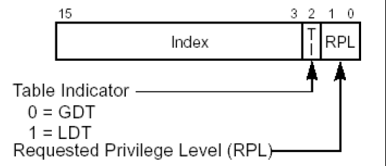

### 6.2.3 GDT

> GDT:`全局描述表`
>
> 数据段:
>
> ​	`当前程序在CPU下的特特权级别(CPL)` ：CS 段选择子,当前程序运行权限
>
> ​	`描述符特权等级(DPL)`  位于段描述符高4字节的13-14位,访问描述符所具备的权限(一致代码段例 外)
>
> ​	`请求特权级别(RPL)`  访问段描述符时的请求等级
>
> ​	`CS和SS的段选择子最后两位总是相同的`

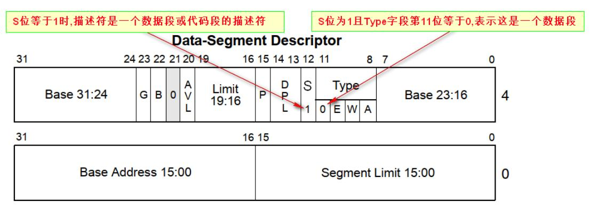

```cpp
'段描述符'
	/* 加载段描述符至段寄存器(代替mov指令加载段描述符) RPL <=DPL */
'GDT全局描述符'
Attributes: //从第8位到23位,16个字节
	G位 			// 位于高4个字节第23的位置G=0,Limit单位为字节最大0xFFFFF,G=1,单位是4KB,后面默认有0xFFF
	P位 			// 位于高4个字节第15的位置,P=1段描述符有效,P=0段描述符无效(大于0x8有效)
	DPL 		// 访问描述符所具备的权限
	S位 			// 位于高4个字节第12位,S=1时,描述符是代码段或者数据段描述符. 当S=0是系统段描述符(0xf/0x9)
	Type域 		// S=1时,第十一位是1是代码段否则是数据段(大于0x8是代码段)
	D/B位 		// 位于高4字节第二十二位,
Base: 		//高4字节0位-7位和24-31位,低四字节16位-31位
Limit: 		//高四字节第16位-19位,低四字节第0位-15位
```

#### 6.2.3.1 数据段

> 数据段的权限检查: `CPL<=DPL` 并且 `RPL<=DPL`
>
> ​	1): 代码间的跳转要修改CS时: 先得到段描述符, 判断查 `GDT` 还是 `LDT `
>
> ​	2): 判断是否是 `代码段` , `调用门` , `TSS任务段` , `任务门`
>
> ​	3): 如果是代码段,之后代码段权限检查 `非一致代码段CPL==DPL` 并且 `RPL<=DPL` , `一致代码段 CPL>=DPL`
>
> ​			/* 一致代码段修饰 允许低权限程序(应用层)直接访问高权限代码段(内核) */
>
> ​	4): 通过后CPU会将描述符加载至CS段寄存器, 将CS.Base+Offset写入EIP,执行EIP

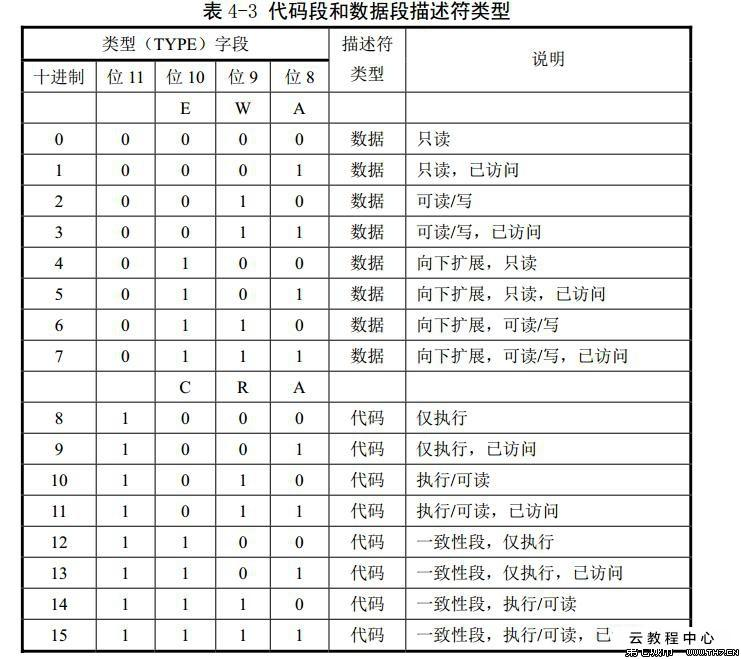

#### 6.2.3.2 系统段


#### 6.2.3.3 调用门

> 门描述符 `S位是0`, `TYPE域是1100`
>
> 调用门执行流程 `CALL CS:EIP(EIP是废弃的)`
>
> ​	1):  根据CS的值查GDT表,对应的段描述符表, `这个描述符是一个调用门`
>
> ​	2):   在调用门描述符中存储另一个代码段 段的选择子
>
> ​	3):  选择子指向的段 段.base+偏移地址就是真正要执行的地址

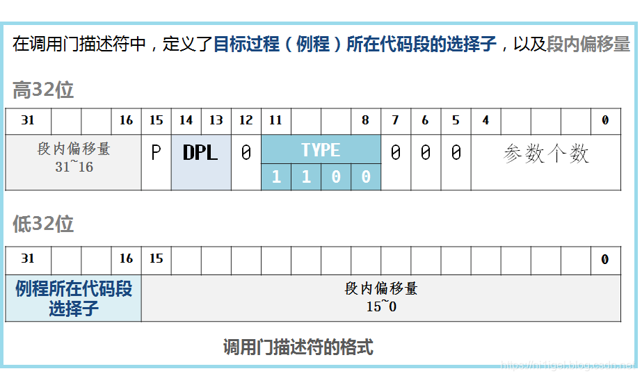

```cpp
#长调用
	# 跨段不提权 /* 发生改变的寄存器,ESP, EIP, CS */
	CALL FAR CS:EIP(EIP是废弃的) --> ESP-8 --> [ESP+4]=返回地址, [ESP+8]=调用者CS 
	RETF
        
	#跨段提权(R3层执行R0层) /* 发生改变的寄存器, ESP, EIP, CS, SS */
	CALL FAR CS:EIP(EIP是废弃的) --> ESP=? --> [ESP+4]=返回地址, [esp+8]=调用者CS, 
										[esp+c]=调用者ESP, [ESP+0x10] =调用者ss
	RETF
                                            
/*
跨段调用时,一旦有权限切换,就会切换堆栈
CS的权限一旦改变,SS的权限也要随着改变,CS和SS的等级必须一样
JMP FAR只能跳转到同级非一致代码段,但CALL FAR可以通过调用门提权,提升CPL的权限
*/
```

### 6.2.4 IDT

> IDT: `中断描述符表`
>
> IDT中断描述符表包含三种门描述符: `任务门描述符(TASK GATE)` , `中断门描述符(INTERRUPT GATE)` , `陷阱门描述符(TRAP GATE)` 
>
> ​	与中断门、陷阱门与调用门类似

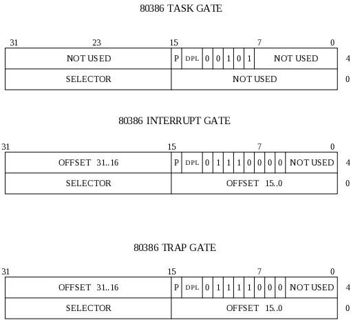

#### 6.2.4.1 中断门

#### 6.2.4.2 陷阱门

#### 6.2.4.3 任务门

> `TSS在内存中,104个字节,里面存放了寄存器的值`
>
> 任务门执行流程:
>
> ​	1):  INT n中断号
>
> ​	2): 查找IDT表,找到`中断门描述符`
>
> ​	3): 通过中断门描述符,查GDT表,找到 `任务段描述符`
>
> ​	4): 使用TSS段中的值修改各个寄存器
>
> ​	5): IRETD 返回

#### 6.2.4.4 TSS段描述符和任务段

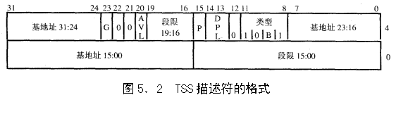

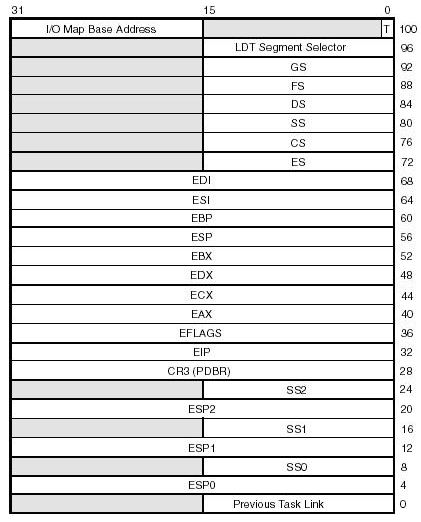

#### 6.2.4.5 TR寄存器

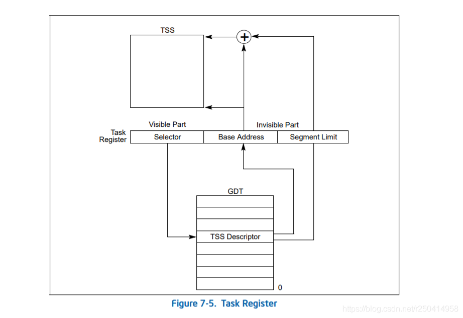

### 6.2.5 SSDT

> KeServiceDescriptorTable ： `系统服务描述符表 (SSTD)`
>
> KeServiceDescriptorTableShadow:  `影子系统服务描述符表(SSDT Shadow)`

```cpp
typedef struct _KSYSTEM_SERVICE_TABLE /* SSDT表项*/
{
	PULONG ServiceTableBase; // 服务函数地址表基址
	PULONG ServiceCounterTableBase;
	ULONG NumberOfService; // 服务函数个数
	PULONG ParamTableBase; // 服务函数参数表基址
}KSYSTEM_SERVICE_TABLE, *PKSYSTEM_SERVICE_TABLE;

typedef struct _SERVICE_DESCRIPTOR_TABLE
{
	SYSTEM_SERVICE_TABLE ntoskrnel; // ntoskrnl.exe的服务函数
	SYSTEM_SERVICE_TABLE win32k; // win32k.sys的服务函数(gdi.dll/user.dll的内核支持)
	SYSTEM_SERVICE_TABLE NotUsed1;
	SYSTEM_SERVICE_tABLE NotUsed2;
}SYSTEM_DESCRIPTOR_TABLE, *PSYSTEM_DESCRIPTOR_TABLE;

typedef struct ServiceDescriptorTable
{
	unsigned int *ServiceTableBase; // SSDT表的基地址
	unsigned int *ServiceCounterTable(0);//包含着 SSDT 中每个服务被调用次数的计数器,由KiSystemService更新
	unsigned int NumberOfServices; // SSTD表服务的数目
	unsigned char *ParamTableBase; // 包含每个系统服务参数字节数表的基地址
}ServiceDescriptorTableEntery_t, *PServiceDescriptorTableEntry_t;
```

#### 6.2.5.1 中断和异常

| 错误类型 | IDT表中断号 |
| -------- | ----------- |
| 页错误   | 0xE         |
| 段错误   | 0xD         |
| 处零错误 | 0x0         |
| 双重错误 | 0x8         |

#### 6.2.5.2 控制寄存器(CR)


### 6.2.6 内存分页

> MOV eax, dword ptr ds:[0x12345678]
>
> ​	有效地址: 0x12345678
>
> ​	线性地址: ds.base+0x12345678
>
> ​	物理地址: 映射的物理页地址

#### 6.2.6.1 [10-10-12]分页

> `ntkrnlpa.exe`
>
> 10-10-12: `PDT-PTI-物理页偏移`
>
> ​	`页目录表(PDT)基址: C0300000`
>
> ​	访问页目录的公式: `0xC0300000+ PDI*4`
>
> ​	访问页表公式: `0xC0000000+ PDI*4096+ PTI*4`


PDE和PTE属性

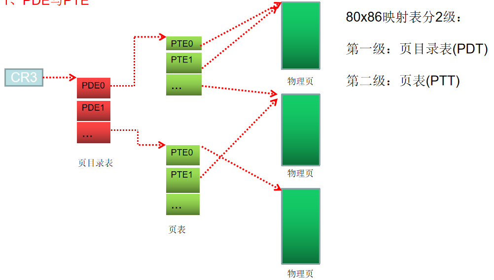

```cpp
# P：有效位。0 表示当前表项无效。
# R/W： 0 表示只读。1表示可读可写。
# U/S:：0 表示3特权级程序可访问，1表示只能0、1、2特权级可访问。
# PWT、PCD、请看后面的填坑篇
# A:：0 表示该页未被访问，1表示已被访问。
# D:：脏位。0表示该页未写过，1表示该页被写过。
# PS:：只存在于页目录。0表示这是4KB页，指向一个页表。1表示这是4MB大页，直接指向物理页。低22位是页内偏移
# PAT：这个不管
# G：如果G位为1刷新TLB时将不会刷新PDE/PTE的G位为1的页，G=1切换进程该PTE扔然有效(这里学完TLB才能明白
```

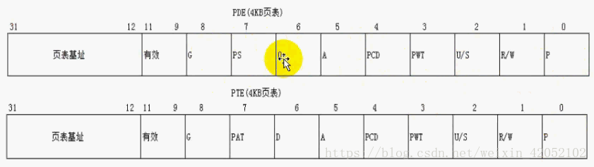

#### 6.2.6.2 [2-9-9-12]分页

> `ntoskrnl.exe`
>
> 2-9-9-12分页又称为PAE(物理地址扩展) 分页
>
> ​	PDPT: `页目录指针表`


PDPTE/PDE/PTE


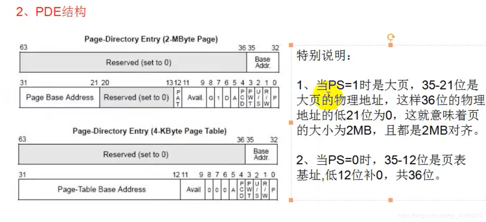

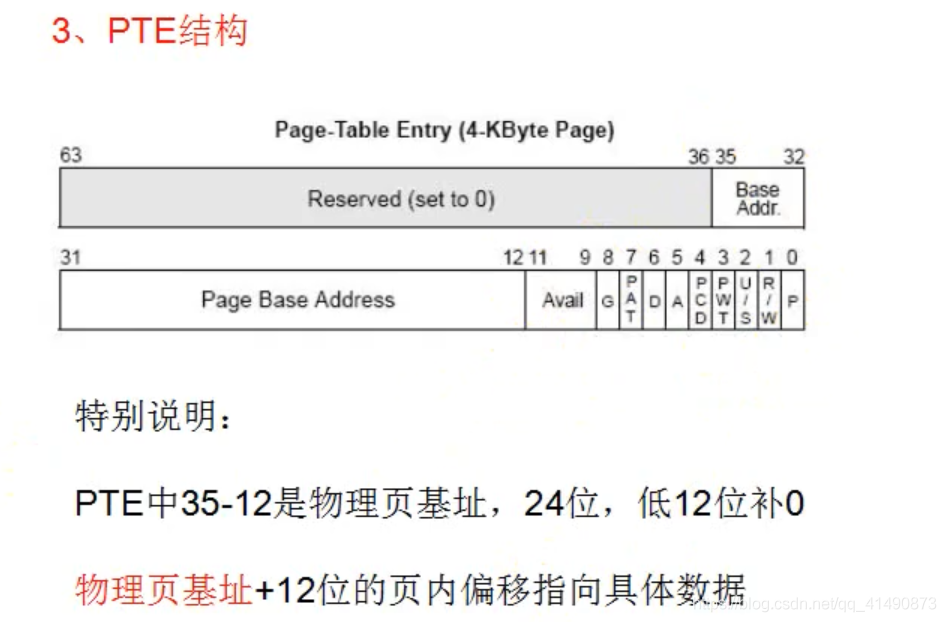

#### 6.2.6.3 TLB表

```cpp

```


### 6.2.7 系统调用

```cpp
dd KeNumberProcessrs // 查看CPU数量(几核)
dd KiProcessorBlock L2 // 查看两个核的KBC
    
'_KUSER_SHARED_DATA'
	X86 		内核起始地址:0xFFDF0000 内核结束地址:0xFFDF0FFF
				用户起始地址:0x7FFE0000 用户结束地址:0x7FFE0FFF
	X64 		内核起始地址:0xFFFFF780`00000000 内核结束地址:0xFFFFF780`00000FFF
				用户起始地址:0x7FFE0000 用户结束地址:0x7FFE0FFF
                    
'_Ktrap_frame' // 应用程序从3环进入0环,3环的寄存器信息由操作系统保存在结构里
                    
'_ETHREAD'// 进程线程相关的结构体                  
	+000 Tcb :_KTHREAD // dt _KTHREAD
        
'_KPCR' // 描述当前CPU的状态
	+0x000 NtTib :_NT_TIB // dt _NT_TIB
	+128 :_EPRCB // dt _EPRCB
```

```cpp
'syscall(貌似de指令别名sysenter)' // CPU通过MSR寄存器获取数据,与操作系统没有关系
	// 进入0环后执行的 NT!KiFastCallEntery例程
	// 直接调用是读取MSR寄存器获取EIP CS ESP,ss的值是 IA32_SYSENTER_CS里的值+8
	IA32_SYSENTER_CS 174h
	IA32_SYSENTER_ESP 175h
	IA32_SYSENTER_EIP 176h
	/* RDMSR/WRMST 可以读写MSR寄存器*/
	/* kd> rdmsr 174 // 查看CS*/
    
'中断门进入0环' // 通过中断号(int 2Eh)查表用中断门进入0环
	// 进入0环后执行的 NT!KiSystemService例
```


### 6.2.8 进程线程KPCR

#### 6.2.8.1 进程

```cpp
' x86'
struct _KPROCESS
{
	+0x000 DOSPATCHER_HEADER: Header; 		//"可等待"对象, 互斥体,Event事件[ 0x10个字节]
	+0x018 DirectoryTableBase; 		// 页目录表基址 [ Uint4B[2] ]
    +0x38 KernelTime; 		// 在内核运行的时间 [ Uint4B ]
	+0x3c UserTime; 		// 在3环运行的时间 [ Uint4B ]
	+0x50 ; 		// 指向进程里线程链表中的第一个线程
	+0x54 ; 		// 指向进程里线程链表中最后一个线程
	+0x5c Addinity; 		// 线程能在哪个CPU上运行,拆成二进制,00000000，能运行的填1[ Uint4B ]
	+0x62 BasePriority; 		// 线程基本优先级 [ Char ]
}
struct _EPROCESS 	
{	// 内核进程结构体
	+0x00 _KPROCESS: Pcb; 		// 进程相关信息[0x6c个字节]
	+0x70 _LARGE_INTEGER: CreateTime; 		// 进程创建时间 [ Uint8B ]
	+0x78 _LERGE_INTEGER: ExitTime;		 // 进程退出时间 [ Uint8B ]
	+0x84 UniqueProcessId; 		// 进程编号,任务管理器中的PID [ Ptr32 Void ]
//双向链表,所有活动进程都连接在一起( PsActiveHead全局链表头指向当前操作系统的第一个进程)
	+0x88 _LIST_ENTRY: ActiveProcessLinks;	
	+0x90 QuotaUsage; 		// 物理页相关统计信息[ Uint4B[3] ]
	+0x9c QuotaPeak; 		// 物理页相关统计信息[ Uint4B[3] ]
	+0xa8 CommitCharge; 		// 虚拟内存相关统计信息 [ Uint4B ]
	+0xac PeakVirtualSize; 		// 虚拟内存相关统计信息 [ Uint4B ]
	+0xb0 VirtualSize; 		// 虚拟内存相关统计信息 [ Uint4B ]
	+0xbc DebugPort; 		// 调试相关 [ Ptr32 Void ]
	+0xc0 ExceptionPort; 		// 调试相关 [ Ptr32 Void ]
	+0xc4 ObjectTable; 		// 句柄表 [ Prt32 _HANDLE_TABLE ]
	+0x11c VadRoot; 		// 标识0-2G哪些地址没占用 [ Ptr32 Void]
	+0x174 ImageFileName; 		// 进程镜像文件名,最后十六个字节 [ UChar[16]]
	+0x1a0 ActiveThreads; 		// 活动线程数量 [ Uint4B ]
	+0x1b0 Peb; 		// 3环进程环境块 [ Ptr32 _PEB ]
}

PsLookupProcessByProcessId(HANDLE pid, _EPROCESS* eProcess);  
```

#### 6.2.8.2 线程

```cpp
' x86'
struct _KTHREAD
{
	+0x00 _DISPATCHER_HEADER: Header; 		// 可等待对象(互斥体,Event事件可以使用WaitForSingleObject) [0x10]
	+0x18 InitialStack; 		// 0环的栈,线程切换有关 [ Ptr32 Void ]
	+0x1c StackLimit; 		// 0环的栈,线程切换有关 [ Ptr32 Void ]
	+0x20 Teb; 		// 线程的环境块,线程描述位于用户地址控件地址fs[0]->TEB [Ptr32 Void]
	+0x28 KernelStack; 		// 0环的栈,线程切换有关 [ Ptr32 Void ]
	+0x2c DebugActive; 		// 如果值为-1不能使用调试寄存器:DR0-DR7 [ UChar ]
	+0x2d State; 		// 线程状态: 就绪/等待/运行 [UChar]
	+0X34 _KAPC_STATE: ApcState; 		// APC相关
// 可以使用 KeSetBasePriorityThread()函数重新设定
	+0x6c BasePriority; 		// 线程优先级, 初始值是所属进程的KPROCESS->BasePriority,
	+0x70 _KWAIT_BLOCK[4]: WaitBlock; 		// 等待哪个对象
	+0xe0 ServiceTable; 		// SSDT系统服务表 [ Ptr32 Void ]
	+0xe8 ApcQueueLock; 		// APC相关 [ Uint4B
    +0x134 TrapFrame; 		// 进0环时保存3环环境
	+0x138 ApcStatePointer; 		// APC相关 [ Ptr32[2] _KAPC_STATE ]
	+140 PreviousMode;		 // 0环调用还是3环调用 [ UChar ]
	+0x14c _KAPC_STATE: SavedApcState; 		// APC相关
	+0x1b0 _LIST_ENTRY: ThreadListEntry; 		// 链表串联进程中的所有线程
}
struct _ETHREAD 
{	// 内核线程结构体
	+00 _KTHREAD: Tcb 		// 线程相关详细信息 [0x1c0]
	+0x1ec _CLIENT_iD: Cid; 		// 进程ID、线程ID
	+0x220 ThreadsProcess; 		// 指向自己所属进程 [ Ptr32 _EPROCESS ]
	+0x22c _LIST_ENTRY: ThreadListEntry; 		// 双向链表,串联进程中所有线程
}
	_LIST_ENTRY: KiWaitListHead; 		// 等待链表,线程调用了Sleep或者WaitForSingleObject登函数就挂载这个链表
	_LIST_ENTRY: KiDispatcherReadyListHead; 		// 调度链表(就绪链表)
```

##### 6.2.8.2.1 KPCR

> KPCR: CPU控制区
>
> ​	1): `当线程进入0环时, FS:[0]指向KPCR`，3环时FS:[0]->TEB
>
> ​	2):  每个CPU都有一个KPCR(一个核一个)
>
> ​	3): KPCR中存储了CPU本身要用的一些重要数据: GDT IDT以及线程相关的一些信息

```cpp
'X86'
struct _NT_TIB /* 和TEB结构类似 */
{
	+0x0 ExceptionList; 		// 0环异常处理函数,[Ptr32_EXCEPTION_REGISTRATION_RECORD]
	+0x04 StackBase; 		// 当前线程栈的栈底 [ Ptr32 Void ]
	+0x08 StackLimit; 		// 当前线程栈的大小 [ Ptr32 Void ]
	+0x18 Self;		 // 指向这个结构自己 [ Ptr32 _NT_TIB ]
}
struct _KPRCB
{
+0x04 CurrentThread; 		// 当前执行线程的结构[Ptr32 _KTHREAD]
+0x08 NextThread; 		// 下一个执行线程的结构 [Ptr32 _KTHREAD]
+0x0c IdleThread; 		// 如果没有需要切换的线程,要执行的空闲线程 [Ptr32_KTHREAD]
}
struct _KPCR
{
	+00 _NT_TIB: NtTib; 		// [ 0x1c ]
	+0x1c SelfPcr; 		// 指向_KPCR自己
	+0x20 Prcb; 		// 指向 _KPRCB: PrcbData [ Ptr32 _KPRCB ]
	+0x038 IDT; 		// IDT表基址 [Ptr32 _KIDTENTRY ]
	+0x3c GDT; 		// GDT表基址 [Ptr32 _KGDTENTRY ]
	+0x40 TSS; 		// 指向TSS，每个CPU都有有一个TSS [ Ptr32 _KTSS ]
	+0x51 Number; 		// CPU编号 [ UChar ]
	+0X120 _KPRCB: PrcbData; 		// 拓展结构体
}
```

##### 6.2.8.2.2 线程切换

```cpp
	KiFindReadyThread(); // 搜索调度链表
	KiSwapContext(); // 线程切换
```

##### 6.2.8.2.3 线程APC队列

```cpp
struct _KAPC
{
}

'APC挂入流程'
	QueueUserAPC(); 		// Kernel32.dll(3环)
	NtQueueApcThread(); 		// Ntosker.exe(3环)
	KeInitializeApc(); 		// 分配空间,初始化KAPC结构体(0环)
	KeInsertQueueApc();
	KiInsertQueueApc(); 		// 将KAPC插入指定APC队列
```

### 6.2.9 内存管理

```cpp
'Windbg'
	!vad 0x123456 // 0x123456-->_EPROCESS+11C VadRoot
```

```cpp
struct _MMVAD_FLAGS // 内存属性
{
	+000 Protection; 		// 1 READONLY 2 EXECUTE 3 EXECUTE_READ 4READWITER
							// 5 WRITECOPY 6 EXECUTE_READWRITE 7 EXECUTE_WRITECOPY
	Private Memory 		// VirtualAlloc/VirtualAllocEx申请的内存
	Mapped Memory 		// CreateFileMapping 映射
}

	HADNLE CreateFileMapping() 		// 创建物理页内核对象
	void* MAPViewOfFile(); 		// 将物理页与线性地址进行映射
```

### 6.2.10 异常

```cpp
typedef struct _EXCEPTION_RECORD
{
	DWORD ExceptionCode; 	// 异常代码
	DWORD ExceptionFlags; 	// 异常状态
	struct _EXCEPTION_RECORD* ExceptionRecord; 	// 下一个异常
	PVOID ExceptionAddress;	 // 异常发生地址
	DWORD NumberParameters; 	// 附加参数个数
	ULONG_PTR ExceptionInformation;
	[EXCEPTION_MAXIMUM_PARAMERERS]; 	// 附加参数指针
}
```

## 6.3 Windows 驱动

```cpp
'内核调试'
    perfmon.msc		 /*Ctrl + R 打开性能监视器 */
// 双机调试
    bcdedit/debug on // cmd设置系统为调试模式
	// 设置网络调试进行连接,获取Key
	bcdedit/dbgsettings net hostip:192.168.0.2 port:50010
		Key=1n7azearrrjme.2yvmrnvi4o02t.2ld90ebhcb0so.11xom58pcnv2e
        
	bcdedit /dbgsettings serial baudrate:115200 debugport:2
```

```cpp
'build驱动编译'
# makfile 格式固定,(代码前导不能有空格)
	!INCLUDE $(NTMAKEENV)\makefile.def
# Sources
	TARGETNAME=DDK_HellWord 		// 指定生成的驱动的名字
	TARGETTYPE=DRIVER 		// 指定生成文件类型 Driver是驱动文件
	TA	RGETPATH=Check /		/ 指定生成驱动所有路径
	INCLUDES=$(BASEDIR)\inc;\ 		// 指定相关头文件所在模具路径
	$(BASEDIR)\inc\wxp;\
	// 空一行
	SOURCES=mini_ddk.c\		 // 指定驱动源代码 *.c *.cpp
    
'cmd设置驱动服务'
/* 注册服务([sc create]:创建一个服务 [binPath]:驱动文件路径 [type]:驱动类型 [start]:该服务的启动类型) */
	sc create FirstDriver binPath= "C:\FirstDirver.sys" type= kernel start= demand
/* 创建驱动服务后,使用sc命令启动服务 [sc start]:等同于 StartService函数*/
	sc start FirstDriver
/* 停止服务 */
	sc stop FirstDriver
/* 删除服务 */
	sc delete FirstDriver
```

### 6.3.1 内核数据结构

```cpp
#include <ntifs.h>
#include <ntddk.h> 		// 当ntddk.h和ntifs.h发生冲突时,先包含ntifs.h可解决
#include <wdm.h>
#include <wdf.h> 		// WDF框架
#include <ntdddisk.h> 		// 磁盘
#define NTSTRSAFE_LIB 		// 使用ntstrsafe静态库时更好兼容Windows2000
#include <ntstrsafe.h>

'#预定义宏'
	__FILE__ 		/* 宏所在文件的源文件名(路径) */
	__LINE__ 		/* 宏所在行的行号 */
	__DATE__ 		/* 代码编译的日期 */
	__TIME__ 		/* 代码编译的的时间 */
	__func__ 		/* 宏所在的当前函数 */
	__cplusplus 		/* */
	UNICODE_STRING 		/* 内核字符串结构 */
	LIST_ENTRY 			// 内核链表结构
	LARGE_INTEGER 		// LONGLONG (int64)
	__CHAR_UNSIGNED 		/* 如果char类型为无符号,该宏定义为1否则未定义 */
	__COUNTER__ 		/* 从0开始,每次使用都会递增1 */
	_DEBUG 				/* 如果设置了/lDd/mDd/mTd改宏定义为1否则未定义*/
	__FUNCTION__ 		/* 函数名称 不含修饰名 */
	__FUNCTIONW__ 		// 当前执行函数的函数名(unicode)，以'\0'表示结尾
	__FUNCDNAME__ 		/* 函数名称 包含修饰名 */
	__FUNCSIG__ 		/* 包含了函数签名的函数名 */
	_WIN32 				/* 当编译为32位ARM,64位ARM,X86或64定义为1 否则未定义 */
	_WIN64 				/* 当编译为64位ARM或X64定义为1 否则未定义 */
	__TIMESTAMP__ 		/* 最后一次源代码修改时间和日期 */
	DELAY_ONE_MILLISECOND 		// 延迟时间一毫秒
```

```cpp
'内核数据结构'
typedef struct P2C_IDTR_
{
	P2C_U16 limit;
    P2C_U32 base;
}
_asm sidt m_idt // 读出一个P2C_IDTR结构,并返回IDT地址
    
UNICODE_STRING 			/* 字符串结构*/
KSPIN_LOCK 			/* 自旋锁结构*/
LIST_ENTRY 			/* 链表结构*/
POOL_TYPE 			/* 内存属性联合体*/
ONJECT_ATTRIBUTES 			// 该结构描述对象句柄的属性到打开句柄的例程
KEY_VALUE_PARTIAL_INFORMATION 			/* 注册表项的值条目的值信息的结构 */
IO_STATUS_BLOCK 			// 函数操作结果结构 P61
LARGE_INTEGER 			// 文件读取位置结构体(读取起始位置)
    
typedef struct DRIVER_OBJECT, *PDRIVER_OBJECT; 		/* 驱动对象*/
typedef struct _DEVICE_OBJECT *PDEVICE_OBJECT;; 		/* 设备对象*
```

#### 6.3.1.0 LDT

> 系统所有程序 驱动对象里都有这个结构 是驱动对象的成员
>
> ​	1):  qudongduixiang1->DriverSection(PVOID DriverSection) 这个结构体在什么时候有的 io管理器在 加载我们驱动的时候 调用DriverEntry这个历程的时候 把我们驱动对象也加入到系统的一个全局链 表中
>
> ​	2): 就是为了方便io管理器进行维护或者方便对象管理器进行维护 为了查找方便 这个全局链表呢 把系统所有驱动程序串起来就是连接起来

```cpp
// DriverObject->DriverSection指向 _LDR_DATA_TABLE_ENTRY
typedef struct _LDR_DATA_TABLE_ENTRY {
	LIST_ENTRY InLoadOrderLinks;
	LIST_ENTRY InMemoryOrderLinks;
	LIST_ENTRY InInitializationOrderLinks;		//已经调用DriverEntry这个函数的所有驱动程序
	PVOID DllBase;
	PVOID EntryPoint;		//驱动的进入点 DriverEntry
	ULONG SizeOfImage;
	UNICODE_STRING FullDllName;		//驱动的满路径
	UNICODE_STRING BaseDllName;		//不带路径的驱动名字
	ULONG Flags;
	USHORT LoadCount;
	USHORT TlsIndex;
	union 
    {
		LIST_ENTRY HashLinks;
		struct 
        {
			PVOID SectionPointer;
			ULONG CheckSum;
		};
	};
	union
    {
		struct { ULONG TimeDateStamp; };
		struct { PVOID LoadedImports; };
	};
} LDR_DATA_TABLE_ENTRY, *PLDR_DATA_TABLE_ENTRY;
```

### 6.3.2 Windows内核API


#### 6.3.2.0 内核结构体

```c

```

#### 6.3.2.1 基础API

```cpp
	UNREFERENCED_PARAMETER(a); 		/* 告诉编译器，已经使用了该变量，不必检测警告 */
	NT_SUCCESS(status) 		/* 宏函数,判断HSTATUS返回值的函数是否STATUS_SUCCESS*/
	PIRP IoGetTopLevelIrp(); 		/* 返回当前线程的TopLevelIrp字段的值。*/

	PsGetCurrentProcessId();		// 获取当前进程ID

// 将输入的有符号整数转换为有符号大整数
	LARGE_INTEGER RtlConvertLongToLargeInteger(LONG SignedInteger);
	NTSTATUS RtlGetVersion(PRTL_OSVERSIONINFOW lpVersionInformation);
```

```cpp
#define INITCODE code_seg("init") // 将入口函数放入INIT标志内存中,驱动加载成功后该函数卸载
#pragma INITCODE

'驱动断点函数'
	KdBreakPoint(); 		// Debug模式下断点
	DbgBreakPoint(); 		// Release版本断点

'时间睡眠'
LARGE_INTEGER Interval;
Interval.QuadPart = (5*1000* ((-10)*1000)); // 设置时间5秒
KeDelayExecutionThread(KernelMode, FALSE, &Interval)

// 驱动程序入口函数(驱动对象的指针, 结构指向当前驱动所对应的注册表位置)
    // 注册表HKEYLOCALMACHINE＼SYSTEM＼Cu∏entControlSet＼Services
	NTSTATUS DriverEntry(PDRIVER_OBJECT DriverObject, PUNICODE_STRING RegistryPath);
	void DriverUnload(PDRIVER_OBJECT DriverObject); // 驱动的卸载函数

	HANDLE PsGetCurrentProcessId(); 		// 获取当前执行代码的进程Id(内核)
	NTHALAPI KIRQL KeGetCurrentIrql();		 		// 获取当前IRQL

	PAGED_CODE();


'运行错误停止系统(蓝屏报错)'
	void KeBugCheckEx(ULONG BugCheckCode, ULONG_PTR BugCheckParameter1, 
                      ULONG_PTR BugCheckParameter2, ULONG_PTR BugCheckParameter3, 
                      ULONG_PTR BugCheckParameter4);

'获取函数地址'
/* 通过函数名获取函数地址*/
    PVOID MmGetSystemRountineAddress(PUNICODE_STRING SystemRountineName);

'系统关机回调函数 •P101'
// 当系统进入关机或者重启逻辑时会发送IRP_MJ_SHUTDOWN信号, 先执行这个`系统关机回调`
	NSTSTATUS IoRegisterShutdownNotification(PDEVICE_OBJCET DeviceObject); /* func(设备对象指针)*/
// 驱动已注册`系统关机回调`, 驱动卸载必须使用这个函数来移除`系统关机回调`
	void IoUnregisterShutdownNotification(PDEVICE_OBJECT DeviceObject); /* func(指向驱动程序的设备对象指针）*/
// 设置系统关机消息时的需要执行函数(分发函数)
	DriverObject->MajorFuntion[IRP_MJ_SHUTDOWN] = SysShutdown;
```

#### 6.3.2.2 字符串操作

```c
struct ANSI_STING 			/* 内核ANSI码类型字符串结构 */
struct UNICODE_STRING 		/* 内核UNICODE宽字符串结构 */
    
typedef struct _UNICODE_STRING		// 内核UNICODE字符串结构 P36
{
    USHORT Length;				/
    USHORT MaximumLength;		// Buffer缓冲区的总大小
    PWSTR Buffer;				// wchar* 不一定是以\0结尾
}UNICODE_STRING, *PUNICODE_STRING

```

```cpp
#include <Ntstrsafe.h>
TARGETLIBS＝$(DDK＿LIB_PAIH)\ntstrsafe.lib	// 如果使用字符串函数编译报错,可以手动添加库

UNICODE_STRING str=RTL_CONSTANT_STRING(L”my first string”);		 /*定义常量UNICODE_STRING*/
DECLARE_CONST_UNICODE_STRING(ntDeviceName, L"name"); 	/*定义常量UNICODE_STRING, 常量名ntDeviceName*/

/* 初始化内核字符串结构,将Buffer指向参数SourceString字地址,使用期间参数SourceString必须有效 */
//如果DestinatjonSmng指向的内存为非分页内存’那么RtlInitU∏icodeStrjng可以工作在IRQL＜＝DlSPATCHLEVEL下
//否则只能工作在IRQL＜＝APCLEVEL下
	VOID RtlInitAnsiString();
	VOID RtlInitUnicodeString(
        PUNICODE_STRING DestinationString, 	// 指向 UNICODE_STRING结构的指针
        PCWSTR SourceString); 				/* 宽字节字符串*/
		/*
		RtlImtUnicodeSmng函数并没有为DestinationString.Buffer申请内存,
		而是令DestinationString指向字符串SourceString的首地址,
		所以开发者使用RtlInitUnicodeString初始化DestinationString后,
		在使用DestinationString期间必须保证SourceString有效,
		SourceString元素值的改变也影响着DestinationString
		*/

/* 内核宏函数,初始化一个空的内核字符串结构 UNICODE_STRING""将DestinationString指向Buffer*/ •P35
    VOID RtlInitEmptyUnicodeString(
    	PUNICODE_STRING DestinationString, PCWTR Buffer,
        USHORT BufferSize);

/* 字符串拷贝 */
	RtlCopyString(); 			/* ANSI_STRING码字符串拷贝*/
	NTSYSAPI VOID RtlCopyUnicodeString(PUNICODE_STING DestinationString, 
                                       PUNICODE_STRING SourceString);
	NTSTATUS RtlUnicodeStringCopyString(
        PUNICODE_STRING DestinationString, 	// 指向 UNICODE_STRING结构的指针
        PCWSTR pszSrc); 					/* 宽字节字符串*/
	//将以"\0"结尾的字符串pszSrc拷贝到DestinationString所指向的内存中,成功返回STATUS_SUCCCESS
	// 只能在IRQL:PASSIVE_LEVEL下运行

/* 字符串比较 */
	RtlCompareString();	// ANSI_STRING字符串比较
	RtlCompareUnicodeString(PUNICODE_STRING String1,PUNICODE_STRING String2, 	/* UNICODE_STRING字符串比较*/
                            BOOLEAN CaseInsensitive);

/* 格式化字符串:sprintf() */
	NTSTRSAFEDDI RtlStringCchPrintfA(NTSTRSAFE_PSTR pszDest, // 需要格式化到哪个字符数组里面(NTSTRSAFE_PSTR==char)
                                     size_t cchDest, 		// 字符串大小
                                     NTSTRSAFE_PCSTR pszFormat, // 需要初始化的字符串(char*)("sad%d %c")
                                     ...); 						// 需要格式化的参数, N
	NTSTATUS RtlAppendUnicodeToString(PUNICODE_STRING, PCWSTR);	// 讲UNICODE_STRING字符串拷贝到PCWSTR

/* 字符串打印 */
	KdPrint(("111%d", a)); 	// 宏函数,Dbg模式会调用DbgPrint,Rele模式不操作
	DbgPrint("%ws\n", __FUNCTIONW__); // 表示打印一个以'\0'结束的Unicode字符串
							"%wZ" // 打印UNICODE_STRING类型(不以'\0'为结尾的)
```

#### 6.3.2.3 自旋锁

```cpp
struct KSPIN_LOCK my_spin_lock; 	// 锁结构，

	VOID KeInitializeSpinLock(PKSPIN_LOCK SpinLock);	// 初始化自旋锁/队列自旋锁

/* 自旋锁自选锁上锁/解锁 , 当使用自旋锁时,需要将它全局/静态或池中 KSPIN_LOCK */
	void KeAcquireSpinLock(SqinLock, OldIrql);			// ===自旋锁上锁
	VOID KeReleaseSpinLock(PKSPIN_LOCK SpinLock, KIRQL NewIrql);	// ===自旋锁释放 P41

/* 队列自旋锁获取和释放 */
	// ===队列自旋锁上锁
	VOID KeAcquireInStackQueuedSpinLock(PKSPIN_LOCK SpinLock, PKLOCK_QUEUE_HANDLE LockHandle);
	void KeReleaseInStackQueuedSpinLock(PKLOC_QUEUE_HANDLE LockHandle);	// ===队列自旋锁释放

/*将事件对象初始化为同步（单个服务程序）或通知类型的事件，并将其设置为有信号或无信号状态*/
void KeInitializeEvent(PKEVENT Event, EVENT_TYPE Type, BOOLEAN Status);
```

#### 6.3.2.4 内核链表操作

```C
typedef struct _LIST_ENTRY	/* 内核链表结构体*/
{
    struct _LIST_ENTRY* Flink;		//指向当前节点后一个节点
    struct _LIST_ENTRY* Blink;		//指向当前节点前一个节点
}LIST_ENTRY, *PLIST_ENTRY;
```

```cpp
/* 链表头节点初始化*/
	VOID InitializeListHead(PLIST_ENTRY ListHead);		// 初始化头节点
    	// WDK上函数实现: ListHead->Flink = ListHead->Blink = ListHead

	// 判断当前链表是否是空链表(只有头节点),返回ture是空链表,否则非空
	BOOLENA IsListEmpty(const LIST_ENTRY * ListHead);  

/* 插入节点 */
	VOID InsertHeadList(PLIST_ENTRY ListHead, PLIST_ENTRY Entry);	// 插入节点到第一位置
	VOID InsertTailList(PLIST_ENTRY ListHead, PLIST_ENTRY Entry);	// 插入节点到末尾

	// 以自旋锁方式插入链表节点
	PLIST_ENTRY ExInterlockedInsertHeadList(PLIST_ENTRY ListHead, PLIST_ENTRY ListEntry, 
                                            PKSPIN_LOCK lock);

/* 移除节点*/
// 成功移除返回从链表移除的节点指针,无节点移除返回NULL
	PLIST_ENTRY RemoveHeadList(PLIST_ENTRY ListHead);		// 移除第一个节点
	PLIST_ENTRY RemoveTailList(PLIST_ENTRY ListHead);		// 移除末尾节点
	BOOLEAN RemoveEntryList(PLIST_ENTRY Entry);			// 移除末尾节点
	// 以自旋锁方式删除一个节点
	PLIST_ENTRY ExInterlockedRemoveHeadList(PLIST_ENTRY ListHead, PKSPIN_LOCK Lock);

/* 遍历节点*/
	//宏函数,宏返回一个结构实例的基地址,该结构的类型和结构所包含的一个域(成员)地址已知
	PCHAR CONTAINING_RECORD(PCHAR Address, TYPE type, PCHAR Field); 	•P39
    /* 例:
    	typedef struct _TestListEntry
    	{
    		LIST_ENTRY m_LisetEntry;		// 双想链表结构
    	}TestListEntry, *PTestListEntry;
    	
    	PLIST_ENTRY pLisetEntryTmp = ListHeader.Flink;
    	while (pLisetEntryTmp != &ListHeader)
    	{
    		PTestListEntry pTestListTmp = CONTAINING_RECORD(pLisetEntryTmp, TestListEntry, m_LisetEntry);
    		DbgPrint("dbg: ListEntry=%p", pTestListTmp);
    	}
    */
```

#### 6.3.2.5 内存操作

> 分页是指`这些内存的内 容可以被置换到磁盘上（也可以是其他介质)`
>
> 非分页内存指`这块内存的内容不会被置换到磁盘上`

```cpp
typedef enum _POOL_TYPE {
    PagedPool, NonPagedPool, NonPagedPoolExecute, NonPagedPoolNx
}; // 重要属性

'修改内存页表属性(可读可写)'
	MmCreateMdl()	
// 验证一个地址是否可用,检查给定虚拟地址的读或写操作是否会发生页错误 #include <ntifs.h>
BOOLEAN MmIsAddressValid(PVOID VirtualAddress);	

'在内存池中申请内存'
	PVOID ExAllocatePool(POOL_TYPE PoolType, SIZE_T NumberOfBytes); // ===在内存池中分配内存'/* malloc*/
	//===在内存池中分配内存并设置使用者标志
	PVOID ExAllocatePoolWithTag( POOL_TYPE PoolType, SIZE_T NumberOfByTes, ULONG Tag);

'释放内存池中的内存'
	ExFreePool(a); /* free*/
	void ExFreePoolWithTag(PVOID P, ULONG Tag);

'内存初始化' /* memset*/
	void RtlFillMemory(PVOID Destination, SIZE_T Length, ULONG Pattern);

'内存拷贝' /* memcpy*/
	void RtlCopyMemory(VOID* Destination, VOID* Source, SIZE_T Length);
```

非分页旁视列表

```cpp
'初始化旁视列表对象'
	void ExInitializeNPagedLookasideList(PNPAGED_LOOCKASIDE_LIST Lookaside, PALLOCATE_FUNCTION Allocate,
                                         PFREE_FUNCTION Free, ULONG Flags, SIZE_T Size, ULONG Tag,
	// 可以初始化分页/非分页旁视列表对象
	NTSTATUS ExInitializeLookasideListEx(PLOOKASIDE_LIST_EX Lookaside, PALLOCATE_FUNCTION_EX Allocate,
                                         PFREE_FUNCTION_EX Free, POOL_TYPE PoolType, ULONG Flage,
                                         SIZE_T Size, ULONG Tag, USHORT Depth);

PVOID ExAllocateFromNPagedLookasideList(PNPAGED_LOOKASIDE_LIST Lookaside);		// 申请旁视列表对象内存
void ExFreeToNPagedLookasideList(PNPANGED_LOOKASIDE_LIST Lookaside);		// 释放旁视列表对象内存
void ExDeleteNPagedLookasideList(PAPAGED_LOOKASIDE_LIST Lookaside);			// 删除旁视对象
```

#### 6.3.2.6 句柄和对象

> 一般 `Zw `开头的内核函数只能在ORQL是PASSIVE_LEVEL下运行

```c
struct OBJECT_ATTRIBUTES // 该结构描述对象句柄的属性到打开句柄的例程
struct DRIVER_OBJECT // 驱动对象
struct DEVICE_OBJECT // 设备对象
    
    // 初始化句柄结构属性信息
    VOID InitializeObjectAttributes(POBJECT_ATTRIBUTES p, /* 需要初始化的结构*/
                                    PUNICODE_STRING n, /* 谁打开句柄的(对象的名字)*/
                                    ULONG a, /* 标志/权限*/ 
                                    HANDLE r, /* 可以为NULL*/
                                    PSECURITY_DESCRIPTOR s); /* 可以为NULL*/

'对象'
    ObCreateObject();		// 对象创建
	/* 例:ObCreateObject(KeGetPreviousMode(), PsProcessType, ObjectAttributes, KeGetPreviousMode(),
                       0, 0x258, 0, 0, &ProcessObject); */
	void ObDereferenceObject(a);		// 释放对象指针

'句柄对象'	/* <ntifs.h> P52*/
	//创建一个句柄对象
	NTSYSAPI NTSTATUS ZwCreateEvent(PHANDLE EventHandle, /* 用于保存EVENT句柄*/
                                    ACCESS_MASK DesiredAccess, /* EVENT打开权限*/
                                    POBJECT_ATTRIBUTES ObjectAttributes, /* EVENT属性结构*/
                                    EVENT_TYPE EventType, /* EVENT类型*/
                                    BOOLEAN InitialState); /* EVENT的初始状态*/
	// 打开一个句柄对象
	NTSYSCALLAPI NTSTATUS ZwOpenEvent(PHANDLE EventHandle, ACCESS_MASK DesiredAccess,
                                      POBJECT_ATTRIBUTES ObjectAttributes);
	NTSYSQPI NTSTATUS ZwClose(HHANDLE Handle);	// 关闭句柄对象

'获取句柄对象'
// 获取句柄对象(EventHandle)对应的Event对象指针 ---对象化 <<Windows内核编程•P53>> 
	// 通过对象的句柄获取对象指针
    NTSTATUS ObReferenceObjectByHandle(HANDLE Handle, 	/* ZwCreateEvent打开的Event对象的句柄*/
                                       ACCESS_MASK DesiredAccess, 	/* 需要获取此对象的权限*/
                                       POBJECT_TYPE ObjectType, 	/* 对象的类型*/
                                       KPROCESSOR_MODE AccessMode, 	/*访问模式(用户态和内核态)*/
                                       PVOID* Object, 	/* 返回参数,函数执行成功保存对象的指针*/
                                       POBJECT_HANDLE_INFORAMTION HandleInformation); 	/* 保留,设置为NULL*/
	// 通过一个名字来获得一个对象得指针(闭源函数,文档没有公开,声明直接使用了)
	// 调用ObReferenceObjectByName会使驱动对象的引用计数增加,ObDereferenceObject释放驱动对象引用
	extern POBJECT_TYPE* IoDriverObjectType;
	NTSTATUS ObReferenceObjectByName(PUNICODE_STRING ObjectName, 	// 指向驱动对象名字的UNICODE_STRING
                                     ULONG Attributes, 	// OBJ_CASE_INSENSITIVE(不区分大小写 驱动名可以写大写或小写)
                                     PACCESS_STATE AccessState, 	// NULL(结构比较复杂设计对象特性的东西accessstate)
                                     ACCESS_MASK DesiredAccess, //0(访问权限可以写0为完全访问,不受控制FILE_ALL_ACCESS)
                                     POBJECT_TYPE ObjectType, 	// *IoDriverObjectType(对象的类型)
                                     KPROCESSOR_MODE AccessMode, 	// KernelMode(访问模式(用户态和内核态))
                                     PVOID ParseContext, 	// NULL(设备上下文)
                                     PVOID* Object); 	// 返回参数,函数执行成功保存对象的指针


	PVOID InterlockedExchangePointer(PVOID volatile *Target, PVOID value);	// 原子地 交换函数地址
```

#### 6.3.2.7 注册表操作

> <<Windows没和编程•P54>> 
>
> 注册表路径:`C:\Windows\System32\config`

```c
struct KEY_VALUE_PARTIAL_INFORMATION /* 注册表项的值条目的值信息的结构 */
//IRQL==PASSIVE_LEVEL (InitializeObjectAttributes初始化结构)
    // 创建一个注册表键
	NTSTATUS ZwCreateKey(PHANDLE KeyHandle, 	/* 返回参数,成功打开或创建键值后保存键值的句柄*/
                         ACCESS_MASK DesiredAccess, 	/* 打开权限*/
                         PBOJECT_ATTRIBUTES ObjectAttributes, 	/* 键值对象的属性*/
                         ULONG TitleIndex, 	/* 0*/
                         PUNICODE_STRING Class, 	/* NULL*/
                         ULONG CreateOptions, 	/* 打开&创建注册表键的选项 */
                         PULONG Disposition); 	/* 返回参数，注册表打开或是创建得到的*/
	// 打开一个注册表键
	NTSYSAWPI NTSTATUS ZwOpenKey(PHANDLE KeyHandle, ACCESS_MASK DesiredAccess,
                                 POBJECT_ATTRIBUTES ObjectAttributes);
	// 关闭注册表句柄
	NTSTATUS ZwClose(HANDLE Handle);
	// 修改注册表
	NTSTATUS ZwSetValueKey(HANDLE KeyHandle, 		/* 要修改的注册表键的句柄*/
                           PUNICODE_STRING ValueName, 		/* 要修改的注册表键值的名字*/
                           ULONG TitleIndex, 		/* 保留参数,设置为0*/
                           ULONG Type, 		/* 键值的类型*/
                           PVOID Data, 		/* 要往键值中写入数据的缓冲区*/
                           ULONG DataSize); 		/* Data缓冲区的大小*/
	// 读取注册表	<<Windows内核编程•P58>>
	NTSTATUS ZwQueryValueKey(HANDLE KeyHandle, 	/* 需要被查询的注册表键句柄*/
                             PUNICODE_STRING VauleName, 	/* 需要被查询的键值名字*/
                             KEY_VALUE_INFORMATION_CLASS KeyValueInformationClass, 	/* 枚举值,查询类型*/
                             PVOID KeyValueInformation, 	/* 接受键值信息的缓冲区*/
                             ULONG Length, 	/* 缓冲区大小,单位字节*/
                             PULONG ResultLength); 	/* 返回参数,缓冲区中实际键值信息需要的大小*/
```

#### 6.3.2.8 文件操作

```cpp
struct IO_STATUS_BLOCK; 	// 函数操作结果结构 <<Windows内核编程•P61>>
struct LARGE_INTEGER; 	// 文件读取位置结构体(读取起始位置)

	// 打开&创建文件,设备
	NTSTATUS ZwCreateFile(OUT PHANDLE FileHandle, 	/* 文件打开后,句柄存放的地址*/
                          IN ACCESS_MASK DesiredAccess, 	/* 申请的权限*/
                          IN POBJECT_ATTRIBUTES Object_Attribute, 	/* 对象属性*/
                          OUT PIO_STATUS_BLOCK IoStatusBlock, 	/* 把函数操作结果放入该结构*/
                          IN PLARGE_INTEGER AllocationSize OPTIONAL, 	/* 文件初始分配的大小,不常用置0*/
                          IN ULONG FileAttributes, 	/* 控制新建立的文件属性,一般为0或FILE_ATTRIBUTE_NORMAL*/
                          IN ULONG ShareAccess, 	/* 共享访问权限,允许别的代码打开这个文件所持有的权限*/
                          IN ULONG CreateDisposition, 	/* 文件打开意图(新建/打开/覆盖...),选择项不能组合*/
                          IN ULONG CreateOptions, 	/* 同步操作(防止异步操作产生未决)*/
                          IN PVOID EaBuffer OPTIONAL, 	/* 设备驱动中必须设为NULL*/
                          IN ULONG EaLength); 	/* 设为0*/
	// 关闭文件句柄
	NTSTATUS ZwClose(HANDLE Handle);
	// 读取文件函数成功返回值STATUS_SUCCESS,读取文件长度之外的返回STATUS_END_OF_FILE(读取完毕)
	NTSTATUS ZwReadFile(IN HANDLE FileHandle, 		/* 成功打开或者创建成功的文件的句柄*/
                        IN HANDLE Event OPTIONAL, 	/* 事件Event对象指针,用于异步完成读取,同步读取忽略用NULL*/
                        IN PIO_APC_ROUTINE ApcRoutine OPTUINAL,	/* 回调例程,用于异步读取,同步读取忽略用NULL*/
                        IN PVOID ApcContext OPTIONAL, 	/* 未知,一般为NULL*/
                        OUT PIO_STATUS_BLOCK IoStatusBlock, 	/* 存储执行的返回结果*/
                        OUT PVOID Buffer, 	/* 读取文件成功,存储缓冲区*/
                        IN ULONG Length, 	/* 描述缓冲区的长度*/
                        IN PLARGE_INTEGER ByteOffset OPTIONAL,
                        	/* 表示要读取的文件的偏移量(读取文件的起始位置),文件句柄不一定支持直接读取当前偏移量*/
                        IN PULONG Key OPTIONAL); 	/* 读取文件时使用的一种附加信息,一般使用为NULL*/
	// 写入文件(和读取文件的参数类似)
	NTSTATUS ZwWriteFile(HANDLE FileHandle, HANDLE Event, PIO_APC_ROUTINE ApcRoutine,
                         PVOID ApcContext, PIO_STATUS_BLOCK IoStatusBlock, PVOID Buffer, 
                         ULONG Length, PLAREG_INTEGER ByteOffset, PULONG Key);
```

#### 6.3.2.9 进程/线程/事件

```cpp
	// 注册 线程/进程和桌面句柄 操作的回调函数列表
	NTSTATUS ObRegisterCallbacks(POB_CALLBACK_REGISTRATION CallbackRegistration,
                                 		/* 指向回调函数和其他注册信息列表的一个结构的指针*/
                                 PVOID* RegistrationHandle);
                                 		/* 输出参数,指向接收标识已注册回调函数集的值的变量的指针*/
```

进程

```cpp
	// 打开进程
	NTSYSAPI NTSTATUS ZwOpenProcess(PHANDLE ProcessHandle, 	/* 输出参数,用于存放获取到的句柄值*/
                                    ACCESS_MASK DesiredAccess, 	/* 句柄权限*/
                                    POBJECT_ATTRIBUTES ObjectAttributes, 
                                    	/* 指向一个结构,该结构指定要应用于进程对象的句柄*/
                                    PCLIENT_ID ClientId); 	/* 指向客户端ID的指针,用于标识要打开进程的线程*/
```

线程

```cpp
	// 生成系统线程' <<Windows内核编程•P66>>
	NTSTATUS PsCreateSystemThread(OUT PHANDLE ThreadHandle, 	/* 句柄指针,返回的线程句柄放入该地址*/
                                  IN ULONG DesiredAccess, 	/* 未知,总是填0*/
                                  IN POBJECT_ATTRIBUTES ObjectAttributes OPTIONAL, 	/* 未知,总是填NULL*/
                                  IN HANDLE ProcessHandle OPTIONAL, 	/* 未知,总是填NULL*/
                                  OUT PCLIENT_ID ClientId OPTIONAL, 	/* 未知,总是填NULL*/
                                  IN PKSTART_ROUTINE StartRoutine, 	/* 要执行的线程启动函数*/
                                  IN PVOID StartContext); 	/* 线程函数的参数*/
	ZwClose(HANDLE);		// 关闭线程句柄
	// 线程启动函数(回调函数)原型,调用者使用启动函数时当参数传递进去
	VOID CustomThreadProc(IN PVOID context);
	// 线程结束函数(线程的结束应该是线程自己调用结束函数)
	NTSTATUS PsTerminateSystemThread(NTSTATUS ExitStatus); /* func(指定终止系统线程的状态，STATUS_SUCCESS) */
	PTHREAD KeGetCurrentThread(); 	//获取当前线程
	KPRIORITY KeSetPriorityThread(PKTHREAD Thread, KPRIORITY Priority); // 设置驱动程序创建线程的运行优先级
	//将当前线程置于可报警或不可报警的等待状态一段指定的时间间隔
	NTSTATUS KeDelayExecutionThread(KPROCESSOR_MODE WaitMode, BOOLEAN Alertable,PLARGE_INTEGER Interval);
```

事件

```cpp
struct KEVENT;		 /* 事件结构*/
    // 初始化事件结构(该事件对象不需要销毁)  <<Windows内核编程•P67>>
    VOID KwInitializeEvent(IN PRKEVENT Event, 	/* 需要初始化的事件*/
                           IN EVENT_TYPE Type, 	/* 事件类型Synchr(同步事件),NotIfic(通告事件)*/
                           IN BOOLEAN State); 	/* 初始化状态,一般为FALSE(设置无信号状态)*/
	// 设置事件使用函数
	LONG KeSetEvent(IN PRKEVENT Event, 		/* 要设置的事件*/
                    IN KPRIORITY Increment, 		/* 用于提升优先权*/
                    IN BOOLEAN Wait); 		/* 是否后面紧接着一个KeWaitSingleObject来等待这个事件*/

	// 设置当前线程为阻塞状态,直到给定调度器对象设置为信号状态,继续执行
	/* 当初始化事件结构时,类型使用同步事件(有信号),只有此函数可以等待函数内部自动重设事件(无信号)*/
	/* 当使用通告事件被设置(有状态)被拦截时，需要使用KeResetEvent手动重设事件(无信号)*/
	NTSTATUS KeWaitForSingleObject(PVOID Object, 	/* 等待的事件对象指针*/
                                   KWAIT_REASON WaitReason,
                                   			/* 指定等待的原因,驱动程序应设置Executive,除非它不是上下文执行*/
                                   KPROCESSOR_MODE WaitMode,	/* 指定等待按照 内核/用户 模式等待*/
                                   BOOLEAL Alertable, 	/*未知,设为0*/
                                   PLARGE_INTEGER Timeout);	/*设置等待时间(整数时绝对时间,负数时现在往后的相对时间)*/
	NTSTATUS KeWaitForMultipleObjects(ULONG Count, PVOID Object[], Waittype, KWAIT_REASON WaitReason,
                                      KPROCESSOR_MODE WaitMode, BOOLEAN Alertable, PLARGE_INTEGER Timeout,
                                      PKWAIT_BLOCK WaitBlockArray);
	KeWaitSingleObject();
	// 重设事件对象状态
	LONG KeResetEvent(IN PRKEVENT Event); 		/* func(需要重设的事件对象指针)*/
```

#### 6.3.2.10 设备对象

```cpp
	// 生成控制设备 <<Windows内核编程 •P71>>
	/* ===IoCreateDevice生成的控制设备具有默认的安全属性,只有管理员权限的用户才能打开它*/
	NTSTAUS IoCreateDevice(IN PDRIVER_OBJECT DriverObject, 	/* 驱动对象,直接从入口函数获取(DriverEntry)*/
                           IN ULONG DeviceExtensionSize, /* 设备扩展的大小*/
                           IN PUNICODE_STRING DeviceName OPTIONAL, /* 设备名字, \\Device\\MyDev*/
                           IN DEVICE_TYPE DeviceType, /* 设备类型*/
                           IN ULONG Characteristics,/* 设备属性, (安全打开文件设备)FILE_DEVICE_SECURE_OPEN*/
                           IN BOOLEAN Exclusive, /* 是否独占设备(设置独占设备,该设备只能同时打开一个句柄)*/
                           OUT PDEVICE_OBJECT *DeviceObject);
								/* 生成的设备对象指针(传入一个PDEVICE_OBJECT空指针的地址)*/
	// 生成任何用户都可以打开的设备对象  <<Windows内核编程•P72>>
	NTSTATUS IoCreateDeviceSecure(IN PDRIVER_OBJECT DriverObject, /* 驱动对象,直接从入口函数获取(DriverEntry)*/
                                  IN ULONG DeviceExtensionSize, /* 设备扩展的大小*/
                                  IN PUNICODE_STRING DeviceName OPTIONAL, /* 设备名字*/
                                  IN DEVICE_TYPE DeviceType, /* 设备类型*/
                                  IN ULONG DeviceCharacteristics, /* 设备属性*/
                                  IN BOOLEAN Exclusive, /* 是否独占设备(设置独占设备,该设备只能同时打开一个句柄)*/
                                  IN PUNICODE_STRNG DefaultSDDLString,/* 特殊格式的字符串
                                  		表示这个设备对象的安全设置 "D:P(A;;GA;;WD)"允许任何用户访问该设备*/
                                  IN LPCGUID DeviceClassGuid, /* 设备的GUID,全球唯一标识*/
                                  OUT PDEVICE_OBJECT *DeviceObject);/* 生成的设备对象指针
                                  	(传入一个PDEVICE_OBJECT空指针的地址)*/
	VOID IoDeleteDevice(PDEVICE_OBJECT DeviceObject);		// 删除设备对象
	
'获取设备'
	// 通过名字获取设备对象
    NTSTATUS IoGetDeviceObjectPointer(IN PUNICODE_STRING ObjectName, 	/* 设备的名字*/
                                      IN ACCESS_MASK DesiredAccess, 	/* 期望的访问权限,
                                      			直接FILE_ALL_ACCESS获取所有权限*/
                                      OUT PFILE_OBJECT* FileObject, /* 返回参数,获取设备对象时会同时获取到一个文件对象,
                                      如果不需要ObDereferenceObject释放(解除引用)*/
                                      OUT PDEVICE_OBJECT* DeviceObject); 	/* 返回参数,得到返回设备对象指针*/
	// 获取驱动程序的设备对象列表
	NTSTATUS IoEnumerateDeviceObjectList(PDRIVER_OBJECT DriverObject,PDEVICE_OBJECT* DeviceObjectList,
                                         ULONG DeviceObjectListSize,PULONG ActualNumberDeviceObject);
	// 获取设备所在设备栈最顶端得那个设备
	PDEVICE_OBJECT IoGetAttachedDevice(PDEVICE_OBJECT DeviceObject);

'设备绑定'
	// 根据设备名对设备绑定
    NTSTATUS IoAttachDevice(IN PDEVICE_OBJECT SourceDevice, 	/* 生成的过滤设备*/
                            IN PUNICODE_STRING TargetDevice, 	/* 串口的设备名*/
                            OUT PDEVICE_OBJECT* AttachedDevice); 	/* 返回被绑定的设备指针*/
	// 根据设备对象指针进行绑定
	// 适合高版本(Windowss 2000SP4/Windows Xp)以上系统,更安全
	NTSTATUS IoAttachDeviceToDeviceStackSafe(IN PDEVICE_OBJECT SourceDevice, /* 过滤设备*/
                                             IN PDEVICE_OBJECT TargetDevice, /* 要被绑定的设备栈中的设备*/
                                             IN OUT PDEVICE_OBJECT* AttachedToDeviceObject); 
													/* 返回最终被绑定的设备*/
	// 兼容低版本,最后一个参数使用返回值返回(返回NULL,表示失败)，其他都一样
	PDEVICE_OBJECT IoAttachDeviceToDeviceStack(
        IN PDEVICE_OBJECT SourceDevice, /* 过滤设备*/
        IN PDEVICE_OBJECT TargetDevice); /* 要被绑定的设备栈中的设备*/
	void IoDetachDevice(PDEVICE_OBJECT TargetDevice);	// 解除设备绑定,参数传入被绑定设备的指针
```

### 6.3.3 驱动与应用层的通信

#### 6.3.3.1 驱动层

##### 6.2.3.1.1 IRP

> `IRP(IO_STACK_LOCATION 结构)` 输入输出请求包

```cpp
'IRP请求功能代码'
	IRP_MJ_CREATE 	// 请求一个句柄(打开符号链接请求),
//CreateFile();
	IRP_MJ_CLOSE 	// 关闭句柄(关闭符号链接请求), //CloseHandle();
	IRP_MJ_WRITE 	// 传送数据到设备, // WriteFile();
	IRP_MJ_READ 	// 从设备读取数据, ReadFile();
	IRP_MJ_DEVICE_CONTROL // 控制操作 //DeviceIoControl();
			// 设备控制码存放 irpsp->Parameters.DeviceIoControl.IoControlCode
	IRP_MJ_POWER 	// 电源操作
	IRP_MJ_SHUTDOWN 	// 关闭系统前会产生此消息
	IRP_MJ_PNP 		// 绑定的设备即插即用(设备插拔)
	IRP_MN_REMOVE_DEVICE 		// 当设备有序或者意外地拔出时,PNP管理器发送此
	IRP(MinorFunction子功能代码)
	/* -->当PNP请求过来时,是没有必要担心还有未决的IRP,这是因为系统要求卸载设备,Windows已处理掉所有未决IRP*/
```

```cpp
'驱动对象分发函数 <<Windows内核编程 •P74>>'
DRIVER_DISPATCH DriverDispatch; // IRP回调(分发) 函数
#define IRP_MJ_MAXIMUM_FUNCTION // 宏,驱动的分发函数数组大小
struct O_STACK_LOCATION // I/O堆栈结构
/*分发函数中处理请求的第一步是获得请求的当前堆栈空间*/
/* 获取指向的IRP(IO_STACK_LOCATION 结构) 堆栈空间*/
	// 获取当前进程堆栈空间(返回指向指定IRP() 中调用方的 I/O 堆栈位置的指针)
	// 返回获取IRP操作类型
	PIO_STACK_LOCATION IoGetCurrentIrpStackLocation(PIRP Irp);
		// 例: PIO_STACK_LOCATION irpsp = IoGetCurrentIrpStackLocation(Irp);

	// 分发函数原型
	NTSTATUS cwkDispatch(IN PDEVICE_OBJECT dev, 	/* 要发送请求的目标对象*/
                         IN PIRP irp); 			/* 请求内容的数据结构指针*/

	// 原子地 交换函数地址 X64 _InterlockedExchangePointer_HLERelease()
	PVOID InterlockedExchangePointer(PVOID volatile *Target, PVOID value);
```

```cpp
'驱动设备设置数据交互的方式'
	DO_BUFFERED_IO 		// 缓冲区方式读写,操作系统将应用层提供的缓冲区数据复制到内核地址里
	DO_DIRECT_IO 		// 直接方式读写，操作系统将用户模式下的缓冲区锁住,内核再映射一份指向地址
	不设置				 // 其他方式读写,直接读取应用层的地址,发生进程切换时会发生错误
	pDevice->Flags |= DO_BUFFERED_IO; /* 设置驱动设备与3环的交互方式 DO_DIRECT_IO(直接读写)*/

'IRP数据结构'
    Irp->IoStatus.Information; 		/* 返回数据的大小*/
	Irp->IoStatus.Status = STATUS_UNSUCCESSFUL; 		/* 返回值,例程执行状态*/
	Irp->PendingReturned; 	/* 例程执行完成,设置IRP状态标识为挂起状态*/
	Irp->CurrentLocation; 	/* 为真时,当前在IRP栈最底端,否则不是*/
	/*写数据缓冲区描述*/
	irp->MDLAddress 	// 应用层的地址空间映射给内核,会在页表中增加一个映射
	irp->AssociatedIrp.SystemBuffer 	// 把应用层(R3层)内存空间中的缓冲区数据拷贝到内核空间(高2G)
	irp->UserBuffer 	// 应用层缓冲区地址直接放在UserBuffer给内核空间访问,存在进程不同访问错误数据
        
'IRP栈空间操作'
	PIRP IoAllocateIrp(CCHAR StackSize, BOOLEAN ChargeQuote);	// 创建IRP

	// 获取当前IRP栈空间(返回指向指定 IRP() 中调用方的 I/O 堆栈位置的指针)
	PIO_STACK_LOCATION IoGetCurrentIrpStackLocation(PIRP Irp);

	//发送一个IRP给指定设备对象关联的驱动程序,这里会把IO栈指针减1*/
	// IoSkipCurrentIrpStackLocation后,经过这样调用后使得下一层的驱动里的IO栈就是当前所用的IO栈
	NTSTATUS IoCallDriver(PDEVICE_OBJECT DeviceObject,
                          __drv_aliasesMem PIRP Irp);

	// 跳过当前设备IRP栈空间, 下层驱动程序将收到与本层驱动程序收到的一模一样的IO_STACK_LOCATION
	// 跳过当前栈，其实就是使IO栈指针加1
	void IoSkipCurrentIrpStackLocation(PIRP Irp);

	// 复制当前IRP栈空间,传递给下层驱动,与IoSkipCurrentIrpStackLocation冲突,
	// 会覆盖下层驱动的IoCompletion(完成例程)
	void IoCopyCurrentIrpStackLocationToNext(PIRP Irp);

	// 注册一个IoCompletion例程,当下层完成指定IRP请求时会调用该例程
	void IoSetCompletionRoutine(PIRP Irp, PIO_COMPLETION_ROUTINE CompletionRoutine,PVOID ConText,
                                BOOLEAN InvokeOnSuccess, BOOLEAN InvokeOnError, BOOLEAN InvokeOnCancel);
	// IoCompletion回调函数
	NTSTATUS IoCompletionRoutine(PDEVICE_oBJECT DeviceObject, PIRP Irp, PVOID Context);

	// IoCompleteRequest函数表示调用者已完成给定的I/O请求的所有处理,并将给定的IRP返回给I/O管理器
	// IoCompleteRequest宏函数包装成IofCompleteRequest
	void IoCompleteRequest(PIRP Irp, CCHAR PriorityBoost);
	// 例:
		{
			Irp->IoStatus.Information = 0;
			Irp->IoStatus.Status = STATUS_UNSUCCESSFUL;
			IoCompleteRequest(Irp, IO_NO_INCREMENT); 
        }

	void IoMarkIrpPengding
```

```cpp
'获取R3层数据交换发送虚拟地址 <<Windows内核编程 •P114>>' 
	// 获取数据在应用层缓冲区的虚拟地址, 映射到内核
    PVOID MmGetSystemAddressForMdl(MDL);	// Windows 2000以下版本使用
	MmGetSystemAddressForMdlSafe();			// Windows高版本使用
		// PBYTE* pBuf = MmGetSystemAddressForMdlsafe(irp->MalAddress,NorMalPagePriority);
		// ULONG length = irpsp->Parameters.Write.Length; /* 获取写缓冲区的长度*/
'电源例程'
    //向电源管理器发送信号,表示驱动程序已准备好下一个电源IRP
    void PoStartNextPowerIrp(PIRP Irp);
	// 将电源IRP传递给设备栈中的下一个驱动程序,特殊例程替代IoCallDriver
	NTSTATUS PoCallDriver(PDEVICE_OBJECT DeviceObject, _drv_aliasesMen PIRP Irp);
```

##### 6.2.3.1.2 符号链接

```cpp
/* 设置一个设备对象名称和该设备的用户可是名称之间的字符链接*/
	// 建立控制设备的符号链接,符号链接在Windows中是全局存在,如果符号链接的名字已在系统中存在了,会执行失败
	NTSTATUS IoCreteSymbolicLink(IN PUNICODE_STRING SymbolicLinkName, 	/* 符号链接名 \\??\\MyDev */
                                 IN PUNICODE_STRING DeviceName); 		/* 设备名*/
	// 删除设备对象符号链接
	NTSTATUS IoDeleteSymbolicLink(PUNICODE_STRING SymbolicLinkName); 	/* func(符号链接名 */
	
'通过端口/管道文件与应用层通信'
    NTSTATUS FLTAPI FltCreateCommunicationPort(PFLT_FILTER Filter, PFLT_PORT* ServerPort, 
                                               POBJECT_ATTRIBUTES ObjectAttributes, PVOID ServerPortCookie,
                                               PFLT_CONNECT_NOTIFY ConnectNotifyCallback,
                                               PFLT_DISCONNECT_NOTIFY DisconnectNotifyCallback,
                                               PFLT_MESSAGE_NOTIFY MessageNotifyCallback, LONG MaxConnections);
```

##### 6.2.3.1.3 WorkItem

```cpp
	// 例程分配工作项(调用方的驱动程序对象或调用方的设备对象)
	PIO_WORKITEM IoAllocateWorkItem( PDEVICE_OBJECT DeviceObject); 
	// 将WorkItem例程与工作项关联,并将工作项插入队列,供系统辅助线程以后处理
	void IoQueueWorkItem(__drv_aliasesMem PIO_WORKITEM IoWorkItem,
                         		/* 指向由IoAllocateWorkItem 分配或由 IoInitializeWorkItem初始化的IO_WORKITEM结构*/
                         PIO_WORKITEM_ROUTINE WorkerRoutine, 	/* 指向工作项例程的指针*/
                         WORK_QUEUE_TYPE QueueType,
                         		/* 要处理工作项的系统辅助线程的类型。驱动程序必须指定 DelayedWorkQueue*/
                         __drv_aliasesMem PVOID Context);
							/* 指定工作项的特定于驱动程序的信息。系统将此值作为上下文参数传递到 WorkItem*/


```

#### 6.2.3.2 应用层

##### 6.2.3.2.1 服务操作

```cpp
	// 打开服务管理器返回服务管理器句柄,使用完关闭句柄
	SC_HANDLE WINAPI OpenSCManager(LPCTSTR lpMachineName, LPCTSTR lpDatabaseName, DWORD dwDesiredAccess);
	// 关闭服务管理器/服务的句柄
	BOOL CloseServiceHandle(SC_HANDLE hSCObject);

	// 注册(创建)服务后自动打开服务并返回句柄,需要使用CloseServiceHandle关闭 <<Windows内核编程 •P16>>
	SC_HANDLE WINAPI CreateService(SC_HANDLE hSCManager, LPCTSTR lpServiceName, 
                                   LPCTSTR lpDisplayNmae,DWORD dwDesiredAccess,
                                   DWORD dwServiceType,DWORD dwStartType,
                                   DWORD dwErrorControl,LPCTSTR lpBinaryPathName, // 驱动文件的路径
                                   LPCTSTR lpLoadOrderGroup,LPDWORD lpdwTagld,
                                   LPCTSTR lpDependencies,LPCTSTR lpserviceStartName,
                                   LPCTSTR lpPassword);
	// 打开已经存在的服务的句柄(使用完毕需使用CloseServiceHandle关闭句柄)•P18
	SC_HANDLE WINAPI OpenService(SC_HANDLE hSCManager, LPCTSTR lpServiceName,
                                 DWORD dwDesiredAccess );

	// 启动已存在的服务，作为内核驱动服务dwNumServiceArgs和lpServiceArgVectors可以为NULL •P18
	BOOL WINAPI StartService(SC_HANDLE hService, DWORD dwNumServiceArgs, 
                             LPCTSTR *lpServiceArgVectors);
	// 停止/暂停/恢复服务->(服务句柄, 服务操作类型, 传出参数:服务的最新状态) •P19
	BOOL WINAPI ControlService(SC_HANDLE hService,DWORD dwControl,
                               LPSERVICE_STATUS lpServiceStatus); //停止必须要一个SERVICE_STATUS接收
	// 删除服务，先OpenService打开有删除权限的服务获取句柄
	BOOL WINAPI DeleteService(SC_HANDLE hService);
```

##### 6.2.3.2.2 设备操作

```cpp
	//创建/打开文件 和最常用的I/O设备驱动
	HANDLE CreateFile(LPCTSTR lpFileName, 		/* 普通文件名/设备文件名 (符号链接名) \\.\MyDev */
                      DWORD dwDesiredAccess, 	/* 访问模式(写/读)*/
                      DWORDdwShareMode, 	/* 共享模式*/
                      LPSECURITY_ATTRIBUTES lpSecurityAttributes, /	* 指向安全属性的指针*/
                      DWORD dwCreationDisposition, 	/* 如何创建 */
                      DWORD dwFlagsAndAttributes, 	/* 文件属性 */
                      HANDLE hTemplateFile); 	/* 用于复制文件的句柄 */
	DWORD CloseHandle(HANDLE); 		// 关闭打开的文件驱动
	IoRegisterDeviceInterface();	// 生成符号
	IoGetDeviceObjectPointer();		// 获取设备

	//控制代码直接发送到指定的设备的驱动程序,使相应的设备执行相应的操作(32位应用通信64位驱动不会发生反应)
	BOOL DeviceIoControl(HANDLE hDevice, 		/* 设备句柄 */
                         DWORD dwloControlCode, 		/* 操作的控制代码 */
                         LPVOID lplnBuffer, 		/* 应用层传递给驱动的数据缓冲区 */
                         DWORD nlnBufferSize, 		/* 应用层传递给驱动缓冲区的大小 */
                         LPVOID lpOutBuffer, 		/* 驱动给应用层传递数据缓冲区 */
                         DWORD nOutBufferSize, 		/* 驱动给应用层传递的缓冲区大小 */
                         LPDWORD lpBytesReturned, 		/* 驱动实际传递给应用层的数据大小 */
                         LPOVERLAPPED lpOverlapped); 		/* 指向 OVERLAPPED 结构的指针 */
'生成一个自己的设备控制请求功能号(宏函数)'
    // 生成一个拥有写入权限的控制代码
    void CTL_CODE( FILE_DEVICE_UNKNOWN, 	/* 设备类型*/
                  0X911, 	/* 生成这个功能号的核心数字(0x800-0xfff)*/
                  METHOD_BUFFERED, 	/* 缓冲的的方式*/
                  FILE_WRITE_DATA); 	/* 操作需要的权限(写入权限), FILE_ANY_ACCESS(所有权限)*/
```


# 7 Linux应用层

> 万物皆数字,一切皆文件

## 7.1 Linux基础操作

### 7.1.1 Linux快捷键

```shell
ctrl+alt+t # 打开终端
ctrl+l # 清屏
ctrl+c # 在终端在退出锁定(终止程序)
Ctrl + Alt + F3 # 切换到字符界面
Ctrl + Alt + F1 # 切换到图形化界面
shell 命令快捷键
	history # 历史命令/查看在shell敲过的命令
	tab # 自动补全
	ctrl + a # 将光标移到最前面
	ctrl + e # 将光标移到最后端
	ctrl + u # 清空命令行
```

### 7.1.2 通配符

```shell
* 	# 匹配0-N个任意字符
? 	# 匹配1个任意字符
```

### 7.1.3  Shell命令

```shell
$: pwd # 查看当前路径 (pwd 打印工作目录 缩写)
$: date # 时间(运行/bin目录下的date可执行程序)
$: tree # 使用树状图显示当前目录结构(Windos)
$: reboot # 重启电脑
$: exit # 退出/注销
$: sudo cat a.txt # 使用超级用户读文件
$: mv # 移动
$: ps # 查看进程信息PID:aux -a(显示终端上所有进程,包括其他用户进程),
					# -u(显示进程的纤细状态) -x(显示没有控制终端的进程))
$: ps ajx # 查看所有进程组
$: ps -Lf # 查看线程号(LWP)
$: ls > out # 属性胡重定向(将输出内容输出到文本out里 没有文件会自动创建, >>追加)
| # 管道:一个命令的输出可以通过管道作为另一个命令的输入

$: ps aux | grep a # 从系统运行进程中过滤出 a 进程相关的进程:两条及以上(有一条是过滤器本身的进程)
$: top # 查看任务列表(Windows任务管理器)
$: kill # 终止进程: -SIGKILL(杀死进程)
$: pwd # 显示当前工作路径
$: which # 查看源命令存储得到位置
$: su # 切换用户:不加-不会切换工作目录, su- root(会切换工作目录到/home下的家目录)
$: sudo # 临时获取一次root权限,执行完该命令后权限失效
$: adduser # 新建用户
$: deluser # 删除用户
$: chown # 修改文件所有者: chown 用户名 文件或目录名
$: stat filename # 查看文件属性
$: cat /etc/passwd # 查看用户
$: addgroup # 新建用户组
$: delgroup # 删除用户组
$: chgrp # 修改文件所属组: chgrp 组名 文件或目录名
$: cat /etc/group # 查看用户组
$: sudo chown user:group c.txt # 同时修改用户组 (sudo chown 用户名:组名 c.txt)
$: exit # 注销用户
$: ssh userName@IP # 使用Linux自带的ssh连接远程linux系统
	$: scp -r userName@IP:/home/src /src/ # 拷贝下载文件
	$: scp -r ./src userName@IP:/home/src/ # 上传文件
```

#### 7.1.3.1 编辑模式

```shell
i/a/o 		#向光标前面插入文本/向光标后面插入文本/向光标下一行插入文本
O/I/A 		#向光标上一行插入文本/向光标所在行的行首插入文本/向光标所在行的行尾插文本
s/S 		#删除光标所在位置字符前提插入文本/删除光标所在行整行前提插入文本
```

#### 7.1.3.2 命令模式

```shell
h, j, k, l 			# 左/下/上/右 光标移动
gg, G 				# 跳转至文件行首/跳转至文件末行
gg=G, nG 			# 排版代码/跳转至n行
0, $ 				# 跳转至光标所在行的行首/跳转至光标所在行的行尾
Shift + z + z 		# 保存退出
u, ctal+r 			# 撤销上一次文本修改/反撤销
yy, n+yy, v+y 		# 复制单行/复制n行/区域型复制 :移动到多行首行的任意位置复制
dd, n+dd, v+x, dw 	# 剪切/多行剪切/区域形剪切/剪切光标位置到单词结尾
p, P 				# 往光标所在行的下一行粘贴/ 往光标所在行的下一行粘贴
D, d$, d0, vd 		# 删除/从光标处删到行尾/从光标处删到行首/区域形删除
/text 				# 在文件中搜索文本内容
* , # 				# 将光标移到单词上,在命令行模式下使用 *()正序 #(倒序) 跳转
```

#### 7.1.3.3 末行模式

```shell
:set nu(nonu) 		# 显示/不显示行号
:! +shell 			# 末行模式加可执行shell命令
:n 					# 跳转至n行
:w 					# 保存但不退出
:wq 				# 保存退出
:x 					# 保存退出
:q 					# 不保存退出
:q! 				# 不保存强制退出
:s/旧内容/新内容 		# 替换单行内容中的内容中一个
	:s/旧内容/新内容/g 	# 替换一行内容中的多个(所有)原内容
	:%s/旧内容/新内容/g 	# 整个文档的内容替换
	:n,ns/旧内容/新内容/g # n行-n行替换掉所有旧内容中内容
	: +ctrl +k(n) 		# 向上(下) 翻使用过的命令
:sp, :vsp 			# 上下/左右分屏编辑
	ctrl +w +w 			# 切换分屏
	:wqall 				# 保存所有分屏内容并退出
:e 					# 更新当前打开的文件内容
```

#### 7.1.3.4 gcc编译

```shell
$: gcc -o test.c F 
	#编译: -E(预处理源文件,不进行编译), -S(编译源文件,但是不进行汇编), 
	# -static 静态编译(会把需要的lib也打包进去)详细:cpp2019-->8大章:分布式游戏服务器开-->12-服务镜像-->2静态编译
	# -c(编译汇编源文件,但不进行链接), -o(将文件编译成可执行文件),|-g(在编译时生成调式信息,可以被调试器调试), 
	# -D(程序编译时指定宏) -w(不生成任何警告信息) -Wall(生成所有警告信息), 
	# -On(n四个级别0[没优化] 1[缺省值] 3[优化级别最高]), -l<L> (编译时指定库的名字,去掉lib和.a 剩下的就是名字), 
	# -L(指定编译搜索库的路径), -std(指定编译器规范), -I <i>./src/ (指定include 头文件搜索目录
	

$: valgrind --leak-check=full ./GameProject.out		# 查看内存泄漏

$: pkg-config --libs 库名			# 当gcc编译连接错误时,查看某库编译参数
```

### 7.1.4 文件管理

#### 7.1.4.0 Linux文件结构

> . 开头的文件或目录为隐藏文件/目录

```shell
'根目录'
/ 					# 根目录
/bin 				# 可执行二进制文件目录
/boot 				# Linxu系统启动文件
/dev 				# Linux设备文件,访问该目录下某文件相当于访问某设备
/etc 				# 系统配置文件存放目录(不建议放可执行文件)
/home 				# 家目录
/lib 				# 库目录
/lost+fount 		# 系统异常遗失的片段(错误日志, 碎片)
/mnt 				# 光盘默认挂载点
/opt 				# 操作系统额外软件安装目录(音乐 QQ.....)
/proc 				# 存放系统核心 内存中的数据 ---临时存储
/root 				# 系统管理员 root 的家目录
/sbin 				# 管理员用户才能 用的可执行程序
/tmp 				# 一般用户或正在执行的程序临时存放文件的目录,内存映射的重启就没了
/srv 				# 服务启动之后需要访问的数据目录
/usr 				# 用户应用程序存放目录了
/var 				# 放置系统执行过程中经常变化的文件, 如临时日志
```

```shell
'文件分类'
- 普通文件 				# 占用磁盘存储
d 目录文件 				# 占用磁盘存储
l 链接文件 				# 占用磁盘存储 (类似于Windows下快捷方式)
	ln 源文件 链接文件 # 硬链接文件占磁盘空间 但是删除源文件不会影响硬链接文件(复制拷贝)
	ln -s 源文件 链接文件 # 软链接文件不占磁盘空间 但是删除源文件会影响软链接文件(快捷方式)
	硬链接和拷贝（复制）区别:
		# 无论修改了哪一个链接之后的文件 两个文件都会改变 保持一致 但是拷贝不会
		# 改变软链接文件就是相当于间接的改变了源文件
		# 查看文件时默认链接数为1 如果有链接一次递增
		# 如果创建的软链接文件和源文件在不同的目录下，需要使用绝对路径
b 块设备文件 		# 伪文件, 不占用磁盘空间
c 字符设备文件 		# 伪文件, 不占用磁盘空间
p 管道文件 			# 伪文件, 不占用磁盘空间
s 套接字 			# 伪文件, 不占用磁盘空间
未知文件

'文件读写权限'
rwx 			# 读写执行权限,没有权限用 - 占位

'help'
date --help 		# 指定命令 查询帮助信息
	man手册
		1卷: 			# 命令的帮助信息
		2卷: 			# 系统调用的帮助信息
		3卷: 			# 库函数
	man手册功能键:
		Enter 			# 一次滚动手册页的一行
		空格页 		# 显示手册页的下一屏
		b 				# 回滚一屏
		f 				# 前滚一屏
		q 				# 退出 man 命令
		h 				# 列出所有功能键
		/word 			# 搜索 word 字符
		n 				# 下一个
```


#### 7.1.4.1 shell命令

```shell
$: ls 			# 查看目录 -l(查看目录下文件详细信息), -a(查看目录下所有文件), 
					# -i(查看文件inode), -d(查看目录本身的属性), -h(文件大小单位信息)
$: cd ./ 		# 打开文件(如果只有cd则返回 /home下的用户目录, cd - 返回到上一次工作过的目录,)
$: file 		# 查看基本文件属性
$: mkdir 		# 创建空目录 mkdir 路径 -p(创建一个完整路径的文件
$: rmdir 		# 删除空目录: -C 路径(指定解压缩在那个目录)
$: rm 			# 删除文件: -r(递归删除, 删除目录下所有文件目录再删除此目录), -i(交互式删除询问是否删除)
$: touch 		# 在当前目录下创建一个空文件
$: cat 			# 打印文本内容
$: more 		# 文件内容分屏显示, q退出,无法使用光标,man手册功能键
$: less 		# 文件内容分屏显示, q退出,可以使用光标逐行下翻,man手册功能键
$: head 5 		# 从头开始显示几行
$: tac 			# 逆序显示文本内容
$: cp 			# 拷贝复制: -r(拷贝目录) -a (会拷贝属性 时间)
$: ln -s 源文件 链接文件 			# 创建软链接(快捷方式)
$: chmod u/g/o/a/ +/-/= rwx 		# 修改文件读写权限 :user/group/other/all rwx读写运行权限
	$: chomd u-w,g+r,o+r c.txt 			# 修改文件权限
	$: chomd u=rw,g=x,o=rwx c.txt 		# 权限赋值,
	$: chomd a+x c.txt 					# 所有人的权限修改
	$: chmod 721 c.txt 					# 数字设定法r(4), w(2), x(1), -rwx-w---x
											# r/w/x对于文件和目录的区别(读写运行权限)
		文件 					# r(可以查看文件内容,cat head tail more less...), 
							# w(可以增加/修改/删除文件内容,vim > >>), x(可以被运行, ./a.out)
		目录 					# r(目录文件的内容可以被查看,ls tree), w(目录文件的内容可以被增删改, mkdir touch rm mv)
							#  x(可以被进入, cd)
$: find /etc/ -  # 按文件属性搜索文件/目录: -size +3k(按大小搜索), 
				# -maxdepth 1(指定搜索层级,在其它参数之前指定该参数), -name "name"(按名称搜索) 
				# -typef/d/e(按类型搜索)
	$: find ./ -maxdepth 1 -type f -exec ls -l {} \; 	# -exec(shell脚本 对搜索结果执行某些命令)
	$: find ./ -maxdepth 1 -type f -exec rm -i {} \;
	$: find ./ -maxdepth 1 -type f | xargs ls -l 		# 对搜索结果执行某些命令(不能搜索名字带空格的)
	$: find ./ -maxdepth 1 -type f -print0 | xargs -0 ls -l # 对搜索结果的分隔符采用AIISC码的 null进行分割,解决空格问题
$: grep -r "love" /etc -n 						# 按文件内容搜索文件
$: find -name "a" | xargs grep -n "love" 			# 搜索指定目录/文件下包含指定内容的文件
$: umask 										# 查看文件掩码
$: stat 										# 查看文件详细信息
```

```shell
'Linux文件压缩'
$: tar -zcvf 压缩包名.tar.gz 压缩源文件/目录-zxvf V 	# 压缩
$: tar -zxvf 压缩包名.tar.gz 						# 解压缩
$: tar -jcvf 压缩包名.tar.bz2 压缩源文件/目录 			# 压缩
$: tar -jxvf 压缩包名.tar.bz2 						# 解压缩

$: unzip 
```

### 7.1.5  Linux库

> 静态库工作原理: `gcc进行链接后,静态库的代码和测试文件的代码被打包到了可执行文件中` 
>
> 动态库工作原理:`gcc链接后,动态库不会和可执行程序打包到一起,程序启动之后动态库会被动态 加载到内存中`


7.1.5.0 第三方库

```shell
'LibEvent 安装'
# 解压LibEvent安装包
	$: tar zxvf libevent-2.1.8-stable.tar.gz
# 进入解压后的文件夹,执行configure执行(检测安装环境,并生成makfile)
	$: sudo ./configure
# 如果提示没有 openssl,执行后重新 ./configure
	$: sudo apt-get install libssl-dev
# 安装(把 ./.libs/libevent.so 拷贝到 /user/local/lib/libevent.so)
	$: sudo make install
	
	$: gcc server.c -o a.out -levent // 编译的时候要加载第三方库 levent
	
'protobuf 安装'
# 解压protobuf安装包
	$: tar zxvf protobuf-cpp-3.20.1.tar.gz
# 进入解压后的文件夹,执行configure执行(检测安装环境,并生成makfile)
	$: sudo ./configure
# 编译源码
	$: make
	$: make check	(可选)
# 安装(把 ./.libs/libevent.so 拷贝到 /user/local/lib/libevent.so)
	$: sudo make install
```


#### 7.1.5.1 静态库

> linux( libxxx.a ), windows( libxxx.lib )

```shell
'生成静态库'
$: gcc -c 1.c 2.c 3.c 4.c #将多个源文件生成若干个 .o的文件(1.o, 2.o,3.o, 4.o)
$: ar rce libxxx.a 1.o 2.o 3.o 4.o #将多个 .o 文件进行打包成静态库: rce(-r: 替换, -c: 创建, -s: 索引)

	#makefile
	libxxx.a: ./xxx.cpp  ./xxx.cpp
			g++ -c -std=c++11 -fPIC %^ -I ./include/
			ar -rc $@ *.o

	#makefile(应用程序静态编译,并且引用-pthread静态库时)
	# -pthread -W1,--whole-archive -lpthread -W1,--no--whole-archive解决gcc静态编译pthread库时的bug
	xxx.out: ./xxx.cpp ./xxx.cpp
		g++ -g -std=c++11 -pthread -W1,--whole-archive -lpthread -W1,--no--whole-archive $^ -o $@
			-lxxx -lpthread -static
	# 或者直接把.a弄到源文件中,-pthread是系统自带的,继续使用动态链接
	xxx.out: ./xxx.cpp ./xxx.cpp ./include/xxx.a
		g++ -pthread -std=c++11 -g -Wall &^ -o $@ -lpthread

'引入静态库'
$: gcc main.c -o app -I<i> ./include/ -L ./ -l xxx # 编译时指定库文件 头文件路径
	# ldd xxx				       查看可执行程序动态读取是否成功(找不到动态库,路径)


```

#### 7.1.5.2 动态库/共享库

> linux( libxxx.so ) windows( libxxx.dll )
>
> $ 找不到动态库 libcalc.so => mot found 
>
> 程序执行时定位库文件顺序: 搜索eft文件的 `DT_RPATH段` =>环境变量`LD_LIBRARY_PATH` => `/etc/ld.so.cache`文件列表 => `/lib/` , `/usr/lib` 目录

```shell
'生成动态库'
$: gcc 1.c 2.c 3.c 4.c -c -fpic #生成 .o文件:-fpic/-fPIC(使用相对地址记录代码位置)
$: gcc -shared 1.o 2.o 3.o 4.o -o libxxx.so # 生成动态库

'引入动态库'
$: gcc main.c -o cpp -I<i> ./include / -L ./ -xxx # 将多个 .o 文件进行打包成动态库
$: ldd xxx # 查看可执行程序动态读取是否成功(找不到动态库,路径)
```

#### 7.1.5.3 MakeFile

> Makefile工作原理:
>
> 1): 命令在执行前,先检测规则中的依赖是否存在
>
> ​	if(存在)? 执行命令 : 向下检测其他规则(检测有没有其中一个规则是用来生成这个依赖的 下举例
>
> 2): 检测更新: * 在执行规则中的命令时,比较 目标和所有依赖文件时间(如果依赖时间比目标时间晚,说明依赖被修改 更新过)
>
> ​	if(依赖时间比目标时间晚) ? 需重新生成目标 : 目标不需要更新,对应规则中的命令不需要执行

```shell
$: make #执行Makefile里面的shell命令(也可查看当前目录下是否有执行MakeFile文件)
文件命名格式
	makefile
	Makefile
	
'Makefile中的规则'
# Makefile中的其他规则一般都是为第一条规则服务的
# 语法
	目标 ...: 依赖 ... # 目标:最终要生成的文件(伪目标不算) 依赖:生成目标的源材料
		命令 ... # 命令(shell命令):通过目标操作依赖生成目标,命令前面带"Tab缩进"
		....
	# 一个Makefile文件中可以有一个或多个规则
	# 一个Makefile中有多个规则,对应有多个目标,执行make生成一个最终目标 == 第一条规则中的目标
	
clean:
	rm $(object) $(target) -f # 清理工作,在shell命令中执行make时多带个clean参数可执行 
				# -如果同一目录下有个clean文件,由于这个规则没有依赖检测更新规则比对时间时会一直以为这个\
				# Makefile生成的文件是最新的,就不会执行规则中的命令
	.PHONY:clean # clean规则并不会生成新文件,所以可以把它声明成 伪目标,就不会对目标和依赖进行时间比对
clean:
	rm $(object) $(target) -f
```

##### 7.1.5.3.1 变量/函数

```shell
'自定义变量'
	变量名=变量值 #变量定义(没有数据类型,自定义变量一般小写)
	temp = hello,world
	取变量的值
		value = $(temp) # $取值(有返回值)
'默认的自带变量'
	自带变量大写
	CC 默认等于 cc #在Linux下,cc等价于gcc
'自动变量' #只能在规则的命令中使用
	app:main.c hello.c a.c b.c
		gcc -c main hello.c a.c b.c
	$(CC) -c $^ #可替代上一语句
	$@:规则中的目标 -app
	$<:规则中的第一个依赖 -main.c
	$^:规则中的所有依赖 -main.c hello.c a.c b.c
	$(CC):gcc
```

```shell
'函数'
# $(wildcard PATTERN...) 获取指定目录下指定类型的文件列表,多个目录用空格隔开
	src = $(wildcard *.c ./sub/*.c) # 返回格式 a.c b.c c.c d.c
# $(patsubst <pattern>, <replacement>, <text>) 模式字符串替换函数
	$(patsubst %.c, %.o, $(src))
```

##### 7.1.5.3.2 模式匹配

```shell
Makefile模式匹配
	% 					#通配符,匹配一个字符串
	%.c : %.c 			#两个%匹配的时同一个字符串
```


##### 7.1.5.3.3 Makefile编写

```shell
# 举例: 目录下有 add.c div.c head.c main.c mult.c sub.c 生成 app(可执行程序)
1) #缺点:任意一个源文件被修改,所有的源文件都要重新编译
	$: vi Makefile # 创建makefile文件
	# 编辑Makefile
	1:app:add.c div.c head.c main.c mult.c sub.c #建立依赖
	2: gcc add.c div.c head.c main.c mult.c sub.c -o app #shell命令编译生成app文件,前面加Tab缩进
	
2) #缺点:书写臃肿,不适用于文件较多
	# 检测第一条规则中的依赖不存在时,向下检测有没有其中一个规则是用来生成这个依赖的
	$: vi Makefile # 创建makefile文件
	# 编辑Makefile
	1:app:add.o div.o head.o main.o mult.o sub.o
	2: gcc app:add.o div.o head.o main.o mult.o sub.o
	3:
	4:add.o:add.c
	5: gcc -c add.c
	6:div.o:div.c
	7: gcc -c div.c
	8:head.o:head.c
	9: gcc -c head.c
	10:main.o:mian.c
	11: gcc -c main.c
	12:mult.o:mult.c
	13: gcc -c mult.c
	14:sub.o:sub.c
	15: gcc -c sub.c
	16:clean:
	17: rm

3) #匹配模式 缺点:获取.o依赖文件需要手写,书写麻烦
	$: vi Makefile # 创建makefile文件
	# 编辑Makefile
	1:object = add.o div.o head.o main.o mult.o sub.o
	2:target = app
	3:$(target):$(object)
	4: gcc $(object) -o $(target)
	5:
	6:%.o:%.c
	7: gcc -c $< -o $@ #编译本规则(第6行规则)中的第一个依赖,生成本规则中的目标文件
	
4)
	$: vi Makefile # 创建makefile文件
	# 编辑Makefile
	1:src = $(wildcard ./*.c) #获取当前目录下所有.c文件
	2:object = $(patsubst %.c, %.o, $(src)) #取变量src里面的值将.c替换成.o
	3:target = app
	4:$(target):$(object) #设置第一天Makefile规则
	5: gcc $(object) -o $(target)
	6:%.o:%.c
	7: gcc -c $< -o $@ #编译本规则(第6行规则)中的第一个依赖,生成本规则中的目标文件
	
4)
	$: vi Makefile # 创建makefile文件
	# 编辑Makefile
	1:src = $(wildcard ./*.c) #获取当前目录下所有.c文件
	2:object = $(patsubst %.c, %.o, $(src)) #取变量src里面的值将.c替换成.o
	3:target = app
	4:$(target):$(object) #设置第一天Makefile规则
	5: gcc $(object) -o $(target)
	6:%.o:%.c
	7: gcc -c $< -o $@ #编译本规则(第6行规则)中的第一个依赖,生成本规则中的目标文件
```

```makefile
'编译例子'
# c++ 编译例子
object=*.cpp *.cc		# 编译依赖项
target=a.out			# 生成项
cmd= -pthread -std=c++11 -g -Wall	# 编译参数
lib = -lzinx -lprotobuf -lpthread -lhiredis		# 依赖库

$(target):$(object)
        g++ $(cmd)  $^ -o $@  $(lib)	#  $^依赖项 $@生成项
clean:
        rm $(target) -f				# 清理项
```


##### 7.1.5.3.4 Cmake

```makefile
#编写CMakeLists.txt
#指定当前文件所依赖的最低CMake版本，若没有必要用到高版本的CMake，建议指定较低的版本3.0
	cmake_minimum_required (VERSION 3.0)
#指定当前工程名称，一般设定成源码包的根目录名
	project("Sample")
#指定包含头文件路径
	include_directories(./include)
#指定要构建的应用程序，参数的含义是：将参数2（hello_world.c）编译成参数1（hello_world）
	add_executable(hello_world hello_world.c)
#指定依赖库(目标, 依赖库)
	target_link_libraries(dpi pcap)

#用例 $cat ./CMakeLists.txt
include_directories(./include)	#头文件
add_executable(dpi.out ./Main.c)	#编译规则
target_link_libraries(dpi.out pcap)	#依赖库


# 在源码包根路径下创建build目录。进入build目录执行 cmake ../ 生成Makefile
$: mkdir build
$: cd ./build
$: cmake ../
```


### 7.1.6 GDB调试

```shell
'gdb启动和退出'
# gdb启动 shell命令
	$: gdb app #app 可执行程序必须是有可调式代码的程序
# 可调试程序设置传入参数
	(gdb):set args 10 20 #将10 20作为参数传入调试程序
	(gdb):show args #可查看传入的参数
		Argument list to give program being debugged when it is started is "1020" #返回查看的参数
# 退出gdb调试
	(gdb):quit #退出gdb调试,返回shell终端界面
```

```shell
'查看代码'
# 默认当前文件是main入口函数所在文件
`1) 当前文件
	#从默认行显示代码
	(gdb):l #查看当前文件Value(代码段), 默认显示10行
	(gdb):list #查看当前文件Value(代码段),默认显示10行,敲回车继续显示代码
	#从指定行号开始显示代码段
	(gdb):l 10 #第10行在中间位置,显示第十行前五行,后五行
	#从指定的函数开始显示
	(gdb):l main #从指定的函数名函数段开始查看,上下显示五行

`2) 非当前文件
	#指定文件指定行号显示
	(gdb):l test.cpp:10 #从指定行号(上下各五行)开始查看; l 文件名:行号
	#指定文件指定函数查看
	(gdb):l test.cpp:main #从指定文件的指定函数段开始查看(上下各五行)

`3) 设置显示的行号
	#查看默认一次性能显示的行数
	(gdb):show list
	(gdb):show listsize #等价于 show list
	#更改可显示函数
	(gdb):set list 20 #设置一次性可显示20行代码段
	(gdb):set listsize 20 #等价于(set list 20)
```

#### 7.1.6.1 断点操作

```shell
"设置断点"
	#命令: break == b
`1)在当前文件设置断点
	# b 行号
	(gdb):b 10 #在第十三行设置断点
	(system):Breakpoint 1 at 0x400c23: file test.cpp, line 10. #系统回复,断点已设置
	# b 函数名
	(gdb):b main #在main函数入口设置断点
	(system):Breakpoint 2 at 0x400c38: file test.cpp, line 15.
`2)在非当前(指定)文件设置断点
	# b 文件名:行号
	(gdb):b test.cpp:15 #指定文件下的指点行号设置断点
	(system):Breakpoint 3 at 0x400c16: file test.cpp, line 15.
	# b 文件名:函数名
	(gdb):b test.cpp:main #指定文件下指定函数入口处设置断
	(system):Breakpoint 4 at 0x400c246: file test.cpp, line 15.
```

```shell
"查看断点"
	#命令: i == info
	(gdb): i b 				#可查看设置的所有断点
	
"删除断点"
	#命令: d == del == delete
	# d 断点的编号, 删除断点
	(gdb):d 10 				#(gdb): i b,可查看断点信息,Num
	
"设置断点无效"
	#命令: dis == disable
	# dis 断点的编号, 使断点静默
	(gdb):dis 1 			#使编号1的断点失效, (gdb): i b,可查看断点信息

"无效断点生效"
	#命令: ena == enable
	# ena 断点的编号
	(gdb):ena 1 			#使失效的某个断点重新生效, (gdb): i b,可查看断点信息

"设置条件断点"
	#一般用在循环里面,
	#b 行号 if 变量==值
	(gdb):b 18 if i==1 			#(b-设置断点, 18-行号, if-判断, i==0-判断条件)
```

#### 7.1.6.2 调试命令

```shell
'gdb操作变量'
# 打印变量的值
# 命令: p==print
	(gdb):p a
	(gdb):p/x a # 以16进制打印变量a的值
	
# 打印变量的数据类型
	(gdb):ptype a
	
# 变量值的自动显示
	# 一直跟踪打印变量a的值
	(gdb):display a
	# i==info, 查看自动打印值的所有变量和信息
	(gdb):i dislay # 返回自动跟踪变量的编号.是否生效
	# 取消自动跟踪打印变量值
	(gdb):undisplay num # 使用i display查看编号,输入编号取消
# 设置变量值(一般用于循环)
	(gdb):set var a=5 # 设置变量a=5 (set-设置, var-类型(类型变量))
	
"运行gdb程序"
# 通过start, 只运行一行就停了
	(gdb):start
# 通过run, 一直运行直到遇到断点
	(gdb):run
# 在断点处停下,从断点的位置继续运行,停在下一个断点
#命令: c==continue

"单步调试"
# s==setp,向下执行一行,遇到函数体会进入函数体
	(gdb):s
#跳出函数体,要跳出的函数体里面不能有断点(有的话设置为无效)
	(gdb):finish
# n==next,向下执行一行,遇到函数体不进入函数体
	(gdb):n
# 跳出循环,要跳出的循环体里面不能有断点,有的话设置为无效否则跳不出去
#执行完循环体的最后一行(循环开始的开始的第一行),才能跳出
	(gbd):unitl
```

### 7.1.7  Linux shell

```cpp
```


## 7.2 Linux API

### 7.2.0 Linux 定时器

```cpp
'获取系统时间'
#include <time.h>
struct tm{
	int tm_sec;
	int tm_min;
	int tm_hour;
	int tm_mday;
	int tm_mon;
	int tm_year;
	int tm_wday;
	int tm_yday;
	int tm_isdst;
};
time_t time(time_t* tloc); /* 返回以长整型,从1970-01-01到现在的秒数 */
struct tm* localtime(const time_t* timep); /* 时间转换成一个结构体 */
char* asctime(const struct tm* tm); /* 格式化时间字符串 */

/* 例:
	time_t tm = time(NULL);
	struct tm* loc = localtime(&tm);
	char* curtim = asctime(loc);	 */
```

```cpp
'通过信号使用计时器'
    // 信号机制由于内核直接调用信号处理函数,堆栈和3换程序可能不同,功能复杂可能不稳定
'alarm'
#include <unistd.h>
//计时器，函数调用开始倒计时，当计时为0时会给函数会给当前进程发送一个SIGALRM信号
// SIGALRM-> 默认终止进程
	unsigned int alarm(unsigned int seconds);
	/* 参数:
		- seconds: 倒计时时长，单位秒。如果参数为0，计时器无效
	返回值: 倒计时剩余的时间  */
	/* 例: 实际时间 = 内核时间 + 用户时间 + 消耗的的时间
		alarm(100);  	//该函数不阻塞
		alarm(0); 	//取消倒计时   */


'setitimer'	//使用信号实现周期性定时
#include <sys/time.h>

struct timeval{ 		/* 总时间 = tv_sec + tv_usec */
	time_t tv_sec; 		//秒
	suseconds_t tv_usec; 		//微秒,如果不使用，初始化为0
};
struct itimerval{
	struct timeval it_value; //第一次触发定时器的时长，倒计时的时长
	struct timeval it_interval; //定时器第二次以后每隔多长时间会被触发一次(频率)
};

	int setitimer(int which, const struct itimerval* new_val, struct itimerval* old_value);
	/* 使用信号实现周期性定时*/
	/*参数:
	- whioh: 定时器以什么时间计时
		ITIMER_REAL: 真实的时间，时间到达发送SIGALRM信号(结束进程) -> 常用
		ITIMER_VIRTUAL: 用户时间，时间到达发送SIGVTALRM信号
		ITIMER_PROF: 内核时间 ，时间到达发送SIGPROF信号
	- new_val: 设置定时器属性
	- old_value: 记录了上一次定时器设置的属性，一般不使用，设置为NULL */
	/* 例: 
		struct sigaction act;
		act.sa_flags=0;
		act.sa_handler=function;
		sigemptyset(&act.sa_mask);
		sigaction(SIGALRM, &act, NULL);
		struct itimerval time_newItme;
		//设置闹钟(第一次定时器触发属性)
		time_newItme.it_value.tv_sec = 10;
		time_newItme.it_value.tv_usec = 0;
		//设置定时器重复的频率
		time_newItme.it_interval.tv_sec = 20;
		time_newItme.it_interval.tv_usec = 0;
		setitimer(ITIMER_REAL, &time_newItme, NULL); 	//该函数并不阻塞
	*/
```

```c
'通过文件描述符超时检测使用定时器'
#include <sys/timerfd.h>
struct timespec{
    time_t tv_sec;	/* 秒*/
    long tv_nsec;	/* 微秒*/
};
struct itimerspec{
	struct timespec it_interval;	/* 第一次超时时间*/
	struct timespec it_value;		/* 之后每次循环的超时时间*/
};
    
// 创建定时器
int timerfd_create(int clockid, int flags);	
/* 参数:
	- clockid:时钟类型 
	- flags: 描述符属性
返回值: 文件描述符*/

// 设置定时器,设置后立马开始计时
int timerfd_settime(int fd, int flags, const struct itimerspec* new_value, struct itimerspec* old_value);
/* 参数:
	- fd: 文件描述符
	- flags: 1代表设置的是绝对时间；为0代表相对时间
	- new_value: 设置的时钟周期
	- old_value: 上一次设置的时钟周期
返回值: 0代表设置成功*/

// 获取定时器距离下次超时还剩下的时间,如果调用时定时器已经到期且该定时器处于循环模式,那么定时器重新开始计时
int timerfd_gettime(int fd, struct itimerspec* curr_value);

read(); 	// 读取到当前定时器超时的次数,如果没超时会阻塞,一般会使用select或者poll防止阻塞
```

#### 7.2.0.1 定时器时间轮


### 7.2.1  Linux 信号

> 信号的集中状态: `产生` ,`未决(没有被处理)`,  `递达(被处理了)`,  信号阻塞时是未决的一种特殊状态
>
> 进程收到信号后对信号的处理: `执行信号的默认处理动作`, `忽略(信号的默认动作不是忽略)`, `执行用户自定义操作`

```shell
# 信号
1) SIGHUP 2) SIGINT 3) SIGQUIT 
4) SIGILL 5) SIGTRAP 6) SIGABRT 7) SIGBUS 8) SIGFPE 9) SIGKILL 
10) SIGUSR1 11) SIGSEGV 12) SIGUSR2 13) SIGPIPE 14) SIGALRM 15) SIGTERM
16) SIGSTKFLT 17) SIGCHLD 18) SIGCONT 19) SIGSTOP 20) SIGTSTP
21) SIGTTIN 22) SIGTTOU 23) SIGURG 24) SIGXCPU 25) SIGXFSZ
26) SIGVTALRM 27) SIGPROF 28) SIGWINCH 29) SIGIO 30) SIGPWR
31) SIGSYS 34) SIGRTMIN 35) SIGRTMIN+1 36) SIGRTMIN+2 37) SIGRTMIN+3
38) SIGRTMIN+4 39) SIGRTMIN+5 40) SIGRTMIN+6 41) SIGRTMIN+7 42) SIGRTMIN+8
43) SIGRTMIN+9 44) SIGRTMIN+10 45) SIGRTMIN+11 46) SIGRTMIN+12 47) SIGRTMIN+13
48) SIGRTMIN+14 49) SIGRTMIN+15 50) SIGRTMAX-14 51) SIGRTMAX-13 52) SIGRTMAX-12
53) SIGRTMAX-11 54) SIGRTMAX-10 55) SIGRTMAX-9 56) SIGRTMAX-8 57) SIGRTMAX-7
58) SIGRTMAX-6 59) SIGRTMAX-5 60) SIGRTMAX-4 61) SIGRTMAX-3 62) SIGRTMAX-2
63) SIGRTMAX-1 64) SIGRTMAX

2) SIGINT # 终止进程[Ctrl + c],可阻塞
3) SIGQUIT # 终止信号[Ctrl+\],可阻塞
9) SIGKILL # 杀死信号,不可阻塞

9)SIGKILL, 19)SIGSTOP  # 不允许被捕捉.忽略和阻塞

17) SIGCHLD产生的条件: # 1、子进程死了[自杀,他杀] 2、子进程暂停了 3、子进程由暂停状态重新恢复运行
	#产生的信号发送给父进程，父进程会默认忽略此信号

# 杀死进程
 	 $: kill -9 PID 		# $: kill -SIGKILL PID
```

```shell
# Linux中信号的行为 -->进程收到这个信号之后的处理动作
	`Term` # 终止进程
	`Ign` # 当前进程忽略掉这个信号
	`Core` # 终止进程,并生成一个core文件(,一般进程发生某种错误时,core文件时gdb调式时使用)
		# 默认情况下,操作系统不允许生成core文件
		$: ulimit -1 可查看
			core file size (blocks , -c) 0 # -->文件大小为0,就是不允许生成文件
		# 放开系统限制
		ulimit -c size(int)/unlimited # size指定文件大小, unlimited无限制
	`Stop` # 暂停当前进程
	`Cont` # 解除暂停,继续执行当前进程
```

```cpp
'kill'
#include <sys/types.h>
#include <signal.h>
	//通过这个函数给某个进程发信号
	int kill(pid_t pid, int sig);
	/* 参数
	- pid:
		>0: 将信号发送给指定的进程 -->最常用
		=0: 将信号发送给当前进程的进程组
		=1: 将信号发送给所有有权限接受这个信号的进程
		<1: 这个pid=某个进程组的ID(123)取反(-123),信号发送给了ID为123的进程组中的每一个进程
	- sig: 要发送的信号(宏值/整数)  */

'raise'
#include <signal.h>
	// 当前进程自己给自己发送信号
	int raise(int sig);
	/* 参数：
		-sig : 要发送的信号
	返回值:
		- 0： 成功
		!= 0: 失败  */
	// kill(getpid(),1);   可以实现 raise功能

'abort'
#include <stdio.h>
	//发送 SIGABRT 给当前进程自己，终止自己并产生一个core文件(类似于 exit()退出当前进程)
	void abort(void);
```

#### 7.2.1.1 信号捕捉

```cpp
'signal'	/* 不遵循POSIX规范,在某些特殊Linux环境下表现出来的行为不同 */
#include <signal.h>
	typedef void(*sighandler_t)(int); /*回调函数,int型参数就是捕捉到的信号 */
	sighandler_t signal(int signum, sighandler_t handler);
	/* 参数:
		-signum: 要捕捉的信号
		- handler: 回调函数，当信号被捕捉后，调用回调函数
	*/
	// 例: signal(2, void(*sighandler_t)(int) );

'sigaction'	/* sigaction()遵循POSIX可移植性规范,所有Linux遵循*/
struct sigaction{
	void (*sa_handler)(int); 		/* 函数指针, 指向信号被捕捉后的处理函数[默认调用函数] */
	void (*sa_sigaction)(int, siginfo_t*, void*);
				/* 信号被捕捉后的处理函数[不常用, sa_handler互斥],用于进程间通信*/
	sigset_t sa_mask;	/* 临时阻塞信号集[在信号捕捉函数执行过程中,临时阻塞某些信号],sa_mask=0不阻塞任何信号*/		
	int sa_flags; 		/* 设置信号捕捉后,调用的处理函数的函数指针[默认调用sa_handler]
					/* sa_flags=0[默认] 调用sa_handler, sa_flags=SA_SIGINFO 调用sa_sigaction */
	void (*sa_restorer)(void); /* 被废弃的函数指针,为兼容旧版本,不使用 */
};
	int sigaction(int signum, const struct sigaction* act, struct sigaction* oldact);
	/* 信号捕捉,会阻塞信号 */
	/* 参数
		- signum: 要捕捉的信号
		- act: 捕捉到信号后的处理动作[结构体]
		- oldact: 上一次对信号捕捉的设置 / 信号被捕捉前的设置[结构体],可以设置NULL
	返回值: 成功[0] / 失败[-1] */
```

#### 7.2.1.2 信号集函数

> 阻塞信号集/未决信号集
>
> `信号的"未决"是状态，指的是从信号的产生到信号被处理前的这一段时间`
>
> `信号的'阻塞'是一个开关动作,指的是阻止信号被处理,但不是阻止信号产生`
>
> `信号的阻塞就是让系统暂时保留信号信息留待以后发送`

```cpp
// 信号集共有64个位
#include <signal.h>
#include <stdlib.h>
#include <unistd.h>
#include <string.h>
#include <stdio.h>
	int sigemptyset(sigest_t* set);
	/* 清空自定义信号集[信号集所有的标志位设置为0，不阻塞任何一个信号自己],可用于初始化 */
	/* 参数:
		- set: 自定义的信号集[8字节的int类型(64个标志位)] */

	int sigfillset(sigset_t* set);
	/* 阻塞所有信号[自定义信号集所有的标志位值设置为1] */

	int sigaddset(sigset_t* set, int signum);
	/* 阻塞信号, 将指定信号设置到自定义信号集中[指定信号的标志位改为1] */
	/* 参数:
		- set: 自定义信号集
		- signum: 将指定信号设置到信号集中,阻塞该信号 */
	int sigdelset(sigset_t* set, int signum);
	/* 将指定的信号从设置好的自定义信号集中删除出去 */

	int sigismember(const sigest_t* set, int signum);
	/* 判断某个信号是否设置到了自定义信号集[标志位为1阻塞状态]*/
	/* 参数:
		- set: 自定义的信号集
		- signum: 指定信号的编号/信号对应的宏
	返回值: 成功[0] / 失败[-1] [标志位为1阻塞状态] */

	int sigprocmask(int how, const sigset_t* set, sigset_t* oldset);
	/* 将自定义信号集中的数据映射到内核中去,修改内核的阻塞信号集 */
	/* 参数:
		- how: --- 如何对内核阻塞信号集进行处理
			SIG_BLOCK: 将用户设置的阻塞信号信息添加到内核中,内核中原本的数据不变
						假设内核中默认的信号集mask, mask |= set
			SIG_UNBLOCK: 清除用户在内核中设置的数据, mask &= ~set (内核中的标志位取反)
			SIG_SETMASK: 覆盖原来的值
		- set: 已经初始化/设置好的自定义阻塞
		- oldset: 拷贝设置前内核中阻塞信号集中的状态(旧状态)[可以设置为空] */

	int sigpending(sigset_t* set);
	/* 读取内核中的未决信号集 */
	/* 参数:
		- set: 传出参数,保存内存中未决状信号集的信息  */
```


### 7.2.3 Linux 文件I/O

> 标准C函数有缓冲区.Linux系统I/O不带缓冲区, `磁盘读写的时候需要缓冲区提升效率,用于网络通信不需 要缓冲区`

虚拟地址空间文件描述符:

> 虚拟地址空间文件描述符：虚拟地址空间是不存在的,的虚拟地址空间地址会被映射到物理内存中,
>
> 文件描述符表默认大小: 1024 , 每次进程启动之后,都有一个文件描述符表,`文件描述表是一个 int 类型数组, 0~1023`,
>
> 所以 每个进程默认能打开的文件个数: 102
>
> 文件描述表的前三个文件描述符默认被使用了的, ---- `标准输入[0]` , `标准输出[1] `, `标准错误[2]`
>
> 文件描述符如果被占用了,需要使用其他未被占用(选数组排序最小的)

```cpp
'Linux File结构体'
    //Linxu c FILE结构体定义: /usr/include/libio.h
struct _IO_FILE {
	int _flags; /* High-order word is _IO_MAGIC; rest is flags. */
#define _IO_file_flags _flags
/* The following pointers correspond to the C++ streambuf protocol. */
/* Note: Tk uses the _IO_read_ptr and _IO_read_end fields directly. */
	char* _IO_read_ptr; /* Current read pointer */
	char* _IO_read_end; /* End of get area. */
	char* _IO_read_base; /* Start of putback+get area. */
	char* _IO_write_base; /* Start of put area. */
	char* _IO_write_ptr; /* Current put pointer. */
	char* _IO_write_end; /* End of put area. */
	char* _IO_buf_base; /* Start of reserve area. */ //缓冲区的起始位置
	char* _IO_buf_end; /* End of reserve area. */ //缓冲区的结束位置
/* The following fields are used to support backing up and undo. */
	char *_IO_save_base; /* Pointer to start of non-current get area. */
	char *_IO_backup_base; /* Pointer to first valid character of backup area */
	char *_IO_save_end; /* Pointer to end of non-current get area. */
	struct _IO_marker *_markers;
	struct _IO_FILE *_chain;
	int _fileno;
#if 0
	int _blksize;
#else
	int _flags2;
#endif
	_IO_off_t _old_offset; /* This used to be _offset but it's too small. */
#define __HAVE_COLUMN /* temporary */
/* 1+column number of pbase(); 0 is unknown. */
	unsigned short _cur_column;
	signed char _vtable_offset;
	char _shortbuf[1];
/* char* _save_gptr; char* _save_egptr; */
	_IO_lock_t *_lock;
#ifdef _IO_USE_OLD_IO_FILE
}	//结构体中
```

```cpp
'errno --> 属于Linux系统函数库里面的一个全局变量,记录的是一个错误号'
#include <stdio.h>
	/* perror打印的是errno对应的错误描述 */
	void perror(const char* s); /* -s:用户描述 */
	// 例: perror("hello");    -s为"hello",实际输出--> hello:xxxxxxx(实际的错误描述)
```

#### 7.2.3.1文件读写

```cpp
/* open 打开文件*/
#include <sys/types.h>
#include <sys/stat.h>
#include <fcntl.h>

"打开已经存在的文件"
	int open(const char* pathname, int flags);
	/* 参数:
		- pathname: 要打开的文件路径,
		- flags: 对文件的操作权限设置(互斥,只能选一个)
		0->O_RDONLY->读
		1->O_WRONLY->写
		2->O_RDWR->读写
		O_NONBLOCK-> 不阻塞,可以可上面的任意权限共用
		return: 成功 ? 文件描述符 : -1 */
	// 例: int fp = open("./c.txt", O_RDWR);

"使用 open 函数创建一个新文件"
	int open(const char* pathname, int flags, mode_t mode);
	/* 参数
		- pathname: 要打开的文件路径,
		- flags: 对文件的操作权限设置
		必选项:
			0->O_RDONLY ->读
			1->O_WRONLY ->写
			2->O_RDWR ->读写
			3->O_APPEND ->追加写入
			可选项: O_CREAT->文件不存在,创建新文件
		- mode: 八进制的数,表示用户对新创建的文件的操作权限->0775(o表示为八进制)<mode & ~umask>
			按位与计算: 0和任何数都为0
			按位或: 1和任何数都为1
			~umask: 文件掩码(shell终端命令:umask查看,可设置)
	返回值：
		- 成功：文件描述符
		- 失败： -1  */
	// 例: int fp = open('./c.txt', O_RDWR|O_CREAT, 0777);

'close 关闭文件'
#include <unistd.h>
	int close(int fp);
	// 例: close(fp);
```

```cpp
'read 读取文件'
#include <unistd.h>
	ssize_t read(int fp, void* buf, size_t count);
	/* 参数:
		- fp: open得到的文件描述符,通过fp操作文件
		- buf: 缓冲区,存储读到的数据,传入数组的地址
		- count: buf的大小
	返回值:
		- 成功: 返回实际读到的字节数
		- 失败：== 0:代表这个文件已经读完了 返回-1,errno会被设置 */

'write 写入文件'
#include <unistd.h>
	ssize_t write(int fp, const void* buf, size_t count);
	/* 参数:
		- fp: open得到的文件描述符,通过fp操作文件
		- buf: 要往磁盘写入到数据 // STDOUT_FILENO
		- count: 要写的数据的实际大小
	返回值:
		成功：返回实际写入的字节数
		失败：返回-1,errno会被设置 */
```

```cpp
'fseek 移动文件指针'
#include <sys/types.h>
#include <unistd.h>
	// int fseek(FILE* stream, long offset, int whence)
	// C语言(获取当前文件指针的位置, 移动文件指针到文件头,获取文件长度)
	off_t lseek(int fp, off_t offset, int whence);
	/* 参数:
		- fp: open得到的文件描述符,通过fp操作文件
		- offset: 偏移量
		- whence:
			SEEK_SET: 设置文件指针的偏移量
			SEEK_CUR: 设置偏移量(当前位置 + 第二个参数偏移量)
			SEEK_END: 设置偏移量(文件大小 + )第二个参数偏移量  */
	/* 例:
		lseek(fp, 0, SEEK_SET); // 移动文件指针到文件头
		lseek(fp, 0, SEEK_CUR); // 获取当前文件指针的位置
		lseek(fp, 0, SEEK_END); // 获取文件长度
		lseek(fp, 100, SEEK_END); // 扩展文件长度,当前10B,扩展为110B,增加的字节填充为0
		write(fp, " ", 1); // 扩展完要进行一次写操作 
	 */
```

```cpp
'dup/dup2'
	int dup(init oldfp); // 复制文件描述符
	int dup2(int fd1, int fd2); // 文件描述符的重定向(fd2重定向指向fd1)

"fcntl函数"
#Include <stdio.h>
#include <fcntl.h>
/* 使用fcntl复制文件描述符 == dup */
	int funtl(int fd, int cmd, ../* arg */);
	/* 参数:
		- F_DUPFD: 复制文件描述符(复制第一个参数fd)
		- 不能修改O_RDONLY, O_WRONLY, or O_RDWR. 可修改可选项
		- O_APPEND: 数据追加
		- O_NONBLOCK: 设置非阻塞  */
	//例: int ret = fcntl(fd, F_DUPFD);
```


#### 7.2.3.2 文件属性

```cpp
'stat/lstat函数'
#include <sys/types.h>
#include <sys/stat.h>
#include <unistd.h>
    
struct stat{
	dev_t st_dev; // 文件的设备编号
	ino_t st_ino; // 节点
	mode_t st_mode; // 文件的类型和存储权限
	nlink_t st_nlink; // 转到该文件的硬连接熟路,刚建立的文件值为1
	uid_t st_uid; // 用户id
	gid_t st_gid; // 组id
	dev_t st_rdev; // (设备类型)若此文件为设备文件,则为其设备编号
	off_t st_size; // 文件字节数(文件大小)
	blksize_t st_blksize; // 块大小(文件系统的I/O 缓冲区大小)
	blkcnt_t st_blocks; // 块数
	time_t st_atime; // 最后一次访问时间
	time_t st_mtime; // 最后一次修改时间
	time_t st_ctime; // 最后一次改变时间(指属性)
};

// 如果文件是链接文件,则会获取软链接指向的文件的属性
int stat(const char* pathname, struct stat* buf); // 查看文件属性
int lstat(const char* pathname, struct stat* buf);// 查看软链接文件(快捷方式)的属性

'文件属性操作'
#include <unistd.h>
int access(const char* pathname, int mode); /* 判断文件权限,或者判断文件是否存在*/
int chmod(const char* filename, int mode); /* 修改文件权限 */
int chown(const char* path, uid_t owner, gid_t group); /* 修改文件所有者 */
int truncate(const char* path, off_t length);/* 修改文件大小 */

'目录属性操作'
int rename(const char* oldpath, const char* newpath); /* 文件的重命名 */
int chdir(const char* path); /* 修改进程的工作目录 */
int mkdir(const char* pathname, mode_t mode); /* 创建一个目录 */
int rmdir(const char* pathname); /* 删除一个目录,只能删除空目录*/
char* getcwd(char* buf, size_t size); /* 查看当前进程的工作目录 [ $ pwd ]*/
/*参数:
	- buf: 得到的路径,指向一个有内存大小的数组
	- size: 修饰buf缓冲区大小
	返回值: 指向buf内存的指针【和buf指向同一块地址】 */
```

```cpp
"目录遍历函数"
enum d_type	// 文件类型
{
	DT_BLK // - 块设备
	DT_CHR // - 字符设备
	DT_DIR // - 目录
	DT_LNK // - 软链接
	DT_FIFO // - 管道
	DT_REG // - 普通文件
	DT_SOCK // - 套接字
	DT_UNKNOWN // - 未知
};

struct dirent{
    ino_t d_ino; // 此目录进入点的inode
	ff_t d_off; // 目录文件开头至此目录进入点的偏移量
	signed short int d_reclen; // d_name 的长度.不包括NULL字符
	unsigned char d_type; // d_name 所指的文件类型
	har d_name[256]; // 文件名
};

DIR* opendir(const char* name); /*打开一个文件目录*/
struct dirent* readdir(DIR* dirp); /* 读取一个目录文件的属性*/
int closedir(DIR* dirp); /* 关闭目录文件*/
/* 实例代码
	DIR* dirfp = opendir("./day/");
	readdir(dirfp);
	closedir(dirfp)
*/

#include <dirent.h>
int scandir(const char* dir, struct dirent*** namelist, int (*filter)(constvoid* b),
            	int (*compare)(const struct dirent**, const struct dirent**) );		// 遍历一个目录
/* 参数:
	- dir: 要操作的目录
	- namelist: 传出参数,指向dirent指针数组,传个&struct dirent**的地址去接收它,会给这个二级指针分配内存,不使用了需要释放
	- filter: 过滤回调函数,根据函数中指定的条件筛选文件名
	- compare: 对查找的文件名排序,可以直接使用默认的排序函数alphassort()和versionsort()
返回值: 读到的当前目录下的文件个数*/

int alphassort(const void* a, const void* b); // 一般默认用这个
int versionsort(const void* a, const void* b);
```

### 7.2.4 Linux进程

> 进程的5中状态: `创建` , `就绪` , `运行` , `阻塞` , `退出`
>
> 并行: 多个进程在某一时间点干同一件事
>
> 并发: 在一个非常短的时间段内处理若干个工作

#### 7.2.4.0 进程组

> PGID: `多个进程的集合[最少一个], Linux里所有的进程都属于某一个进程组, 默认父子进程再同一个进程组里,当前进程组中第一个进程就是进程组默认组长, 进程组ID和进程组组长的进程ID相同`

```cpp
#include <unistd.h>
	pid_t getsid(pid_t pid); /* 查看指定进程的会话ID */
	/* 参数:
		- pid: 要查看的进程
	返回值: 成功[会话id] 失败[-1]  */

	pid_t setsid(void); /* 调用该函数的进程创建会话[只有普通进程能创建会话] */
	/* 返回:当前会话id 失败[0] */
	//例: pid_t sid = setsid();
```


#### 7.2.4.1 shell 操作

```shell
"命令查看进程"
$: ps aux/ajx
	# 参数:
	# - a: 显示当前终端下所以的程序(所有用户)
	# - u: 显示用户信息
	# - x: 打印有关的终端信息
	# - j: 显示更多详细的用户信息
```

###### 

#### 7.2.4.2 进程API

```cpp
'查看进程函数'
#include <sys/types.h>
#include <unistd.h>
	pid_t getpid(void); // 当前进程的id
	pid_t getppid(void); // 当前进程的父进程的id

'结束进程'
	// --->c库函数
#include <stdio.h>
	void exit(int status);
	// 例exit(-1); // 类似于return, -1返回的时子进程的状态

// Linux系统函数
#include <unistd.h>
	void _exit(int status);
	
```

##### 7.2.4.2.1 子进程

> 新创建的子进程会复制父进程的数据,如果父子进程都不修改数据则共用内存,如果谁修改数据谁就 会重新寻找内存存储数据
>
> `子进程会继承父进程中设置的 阻塞信号集、信号处理动作[回调函数]`
>
> 每个子进程结束后,都会自己释放自己地址空间中的用户区的数据.内核区的PCB块需要父进程手动 释放

```cpp
'创建子进程'
#include <unistd.h>
	pid_t fork(void);	// 在当前进程中创建一个子进程
	/* 返回值:
		- >0: 代表父进程的返回值
		- ==0: 子进程的返回值 */
	//例: pid_t ret_pid = fork();

'进程回收'
#include <sys/types.h>
#include <sys/wait.h>
    // 父进程中有子进程存活的情况下阻塞,当子进程死掉时回收进程(一次只能回收一个),子进程死完了阻塞取消
	pid_t wait(int* status); // 当前父进程是否还有子进程 ? 如果有,调用该函数会默认阻塞: 没有,不阻塞
	/* 参数:
		- status: 记录了子进程退出时候的状态(类似return函数)
		- return:
		>0: 被回收的子进程ID
		==-1: 调用失败 */
	/*例:
		pid_t ret = wait(NULL);
		int s;
		int ret = wait(&S);
		if(WIFEXITED(s)) {printf("子进程退出的状态码:%d\n", WEXITSTATUS(s)); }
		// 获取子进程退出的状态码,返回return值
		if(WIFSIGNALED(s)) {printf("干掉子进程的信号:%d\n", WTERMSIG(s)); }  
	*/
	
	// 在wait基础上扩展,回收指定的子进程,可以设置函数的阻塞和非阻塞状态
	pid_t waitpid(pid_t pid, int* status, int options);
	/* 参数:
		- pid:
			>0: 某个子进程的pid
			=0: 回收当前进程组的子进程
			-1: 回收所有子进程 == wait(NULL)
			<0: 某个进程组的组ID(回收指定组里面的属于子进程)
		- status: NULL
		- options: 设置函数阻塞或非阻塞状态
			0: 阻塞
			WNOHANG: 非阻塞
	return :
		- >0: 回收的子进程的ID
		- ==0: options == WNOHANG,还有子进程存在[死了的子进程回收成功]
		- -1: 所有的子进程已经回收了,所以回收错误 */
```

```shell
'多进程的gdb调试'
gcc fork.c -g
# 默认gdb跟踪父进程
	# 设置跟踪父进程
	set follow-fork-mode parent
	# 设置跟踪子进程
	set follow-fork-mode child
```

##### 7.2.4.2.2 exec族函数

> exec函数族: 会替换进程中的数据,exec函数族一般在子进程中运行，内核数据可能不会被修改

```cpp
#include <unistd.h>
extern char** environ;
// 不是Linux系统函数
/* 常用,适用于自己写的程序,没有环境变量配置 */

	int execl(const char* path, const char* arg, ...);
	/*参数
		- path: 可执行程序的路径,建议绝对路径
		- arg: 第二个参数arg,无用参数(随便写,一般为了看起来舒服,写成和参数1 相同的值)
		- 第三个参数开始: 可执行程序执行过程中需要的真正参数
		- 最后一个参数: NULL(结束转义符类似于\0) */
	/* 常用,适用于系统自带,有环境变量*/
	/*例: 
	execl("/home/test/a.out", "xxx", "hell". "123", NULL);
	execl("bin/ps", "ps", "aux", NULL); //终端执行程序时启动 ps aux操作 */

	int execlp(const char* file, const char* arg, ...);
	/* 参数
		- file: 可执行程序的名字,在执行程序前会自动搜索系统环境变量PATH
		- arg: 类似于main()第二个参数argv[0],一般无用参数(随便写,一般为了看起来舒服,写成和参数1 相同的值)
		- 第三个参数开始: 可执行程序执行过程中需要的真正参数
		- 最后一个参数: NULL(结束转义符类似于\0) */
	//例: execp("ps", "xxx", "aux", NULL);

	int execle(const char* path, const char* arg, ..., char* const envp[]);
	/* 参数
		- path: 可执行程序的名字
		- arg: 第二个参数arg,无用参数(随便写,一般为了看起来舒服,写成和参数1 相同的值)
		- 第三个参数开始: 可执行程序执行过程中需要的真正参数
		- envp[]: 从这个参数指定的路径所属第一个参数对应的文件名 
			char* encp[] = {"/home/test", "/a/n", "/bin/", NULL} */

	int execv(const char* path, char* const argv[]);
	/* 参数
		- path: 可执行程序的名字
		- argv[]: 参数列表 */
	/*例:
    char* argv[] = {"ps", "aux", NULL};
	exev(ps, argv); */

int execvp(const char* file, char* const argv[]);

// Linux系统函数
int execve(const char* path, char* const argv[], char* const envp[]);
```

#### 7.2.4.3 进程间通信

> 进程间通信: `管道(匿名管道, 有名管道)` , `内存映射` , `本地套接字` , `网络套接字` , `消息队列` , `共享内存` ,
>
> 父子进程始终共享什么东西 ? `文件描述符` , `内存映射区`

##### 7.2.4.3.1 管道

> 管道的本质: `内核缓冲区` ,管道拥有文件的特质(I/O)可以按照对文件的处理出路管道 
>
> 匿名管道(没有文件的实体), 有名管道(有文件实体,不储存数据) 
>
> 管道默认为 阻塞 状态, fcntl 可以设置管道为非阻塞

匿名管道

> 匿名管道 :没有名字,在磁盘上没有实体,是内存中的一块缓冲区,只能实现有血缘关系的进程间的通信. 
>
> 环形队列数据只能被读取一次. 内存缓冲区有读端和写端两部分. 父进程被销毁,管道自动被释放

```cpp
'创建匿名管道'
#include <unistd.h>
	int pipe(int pipefd[2]);
	/* 参数
		- pipefd: 传出参数
		- pipefd[0]: 管道的读端(描述符)
		- pipefd[1]: 管道的写端(描述符)
	return : 成功? 0 : -1
	- 重定向: STDOUT_FILENO stdou(参数默认绑定指向终端) //管道输出文件描述符,默认指向终端 */
	/* 例:
		int fd[2];
		int ret_pipe = pipe(fd);
		if(ret_pipe == -1){ perror("匿名管道创建失败"); exit(0); }	*/

'设置匿名管道非阻塞状态'
	// 使用 fcntl函数 将读端设置为非阻塞状态
	int flag = fcntl(fd[0], F_GETFL); // 获取读端是否阻塞状态, fd[0] 读端
	flag |= NONBLOCK;
	fcntl(fd[0], F_SETFL, flag);
```

有名管道

> 有名管道 :磁盘上有一个伪文件(size: 0),通过伪文件映射内核缓冲区 [环形队列,数据只能被读一次] 
>
> 默认为阻塞状态,实现没有血缘关系的进程间通信
>
> 当读写端在两个进程中分离(一个进程是读端,一个进程写端),其中一端被关闭时,另一端会自动解除阻塞(读写同时打开时不会)

```shell
'命令行创建管道文件'
	$: mkfifo test 			# 在shell命令行创建管道文件
```

```cpp
'代码函数创建管道'
#include <sys/types.h>
#include <sys/stat.h>
	int mkfifo(const char* pathname, mode_t mode);
	/* 参数:
		- pathname: 要创建的管道文件的路径和名字
		- mode: 用户对管道文件的操作权限,八进制的数->0775(o表示为八进制) <mode & ~umask>	*/
```

父子进程通过管道通信

> `popen()`函数本质通过创建一个管道，调用`fork()`产生一个子进程，执行一个shell以运行命令来开启一个进程。可以通过这个管道执行标准输入输出操作。这个管道必须由`pclose()`函数关闭

```cpp
#include <stdio.h>

	FILE* popen(const char* command, const char* type);
		FILE* pfd = popen("./room_craeate.sh", "r");
	int pclose(FILE* stream);
```


##### 7.2.4.3.2 内存映射

> 將磁盘文件的数据映射到内存,内存和磁盘文件实时同步, 用户通过修改内存就能修改磁盘文件.

> 通过内存映射的进程间通信:
>
> 1): 有血缘关系:  在还没有子进程的时候,通过唯一的父进程先创建内存映射区,内存映射区有了之后再创建子进程. 父子进程共享创建出来的内存映射区 
>
> 2):没有血缘关系的进程间通信:  准备一个大小非0的磁盘文件,进程1,2通过这个磁盘分别创建内存映射区,两个进程得到操作对应内 存映射区的指针, 通过这个磁盘文件实现两进程间内存区域数据的同步 (和管道通信的区别是没有阻塞)

```cpp
"函数原型"
#include <sys/mman.h>
	//映射得到的内存 在进程用户区共享库加载的区域(虚拟地址空间)
	void* mmap(void* addr, size_t length, int prot, int flags, int fd, off_toddset);
	/* 参数
		- addr: 内存地址(传 NULL, 默认由内核申请指定地址)
		- length: 要映射的数据长度(不能写0)
		- prot: 用户对内存映射区的操作权限(读操作是必须拥有的权限)
			PROT_WRITE: 写 
			PROT_READ: 读 
			PROT_WRITE|PROT_READ: 读写
			PROT_EXEC: 执行
		- flags:
			MAP_SHARED: 内存映射区会自动与磁盘文件同步(进程间通信必须设置选项)
			MAP_PRIVATE: 不自动同步(不能同步就不能实现进程通信)
		- fd: 文件描述符 (通过open打开一个磁盘文件得到的,文件大小不性能为0)
			open文件时需指定open的flags权限要与mmap指定的 prot权限一致
		- offset: 偏移量 (设置开始读取文件内容位置,只能偏移4k整数倍),0是不偏移
	return: 成功 ? 指向映射区起始位置的指针 : MAP_FAILED ((void *) -1)	*/
	/* 例:
		int fd = open("./src", O_RDWD);
		int size_File = lseek(fd, 0, SEEK_END);
		void* ptr = mmap(NULL, size_File, PROT_WRITE|PROT_READ, MAP_SHARED, fd,0);
		if(ptr == MAP_FAILED){ perror("内存映射失败"); exit(-1); }
	*/

'释放内存映射区'
    int munmap(void* addr, size_t length);
	/* 参数
		- addr: 指向内存映射区的指针 (mmap的返回值)
		- length: 申请内存时的长度一致 (mmap的第二个参数)
	return: 成功 ? 0 : -1 */
```

##### 7.2.4.3.3 共享内存

```shell
$: ipcs -a			# 查看系统中所有进程间通信方式的信息
$: ipcs -m			# 查看使用共享内存进行进程通信的信息
$: ipcs -q			# 查看使用消息队列进行进程通信的信息
$: ipcs -s			# 查看使用信号进行进程通信间通信的信息

$: ipcrm -M shmkey		# 移除用shmkey创建的共享内存段
$: ipcrm -m shmid		# 移除用shmid标识的共享内存段
$: ipcrm -Q msgkey		# 移除用msgkey创建的消息队列
$: ipcrm -q msqid		# 移除用msqid表示的消息队列
$: ipcrm -S semkey		# 移除用semkey创建的信号
$: ipcrm -s semid		# 移除用semid标识的信号
```

```cpp
#include <sys/ipc.h>
#include <sys/shm.h>

	key_t ftok(const char* pathname, int proj_id);		// 通过两个参数进行算法获得某个数
	/*参数:
		- pathname: 对应某个已存的文件或目录---->绝对路径
		- proj_id: 目前只使用了该变量4个字节中的第一个字节,0-255*/
	// 例: key_t ftok("/home/", 'a');

    int shmget(key_t key, size_t size, int shmflg);				// 创建或获取一个共享内存,返回共享内存ID
	/* 参数:
		- key: key_t是int类型, 标识共享内存的键值/名称,可以自己随意写,也可以使用ftok生成
		- size: 共享内存的长度
		- shmflg: 属性
			IPC_CREAT: 创建
			IPC_CREAT | IPC_EXCL:  IPC_EXEL标志本身并没有太大的意义,
									但是和IPC_CREAT标志一起使用可以用来保证所得的对象是新建的
	返回值: 成功 ? 共享内存的引用id : -1*/
	/* 例:
		int shmid = shmget(0xff, 4096, IPC_CREAT | 0664);		// 创建一个共享内存
		int shmid = shmget(0xff, 0, 0);							// 打开共享内存	
		int shmid = shmget(0xff, 0, IPC_CREAT | IPC_EXCL);		// 判断共享内存是否存在,size参数用不到
							----- 存在 ? shmid>1 : -1
	*/

    void* shmat(int shmid, const void* shmaddr, int shmflg);	// 关联共享内存s
	/* 参数:
		-shmid: 共享内存ID
		-shmaddr: 申请的共享内存起始地址,指定为NULL,内核随机指定
		-shmflg：对共享内存拥有的操作权限,必须要拥有读权限
			0: 读写权限
			SHM_RDONLY: 只读
	返回值: 成功 ? 共享内存的起始地址 : ((void*)-1)	*/

    int shmdt(const void* shmaddr);								// 分离共享内存
	int shmctl(int shmid, int cmd, struct shmid_ds* buf);		// 销毁共享内存
	/* 参数:
		- shmid: 共享内存id
		- cmd: 操作
			IPC_STAT: 获取共享内存属性
			IPC_SET: 设置共享内存属性
			IPC_RMID: 标记共享内存要被销毁(将key键值清空为0,防止有新进程连接,等已连接的进程都断开后销毁)
		buf: 设置、获取内存属性时使用  	*/
	// 例: shmctl(0xff, IPC_RMID, NULL);		// 销毁共享内存
```

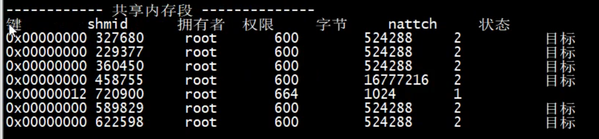


##### 7.2.4.3.4 信号

```cpp
union sigval{
	/* 参数二选一[传出一个整形数 或者 内存的首地址]*/
	int sival_int; /* 两个没有血缘关系的进程间通信 */
	void* sival_ptr; /* 有血缘关系间的进程间通信*/
};
	int sigqueue(pid_t pid, int sig, const union sigval vaule);
	/* 将信号发送给某个参数,并传递一些额外的数据 */
```


#### 7.2.4.4  守护进程

> 守护进程[精灵进程]:`后台进程,守护进程脱离终端,输入输出会到自己的文件里,周期性的执行某些动作,需要将进程提升为会话,它才能变成守护进程`

> 创建守护进程:
>
> ​	1):  父进程创建子进程【必须的步骤】 -
>
> ​	2):  杀死父进程[释放父进程资源]【必须的步骤】
>
> ​	3): 将子进程提升为会话[setsid()] 
>
> ​	4): 修改进程的工作目录,防止有些不安全目录被卸载[chdir()],  修改文件umask掩码[文件权限]
>
> ​	5):  关闭/重定向 文件描述符 [dup2(); 脱离绑定在终端的输出]
>
> ​			open("/dev/null", O_RDWR)

```cpp
#include <unistd.h>
	int chdir(const char* path); 		/*切换进程目录*/
	/*参数:
		- path: 进程要切换的目录  */

#include <sys/types.h>
#include <sys/stat.h>
	mode_t umask(mode_t mask); 			/*修改文件umask掩码*/
	/* 参数:
		- mask: 8进制数   */

/* 关闭绑定在终端的标准输入/输出/错误 或者重定向 
	- 标准输入 --> close(0)
	- 标准输出 --> close(1)
	- 标准错误 --> clsoe(2)
	- 重定向文件描述符: /dev/null 设备文件（垃圾回收站）	 --> 推荐
		int fd = open("/dev/null", O_RDWR)
		dup2(fd, STDIN_FILENO);
		dup2(fd, STDOUT_FILENO);
		dup2(fd, STDERR_FILENO);   */
```

### 7.2.5 线程

> Linux下线程本质仍然是进程[ 轻量级进程(LWP) ],  线程是从进程中分出去的
>
> Linux以进程为单位分配进程,线程是系统资源调度的最小单位, 线程分出去系统会当作进程处理[ 线程参与抢占CPU资源 ] 
>
> 线程存在进程当中(进程可以认为是线程的容器),多个子线程与父线程共用同一个虚拟地址空间

> 线程共享资源: `文件描述符表`, `信号的处理方式[信号捕捉后的回调函数]`, `当前的工作目录`, `用户ID和组ID`, `内存地址空间[.text[代码区]    .data[全局变量区]   .bss heap[堆]    共享库[dll]`
>
> 线程不共享资源: `线程ID[unsigned long int]`, `处理器现场和栈指针[内核栈]`, `独立的栈空间[栈]`, `errno变量` , `阻塞信号集` , `调度优先级[线程的优先级]`

> 安装线程 man page: ”`sudo apt-get install manpages-posix-dev`“ 
>
> ps -Lf 查看线程的LWP号
>
> 编译有调用子线程的库时必须添加线程库的名字[pthread]:  `gcc pthread_create.c -lpthread`

```cpp
'获取当前线程的线程ID'
#include <pthread.h>
	pthread_t pthread_self(void); 			/* 返回线程ID */

"比较线程ID是否相同"
/* 在Linux下线程ID[无符号长整形], 有的操作系统封装不同pthread_t是结构体,无法用 == 比较两个线程ID */
#include <pthread.h>
	int pthread_equal(pthread_t t1, pthread_t t2);
	/*参数:
		-: 要比较的两个线程的ID
	返回值: 两个ID相同【非0】 不同【0】*/

"线程属性"
/* 设置线程属性需要先申请一个变量保存属性,使用完后释放 */
/* 线程的属性类: pthread_attr_t */
#include <pthread.h>
	int pthread_attr_init(pthread_attr_t* attr); /* 线程属性结构体初始化 */
	int pthread_attr_destroy(pthread_attr_t* attr); /*释放线程属性*/
	/* 例:
		pthread_attr_t t;
		pthread_attr_init(&t);
		pthread_attr_destroy(&t);    */

'获取线程的状态 '
int pthread_attr_getdetachstate(const pthread_attr_t* attr, int*detachstate);
```

#### 7.2.5.1 线程操作

```cpp
/* 编译有调用子线程的库时必须添加线程库的名字[pthread] */
" gcc pthread_create.c -lpthread"

'创建子线程'
#include <pthread.h>
	/* 创建的每一个子线程只会执行自己回调函数里面的代码 */
	int pthread_create(pthread_t* thread, const pthread_attr_t* attr,
                       void *(*start_routine) (void *), void* arg);
	/* 参数:
		- thread: 传出参数,线程创建成功后保存着子线程的id [pthread_t线程id的类型(unsigned long int)]
		- attr: 设置线程属性[可以不使用, 传NULL(使用默认的系统属性)]
		- start_routine: 回调函数,子线程的处理逻辑
		- arg: 给第三个参数[回调函数]传参
	返回值: 成功【0】 / 失败【错误号，char* 类型】 strerror(线程名)可获取线程名 */
	/* 例:
		pthread_t tid;
		int number =100;
		int ret = pthread_create(&tid, NULL, callBack, (void*)&number);  */

'线程退出'
/* 线程执行完毕退出不会对其他子线程产生影响(包括主线程退出) */
#include <pthread.h>
	void pthread_exit(void* retval);
	/* 参数
		- retval: 线程退出的时候的返回值 可以指定为NULL*/
	// 例: pthread_exit(NULL);

'主线程回收子线程资源'
#include <pthread.h>
	int pthread_join(pthread_t thread, void** retval);
	/* 阻塞函数,调用一次回收一次子进程 */
	/*参数:
		- thread: 需要回收的子线程ID
		- retval: 二级指针，使用这个变量接收子进程退出时返回的值 [可以指定为NULL] 也可以接收返回值  */

'线程分离'
/*设置了线程分离后,子线程执行完毕后,不需要主线程回收子线程资源 */
#include <pthread.h>
	int pthread_detach(pthread_t thread);
	/*子线程创建成功后,设置分离,主线程执行完毕后设置线程退出,就不会影响子进程继续运行 */
	/*参数:
		- thread: 要和主线程分离的子线程ID  */

'线程取消'
/* 取消点: 在程序中发生系统调用时[ 从用户区切换到内核区 ]会执行类似于Windows内核调用ACP队列的操作 */
/* 主线程调用线程取消函数,可以终止子进程的运行,如果子线程没有执行到取消点,子进程就不会终止 */
#include <pthread.h>
	int pthread_cancel(pthread_t thread);
	/* 主线程调用该函数 */
	/*参数:
		-thread: 要取消的线程ID  */

"通过线程属性实现线程分离"
#include <pthread.h>
	int pthread_attr_setdetachstate(pthread_attr_t* attr, int detachstate);
	/*参数:
		- attr: 线程属性结构体
		- detachstate:
			PTHREAD_CREATE_DETACHED: 设置线程分离
			PTHREAD_CREATE_JOINABLE: 设置主线程子线程不分离  */
	int pthread_attr_getdetachstate(const pthread_attr_t* attr, int*detachstate);
	/* 获取线程的状态 *
```

#### 7.2.5.2 线程同步

> 当一个线程对内存进行操作时,其他线程都不可以对这个内存地址进行操作,直至该线程完成操作

##### 7.2.5.2.1 互斥锁/互斥量

> 互斥锁的类型: `pthread_mutex_t`, 可以理解为结构体
>
> 互斥锁可以让多个线程串行处理临界区的资源 ( 代码块 )
>
> `restrict修饰符 (被修饰过的变量不能被其他指针引用),用其他指针操作修饰过变量的地址是不允许的`

```cpp
' restrict 是一个修饰符 '
' 线程初始化之前就需要创建锁,并初始化 '
	pthread_mutex_t mutex; /* 创建互斥锁 */
#include <pthread.h>

	int pthread_mutex_init(pthread_mutex_t* restrict mutex,const pthread_mutexattr_t* restrict attr); 
	/* 初始化互斥锁*/
	/* 参数：
		- mutex: 互斥锁的地址
		- attr: 互斥锁的属性,一般使用默认属性【NULL】 */

	int pthread_mutex_destroy(pthread_mutex_t* mutex); 		/* 释放互斥锁的资源*/
	int pthread_mutex_lock(pthread_mutex_t* mutex); 		/* 将参数指定的互斥锁上锁,如果已被锁上,
															其他线程调用加锁就会被阻塞在这里 */
	int pthread_mutex_trylock(pthread_mutex_t* mutex); 		/* 将指定参数的互斥锁尝试加锁,加锁失败函数直接返回,
															不会阻塞在这里 */
	int pthread_mutex_unlock(pthread_mutex_t* mutex);		 /* 解锁函数 */
```

##### 7.2.5.2.2 读写锁

> 读写锁是一把锁定读操作,锁定写操作的锁(
>
> 读写锁的类型: `pthread_rwlock_t`
>
>  `读取的时候可以并发进行, 写的时候独占, 写的优先级高于读的优先级 `,`加读锁可以阻塞写锁,读锁全部关闭后写锁锁上,不允许读锁`

```cpp
#include <pthread.h>
	int pthread_rwlock_init(pthread_rwlock_t* restrict rwlock, 
                        const pthread_rwlockattr_t* restrict attr);		/* 初始化读写锁*/
	/* 参数:
		- rwlock: 读写锁的地址
		- attr: 读写锁的属性 [使用默认属性 设置NULL] */
	int pthread_rwlock_destroy(pthread_rwlock_t* rwlock); 		/* 释放读写锁资源*/
	int pthread_rwlock_rdlock(pthread_rwlock_t* rwlock); 		/* 加读锁[失败会阻塞在这里等待],
																被加了写锁时, 加读锁被阻塞, 读锁可以同时进行 */
	int pthread_rwlock_tryrdlock(pthread_rwlock_t* rwlock); 	/* 尝试加读锁[失败会直接返回] */
	int pthread_rwlock_wrlock(pthread_rwlock_t* rwlock); 		/* 加写锁[失败阻塞等待] */
	int pthread_rwlock_trywrlock(pthread_rwlock_t* rwlock); 	/* 尝试加写锁[失败直接返回] */
	int pthread_rwlock_unlock(pthread_rwlock_t* rwlock); 		/* 读写锁解锁 */
```

##### 7.2.5.2.3 条件变量

> 条件变量能够引起某个线程的阻塞
>
> ​	`---某个条件满足之后,阻塞线程`
>
> ​	`---某个条件满足之后,解除线程阻塞`
>
>  使用条件变量进行线程同步,多个线程操作共享数据,不能解决数据混乱问题, `需要配合互斥锁使用 条件变量的类型: pthread_cond_t`

```cpp
steuct timespec{ /* 时间结构体,从1970-01-01算 */
	time_t tv_sec;
	long tv_nsec;
};
struct timeval{
	time_t tv_sec; /* 秒 */
	suseconds_t tv_usec; /* 微秒 */
};
struct timezone{
	int tz_minuteswest;
	int tz_dsttime;
};
#inlcude <sys/time.h>
	int gettimeofday(struct timeval* tv, struct timezone* tz);
```

```cpp
#include <pthread.h>
	int pthread_cond_init(pthread_cond_t* restrict cond, const pthread_condattr_t* restrict attr);	
					/* 初始化条件变量 */
	/* 参数:
		- cond: 指向条件变量的存放地址
		- attr: 条件变量的属性[使用默认属性,这个值设置为 NULL] */

	int pthread_cond_destroy(pthread_cond_t* cond); 		/* 释放条件变量资源 */
	int pthread_cond_wait(pthread_cond_t* restrict cond, pthread_mutex_t* restrict mutex);
			/* 线程调用该函数后一直阻塞*/
	/* 参数:
		- cond: 条件变量
		- mutex: 互斥锁 */
	int pthread_cond_timedwait(pthread_cond_t* restrict cond, pthread_mutex_t* restrict mutex,
                               const struct timespec* restrict abstime); /* 在指定时间后解除阻塞*/
	/* 参数:
		- cond: 条件变量
		- mutex: 互斥锁
		- abstime: 阻塞的时间 上有结构体和函数
			- 当前的时间 + 要阻塞的时长
				struct timeval val;
				gettimeofday(&val, NULL); */
	int pthread_cond_signal(pthread_cond_t* cond); /* 唤醒一个或多个阻塞在环境变量函数上的线程 */
	int pthread_cond_broadcast(pthread_cond_t* cond); /* 唤醒所有在阻塞环境变量的函数 */
```


#### 7.2.5.3 线程池

> 线程池设计:  有一个管理者线程, 若干个工作者线程, 和分派任务的任务队列
>
> ​	1): 管理者线程: 创建和销毁工作者线程
>
> ​			a): 假设当前有10个工作者线程, 有9个正在工作,线程马上就不够用了,要创建新的线程
>
> ​			b): 假设当前工作者线程有100,正在工作的线程只有10个工作90个空闲,空闲线程太多,释放一部分线程
>
> ​	2): 工作者线程: 从任务队列中取出任务并处理客户端业务逻辑
>
> ​			a): 任务队列中没有任务了,让空闲线程阻塞-->`pthread_cond_wait`
>
> ​			b): 任务队列中添加了新任务,让阻塞的工作线程解除阻塞-->`pthread_cond_signal`
>
> ​	3):任务队列: 存储客户端请求

## 7.3 Linux 网络通信

### 7.3.1套接字

#### 7.3.1 .1网络套接字

> 这个结构体存储IP地址和端口

```cpp
#include <arpa/inet.h>

typedef unsigned short uint16_t;
typedef unsigned int uint32_t;
typedef uint16_t in_port_t;
typedef uint32_t in_addr_t;
typedef unsigned short int sa_family_t;
#define __SOCKADDR_COMMON_SIZE (sizeof(unsigned short int))

struct in_addr{
	in_addr_t s_addr; 			/* ip地址 unsigned int */
};

struct sockaddr{
	sa_family_t sa_family; 		/* 地址组协议[IP协议] unsigned short int */
	char sa_data[14]; 			/* IP和端口 */
}

struct sockaddr_in{ /* IPv4 【可以强转 struct sockaddr类型】*/
	sa_family_t sin_family; /* 地址族/通讯协议 【AF_INET, AF_INET6】unsignedshort int */
	in_port_t sin_port; /* 端口 unsigned short */
	struct in_addr sin_addr; /* IP地址结构体 unsigned int*/
		// sin_addr.s_addr设置宏值 INADDR_ANY 操作系统会自动获取本机IP地址赋值给变量
	unsigned char sin_zero[sizeof(struct sockaddr) - __SOCKADDR_COMMON_SIZE -
		sizeof(in_port_t) - sizeof(struct in_addr)];
};

```

##### 7.3.1.1 .1字节序转换函数

> 小端(主机字节序): `低地址存放低位节字` 大端(网络字节序): `低地址存放高位字节`

```shell
$ netstat 查看网络信息命令
```

```cpp
#include <arpa/inet.h>

" short int --> 2字节 【 *ro*s() --> 进行端口转换 】"
	uint16_t htons(uint16_t hostshort); /* 主机字节序转换成网络字节序 短整型 */
	/* 参数:
		- hostshort: 主机字节数的short型数值(要转换的主机字节序)
	返回值: 转换后得到数(网络字节序) */

	uint16_t ntohs(uint16_t netshort); /* 网络字节序转主机字节序 */
	/* 参数:
		- netshort：要转换的网络字节序
	返回值: 主机字节序 */

" long -->4字节 32位下long是4字节 【 *to*l() --> 进行IP转换 】"
	uint32_t htonl(uint32_t hostlong); /* 主机字节序转网络字节序 长整型*/
	uint32_t ntohl(uint32_t netlong); /* 网络字节序转主机字节序 */
```

##### 7.3.1.1.2 IP地址转换函数

```cpp
#include <arpa/inet.h>
	/* 字符串: 192.168.1.100 (点分十进制字符串) */
	/* inet_pton【p-->点分十进制字符串 IP】【n-->network】 */
	int inet_pton(int af, const char* src, void* dst);
	/* 将主机字节序的字符串IP[192.168.1.100] 转换 网络字节序的整型数 */
	/* 参数:
		- af: 地址族协议 ipv4[], ipv6]
			AF_INET // ipv4
			AF_INET6 // ipv6
		- src: 点分十进制字符串 IP[192.168.1.100]
		- dst: 传出参数,需要一块内存的地址,将转换得到的网络字节序(整型数)传到这块内存中
	返回值: 成功[1] 失败[-1] 输入的不是一个有效的表达式[0] */

	const char* inet_ntop(int af, const void* src, char* dst, socklen_t size);
	/* 网络字节序的整型IP 转换 点分十进制字符串IP*/
	/* 参数:
		- af: 地址族协议[AF_INET, AF_INET6]
		- src: 指向要转换的 网络字节序整型IP的地址
		- dst: 指向转换成功后存储点分十进制字符串的地址
		- size: 修饰第三个参数dst对应的内存大小[socklen_t 是一个int ]
	返回值: 成功[非空指针指向dst] 失败[NULL] */

	char *inet_ntoa(struct in_addr in);
	// 将网络地址转换成“.”点隔的字符串格式返回的地址在下一次调用将被覆
```

#### 7.3.1.2 本地套接字

```cpp
#include <sys/un.h>
#define UNIX_PATH_MAX 108
struct sockaddr_un{
	sa_family_t sun_family; // 地址族协议[AF_LOCAL||AF_UNIX]
	AF_LOCAL==AF_UNIX
	char sun_path[UNIX_PATH_MAX]; // 套接字文件(伪文件) 路径,不需要手动创建
}
/* 本地套接字通信流程和TCP是一样, socket(AF_LOCAL,sock_stream, 0 ) */

// 如果使用本地套接字,bind失败,显示被占用,可以删除那个套接字文件
#include <unistd.h>
	int unlink(const char* path); // 删除文件
```


### 7.3.2 TCP/UDP

```cpp
#include <sys/types.h>
#include <sys/socket.h>
/* arpa/inet.h 包含这个头文件,上面有两个头文件就可以不写了 */
#include <arpa/inet.h>
#include <unistd.h>

	int socket(int domain, int type, int protocol); //  创建一个套接字 
	/*[用完释放文件描述符close()] */
	/* 参数:
		- domain: 地址族协议
			AF_INET // IPv4
			AF_INET6 // IPv6
			AF_UNIX==AF_LOCAL // 进行本地套接字通信(进程间通信) [这两个宏值是等价的]
		- type: 通信过程中使用的协议类型
			SOCK_STREAM // 流式协议,【默认使用TCP】
			SOCK_DGRAM // 报式协议,【默认使用UDP】
		- protocol: // 协议, 一般写0[ 协议类型里默认使用的TCP]
	返回值: 成功【文件描述符(大于0)，指向内核缓冲区】 失败【-1】 */

	int bind(int sockfd, const struct sockaddr* addr, socklen_t addrlen);
	/* 绑定函数, 将fd和本地的IP+Port进程绑定 */
	/* 参数:
		- sockfd: 通过调用sockt函数得到的文件描述符
		- addr: 将IP和端口初始化到 sockaddr* addr变量中 sockaddr_in可以强转sockaddr
		-addrlen: 第二个参数struct sockaddr* addr结构体占的内存大小
	返回值: 失败【-1】 */

	int listen(int sockfd, int backlog); /* 设置监听 */
	/* 参数:
		- sockfd: 通过调用sockt函数得到的文件描述符
		- backlog: 已经连接成功,但是还没有被处理的最大连接的数量
				指定的数指不能大于 /proc/sys/net/core/somaxconn里存储的数据,大于就会默认是它
	返回值: 失败【-1】*/

	int accept(int sockfd, struct sockaddr* addr, socklen_t* addrlen);
	/* 默认阻塞函数,阻塞等待客户端请求. 请求到达,接收客户端连接 */
	/* [用完释放文件描述符close()] */
	/*参数:
		- sockfd: 用于监听的文件描述符(套接字)
		- addr: 传出参数，记录了连接成功客户端的IP和端口信息
		- addrlen: 保存第二个参数struct sockaddr* addr结构体的大小
	返回值: 成功【用于通信的文件描述符(大于0)】 失败【-1】 */

	int connect(int sockfd, const struct sockaddr* addr, socklen_t addrlen);
	/* 客户端使用该函数连接服务器，TCP需要,UDP不需要连接直接发送 */
	/* 参数:
		- sockfd: 用于通信的文件描述符
		- addr: 客户端要连接服务器的地址信息
		- addrlen: 第二个参数struct sockaddr* addr结构体的大小
	返回值: 连接成功【0】 连接失败【-1】*/
	/* Posix 定义了与 select/epoll 和 非阻塞 connect 相关的规定：
		连接成功建立时,socket 描述字变为可写（连接建立时，写缓冲区空闲，所以可写）
		连接建立失败时,socket 描述字既可读又可写 （由于有未决的错误，从而可读又可写）
		---当用select检测连接时,socket既可读又可写,只能在可读的集合通过getsockopt获取错误码。
		---当用epoll检测连接时,socket既可读又可写,只能在EPOLLERR中通过getsockopt获取错误码。
	*/

	int shutdown(int sockfd, int how);
	/* 套接字 半关闭函数 */
	/* 参数:
		- sokcfd: 要操作的套接字文件描述符
		- how:
			SHUT_RD: 关闭读端
			SHUT_WR: 关闭写端
			SHUT_RDWR: 关闭读写端 */	
```

```cpp

'TCP' // TCP可以通过描述符用read/write直接操作读写
	ssize_t send(int sockfd, const void* buf, size_t len, int flags);
	ssize_t recv(int sockfd, void* buf, size_t len, int flags);

'UDP'
	ssize_t sendto(int sockfd, const void* buf, size_t len, int flags,
                   const struct sockaddr* dest_addr, socklen_t addrlen);
	/* 参数:
		- sockfd: 通信的描述符
		- buf: 要发送的数据
		- len: 数据长度
		- flags: 一般填0
		- dest_addr: 接收端信息
		- addrlen: dest_addr大小*/

	ssize_t recvfrom(int sockfd, void* buf, size_t len, int flag,
                     struct sockaddr* src_addr, socklen_t* addrlen);
	/* 阻塞函数*/
	/* 参数:
		- sockfd: 通信的描述符
		- buf: 接收数据的缓冲区
		- len: 缓冲区大小
		- flags: 一般填0
		- src_addr: 接收发送端信息的缓冲区,不需要可以指定为NULL
		- addrlen: src_addr大小(传入传出参数)*/ 
```

#### 7.3.2.1 连接池

> 客户端在与服务器的连接在使用之前先创建好,放到某个容器中,这个容器提供一块存储空间,地宫对应的操作方法

### 7.3.3 I/O多路转接

> 用多路转接托管 要检测描述符状态,当描述符状态发生变化时,去accecpt或者读取网络连接的缓冲区数据

#### 7.3.3.1 Select

```cpp
#include <sys/select.h>
struct fd_set // fd_set文件描述符集,有128个字节,有1024个位,分别对应文件描述符0-1023
{// sizeof(fd_set) == 128
} 

	int select(int nfds, fd_set* readfds, fd_set* writefds, fd_set* exceptfds, 
               struct timeval* timeout);
	/* 参数:
		- nfds: 要检测文件描述符的最大数量+1
		- readfds: 读集合(检测文件描述符指向的内核读缓冲区是否有数据)-->传入传出参数
		- writefds: 写集合(检测文件描述符指向的内核写缓冲区是否能写数据)-->传入传出参数
		- exceptfds: 异常集合-->传入传出参数,为NULL不检测
		- timeout: 阻塞or非阻塞
			NULL: 永久阻塞,直到检测到需要检测的文件描述符有变化
			timeout->tv_sec=0, timeout->tv_usec=0: 不阻塞
			timeout->tv_sec>0||timeout->tv_usec>0: 阻塞对应时长  */
	void FD_ISSET(int fd, fd_set* set); 	/* 判断某个文件描述符在集合中的标志位是0还是1*/
	void FD_ZERO(fd_set* set); 				/* 将某个集合全部标志位初始化为0,共有1024个标志位*/
	void FD_CLR(int fd, fd_set* set); 		/* 设置某个文件描述符在集合中的标志位为0*/
	void FD_SET(int fd, fd_set* set); 		/* 设置某个文件描述符在集合中的标志位为1*/
```

#### 7.3.3.2 poll

```cpp
#include <poll.h>
struct pollfd{
	int fd; /* 设置内核检测的描述符*/
	short events; /* 内核检测文件描述符的事件类型(读POLLIN、写POLLOUT、错误POOLERR...等)*/
	short revents; /* 文件描述符实际发生的事件*/
}

	int poll(struct pollfd* fds, nfds_t nfds, int timeout);
	/* 参数:
		- fds: 要检测的文件描述符和事件结构体数组-->struct pollfd fds[];
		- nfds: 数组中最后一个有效元素的下标+1
		- timeout:
			0:不阻塞
			-1:阻塞(直至描述符发生变化)
			>0: 阻塞时长
	返回值: -1失败 >0检测到发生变化的描述符数量*/
```

#### 7.3.3.3 epoll

> 内核和用户区以共享内存的方式 
>
> LT模式: `缺省模式`
>
>  ET模式: `高速工作模式`

```cpp
#include <sys/epoll.h>
typedef union epoll_data{
	void* ptr;
	int fd;
	uint32_t u32;
	uint64_t u64;
}epoll_data_t;

struct epoll_event{	// 检测的到时候返回这个描述符信息
	uint32_t events; // Epoll events, Epoll检测的事件	
    /*EPOLLIN, EPOLLOUT, EPOLLERR, EPOLLET(设置边沿触发)*/
	epoll_data_t data; // User data variable	可以传入要检测的描述符-->epeve.data.fd = fd;
}

	int epoll_create(int size); // 创建一颗epoll红黑树
	/* 参数:
		- size: 现在版本没有意义,随便填大于0的数
	返回值: >0:epoll树的根节点(也是文件描述符) 用close()释放 -1:失败*/

	int epoll_ctl(int epfd, int op, int fd, struct epoll_event* event);
	/* epoll树管理: 添加节点,删除节点,修改已有节点属性*/
	/* 参数:
		- epfd: epoll_create创建出来的 树根节点
		- op:
			EPOLL_CTL_ADD: 添加新节点
			EPOLL_CTL_MOD: 修改某个节点的属性,如果之前没有调用过EPOLL_CTL_ADD,直接调EPOLL_CTL_MOD会失败
			EPOLL_CTL_DEL: 删除某个节点
		- fd: 需要检测的文件描述符
		- event: epoll事件结构体变量,删除的时候传NULL */

	int epoll_wait(int epfd, struct epoll_event* events, int maxevents, inttimeout);
	/* 检测函数,有可能同时返回读和写的,用 返回值&事件掩码判断是什么事件*/
	/* 参数:
		- epfd: epoll_create创建出来的 树根节点
		- events: 传出参数,发生变化的描述符信息
		- maxevents: events数组的大小( sizeof(events)/sizeof(struct epoll_event) )
		- timeout: 0:不阻塞 -1:一直阻塞,直到检测的某个描述符发生变化 >0:阻塞时长(毫秒)
	返回值: >0:发生变化的描述符数量 -1:失败  0:等待被打断,如果被信号打断errno==EINTR */
```

#### 7.3.3.4 广播/组播/端口复用

> 广播 : `只能在局域网中使用,接收端需要绑定本机与服务器发送端口`

|           IP地址           |                             说明                             |
| :------------------------: | :----------------------------------------------------------: |
|   224.0.0.0- 224.0.0.255   | `局部链接多播地址` :是由路由协议和其他用途保留的地址,路由器并不转发 属于此范围的IP包 |
|   224.0.1.0- 224.0.1.255   |  `预留多播地址` :公用组播地址,可用于internet; 使用前需申请   |
| 224.0.2.0- 238.255.255.255 | `预留多播地址` :用户可用组播地址(临时组地址), 全网范围内有效 |
| 239.0.0.0- 239.255.255.255 | `本地管理组播地址` : 供组织内部使用,类似于私有IP地址,不能用于internet, 可限制多播范围 |

```cpp
#include <net/if.h>
unsigned int if_nametoindex(const char* ifname); // 同过网卡名字获取网卡编号
char* if_indextoname(unsigned int ifindex, char* ifname); // 通过网卡编号获取网卡名字
```

```cpp
struct in_addr{
	in_addr_t s_addr;
};

struct ip_mreqn{
	struct in_addr imr_multiaddr; // 组播组IP
	struct in_addr imr_address; // 本地某一网络设备接口的IPD地址
	int imr_ifindex; // 网卡编号,if_nametoindex()获取
};

	int setsockopt(int sockfd, int level, int optname, const void* optval, 
                   socklen_T optlen);
	/* 设置端口复用在描述符bind之前设置(服务器程序重启之后,端口还未被释放) 设置UDP广播属性 */
	/* 参数:
		- sockfd: 要设置的套接字文件描述符
		- level: 权限级别
			SOL_SOCKET: 端口复用/UDP广播
			IPPROTO_IP: 组播/
		- optname: 操作
			SO_REUSEADDR: IP地址复用
			SO_REUSEPORT: 端口复用
			SO_BROADCAST: 允许发送广播数据段
		- optval: -->地址里面存放的值(int)
			1: 可以 复用/广播
			0: 不能 复用/广播
		- optlen：optval对应的内存大小(sizeof(类型))
	返回值: 成功【0】, 失败【-1】*/


	setsockopt(sockfd, SOL_SOCKET, SO_BROADCAST, int*, sizeof(int));	// 发送广播

	setsockopt(sockfd, IPPROTO_IP, IP_MULTICAST_IF, struct in_addr*,sizeof(struct in_addr) );
	// 服务端指定外出接口(组播)

	setsockopt(sockfd, IPPROTO_IP, IP_ADD_MEMBERSHIP, struct ip_mreqn*, sizeof(struct ip_mreqn) );
	// 客户端加入组播
```

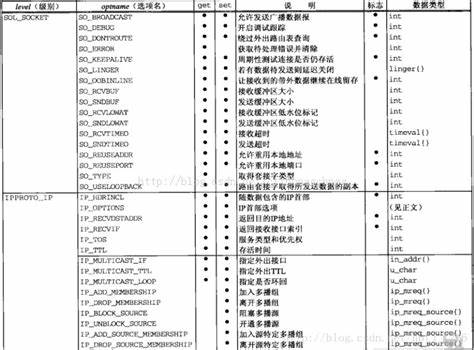

### 7.3.4 LibEvent框架

> https://libevent.org/
>
> `LibEvent` : 基于回调的事件驱动

```shell
'LibEvent 安装'
# 解压LibEvent安装包
	$: tar zxvf libevent-2.1.8-stable.tar.gz
# 进入解压后的文件夹,执行configure执行(检测安装环境,并生成makfile)
	$: sudo ./configure
	# 如果提示没有 openssl,执行后重新 ./configure
	$: sudo apt-get install libssl-dev
# 安装(把 ./.libs/libevent.so 拷贝到 /user/local/lib/libevent.so)
	$: sudo make install
	
	$: gcc server.c -o a.out -levent // 编译的时候要加载第三方库 levent
```

```cpp
#include <event2/event.h>
struct event_base{
	const struct eventop* evsel;
	void* evbase;
	int event_count;
	int event_count_active;
	....
};

	struct event_base* event_base_new(void); // 创建event_base框架, 返回指针
	void event_base_free(struct event_base* base); // 释放event_base框架, 返回指针
	int event_reinit(struct event_base* base); // 重新初始化event_base框架,子进程被创建后
	const char** event_get_supported_methods(void); // 检测支持哪些I/O转接函数
	const char* event_base_get_method(
	const struct event_base* base); // 查看当前使用的I/O转接函数
```

```cpp
#include <event2/event.h>
#define EV_TIMEOUT 0x01
#define EV_READ 0x02
#define EV_WRITE 0x04
#define EV_SIGNAL 0x08
#define EV_PERSIST 0x10 // 修饰某个事件是持续触发的
#define EV_ET 0x20 // 边沿模式

	typedef void (*event_callback_fn)(evutil_socket_t fd, short what, void* arg);
	// 事件处理回调函数
	/* 参数:
		- fd: 触发事件的描述符
		- what: 实际触发的事件
		- arg: 指向event本身 */

'事件操作'
	struct event* event_new(struct event_base* base, evutil_socket_t fd,shortwhat,
                            void (*event_callback_fn)(evutil_socket_t, short, void*),void* arg);
	// 创建事件实例,事件被nwe出来不能直接被检测
	/* 参数:
		- base: base事件框架
		- fd: 要检测的描述符
		- what: 需要检测的事件 ————>上面的宏
		- event_callback_fn: 事件处理回调函数--> fn(fd, what, arg); 与这些参数相同
		- arg: 指向event本身*/

	int event_add(struct event* ev, const struct timeval* tv);
	// 添加事件实例到检测框架树
	/* 参数:
		ev: 事件实例
		tv: 超时检测,如果tv事件内事件没有被触发,也会强制调用事件处理回调函数,为NULL不会强制*/

	void event_free(struct event* event); // 释放事件实例资源,先event_del再释放
	int event_del(struct event* ev); // 将事件实例从框架检测树上摘下来
```

#### 7.3.4.1 事件循环

> `事件循环` : 检测对应的事件是否被触发了

```cpp
#include <event2/event.h>
#define EVLOOP_ONCE 0x01
#define EVLOOP_NONBLOCK 0x02
#define EVLOOP_NO_EXIT_ON_EMPTY 0x04
struct timeval{
	long tv_sec;
	long tv_usec;
}

'启动事件循环'
	int event_base_loop(struct event_base* base, int flags);
	/* 参数:
		- base: 通过event_base_new 创建得event_base框架的指针
		- flags:
			EVLOOP_ONCE: 循环阻塞检测某个事件,事件被触发后停止事件循环
			EVLOOP_NONBLOCK: 不阻塞,不停的检测,当事件触发后停止事件循环
			EVLOOP_NO_EXIT_ON_EMPTY: 一直进行事件检测,如果没有了要检测的事件也不退出
	*/
	// 不停的循环检测,所有要检测的事件都被触发了并且处理完毕结束检测
	int event_base_dispatch(struct event_base* base); // 一般使用这个

'终止事件循环'
	// 事件处理函数正在执行,执行完毕在tv时长后退出循环事件,如果指定为NULL,直接退出
	int event_base_loopexit(struct event_base* base, const struct timeval* tv);
	// 不管是否有正在事件处理函数正在执行, 马上终止
	int event_base_loopbreak(struct event_base* base);

'事件优先级'
	// EVENT_MAX_PRIORITIES == 256
	int event_base_priority_init(struct event_base* base, int n_priorities);
	// 初始化事件框架的优先级等级
	/* 参数:
		- base: event_base框架的指针
		- n_priorities: 等级个数, 3级->[0,1,2], 等级最高EVENT_MAX_PRIORITIES
	返回值: */
	int event_priority_set(struct event* event, int priority); // 设置事件的等级
	/* 参数:
		- event: 事件
		- priority: 事件对应的等级*/
	int event_base_get_npriorities(struct event_base* base); // 获取当前事件的等级个数
```

#### 7.3.4.2 bufferEvent

> 带缓冲区的事件,主要应用于套接字通信

```cpp
#include <event2/bufferevent.h>
typedef void(*buffevent_data_callback)(struct bufferevent*bev, void* ctx);
typedef void(*buffevent_event_cb)(struct bufferevent* bev, short events, void*ctx);

	struct bufferevent* bufferevent_socket_new(struct event_base* base,
                                               evutil_socket_t fd, enum bufferevent_options options);
	/* 创建创建带缓冲区的事件,读缓冲区默认禁用的bufferevent_enable()设置,主要用于通信 */
	/* 参数:
		- base: 框架指针
		- fd: 描述符,客户端可以指定为-1,在bufferevent_socket_connect()的时候自动创建
		- options:
			BEV_OPT_CLOSE_ON_FREE: 当创建的bufferevent*被释放时,底层的资源也被释放了
	返回值: 得到带缓冲区的bufferevent事件的指针 */
	void bufferevent_free(struct bufferevent* bev); // 释放带缓冲区的事件
	void bufferevent_setcb(struct bufferevent* bufev,
	void (*read_callback)(struct bufferevent*bev, void* ctx),
	void (*write_callback)(struct bufferevent*bev, void* ctx),
	void (*event_callback)(struct bufferevent* bev, short events, void*ctx), void* arg);
	/* 设置读写事件回调函数*/
	/* 参数:
		- bufev: 带缓冲区的event事件
		- read_callback: 读事件回调函数, 事件函数参数(bufev, arg);
		- write_callback: 写事件回调函数, 事件函数参数(bufev, arg);
		- event_callback: 特殊事件处理回调函数, 事件函数参数(bufev, events[看下面宏], arg);
			BEV_EVENT_READING: 缓冲区有读操作时发生某事件,去i读取某些数据-->对方关闭了连接
			BEV_EVENT_WRITING: 写入操作时发生某事件,当数据被bufferevent_write写入之后才会被触发
			BEV_EVENT_ERROR: 操作时发生错误, EVUTIL_SOCKET_ERROR()查看错误信息
			BEV_EVENT_TIMEOUT: 发生超时
			BEV_EVENT_EOF: 遇到文件结束指示,对方已经关闭了连接
			BEV_EVENT_CONNECTED: 请求的连接过程已经完成,客户端建立连接成功会第一次触发
		- arg: 回调函数参数指针 */
```

```cpp
'事件检测操作'
#define EV_TIMEOUT 0x01
#define EV_READ 0x02
#define EV_WRITE 0x04
#define EV_SIGNAL 0x08
#define EV_PERSIST 0x10 // 修饰某个事件是持续触发的
#define EV_ET 0x20 // 边沿模式
    
void bufferevent_enable(struct bufferevent* bufev, short events); //设置某个事件有效
void bufferevent_disable(struct bufferevent* bufev, short events); //设置某个事件无效
short bufferevent_get_enabled(struct bufferevent* bufev); // 获取带缓冲区事件的有效事件

'缓冲区操作'
// 向缓冲区写入数据
int bufferevent_write(struct bufferevent* bufev, const void* data, size_tsize);
// 向缓冲区读出数据,读出后缓冲区数据清空
size_t bufferevent_read(struct bufferevent* bufev, void* data, size_t size);
```

```cpp
'客户端连接服务器'
#include <event2/bufferevent.h>
    
int bufferevent_socket_connect(struct bufferevent* bev, struct sockaddr* address, int addrlen);
	// 连接服务器函数
	/* 参数:
		- bev: 带缓冲区的event事件,里面封装了fd
		- address: 地址族协议/端口/IP
		- addrlen: address的内存大小*/

'服务器监听'
#include <event2/listener.h>
	typedef void (*evconnlistener_callback)(struct evconnlistener* listener,
                                            evutil_socket_t sock, struct sockaddr* addr, int len, void* ptr);
	/* 参数:
		- listener: evconnlistener_new()/...new_bind() 时创建的监听event的指针
		- sock: 通信的描述符
		- addr: 客户端的ip和端口
		- len: addr的大小
		- ptr: evconnlistener_new()/...new_bind() 时传入的回调函数参数*/

	struct evconnlistener* evconnlistener_new(struct event_base* base,evconnlistener_callback ev_cb, 
                                              void* ptr, unsigned flags,int backlog, evutil_socket_t fd);
	// 以绑定端口的描述设置监听
	/* 参数:
		- base: libevent框架指针
		- ev_cb: 描述符的回调函数
		- ptr: 回电函数的最后一个参数
		- flags: 描述符属性
			LEV_OPT_CLOSE_ON_FREE: 监听event 释放的时候, 资源也会被释放
			LEV_OPT_REUSEABLE: 设置端口复用,监听描述符被关闭后,其他描述符能马上绑定端口
		- backlog: 已经连接成功,还没有被处理的最大连接的数量,设置-1,会自动选择一个
		- fd: 监听 已经创建出来并且绑定端口的描述符*/

	struct evconnlistener* evconnlistener_new_bind(struct event_base* base,evconnlistener_callback ev_cb, 
                                                   void* ptr, unsigned flags,int backlog, 
                                                   const struct sockaddr* sa, int socklen);
	// 创建用于监听的描述符,并且绑定和设置监听
	/* 参数:
		- base: libevent框架指针
		- ev_cb: 描述符的回调函数,接收新连接后
		- ptr: 回电函数的最后一个参数
		- flags: 描述符属性
			LEV_OPT_CLOSE_ON_FREE: 监听event 释放的时候, 资源也会被释放
			LEV_OPT_REUSEABLE: 设置端口复用,监听描述符被关闭后,其他描述符能马上绑定端口
		- backlog: 已经连接成功,还没有被处理的最大连接的数量,设置-1,会自动选择一个
		- sa: 地址族协议/端口/IP, 本地的
		- socklen: sa的大小*/
void evconnlistener_set_cb(struct evconnlistener* lev,
evconnlistener_callback cb, void* arg); 				// 重置监听事件的回调函数
void evconnlistener_free(struct evconnlistener* lev); 	// 释放 监听event
int evconnlistener(struct evconnlistener* lev); 		// 设置监听无效
int evconnlistener_enable(struct evconnlistener* lev);	 // 设置监听有效
```

### 7.3.5 HTTP分析

```http
http状态码:
1xx：指示信息--表示请求已接收，继续处理
2xx：成功--表示请求已被成功接收、理解、接受
3xx：重定向--要完成请求必须进行更进一步的操作
4xx：客户端错误--请求有语法错误或请求无法实现
5xx：服务器端错误--服务器未能实现合法的请求
常见状态码：
200 OK 客户端请求成功
400 Bad Request 客户端请求有语法错误，不能被服务器所理解
401 Unauthorized 请求未经授权，这个状态代码必须和WWW-Authenticate报头域一起使用
403 Forbidden 服务器收到请求，但是拒绝提供服务
404 Not Found 请求资源不存在，eg：输入了错误的URL
500 Internal Server Error 服务器发生不可预期的错误
503 Server Unavailable 服务器当前不能处理客户端的请求，一段时间后可能恢复正常
```

```cpp
//c函数字符转换 
	encodeStr(char* to, int tosize, const char* form);		// utf-8转换asiic
```


#### 7.3.5.1 报文

##### 7.3.5.1.1 请求报文

```http
GET /?username=subwen%40qq.com&phone=11223344&email=11%40aa.com&date=2019-01-
01&sex=male&class=3&rule=on HTTP/1.1
Host: 192.168.36.58:6789
Connection: keep-alive
Upgrade-Insecure-Requests: 1
User-Agent: Mozilla/5.0 (Windows NT 10.0; Win64; x64) AppleWebKit/537.36 (KHTML,
like Gecko) Chrome/73.0.3683.75 Safari/537.36
Accept:
text/html,application/xhtml+xml,application/xml;q=0.9,image/webp,image/apng,*/*;
q=0.8,application/signed-exchange;v=b3
Accept-Encoding: gzip, deflate
Accept-Language: zh,zh-CN;q=0.9,en;q=0.8

// get请求: 第一行的第二部分: 包含了用户提交的数据, 从请求行的第二部分的?开始
```

```http
POST / HTTP/1.1
Host: 192.168.36.58:6789
Connection: keep-alive
Content-Length: 98
Cache-Control: max-age=0
Upgrade-Insecure-Requests: 1
Origin: null
Content-Type: application/x-www-form-urlencoded
User-Agent: Mozilla/5.0 (Windows NT 10.0; Win64; x64) AppleWebKit/537.36 (KHTML,
like Gecko) Chrome/73.0.3683.75 Safari/537.36
Accept:
text/html,application/xhtml+xml,application/xml;q=0.9,image/webp,image/apng,*/*;
q=0.8,application/signed-exchange;v=b3
Accept-Encoding: gzip, deflate
Accept-Language: zh,zh-CN;q=0.9,en;q=0.8
username=subwen%40qq.com&phone=11223344&email=11%40aa.com&date=2019-01-
01&sex=male&class=3&rule=on

// post请求
```

##### 7.3.5.1.2 响应报文

``` http
// 响应报头
HTTP/1.1 200 Ok
Server: micro_httpd
Date: Fri, 18 Jul 2014 14:34:26 GMT
/* 告诉浏览器发送的数据是什么类型 */
Content-Type: text/plain; charset=iso-8859-1 (必选项) 西欧编码->不支持中文
/* 发送的数据的长度 */
Content-Length: 32
Location:url
Content-Language: zh-CN
Last-Modified: Fri, 18 Jul 2014 08:36:36 GMT
Connection: close

<!doucment --->
<h1></h1>
........... 
```

## 7.4 三方框架/库

### 7.4 .1 数据序列化

#### 7.4 .1 .1JSON

> json安装包:  [https://github.com/open-source-parsers/jsoncpp/releases/](https://github.com/open-source-parsers/jsoncpp/releases/)
>
> 编译时必须指定:`C/C++ --> 代码生成 --> 多线程调式(/MTd)`
>
> vs2019 依赖库:`F:\Microsoft Visual Studio\jsoncpp-1.9.5\vs2019\lib\Debug\jsoncpp_static.lib`

- Linux 下的安装

  - 准备安装包

    - `jsoncpp-0.10.7.tar.gz`
    - `scons-3.0.5.zip`

  - 解压缩

    ```shell
    $ tar zxvf jsoncpp-0.10.7.tar.gz
    
    $ unzip scons-3.0.5.zip
    	# 或者
    	$: sudo apt-get update
    	$: sudo apt-get install scons
    ```
  
  - 安装scons -> 进入 `scons-3.0.5.zip` 的解压目录

    ```shell
    $ python setup.py install 
    ```
  
  - 安装 jsoncpp -> 进入 `jsoncpp-0.10.7.tar.gz` 的解压目录
  
    ```shell
    $ scons platform=linux-gcc 
    # 将生成的动态库/静态库拷贝到系统的库目录中, 需要管理员权限
    $ cp libs/linux-gcc-4.8.5/* /lib
    # 拷贝json的头文件到系统目录中, 需要管理员权限
    $ cp include/json/ /usr/include/ -r
    # 创建动态库的链接文件, 需要管理员权限
    ln -s /lib/libjson_linux-gcc-4.8.5_libmt.so /lib/libjson.so
    # 更新, 这样才能搜索到动态库 libjson.so。需要管理员权限
    $ ldconfig	
    # 测试
    $ ./bin/linux-gcc-4.8.5/test_lib_json 
    Testing ValueTest/checkNormalizeFloatingPointStr: OK
    Testing ValueTest/memberCount: OK
    Testing ValueTest/objects: OK
    Testing ValueTest/arrays: OK
    ..................
    Testing BuilderTest/settings: OK
    Testing IteratorTest/distance: OK
    Testing IteratorTest/names: OK
    Testing IteratorTest/indexes: OK
    All 53 tests passed
    ```
  
  - 编译 c++ 测试文件： json-test.cpp
  
    ```shell
    $ g++ json-test.cpp -ljson -o json
    ```

```cpp
sudo apt-get install libjsoncpp-dev
    头文件: /usr/include/jsoncpp/
	库文件: /usr/lib/x86_64-linux-gnu/libjsoncpp.so
```


```cpp
// json数组 --> [ ]: 里面存储元素类型可以不同(又存字符串又存数字)
// json对象 --> { }: 里面是键值对
Type = {int, float, double, string, char*, bool, JsonArray, JsonObject} 	// JSON支持的数据类型

Type asType();		// 将Value对象转换成对应类型的数据, Type替换成上面的某种类型 asInt(); asFloat
bool isType();		// 判断Value对象中存储数据的类型,Type替换成上面的某种类型

Json::Value(Type t);			// 构造函数，Type替换成上面的某种类型
// Value类重载各种类型数据的构造函数
	Json::Value::append(json::Value& val);
	Json::Value::append(Type val);	// 往json数据中添加Value数据,Type替换成上面的某种类型
	Json::Value::size();			// 获取Value数组的大小
	/*
		Json::Value v;
		v.append(12);		// 添加int类似数据
	
		Value arr;
		arr.append("1111");  arr.append("222");  arr.append("3333");
		v.append(arr);		// 添加json数组,数组的排序顺序根据append()添加的顺序排序
	
		Value obj;
		obj["name"] = "小明";  obj["age"] = 12;	
		v.append(obj);		// 添加json对象,对象的配许顺序根据键值a-z的顺序排列
	*/
		std::string Value::toStyledString() const;/* 取值、格式化对象成字符串,拥有换行格式合适存储文件，
												FastWriter::write()适合传输 */
```

```cpp
'Json::Reader' // Json格式字符串转换为Json对象
    bool Json::Reader::parse(const std::string& document, Value& root, bool collectComments = true);
	bool Json::Reader::parse(const char* beginDoc, const char* endDoc, Value& root, bool collectComments = true);
	bool Json::Reader::parse(IStream& is, Value& root, bool collectComments = true);
	/*
	Json::Value val;
	Json::Reader reader;
	std::ifstream file(confPath, std::ios::in);
	*/

'Json::FastWriter' // Json对象转换为Json格式字符串
#include <json/writer.h>
    std::String Json::FastWriter::write(const Value& root) override;	// 格式化成字符串,没有格式适合网络传输
	/*
		Json::FastWriter fw;
		string str = fw.write(Json::Value v);
	*/
```

```cpp
// 例:
void init_conf(const char* confPath)
{
	Json::Value val;
	Json::Reader reader;
	std::ifstream file(confPath, std::ios::in);

	reader.parse(file, val);
	if (val["clientID"].isString())
		this->clientID = val["clientID"].asString();
	if (val["serverID"].isString())
		this->serverID = val["serverID"].asString();
	if (val["serverIP"].isString())
		this->serverIP = val["serverIP"].asString();
	if (val["shmkey"].isString())
		this->shmkey = val["shmkey"].asString();
	if (val["serverPort"].isInt())
		this->serverPort = val["serverPort"].asInt();
	if (val["maxnode"].isInt())
		this->maxnode = val["maxnode"].asInt();
	file.close();
	return;
}
```


#### 7.4 .1.2 protobuf

> 使用protobuf编译生成c++类,使用c++函数读写消息

|     .proto类型      |        c++类型         |                             备注                             |
| :-----------------: | :--------------------: | :----------------------------------------------------------: |
|   double / float    |     double / float     |                   64位浮点数 / 32位浮点数                    |
|    int32 / int64    |     int32 / int64      |                     32位整数 / 64位整数                      |
|   uint32 / uint64   |    uint32 / uint64     |               32位无符号整数 / 64位无符号整数                |
|   sint32 / sint64   |    sint32 / sint64     |        32位整数/64位整数,处理负数效率比int64或int32高        |
|  fixed32 / fixed64  |    uint32 / uint64     | 4字节、8字节,如果数值比 228 256 大的话这个类型会比uint32、uint64高效 |
| sfixed32 / sfixed64 |     int32 / int64      |                        4字节 / 8字节                         |
|        bool         |          bool          |                           布尔类型                           |
|   string / bytes    |    string / string     |  必须是UTF-8编码或者7-bit ASCII编码的文本 / 处理宽字节字符   |
|   enum / message    | enum / object of class |                   枚举 / 自定义的消息类型                    |

```c++
"windows下"
// 下载官方源码库后,需要使用CMake将源码编译成vs能使用的项目(原Linxu项目)，生成第三方库
// 步骤2: 可以配置 protoc.exe 到系统配置环境
	// F:\Microsoft Visual Studio\2019\protobuf\Release
// 步骤3: 使用protobuf编程器(protoc.exe)将写好的.proto文件 生成c++类
cmd: protoc "xxx/xxx/xxx.proto" --cpp_out="xxx/xxx/" --proto_path="xxx\xxx\xx"

// protoc ".\socktMsg.proto" --cpp_out="./" 
```

```cpp
'步骤1 :  序列化'
struct Person
{
     int id;
    string name;
    string sex;
    int age;
}
string text;


'在 .proto文件中定义的消息格式'
syntax = "proto3";				// 使用protobuf版本3
package packSpace;				// 设置生成的包名(命名空间),使用时需要加前缀报名
import ".\\info.proto";			// 导入其他.proto文件
message Person
{
	// 类型 变量名 = 编号(从1号开始)
	int32 id = 1;		// 初始化序列化变量编号
	bytes name = 2;
	bytes sex = 3;
	int32 age = 4;		
}
message text
{
	bytes text=1;
}
```


##### 7.4 .1.2.1 protobuf函数

```cpp
// 项目添加生成的类, 配置项目属性中 加入新类文件所需要的的库和头文件,即可使用这个新类
	// Windows下 vs2019:项目属性->c/c++ -> 预处理器 -> 预处理器定义 添加这个`PROTOBUF_USE_DLLS `宏定义 
	// Linux下设置编译参数 -pthread, 链接库添加protobuf和pthread
    	// vs2019远程linux:	项目属性-> c/c++-> 所有选项-> 附加选项
```


```cpp

// protobuf 消息
#include <google/protobuf/message>

google::protobuff::message* pMsg = nullptr;
```


```cpp
// 生成的操作成员变量的函数的函数名与成员名相关 class.set_xxx()和class.xxx()

// 序列化和反序列化 字符串
	class.SerializeToString(std::string* str);		// 将类成员序列化放进字符串中
	class.ParseFromString(std::string &str);		// 将字符串反序列化之后赋值给类成员

// 序列化反序列化文件
	class.SerializeToFileDescriptor(int file_descriptor);
	class.ParseFromFileDescriptor(int file_descriptor);
```


### 7.4.2  openssl 加密解密

> 安装地址(非官方公益组织):  [openSSL安装包](http://slproweb.com/products/Win32OpenSSL.html)，
>
> ​	使用openSSL的32或64的版本(opsnSLL库)取决于生成的可执行程序是什么版本的

> 加密三要素: `明文/密文, 加密算法/解密算法, 密钥`
>
> 编码方式: `base64(a-z、A-Z、+ /)`

```shell
'添加环境变量'
# 1): 将安装目录的bin目录添加到系统环境变量Path中,方便访问 
# 2): 使用的时候添加包含目录和库目录到项目里,将lib文件添加到附加依赖项
	'F:\OpenSSL\OpenSSL-Win64\include'		# 头文件目录
	'F:\OpenSSL\OpenSSL-Win64\lib'			# 库目录
	'libcrypto.lib'							# 静态库
```

#### 7.4.2.0 数据编码


##### 7.4.2.0.1 BIO

OpenSSL中文手册之BIO库详解: 	<https://blog.csdn.net/liao20081228/article/details/77193729>

```cpp
struct buf_mem_st {
    size_t length;              /* current number of bytes */
    char *data;
    size_t max;                 /* size of buffer */
    unsigned long flags;
};	// 内存型bio的缓冲区属性结构
typedef struct buf_mem_st BUF_MEM;

BIO_METHOD* BIO_f_base64();			// 返回 base64操作的bio结构类型(写的时候编码,读的时候解码),BIO_new(BIO_METHOD*);
BIO_METHOD* BIO_s_mem();			// 返回 内存操作的bio结构类型(包括内存读写),BIO_new(BIO_METHOD*)
	// BIO* base64 = BIO_new(BIO_f_base64());		// 创建一个base64操作 BIO对象
	// BIO* mem = BIO_new(BIO_s_mem());				// 创建一个内存操作 BIO对象

BIO* BIO_new(const BIO_METHOD* type);			// 创建BIO对象
BIO* BIO_new_mem_buf(void* buf, int len);		// 创建一个内存型的BIO对象
BIO* BIO_new_file(const char *filename, const char *mode);	// 创建一个文件型bio
int BIO_free(BIO* bp);						// 释放bio对象


// 下面两个函数返回－2, 则是BIO没有实现本函数
int BIO_read(BIO* b, void* buf, int len);	// 从bio缓冲区中读出len字节的数据到buf中(成功返回读取的字节,失败返回0或者-1)
int BIO_write(BIO* b, const void* buf, int len);	// 往BIO缓冲区中写入长度为len的数据,记得强刷包括操作内存
int BIO_flush(BIO* b);						// 将BIO内部缓冲区的数据都刷新出去(成功返回1,失败返回0或者-1)

'bio操作链'
//  当穿插链后,BIO_write()操作完这个bio后,会继续依次操作链节点后面的bio使用BIO_write(bio*)
BIO* BIO_push(BIO* b, BIO* append);			// 把参数中名为append的BIO附加到名为b的BIO上，并返回b
BIO* BIO_pop(BIO* b);						// 把b从一个BIO链中移除并返回下一个BIO,如果没有下一个BIO返回NULL
void BIO_free_all(BIO* a);					// 释放整个bio链
long BIO_get_mem_ptr(BIO* b, BUF_MEM **p);		// 获取内存型bio的缓冲区属性结构
```

##### 7.4.2.0.2 base64

> Base64:`是一种基于64个可打印字符来表示`二进制数据**的表示方法. 在Base64中的可打印字符包括[字母](https://zh.wikipedia.org/wiki/%E6%8B%89%E4%B8%81%E5%AD%97%E6%AF%8D)`A-Z`、`a-z`、[数字](https://zh.wikipedia.org/wiki/%E6%95%B0%E5%AD%97)`0-9`，这样共有62个字符，此外两个可打印符号在不同的系统中而不同。

> base64算法:
>
> - 把3个8位字（3\*8=24）转化为4个6位的字（4*6=24）
>   - 假设有一个字符串, 需要对这个字符串分组, 每3个字节为一组, 分成N组
>   - 将每一组的3个字节拆分, 拆成4个字节, 每个字节有6bit
> - 在6位的前面补两个0，形成8位一个字节的形式
>   - 每个组就从3个字节变成了4个字节
>   - 结论: base64编码之后的字符串变大了, 
> - 如果剩下的字符不足3个字节，则用0填充，输出字符使用'='，因此编码后输出的文本末尾可能会出现1或2个'=', 表示补了多少字节，解码的时候，会自动去掉。

```cpp
// 例: bio操作base64进行编码
void bio_base64_encrypt()
{
    const char* text_buf = "hello word";
    char* encbuf = nullptr;
    BUF_MEM* memptr = nullptr;
    
	BIO* base64 = BIO_new(BIO_f_base64());		// 创建一个base64操作 BIO对象
	BIO* mem = BIO_new(BIO_s_mem());			// 创建一个内存操作 BIO对象
    BIO_push(base64, mem);						 // 组织bio链(逻辑关系: 先编码,再存放内存下面)
    BIO_write(base64, text_buf, strlen(text_buf));	// 编码: 由于加入的bio链.编码后会再存放在bio mem内存中
    BIO_flush(base64);
    BIO_get_mem_ptr(mem, &memptr);					// 获取编码后的内存bio的缓冲区属性
    encbuf = new char[memptr->length+1];
    memcpy(encbuf, memptr->data, memptr->length);
    encbuf[memptr->length] = '\0';
    
	std::cout<<"进行base64编码后的数据: "<<encbuf<<std::endl;
    delete[] encbuf;
    return;
}

// 例: bio操作base64进行解码
void bio_base_decrypt()
{
	const char* encbuf = "-----BEGIN RSA PUBLIC KEY-----\
MEkCQQDC1PNArrMEMIJHF+SLfVkTRgbCKhuDUR/0oRPhhso32t68+Ml1ADRUqlgi\
x6G5YPEPZlbNRtS4c4/Gg+b20OR9AgQHW80V\
-----END RSA PUBLIC KEY-----";
    char* decbuf = new char[1024];
    BIO* base64 = BIO_new(BIO_f_base64());
    
#if 0
	BIO* mem = BIO_new(BIO_s_mem());
	BIO_write(mem, encbuf, strlen(encbuf));
#else
	/*上面这两句也可以写成: */
    BIO* mem = BIO_new_mem_buf(encbuf, strlen(encbuf));
#endif

    BIO_push(base64, mem);
    BIO_read(base64, decbuf, strlen(decbuf));
    BIO_flush(base64);
    std::cout<< "进行base64解码后的数据: "<decbuf<<std::endl;
    delete[] decbuf;
    return;
}
```


#### 7.4.2.1 对称加密

> 对称加密：`加密和解密使用的密钥是相同的,加密强度低效率高,密钥分发困难(更新密钥困难),`
>
> 对称加密的加密算法:`基于块加密,选取固定长度的密钥,加密固定长度的块后数据长度和原始数据长度一样`
>
> `密钥长度短(8字节/16字节/32字节的字符串)`

> 常用对称加密算法: `DES/3DES`, `AES`,`Blowfish`, `RC2/RC4/RC5`, `IDEA`, `SKIPJACK`
>

```shell
'DES'		# ---->现在已经不安全
# 1): 需要的密钥长度8字节,将原始数据进行分组,每组8byte通过算法与密钥进行加密运算, 
# 2): 得到的密文长度和原始铭文长度相等

'3DES'		# ---->三重加密算法,效率低
# 1): 密钥长度24byte,密钥会被算法平均分成三部分每部分8byte,得到3个密钥
		# 使用第一个密钥加密
		# 使用第二个密钥解密(使用加密密钥进行解密得到乱码)
		# 使用第三个密钥再加密

'AES'		# 安全效率高
# 1): 密钥长度可选, 16byte, 24byte, 32byte, 将原始数据进行分组加密,每组长度跟密钥长度相同
```

##### 7.4.2.1.1 ASE

> `ASE中规定块的长度大小为128bit(16byte)，而密钥长度可以选择128,129,256bit`

```cpp
#include <openssl/aes.h>
#define AES_BLOCK_SIZE 16	// 明文块分组大小
#define AES_ENCRYPT     1	// AES_cbc_encrypt()时执行加密操作的宏标志
#define AES_DECRYPT     0	// AES_cbc_encrypt()时执行解密操作的宏标志

typedef struct aes_key_st {
#ifdef AES_LONG
    unsigned long rd_key[4 * (AES_MAXNR + 1)];
#else
    unsigned int rd_key[4 * (AES_MAXNR + 1)];
#endif
    int rounds;
} AES_KEY;	//

// 初始化密钥,ASE不用保存文件,使用userKey随时生成
	int AES_set_encrypt_key(const unsigned char* userKey, const int bits, AES_KEY *key);
	/* 参数:
		- userKey: 密钥字符串，只取密钥长度设定的长度,多出忽略
		- bits:  128bit,129,256bit,密钥长度, 长度单位是位(1bit*8 = ),
		- key: 传出参数,保存了设置的密钥信息*/
	int AES_set_decrypt_key(const unsigned char* userKey, const int bits, AES_KEY *key);

	void AES_cbc_encrypt(const unsigned char *in, unsigned char *out, size_t length,
                         const AES_KEY *key, unsigned char *ivec, const int enc);	//CBC方式加解密(能加能解)
	/* 参数 // 如果使用strlen()计算加密后的数据长度,可能会获得错误的长度, wcslen(wchr_t*)*2;可以获取到正确的长度或者之上
		- in: 要加密 或者 解密的数据
		- out: 加密完成 或者 解密完成的数据
		- length:数据的长度,必须是16的整数倍 (加密前的原始数据和加密完成后的密文长度不会改变)
			数据刚好是16的整数倍: strlen(in+1) %16 ==0;
			如果不够将大小进行扩充: length = ((strlen(in+1)/16+1)*16;
		- key: 密钥
		- ivec: 初始化字符串向量, 需要 AES_BLOCK_SIZE(16个字符大小)的字符串,这个字符串再函数执行后会被改变
		- enc: 指定加解密的标志
			AES_ENCRYPT: 进行加密
			AES_DECRYPT: 进行解密
			*/
```


#### 7.4.2.2  非对称加密

> 非对称加密: `加解密分别使用密钥对(公钥,私钥),加密强度高效率低,密钥分发容易(公开公钥保留私钥),密钥长度较长`
>
> ​	密钥对: 需要使用对应的非对称加密算法生成
>
> ​	公钥加密私钥解密:  密钥分发,只有拥有私钥的服务器能够解密
>
> ​	私钥加密公钥解密: 数字签名

> 常用非对称加密算法: `RSA(数字签名和密钥交换)`, `ECC(椭圆曲线加密算法)`, `Fiffie-Hellman(DH,密钥交换)`, 
>
> `El Gamal(数字签名)`, `DSA(数字签名)`

```shell
'RSA'	# 密钥交换
# 1): 使用非对称加密方式交换对称加密方式的密钥
	# 主机A生成非对称加密的密钥对,分发公钥给主机B
	# 主机B的到主机A的公钥,生成对称加密的密钥,使用主机A的公钥加密,将密文发送给主机A
	# 主机A的到主机B发送的密文,使用私钥解密，得到的明文(对称加密密钥)

'消息认证码(HMAC)'
# 在原始数据上+对称加密密钥 进行哈希运算得到的哈希值

'数字签名'
# 1):签名
	# 对原始数据进行哈希运算得到哈希值
	# 使用非对称加密的私钥把计算出来的哈希值进行加密得到密文
	# 把密文放到原始数据后进行分发
# 2): 校验签名
	# 接收签名数据后,将数据和密文拆分
	# 使用哈希运算得到现在数据的哈希值
	# 使用公钥对密文进行解密,得到签名时原始数据的哈希值
	# 校验两个哈希值现在是否还是相同的
```

##### 7.4.2.2.1 RSA

> 写入文件中的公钥私钥数据是将原始数据进行编码后的数据,数据使用base64进行编码,生成pem的文件格式

```cpp
#include <openssl/rsa.h>
// 创建初始化
	RSA* RSA_new(void);			// 创建一个RAS结构
	RSA_free(RAS* rsa);			// 释放
	int RSA_size(const RAS* rsa);	// 获取密钥长度
        
	BIGNUM* BN_new(void);		// 创建一个BIGNUM结构,生成密钥的时候的随机数种子
	BN_free(BIGNUM* bp);		// 释放
	int BN_set_word(BIGNUM* e, unsigned int w);	 // 初始化BIGNUM结构里面的种子
	// BN_set_word(e, 123456);	// 初始化的数必须大于或等于10001,数越大计算时间越长

// 生成密钥对
	RSA *RSA_generate_key(int bits, unsigned long e, void (*callback) (int, int, void *), void *cb_arg); //旧版
	int RSA_generate_key_ex(RSA *rsa, int bits, BIGNUM *e, BN_GENCB *cb);	// 新版
	/* 参数:
		- rsa: RSA_new()创建出来的实例,生成的密钥对会存储在这个结构中
		- bits: 要生成的密钥对的长度(单位是位 char ==8*bits),最低使用512位
		- e: 指向BIGNUM结构的指针
		- cb: 回调函数指针,一般用不上指定NULL */

// 提取公钥私钥进行分离
	RSA* RSAPublicKey_dup(const RSA* rsa);   		// 将rsa中的公钥提取出来放在另一个RSA中
	RSA* RSAPrivateKey_dup(const RSA* rsa);			// 提取私钥
```

```cpp
'公钥私钥的文件读写'
#include <openssl/bio.h>
#include <pem.h>
typedef int pem_password_cb(char* buf, int size, int rwflag, void* userdata);   
/* //c++在Windows下使用openssl运行出现 no OPENSSL_Applink解决办法以C导入
#ifdef __cplusplus
extern "C" {
#endif 
#include<openssl/applink.c>
#ifdef __cplusplus
}
#endif
*/

	BIO* BIO_new_file(const char *filename, const char *mode);		// 打开密钥文件
	int BIO_free(BIO* bp);			// 释放
	BIO_flush(BIO* bp);				// 强制将内存中的数据刷新到磁盘上

	int PEM_write_bio_RSAPublicKey(BIO* bp, const RSA* r);
	int PEM_write_bio_RSAPrivateKey(BIO* bp, const RSA* r, const EVP_CIPHER* enc,
                                   unsigned char* kstr, int klen, pem_password_cb* cb, void* u);
	/* 参数:
		- bp:BIO_new_file打开的密钥文件对象
		- r: 存储着私钥信息的RSA 
		- enc: 不加密指定位NULL, 将私钥信息使用对称加密的加密算法,加密后再放入文件中,
		- kstr: 不加密指定为NULL(猜测可能是使用enc参数当加密算法时所需要的密钥key)
		- klen: 不加密指定为0, 参数kstr密钥的长度
		- cb: 不加密指定为NULL, 加密时使用的回调函数
		- u: 不加密指定为NULL, 加密时回调函数cb传参使用*/
	/* 
		PEM_write_RSAPrivateKey(bp, rsa, NULL, NULL, 0, NULL, NULL);
		BIO_flush(bp);		// 将内存中的数据刷新到磁盘上
	*/

	RSA* PEM_read_bio_RSAPublicKey(BIO* bp, RSA** r, pem_password_cb* cb, void* u);
	RSA* PEM_read_bio_RSAPrivateKey(BIO* bp, RSA** r, pem_password_cb cb, void* u);

//  打开密钥文件使用文件描述符进行读写
	int PEM_write_RSAPublicKey(FILE* fp, const RSA* r);		// 将公钥写入到文件中
	int PEM_write_RSAPrivateKey(FILE* fp, const RSA* r, const EVP_CIPHER* enc,  // 将私钥写入到文件中
                                unsigned char* kstr, int klen, pem_password_cb* cb, void* u);
	/* 参数:
		- fp: 已打开的私钥文件描述符,fopen()
		- r: 存储着私钥信息的 
		- enc: 不加密指定位NULL, 将私钥信息使用对称加密的加密算法,加密后再放入文件中,
		- kstr: 不加密指定为NULL(猜测可能是使用enc参数当加密算法时所需要的密钥key)
		- klen: 不加密指定为0, 参数kstr密钥的长度
		- cb: 不加密指定为NULL, 加密时使用的回调函数
		- u: 不加密指定为NULL, 加密时回调函数cb传参使用*/
	// PEM_write_RSAPrivateKey(fp, rsa, NULL, NULL, 0, NULL, NULL);
    RSA* PEM_read_RSAPublicKey(FILE* fp, RSA** r, pem_password_cb* cb, void* u);		// 读公钥文件
	RSA* PEM_read_RSAPrivateKey(FILE* fp, RSA** r, pem_password_cb cb, void* u);		// 读私钥文件
```

```cpp
'加解密、签名函数'
#define RSA_PKCS1_PADDING_SIZE 11
    // 加密解密参数都一样
	int RSA_public_encrypt(int flen, const unsigned char *from, 		// 公钥加密
                           unsigned char *to, RSA *rsa, int padding);
	/* 参数:
		- flen: 要加密或解密的数据长度,  wcslen(wchr_t*)*2
				加密或解密时数据大于密钥长度,使用循环按照块级多次处理(手动多次调用),数据长度不能大于密钥的长度-填充长度
				生成密钥RSA_generate_key_ex()时bits参数指定的长度 例: 密钥的长度-padding填充的字节 = 能加解密的数据长度
					加密时: RSA_size()- 11;
					解密时: RSA_size;
		- from: 要解密或解密的数据
		- to: 传出参数,加密或解密后的数据存储位置(注意接收缓冲区大小)
				加密数据每块填充padding标志代表的大小: RSA_size()
				解密数据每块剪掉padding标志代表的大小: RSA_size()-11;
		- rsa: 密钥
		- padding: 加密数据的尾部结束标志填充
			RSA_PKCS1_PADDING: (XX准则),一般会填充 RSA_PKCS1_PADDING_SIZE(11个字节) 的长度
	返回值: -1: 失败		>0: 加密后的数据长度*/
	int RSA_private_encrypt(int flen, const unsigned char *from, 		// 私钥加密
                            unsigned char *to, RSA *rsa, int padding);
	int RSA_public_decrypt(int flen, const unsigned char *from, 		// 公钥解密
                           unsigned char *to, RSA *rsa, int padding);
	int RSA_private_decrypt(int flen, const unsigned char *from, 		// 私钥解密
                            unsigned char *to, RSA *rsa, int padding);

/* 加密封装
char* EncryRSA::RsaPrivateEncrypt(const char* from, char** tobuf)
{
	int data_Len = wcslen((wchar_t*)from) * 2;
	int rsa_size = RSA_size(this->m_rsa) - RSA_PKCS1_PADDING;
	int addre_offset = 0, data_offset = 0, buf_size = 0;
	char* buf = nullptr;

	if (data_Len > rsa_size)
		buf_size = (data_Len / (rsa_size - 11) + 1) * rsa_size + 2;
	else
		buf_size = rsa_size + 2;
	buf = new char[buf_size];
	memset(buf, 0, buf_size);
	while (true)
	{
		if (data_Len- data_offset > rsa_size)
		{
			RSA_private_encrypt(rsa_size - 11, (const unsigned char*)from+ data_offset,
				(unsigned char*)buf+ addre_offset, this->m_rsa, RSA_PKCS1_PADDING);
			addre_offset += rsa_size;
			data_offset += (rsa_size - 11);
			continue;
		}
		RSA_private_encrypt(data_Len - addre_offset, (const unsigned char*)from + data_offset,
			(unsigned char*)buf + addre_offset, this->m_rsa, RSA_PKCS1_PADDING);
		break;
	}
	return buf;		*/

/* 解密封装
char* EncryRSA::RsaPrivateDecrypt(const char* from, char** tobuf)
{
	int data_Len = wcslen((wchar_t*)from) * 2;
	int rsa_size = RSA_size(this->m_rsa);
	int buf_size = 0, data_offset = 0, addre_offset = 0;
	char* buf = nullptr;

	if (data_Len > rsa_size)
		buf_size = (data_Len / (rsa_size+11) + 1) * rsa_size + 2;
	else
		buf_size = rsa_size + 2;
	buf = new char[buf_size];
	memset(buf, 0, buf_size);
	while (true)
	{
		if (data_Len- data_offset > rsa_size)
		{
			RSA_private_decrypt(rsa_size, (const unsigned char*)from+ data_offset,
				(unsigned char*)buf+ addre_offset, this->m_rsa, RSA_PKCS1_PADDING);
			data_offset += rsa_size;
			addre_offset += (rsa_size - 11);
			continue;
		}
		RSA_private_decrypt(data_Len, (const unsigned char*)from+ data_offset,
			(unsigned char*)buf+ addre_offset, this->m_rsa, RSA_PKCS1_PADDING);
		break;
	}
	return buf;
}
*/
```

```cpp
/*
# 1):签名
	# 对原始数据进行哈希运算得到哈希值
	# 使用非对称加密的私钥把计算出来的哈希值进行加密得到密文
	# 把密文放到原始数据后进行分发
# 2): 校验签名
	# 接收签名数据后,将数据和密文拆分
	# 使用哈希运算得到现在数据的哈希值
	# 使用公钥对密文进行解密,得到签名时原始数据的哈希值
	# 校验两个哈希值现在是否还是相同的
*/
/*
openssl公钥加密，私钥解密（私钥和公钥通过文件传进去），
	这里有一个注意点是在通过私钥解密的读取私钥信息时候使用的是PEM_read_bio_RSAPrivateKey，
	但是通过公钥加密读取公钥信息的时候使用的是PEM_read_bio_RSA_PUBKEY，而不是PEM_read_bio_RSAPublicKey
*/

	int RSA_sign(int type, const unsigned char *m, unsigned int m_length, 	// 签名函数
                 unsigned char *sigret, unsigned int *siglen, RSA *rsa);	
	/* 参数:
		- type: 宏值,指定使用的哈希算法类型
			NID_md5: 使用md5进行哈希运算
			NID_sha1: 使用SHA进行哈希运算
			NID_sha224: 使用SHA224进行哈希运算
			NID_...
		- m: 要进行签名的数据,(签名的数据不能大于 密钥长度-11)
		- m_length: 要进行签名的数据长度
		- sigret: 传出参数,签名后的得到的数据(先将m进行哈希运算,再使用私钥把哈希值进行加密放到原始数据后面)
		- siglen: 传出参数,签名后的数据长度
		- rsa: 要将哈希值进行加密的私钥 
	返回值: -1: 失败 */
	/*
		签名某个密钥对,先将密钥保存在文件中,在读到内存中,然后在内存中进行加密
		std::string cab;
		std::stringstream strbuf;
		std::ifstream ifs("./public.pem");
		char* rsa_data = nullptr;
		strbuf << ifs.rdbuf();
		cab = strbuf.str();
		const char* rsa_data
	*/
	int RSA_verify(int type, const unsigned char *m, unsigned int m_length,		// 校验签名
                   const unsigned char *sigbuf, unsigned int siglen, RSA *rsa);
	/* 参数:
		- type: 宏值,指定使用的哈希算法类型
			NID_MD5: 使用md5进行哈希运算
			NID_SHA1: 使用SHA进行哈希运算
			NID_...
		- m: 要进行签名校验的原始数据
		- m_length: 原始数据的长度
		- sigret: 传入参数,签名后的得到的数据
		- siglen: 传入参数,签名后的数据长度
		- rsa: 要将哈希值进行解密的公钥
	返回值: 成功:1  失败:不等于1 */
```


####  7.4.2.3 哈希算法

> Hash算法(单向散列函数):
>
> ​	1): 运算出来结果不可逆(结果称呼为 哈希值,散列值,指纹)
>
> ​	2): 将任意长度数据转换成固定长度的数据(不同的哈希算法得到的长度不同)
>
> ​	3: 具有很强的抗碰撞性，原始数据不同,通过哈希算法运算后得到的结果也不同
>
> ​		运算长度结果长度相同且不可逆,好比5+5=10,拿到结果10, 无法使用10逆推出是哪个运算式子运算结果是10
>
> ​			-->1+9=10//2+8=10//20/2=10.....都可以得到这个10
>
> `哈希函数的哈希值默认格式为2进制格式,有些字符不可见,为了可读性强一般会将其转换为16进制格式字符串`

> 常用Hash算法: `MD4/MD5`, `SHA-1`, `SHA-2系列`, `SHA3系列`
>

```shell
# 称呼 ---->哈希值,散列值,指纹
'MD5/MD4'		# -->哈希碰撞已经不安全
	# 生成的哈希值长度相同: 16 Byte
	
'SHA-1'
	# 生成的哈希值: 20byte
	
'SHA-2'		# --->SHA-2系列: SHA224/SHA256/SHA384/SHA512
	# SHA224: 散列长度224bit-->28byte
	# SHA256: 散列长度256bit-->32byte
	# ....
'SHA3'		# --->SHA3系列:SHA3-224/SSHA3-256/SHA3-384/SHA3-512
	#  散列值长度同上, 算法不同,值不同...
```

##### 7.4.2.3.1 md5

```cpp
#include <openssl/md5.h>

#define MD5_DIGEST_LENGTH 16			// 散列值长度
#define MD5_LONG unsigned int
typedef struct MD5state_st {
    MD5_LONG A, B, C, D;
    MD5_LONG Nl, Nh;
    MD5_LONG data[MD5_LBLOCK];
    unsigned int num;
} MD5_CTX;
void MD5_Transform(MD5_CTX *c, const unsigned char *b);		// 计算散列的函数,给MD5_Final使用的

// 计算MD5哈希值第1种办法:处理较大的数据量,原始数据不是一次性获得,持续添加数据完成后进行哈希运算,
	int MD5_Init(MD5_CTX *c);								// 初始化函数,初始化struct MD5_CTX结构
	int MD5_Update(MD5_CTX *c, const void *data, size_t len);	// 添加要进行哈希计算的原始数据(原有数据基础上追加)
	int MD5_Final(unsigned char *md, MD5_CTX *c);			// 计算MD5哈希散列值并放入char[MD5_DIGEST_LENGTH] md中

// 计算MD5哈希值第2种办法:一次性获得所有原始数据进行哈希
	unsigned char *MD5(const unsigned char *data, size_t len, unsigned char *md);

/* 注意MD5哈希值转换为字符串时,存放数据的缓冲区大小一点至少要MD5_DIGEST_LENGTH*2+1多,否则会内存泄露,原因不明*/
```

##### 7.4.2.3.2 SHA

​	`SHA-1: 函数用法和MD5一样`

```cpp
#include <openssl/sha.h>
#define SHA_DIGEST_LENGTH 20
typedef struct SHAstate_st {
    SHA_LONG h0, h1, h2, h3, h4;
    SHA_LONG Nl, Nh;
    SHA_LONG data[SHA_LBLOCK];
    unsigned int num;
} SHA_CTX;

int SHA1_Init(SHA_CTX *c);
int SHA1_Update(SHA_CTX *c, const void *data, size_t len);
int SHA1_Final(unsigned char *md, SHA_CTX *c);
unsigned char *SHA1(const unsigned char *d, size_t n, unsigned char *md);
```

​	`SHA224 / SHA256: 函数用法和MD5一样`

```cpp
#include <openssl/sha.h>
#define SHA224_DIGEST_LENGTH    28
#define SHA256_DIGEST_LENGTH    32
typedef struct SHA256state_st {
    SHA_LONG h[8];
    SHA_LONG Nl, Nh;
    SHA_LONG data[SHA_LBLOCK];
    unsigned int num, md_len;
} SHA256_CTX;
void SHA256_Transform(SHA256_CTX *c, const unsigned char *data);	//计算散列值的函数,供_Final函数使用

int SHA224_Init(SHA256_CTX *c);
int SHA224_Update(SHA256_CTX *c, const void *data, size_t len);
int SHA224_Final(unsigned char *md, SHA256_CTX *c);
unsigned char *SHA224(const unsigned char *d, size_t n, unsigned char *md);

int SHA256_Init(SHA256_CTX *c);
int SHA256_Update(SHA256_CTX *c, const void *data, size_t len);
int SHA256_Final(unsigned char *md, SHA256_CTX *c);
unsigned char *SHA256(const unsigned char *d, size_t n, unsigned char *md);
```

​	`SHA384/SHA512: 函数用法和MD5一样`

```cpp
#include <openssl/sha.h>
#define SHA384_DIGEST_LENGTH    48
#define SHA512_DIGEST_LENGTH    64
typedef struct SHA512state_st {
    SHA_LONG64 h[8];
    SHA_LONG64 Nl, Nh;
    union {
        SHA_LONG64 d[SHA_LBLOCK];
        unsigned char p[SHA512_CBLOCK];
    } u;
    unsigned int num, md_len;
} SHA512_CTX;
void SHA512_Transform(SHA512_CTX *c, const unsigned char *data);	//计算散列值的函数,供_Final函数使用

int SHA384_Init(SHA512_CTX *c);
int SHA384_Update(SHA512_CTX *c, const void *data, size_t len);
int SHA384_Final(unsigned char *md, SHA512_CTX *c);
unsigned char *SHA384(const unsigned char *d, size_t n, unsigned char *md);

int SHA512_Init(SHA512_CTX *c);
int SHA512_Update(SHA512_CTX *c, const void *data, size_t len);
int SHA512_Final(unsigned char *md, SHA512_CTX *c);
unsigned char *SHA512(const unsigned char *d, size_t n, unsigned char *md);
```


### 7.4.3 zinx

> Github下载地址:[https://github.com/marklion/zinx](https://github.com/marklion/zinx)
>
> zinx(IO控制框架)：处理多路IO框架,  

> Zinx框架的使用步骤:
>
> ​	1):  `ZinxKernel::ZinxKernelInit()` 初始化框架
>
> ​	2):  写类继承`AZinxHandler`输出类, 重写虚函数,在函数中对参数进行处理(比如使用std::cout将参数内容打印到标准输入)
>
> ​	3):  写类继承 `Ichannel`通道类, 重写`虚函数ReadFd完成数据收发`,
>
> ​				重写 `GetInputNextStage()将数据交给谁处理,return第二步创建的类`
>
> ​	4): 添加步骤3创建的通道类对象到框架中
>
> ​	5): 运行框架, 框架使用完,使用`ZinxKernel::ZinxKernelFini()`回收框架资源

> 三层结构: `通道层`, `协议层`, `业务层`
>
> ​	通道层: `若干个Ichannel的子类实现`
>
> ​	协议层: `若干个Iprotocol的子类实现`
>
> ​	业务层: `若干个Irole的子类实现`

```cpp
/* 框架类*/
	static bool ZinxKernel::ZinxKernelInit();	/* 初始化，每个要用到zinx框架的进程应该调用且只调用一次该函数*/
	static void ZinxKernel::ZinxKernelFini();	/*去初始化，在进程退出前建议调用该函数，回收相关资源*/
	static void ZinxKernel::Zinx_Run();			/*运行框架，该函数运行后会一直循环处理IO数据，直到Zinx_Exit被调用 */
```

```cpp
/* 通道对象*/
// Ichannel对象的Ichannel::GetInputNextStage()不能直接设置Irole业务层对象
class Ichannel : public AZinxHandler		 // Ichannel虚基类,需要继承重写才能使用
{
    /*通道初始化函数，一般地，开发者应该重写这个函数实现打开文件和一定的参数配置,
    		该函数会在通道对象添加到zinxkernel时被调用,返回true,初始化成功*/
    virtual bool Init() override;
    /*通道去初始化，开发者应该在该函数回收相关资源,该函数会在通道对象从zinxkernel中摘除时调用*/
	virtual void Fini() override;
    virtual bool ReadFd(std::string& _input) override;
    virtual bool WriteFd(std::string& _output) override;
    virtual int GetFd() override;	// 获取当前通道对象fd
    virtual std::string GetChannelInfo() override; // 通过这个名可以在框架对象链表找到这个对象
    virtual AZinxHandler* GetInputNextStage(BytesMsg& _oInput) override;	// 指定下一个数据接收者,return返回那个
};

	/* 添加通道对象，要求对象为堆对象(局部变量可能被提前释放,并且析构的时候会释放它导致异常)，
		对象的消息队列依然开通 ,对象只有添加到zinxkernel后消息才能被并发处理(类似于把对象放入链表,对链表遍历操作对象) */
	static bool ZinxKernel::Zinx_Add_Channel(Ichannel &_oChannel);

	/* 移除通道对象,不会释放通道对象资源, 
		对象的消息队列依然开通消息会被滞留 ,对象只有添加到zinxkernel后滞留的消息才被处理 */
	static bool ZinxKernel::Zinx_Del_Channel(Ichannel &_oChannel);

	/*通过通道的信息获取通道对象，如果多个通道的信息字符串相同则获取第一个通道*/
	static Ichannel* ZinxKernel::Zinx_GetChannel_ByInfo(std::string _szInfo);
```

```cpp
/*协议对象*/
class Iprotocol : public AZinxHandler		// Iprotocol虚基类,需要继承重写才能使用
{
    /* 原始数据,开发者重写此函数,将通道对象发过来的原始数据转换成UserData型数据 */
	virtual UserData* raw2request(std::string _szInput) override;
    /* 开发者重写此函数,开发者根据业务需求指定处理已经转换好数据的处理对象 */
	virtual Irole* GetMsgProcessor(UserDataMsg& _oUserDataMsg) override;
    /* 数据处理者已经处理好数据,通过Zinx_SendOut()可以反回来的数据,可以返回给当初发数据的人*/
    virtual std::string* response2raw(UserData& _oUserData) override;
    /* 指定发送字节流的通道对象*/
    virtual Ichannel* GetMsgSender(BytesMsg& _oBytes) override;
};

	/*添加协议对象，要求对象为堆对象，该函数仅有内存管理的作用，建议开发者将协议对象添加到zinxkernel存储*/
	static bool ZinxKernel::Zinx_Add_Proto(Iprotocol &_oProto);

	/*摘除协议对象，该函数不会释放协议对象，需要调用者手动释放*/
	static void ZinxKernel::Zinx_Del_Proto(Iprotocol &_oProto);
```

```cpp
/* 角色对象,处理数据*/
class Irole : public AZinxHandler	// Irole虚基类,需要继承重写才能使用
{
    /*初始化函数，开发者可以重写该函数实现对象相关的初始化，该函数会在role对象添加到zinxkernel时调用*/
	virtual bool Init() override;	// 如果数据还要往下分发,在继承函数Init中设置下一个数据处理对象
    /* 处理数据函数,如果数据还要继续往下分发, new一个新数据对象,继续往下分发*/
	virtual UserData* ProcMsg(UserData& _poUserData) override;
    /*去初始化函数，类似初始化函数，该函数会在role对象摘除出zinxkernel时调用*/
	virtual void Fini() override;
    
    void SetNextProcessor(Irole &_oNextRole);	// 设置下一个数据处理者
};

	/*添加角色对象，要求对象为堆对象，添加到zinxkernel后的角色对象才能被调用初始化函数*/
	static bool ZinxKernel::Zinx_Add_Role(Irole &_oRole);
	/*摘除角色对象，该函数不会释放角色对象，需要调用者手动释放*/
	static void ZinxKernel::Zinx_Del_Role(Irole &_oRole);
	/*获取角色对象列表，获取当前zinxkernel中所有的角色对象*/
	static std::list<Irole *> &ZinxKernel::Zinx_GetAllRole();
```

```cpp
/* TCP网络对象*/
class ZinxTCPListen:public Ichannel	// TCP监听通道,实体类不用继承构造
{
    ZinxTCPListen(unsigned short _usPort, IZinxTcpConnFact* _pConnFac);
};

class IZinxTcpConnFact:public IZinxTcpConnFact	// 	TCP工厂类, 构造TCP数据通道对象
{
    /* 函数内需要创建 ZinxTcpData(_fd)返回*/
    virtual ZinxTcpData* CreateTcpDataChannel(int _fd) override
    {return new ZinxTcpData(_fd); }  // 这个ZinxTcpData是虚基类,真实场景写他的继承类
};

class ZinxTcpData:public ZinxTcpData		// TCP数据接收 发送类
{
	/* 开发者可以重写该函数,指定接收数据的协议类对象或数据处理类对象,并可以将数据返回来让他发送*/
  virtual AZinxHandler* GetInputNextStage(BytesMsg& _oInput) override;	
};
```

## 7.5 分布式集群

### 7.5.1 Docker

> docker有3个核心概念:  镜像(静态iso)、容器(运行实例)、仓库
>
> docker: 是一种实现容器技术的软件,用到Linux内核的命名空间原理,`容器的运行不会影响镜像的内容`
>
> docker安装:[容器与云|如何在 Ubuntu 22.04 LTS 中安装 Docker 和 Docker Compose (linux.cn)](https://linux.cn/article-14871-1.html#:~:text=在 Ubuntu 22.04 LTS 中安装 Docker 1 1、更新,（选做） 默认情况下，Docker 守护进程绑定到 Unix 套接字而不是 TCP 端口。 )

| 类型     | 命令                                                    | 描述                                     |
| -------- | ------------------------------------------------------- | ---------------------------------------- |
| 镜像操作 | docker images                                           | 显示存在的当前镜像                       |
|          | docker image prune                                      | 删除无用的镜像（被更新的旧镜像）         |
|          | docker rmi _镜像ID_                                     | 删除指定的镜像                           |
|          | docker build -t _镜像名称：tag dockerfile所在路径_      | 编译镜像                                 |
|          | docker login                                            | 登陆dockerhub                            |
|          | docker pull _镜像作者/镜像名称：tag_                    | 从dockerhub拉取镜像                      |
|          | docker tag _镜像名称：tag_ _镜像作者/新名称：tag_       | 规范重命名镜像                           |
|          | docker push _镜像作者/镜像名称：tag_                    | 推送镜像到dockerhub                      |
| 容器操作 | docker ps -a                                            | 显示当前所有容器                         |
|          | docker rm _容器ID_                                      | 删除指定容器，运行中容器不能删           |
|          | docker start -ai _容器ID_                               | 启动之前退出的容器                       |
|          | docker stop _容器ID_                                    | 停止指定容器                             |
|          | docker cp _宿主机文件绝对路径_ _容器ID：容器内绝对路径_ | 从宿主机拷贝文件到容器内                 |
|          | docker cp _容器ID：容器内绝对路径_ _宿主机文件绝对路径_ | 从容器内拷贝文件到宿主机                 |
| run命令  | docker run _参数_ _镜像名_ _执行程序名_                 | 创建并运行容器                           |
|          | -d                                                      | 守护模式运行，适用服务，与ti参数互斥     |
|          | -ti                                                     | 打开终端交换模式，适用应用程序，与-d互斥 |
|          | -v _主机绝对路径_:_容器内绝对路径_                      | 将宿主机路径挂载到容器内                 |
|          | -p _主机端口_:_容器内端口_                              | 将容器内端口映射到宿主机端口             |
|          | -e _环境变量名=环境变量值_                              | 向容器内定义环境变量                     |
|          | --rm                                                    | 容器退出后自动删除，适用纯应用程序       |

更多：`man docker,man docker run .....`

```shell
#修改添加当前用户到docker用户组,修改socket权限
$: sudo usermod -aG docker dev
$: sudo chmod 777 /var/run/docker.sock
```

```shell
# 拉取dockerhub上的镜像 
$: sudo docker pull  mo1187480520/ubuntu:latest	# 作者/镜像名:标签
	# $: sudo docker pull  ubuntu:latest		# 直接拉去ubuntu官方镜像,不用用户名否则他会验证组织

# 推送本地镜像
$: sudo docker login								# 登录
$: sudo docker push mohui/ubuntu:myfirst				# 推送自己的镜像,如果是官方的原始镜像,需要重新命名
$: sudo docker tag ubuntu mohui/ubuntu:myfirst			# 将本地镜像名重命名成规范名称

$: sudo docke import --help
$: sudo docker export -o gcc.tar id			# 将容器导出为镜像压缩文件
$: sudo docker import gcc.tar mygcc			# 将镜像压缩文件导入为镜像

$: sudo docker build -t game:myfirst ./		# 编译Dockerfile
```

```shell
# 查看docker
$: sudo docker --help
$: sudo docker images	# 查看当前docker镜像
$: sudo docker ps -a	# 显示docker所有容器
$: sudo docker ps -aq	# 显示当前容器的所有id

# 删除容器
$: sudo docker rm Id				
	$: sudo docker rm `docker ps -aq`	# 删除所有容器
	
# 用docker现有容器运行程序
$: sudo docker start --help
$: sudo docker start -ai Id			# 运行容器,会进入bash

# 用docker镜像加载一个新容器运行程序
# -ti(会为新开启的镜像开一个终端)  --rm(容器运行完,会删除容器)
$: sudo docker run --help
$: sudo docker run -ti ubuntu bash				# 以前台运行镜像启动容器ubuntu并并执行它的bash
$: sudo docker run -d ubuntu_ifconfug:v1.0 ps aux	# 以守护进程(后台)运行镜像并执行 ps aux命令
$: sudo docker run -ti -p 4444:7788 ubuntu bash	#启动容器ubuntu并进入它的bash,将容器内的7788端口映射给宿主机4444端口
$: sudo docker run -ti -v  /home/mohui:/mohui/client ubuntu bash	# 挂载某个文件目录并启动(外绝对路径:内绝对路径)
```

**Dockerfile常见指令**

| 指令                               | 描述                                                         |
| ---------------------------------- | ------------------------------------------------------------ |
| FROM *本地镜像名或dockerhub镜像名* | 指定基础镜像                                                 |
| WORKDIR *容器内绝对路径*           | 指定后续容器内命令的执行路径(工作目录)                       |
| RUN *命令*                         | 构建镜像过程中执行的命令，多条可以顺序书写                   |
| COPY *主机文件路径* *容器内路径*   | 主机文件必须使用dockerfile所在路径的`相对路径`，将主机文件拷贝到容器内 |
| EXPOSE *端口号*                    | 定义要映射到主机的端口号，搭配run命令的-P参数可以随机映射    |
| ENTRYPOINT *["程序"]*或*脚本*      | 定义镜像执行点，定义后，run命令的最后字段会变成该命令的参数,指定后运行容器会首先执行这个命令,如果是导出后再导入的会变成正常执行的命令的容器了 |
| CMD *["命令或参数"]*               | 若定义了执行点，则该命令定义的是执行点的参数。若没有定义执行点，则该命令定义的是镜像创建后缺省的指向程序。 如果运行时run命令的最后字段会替换该命令的值 |

```makefile
$: ldd a.out					# 查看程序运行所需要的动态库

# 创建容器(容器必须基于镜像创建)
	# 手动创建(1:下载原始镜像  2:在基于该镜像运行bash装所需软件  3:将装好软件的容器提交为新的镜像)
	$: sudo docker commit --help		# 查看创建容器帮助
	$: sudo docker commit -a mohui id ubuntu_ifconfug:v1.0		# 从容器中创建一个新镜像
		# $: sudo docker commit -a mohui 03a4 ubuntu_ifconfug:v1.0


# dockerfile定义基础镜像,和要运行的安装命令

COPY ./game.out /game
COPY ./docker_game_start.sh /game


FROM ubuntu
# 设置容器内的运行目录
WORKDIR /game
# 拷贝宿主机的文件
COPY ./game.out /game
COPY ./docker_game_start.sh /game
# 暴露容器的端口(占位)
EXPOSE 8888
# 指定执行点
ENTRYPOINT ["./game.out"]

# 编译镜像,指定镜像名是ccc:addnet,指定Dockerfile当前路径
$: sudo docker build -t game:v1.0 ./

$: sudo docker run -d -P game:v1.0
```


### 7.5.2 Nginx/FastDGI

#### 7.5.2.1 Nginx

> Nginx: http,反向代理,邮件
>
> 配置文件目录:  `/etc/nginx/`
>
> 日志配置文件:  `/var/log/nginx/`

```shell
$: sudo apt-get install nginx

$: sudo nginx -t		# 测试
$: sudo nginx			# 启动
$: sudo nginx -s stop	# 停止
$: sudo nginx -s reload # 重启并重新加载配置文件
```

**Nginx配置文件结构**

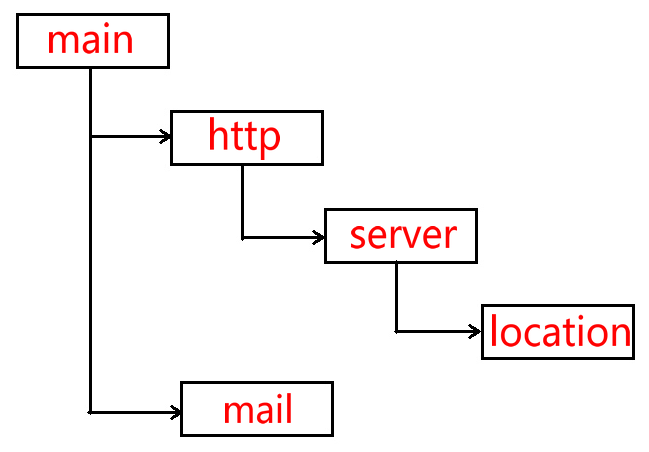

| 配置层次 | 描述                                                         |
| -------- | ------------------------------------------------------------ |
| main     | Nginx在运行时与具体业务功能无关的参数，比如工作进程数、运行身份等 |
| http     | 与提供http服务相关的参数，比如keepalive、gzip等              |
| server   | http服务上支持若干虚拟机，每个虚拟机一个对应的server配置项，配置项里包含该虚拟机相关的配置 |
| location | http服务中，某些特定的URL对应的一系列配置项                  |
| mail     | 实现email相关的SMTP/IMAP/POP3代理时，共享的一些配置项        |

```shell
# nginx 配置文件 /etc/nginx/nginx.conf
# 服务器主机配置文件中的 include /etc/nginx/conf.d/*.conf;    include /etc/nginx/sites-enabled/*;
user www-data;
worker_processes auto;
pid /run/nginx.pid;

events {
	worker_connections 768;
}

http {
    sendfile on;
    tcp_nopush on;
    tcp_nodelay on;
    keepalive_timeout 65;
    types_hash_max_size 2048;
    access_log /var/log/nginx/access.log;
    error_log /var/log/nginx/error.log;

    server {
        listen 80 default_server;		# ipv4监听端口
        listen [::]:80 default_server;	# ipv6监听端口被
        root /usr/share/nginx/html;		# 服务器根目录
        #server_name _;
        #index index.html index.htm index.nginx-debian.html;	#支持的请求文件格式
        location / {
        
        }
        location /2/{			# 设置反向代理 新浪
        	proxy_pass http://www.sina.com/;
        }
        
     server {
        listen 7788;
        root /usr/share/nginx/html;		# 服务器根目录
        index index.html;				#支持的请求文件格式
        location / {
            
        }
        location /fast/ {
            root /usr/share/nginx/html;				# 服务器根目录
            include /etc/nginx/fastcgi_params		# fastCGI配置文件,nginx自带的
        	fastcgi_pass 192.168.1.1:5555			# 讲数据发送给代理服务器的地址
        }
    }
}
```

**反向代理**

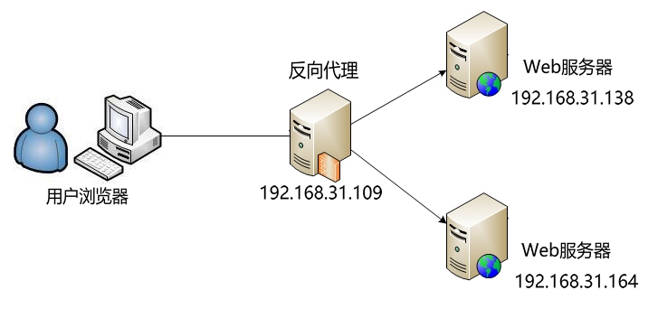

#### 7.5.2.2 fastCGI

> FCGI 库: https://github.com/FastCGI-Archives/fcgi2.git

| 环境变量          | 含义                                                         |
| ----------------- | ------------------------------------------------------------ |
| AUTH_TYPE         | 存取认证类型                                                 |
| CONTENT_LENGTH    | 由标准输入传递给CGI程序的数据长度，以bytes或字元数来计算     |
| CONTENT_TYPE      | 请求的MIME类型                                               |
| GATEWAY_INTERFACE | 服务器的CGI版本编号                                          |
| HTTP_ACCEPT       | 浏览器能直接接收的Content-types, 可以有HTTP Accept header定义 |
| HTTP_USER_AGENT   | 递交表单的浏览器的名称、版本和其他平台性的附加信息           |
| HTTP_REFERER      | 递交表单的文本的URL，不是所有的浏览器都发出这个信息，不要依赖它 |
| PATH_INFO         | 传递给CGI程序的路径信息                                      |
| QUERY_STRING      | 传递给CGI程序的请求参数，也就是用"?"隔开，添加在URL后面的字串 |
| REMOTE_ADDR       | client端的host名称                                           |
| REMOTE_HOST       | client端的IP位址                                             |
| REMOTE_USER       | client端送出来的使用者名称                                   |
| REMOTE_METHOD     | client端发出请求的方法(如get、post)                          |
| SCRIPT_NAME       | CGI程序所在的虚拟路径，如/cgi-bin/echo                       |
| SERVER_NAME       | server的host名称或IP地址                                     |
| SERVER_PORT       | 收到request的server端口                                      |
| SERVER_PROTOCOL   | 所使用的通讯协定和版本编号                                   |
| SERVER_SOFTWARE   | server程序的名称和版本                                       |

```shell
# 安装自动化生成脚本工具
$: sudo apt-get install autoconf -y

# 安装libtool工具
$: sudo apt-get install libtool -y

# 解压并进入
$: sudo unzip fcgi2-master.zip 

# 运行生成脚本,生成configure
$: sudo ./autogen.sh

# 运行configure
$: sudo ./configure	# 默认放在 /usr/local/
	# $: sudo ./configure --prefix=/usr/ #指定放在/usr/
	
$: sudo make
$: sudo make install
```

```c
#include <stdlib.h>
#include <fcgi_stdio.h>

int main()
{
    while (FCGI_Accept() >= 0)
    {
        printf("Content-Type:text\r\n\r\n");
        printf("clint ip is %s\r\n", getenv("REMOTE_ADDR"));

    }

    return 0;
}


#echo "username=abc&password=123" | ./a.out
```


**fastCGI-spawn**

> 安装fastCGI助手工具:`sudo apt-get install spawn-fcgi -y`

```shell
$: sudo spawn-fcgi ---help		# 查看帮助文档
$: spawn-fcgi -a 127.0.0.1 -p 55555 -f ./a.out		# 用spawn-fcgi启动cgi程序
```


#### 7.5.2.0 fastDFS/nginx

> 仓库地址: https://github.com/happyfish100
>
> fastDFS、fastdfs-nginx-module、libfastcommon安装教程: [在Ubuntu服务器上安装fastdfs - 糖果墙 - 博客园 (cnblogs.com)](https://www.cnblogs.com/candywall/p/14639080.html)
>
> Client(客户端)、Storage(存储节点)、Tracker(追踪器/分发器)

#### 

```shell
# 解压fastdfs对应的压缩包
$: sudo tar -zxvf fastdfs-6.07.tar.gz

# 进入解压后的目录
$: cd fastdfs-6.07/

# 执行编译脚本
$: sudo ./make.sh

# 安装
$: sudo ./make.sh install

	# 复制fastdfs安装包下面的配置文件到/etc/fdfs目录下(如果安装脚本没有自动拷贝,就执行这一句)
	# $:cp * /etc/fdfs

# 进入/etc/fdfs目录
$: cd /etc/fdfs

# 将备份的配置文件拷贝复制成正式配置文件
$: sudo cp ./client.conf.samole  ./client.conf
$: sudo cp ./tracker.conf.samole ./tracker.conf
$: sudo cp ./storage.conf.samole ./storage.conf

# 修改追踪分发器tracker的配置文件
$: sudo vi ./tracker.conf

bind_addr= 当前 自己的IP
port= 要绑定端口
base_path=追踪器存储log日志文件的绝对路径

#修改存储节点Storage的配置文件
$: sudo vi ./storage.conf

group_name= 当前存储节点属于组的组名
bind_addr= IP地址
port=要设置的端口(默认23000)
base_path=存储节点存储log日志文件的绝对路径
store_path_count=存储目录的个数,设置下面有几个目录
store_path0=第一个存储目录的路径,根据
store_path1=第二个存储目录的路径
......
tracker_server=IP地址:端口  (追踪器的IP和端口)

#修改客户端Client的配置文件
$: sudo vi ./client.conf

base_path=存储客户端log日志文件的绝对路径
tracker_server=IP地址:端口  (追踪器的IP和端口)
```


### 7.5.3 RPG 远程过程调用

> 远程过程调用: `A主机调用B主机的功能函数`
>
> A主机调用函数过程中,与B主机进行若干网络通信得到运算
>
> B主机接收A主机的请求,并进行运算,返回结果
>
> 特性: `异构 跨语言 跨平台`
>
> 常用架构工具: `thrift`(facebook), `grpc`(google基于protobuf架构) 

#### 7.5.3.1 thrift

> ​	使用步骤跟protobug类似
>
> ​	1): 写 xxx.thrift 文件定义函数原型
>
> ​    2): 生成服务器代码,预留函数实现
>
> ​    3): 实现预留的函数,启动服务器的服务
>
> ​    4): 在调用端包含生成的部分代码,就可以调用了

## 7.6  网络安全 

> 攻击机(kail Linux): [https://www.kali.org/get-kali/](https://www.kali.org/get-kali/)
>
> 靶机:

```shell
`更新系统软件`
kali@kali:$ lsb_release -a					#查看当前操作系统版本
kali@kali:$ sudo apt-get update				#更新软件包
kali@kali:$ sudo apt-get dist-upgrade -y		#软件更新

`启动远程ssh`
kali@kali:$ sudo systemctl start ssh		# 临时启动
kali@kali:$ sudo systemctl enable ssh		# 开机自启动
	kali@kali:$ sudo vim /etc/ssh/sshd_config
	# PermitRootLogin yes				#配置文件设置允许root用户远程登录
kali@kali:$ sudo systemctl restart ssh		# 重启ssh服务
```

###  7.6.1 渗透工具

**域名解析**

```shell
$: dnsenum www.baidu.com
$: nslookup www.baidu.com
$: whois baidu.com
```

**网络拓扑**

```shell
$: dnsenum www.tianma.cn
Host's addresses:
2v6mmpguhj0bp9ao3gpohuhb0gkt8phq.yundunwaf2.com. 5        IN    A        47.113.23.153

$: traceroute 47.113.23.153
```

**端口扫描**

```shell
$: telnet 192.168.88.130 22		#  telnet <IP|url> port  扫描端口, 三次握手,连接成功说明端口是开的
$: ping www.baidu.com
$: arping 192.168.88.130		# arping只能查看局域网
$: fping -g 192.168.88.0/24		# 查看局域网内在线的IP
```

```shell
$: nmap -sP 192.168.88.0/24		# 扫描局域网内在线IP
	$: nmap 192.168.88.130			# 查看某个主机开了哪些端口
	
$: p0f -i <网卡名> -f <指纹文件>	# 被动扫描,记录telnet连接上这个网卡的网络连接
	$: p0f -i eth0 -f /etc/p0f/p0f.fp
```

**漏洞扫描**

Nessus: [https://tenable.com/products/nessus](https://tenable.com/products/nessus)

```shell
$: dpkg -i *.deb		# 将deb包安装
$: sudo /etc/init.d/nessusd start	# 启动服务

# 打开浏览器配置用户名,数据库
https://192.168.38.129:8834
```

**暴力破解**

```shell
$: hydra -L user.txt -P passwd.txt -e nsr -vV -o ssh_ok.log 192.168.38.130 ssh
```

**字典生成**


### 7.6.2 审计工具

#### 7.6.2.1 auditd

> 监控文件的状态: 被读,被写,被执行...

```shell
$: sudo apt-get install auditd		# 安装审计工具auditd
$: sudo /etc/init.d/auditd start	# 启动后端审计服务
$: sudo /etc/init.d/auditd restart	# 重启审计服务
```

**审计规则**

```shell
# /etc/audit/rules.d/audit.rules  审计规则配置,修改完规则需要重启审计服务
-w <要审计的文件绝对路径>
-p <监控操作, r(读)/w(写)/x(执行)/a(属性修改)>
-k <审计记录保存的关键字>

# /var/log/audit.log	审计日志所在的路径
```

**审计命令**

```shell
# auditctl -->用来控制audit系统,主要查询和配置 audit rules
	$: auditctl -l 		#查看审计规则
	$: auditctl -s		# auditd运行状态
	$: sudo auditctl -w /etc/passwd -p rwxa -k passwd_key
		-w <要审计的文件绝对路径>
		-p <监控操作, r(读)/w(写)/x(执行)/a(属性修改)>
		-k <审计记录保存的关键字>
	
# ausearch --> 搜索日志相关
	$: ausearch -k xxxxkey		# 查看审计文件中关键字key相关的内容
	$: ausearch -f filename		# 查看文件相关内容
	$: ausearch -ui uid			# 查看某个用户id相关内容
	
# aureport --> 生成审计报告
	$: aureport -au		# 鉴权相关
	$: aureport -m		# 账户修改相关

```


### 7.6.2 深度报文解析

> pcap-e=dev开发包: `$: sudo apt-get install libpcap-dev`
>
> 查看帮助`man pcap`
>
> 头文件: `#include <pcap/pcap.h>`
> 编译程序: `-lpcap`参数

```cpp
	char errbuf[PCAP_ERRBUF_SIZE]

	pcap_t* pcap_open_offline(const char* fname, char* errbuf);
	// 打开以前保存捕获数据包的文件(.paca)，用于读取
	/* 参数
		- fname: 要打开的文件路径,该文件中的数据格式与tcpdump和tcpslice兼容。”-“为标准输入
		- ebuf参数则仅在pcap_open_offline()函数出错返回NULL时用于传递错误消息 */

	pcap_t* pcap_open_offline_wite_tstamp_precision(const char* fname, 
                  u_int precision, char* errbuf);

	pcap_t* pcap_fopen_offline(FILE* fp, char* errbuf);

	pcap_t* pcap_fopen_offline_wite_tstamp_precision(FILE* fp,
               	u_int precision, char* errbuf);

	int pcap_loop(pcap_t* p, int cnt,pcap_handler callback, u_char* user);
	// 捕获并处理数据包。此函数在cnt个数据包被处理或出现错误时才返回，但读取超时不会返回
	/* 参数
		- cnt: 参数为负值时pcap_loop()函数将始终循环运行，除非出现错误。 
		- callback: 搜到数据包时的处理回调函数
		- user: 回调函数参数*/

	void pcap_close(pcap_t *p);		//关闭p参数相应的文件，并释放资源
```


# 8 数据库

## 8.1 Oracle

> Oracle貌似只能安装在RedHat Linux及分支上
>
> 安装Oracle数据库会默认自动创建scott和hr两个用户以及其方案

```sql
$: sqlplus sys/sys as sysdba # 以oracle超级管理员登陆oracle sqlplus / as sysdba
$: sqlplus 用户名/密码 # 本地登录Oracle
$: sqlplus 用户名/密码@//IP/实例名 # 远程登陆Oracle,实例名默认orcl

$: lsnrctl start # 启动监听服务,对internet开放(外网访问),如果失败切换到root(su - root)执行'hostname oracle'
$: lsnrctl stop # 关闭监听服务
$: lsnrctl status # 查看监听状态

SQL> startup; # 启动数据库实例,orcl
SQL> shutdown; # 关闭数据库实例cd
SQL> exit | quit; # 退出SQL命令行

# 设置oracle默认加载项
./Oracle/WINDOWS.X64_193000_db_home/sqlplus/admin/glogin.sql
SQL> source ./path/to/sql-file.sql; # 执行本地 SQL 文件中的的 SQL 语句
SQL> set linesize 140; # 设置显示的行宽大小为140
SQL> set pagesize 50; # 设置显示一页数据量(多少条)
SQL> alter session set NLS_DATE_FORMAT = 'yyyy-mm-dd'; # 修改日期格式

SQL> @F:\soctt.sql				# 执行某个sql文件
```

```sql
SQL> show user; # 查看当前登录账户
SQL> alter user 用户名 account unlock; #给用户解锁,oracle的用户默认锁定scott
SQL> alter user 用户名 identified by "新密码"; # 修改用户密码
SQL> select userenv("language") from dual; # 查看当前语言环境
SQL> select * form v$nls_parameters; 	#查看当前sqlplus会话环境变量

SQL> grant select on 表名 to 用户名;		# 为授予某用户查询某表的权限
SQL> select * from tab; # 查看当前用户拥有哪些表
```

```sql
'Oracle 回收站'
SQL> show recyclebin;						# 查看回收站
SQL> flashback table 表名 to before drop;		# 还原回收站中的表
SQL> purge recyclebin;						# 清空回收站
```

```shell
# Linux下,无法远程连接Oracle服务, 有时防火墙也有可能导致打不开,可以关闭防火墙
# CentOS关闭防火墙 例:

# 1: 安装iptables, 临时设置,关机重启后失效
	$: yum install iptables
	
	$: service iptables status		# 查看状态
	$: service iptables stop		# 关闭防火墙
	$: service iptables starts		# 启动防火墙
	
# 2: systemctl系统设置
	$: systemctl status firewalld	# 查看防火墙状态
	$: systemctl start firewalld	# 启动防火墙
	$: systemctl stop firewalld		# 关闭防火墙
	$: systemctl enable firewalld	# 设置防火墙开机自启动
	$: systemctl disable firewalld	# 关闭防火墙开机自启动
```


### 8.2.1  DML (数据操作)

#### 8.2.1.0 sql 函数

> SQL语句对大小写不敏感
>
> SQL语句可以写在多行以;号结束 
>
> 关键词不能被缩写也不能被分行

```sql
# SQL比较运算符
= 等于 > 大于 >= 大于等于
< 小于 <= 小于等于 <>或者!= 不等于
# 逻辑表达式(&& || !)
and 与 or 或 not 非
# 通配符
% 若干个字符 _ 任意一个字符
escape '\' ' SQL语句最后加上escape +'符号',表示该符号以转移字符使用
# 表达式计算
# 表达式计算,任何数加NULL都为NULL
SQL> select 3+列名 from dual; # oracle提供的专门计算表达式的虚表(不存在)
	SQL> select 3+nvl(列名, 值) from dual;// 判断如果某个列的值为NULL,就返回对应第二个值
```

```sql
# 单行函数
`字符函数`
lower(字符串1,列名1， ...)		 # 讲字符串转小写
	select lower('hEllO', 'woRld') from dual;
	
upper(列名1)		 			# 将字符转大写
	select upper(列名1) from 表单名;
	
initcap 			# 将首字母变成大写
	select upper(列名1,列名2) from 表单名;
	
concat 				# 字符串拼接,只能支持两个参数
	select upper(列名1,列名2) from 表单名;
	select 'hello' || 'word' || 123 from dual; # 可以拼接字符串
	
substr(字符串, 截取位置, 截取个数) 	# 提取字符串子串
	select substr(字符串, 截取位置) from dual; #从截取位置开始截取
	select substr(字符串, 截取位置, 截取个数) from dual; #从截取位置开始截取截取N个
	
instr(字符串, 子字符串) # 查找字符串中是否包含此字字符串
	select substr(字符串, 子字符串) from dual; # 查找字符串中包含字串,返回索引
	
'lpad,rpad' # 左右填充
'trim' # 裁剪
	select trim(' hello world ') from dual; # 默认裁剪两边空白字符
	select trim('H' form ' HH hello worHld H ') from dual; # 指定裁剪里面的H字符
	
'replace' # 替换字符串子串
	select replace("hello word", 'el', "ccc") from dual; #将字符串中的el全部替换成ccc

'length'	#计算字符串长度
	
`数值函数` #number
'round'		# 四舍五入
'trunc'		# 截取
'ceil', 'floor'	#向上取整/向下取整
'mod'	# 取模 %

`转换函数`
'to_char' 数字/日期 转字符串
	select 值, to_char(值, 'L9999') from 表单;#将number列的数字转换成本地货币，4个9就是最大4位数
	
'to_number' 字符串转数字
'to_data' 字符串转日期

`日期函数` # data
'sysdate' # 获取系统时间,显示某日期
	select sysdata 今天, sysdata-1 昨天, sysdata+1 明天 from dual; 	#日期显示
	# select to_char(sysdate, 'yyyy-mm-dd hh:mi:ss') from dual;
	
'months_between' #计算两个时间相差的月份,自动计算大小月(30, 31天)
add_months #添加多少月后的日期
	select add_months(sysadta, 12) from dual; #日期加12个月
last_day #获取当前月份最后一天
	select last_day(sysdate) from dual;
next_day #查看下一个星期几是几月几号
	select next_day(sysdate, '星期四') from dual;	#填写日期的字符串写中文还是英文取决于环境变量设置

# 判断是否空函数
nvl(条件, 返回值);	 # 判断条件值为NULL,就返回 返回值
nvl2(值, 返回值1, 返回值2); 	# 判断exp值不为NULL,就返回val1,否则返回val2
nullif(值1, 值2); 	#当值1==值2返回null, 不相等返回值1
coalesce(值1, 值2, ..., 值N); 	# 从左往右找第一个不为null的值

`条件语句`
case when then else end #和c语言switch语句类似
 case 条件
	when 值 then 表达式
	when 值 then 表达式
	else 表达式
end

decode(条件, 值1, 返回值1, 值2, 返回值2, ..., 不匹配返回值); # Oracle额外扩充的和case语句的功能
```

```sql
# 多行函数
`统计函数` # null不参与统计函数的计算
sum
	select sum(列) from 表单; # 统计所有行的某一列的值总和
	
count # 计数函数,某一行有值,计数就+1
	select count(*) from 表单; # 一共有多少行
	select count(列) from 表单; # 某一列有值的有多少行
	select count(distinct 列) from 表单; # 去重复统计
	
max/ min # 最大值/最小值
	select max(列), min(列) from 表单;
	
avg # 平均值
	select avg(列) from 表单; # 如果某一行的值NULL,则不计入统计(除的时候不会加上它)

```

#### 8.2.1.1 查

```sql
'select'	 # --- 查询(可以select 列或者具体的值)
# select *; # 查询所有内容
# IN:等于某个集合中任意一个   ANY:比较集合中满足某一个的条件    ALL:比较集合中满足所有个的条件
 in(10, 20);		# 比较用 select * from emp where emptno in(10, 20); 	# emptno==10 || emptno==20
 ANY(...);			# 用于条件判断中, 比较ANY集合中任意一个满足条件
 			# select * from emp where sal > ANY(select sal from emp where deptno =30);  # 比30号部门任意一个员工工资高的员工信息
ALL(...)			# 标胶条件中用, 比较ALL集合中满足所有数值条件
			# select * from emp where sal > ALL(select sal from emp where deptno =30);  # 比30号部门所有人工资都高的员工信息

# 行号rownum需要注意的问题
	# 1.rownum永远按照默认的顺序生成。
	# 2.rownum只能使用<, <=符号，不能使用>，>=符号，除了>=1(rownnum 是在生成时判断符合条件的再加上一句行号的,如果再判断时就使用会导致所有都不符合)
		# 解决办法,再嵌套子查询专门生成行号在外面的查询判断
```

```sql
SQL> desc 表单名; # 查看指定表单结构
# 查询语句得到的是结果集
# 增删改语句得到的是执行这个语句受影响的行数
SQL> select * from 表单名; # 查询某个表单里所有列
SQL> select 列名 from 表单名; # 查询*表单的*列的数据
SQL> select 列名1 as '别名1', 列名2 as '别名2', 列名1*10+列名2 as '别名3' from 表单名 别名4;
#查询某单的某两列和 列1*10+列2 的数据,并对显示的列以取的别名显示,不会修改真实数值
	SQL> select 列名1 别名1, 列名2 别名2, 列名1*10+列名2 别名3 from 表单名;
	#查询某单某两列和的数据, as和双引号可以省, 双引号在别名有空格的时候不能省
SQL> select distinct 列名 from 表单名; #去重显示某表单某列的数据
SQL> select * from 表单名 where 列名=值; #单条件查询
	SQL> select * from 表单名 where 列名 is null; # 判断所有列名值为null的行
	SQL> select * from 表单名 where 列名 is not null; # 判断所有列名值不为null的行
	SQL> select * from 表单名 where 列名1=值 and 列名2='字符串'; #多条件查询,两个条件相等
	SQL> select * from 表单名 where 列名 in (值1, 值2, ...); #查询所有列名值为值1或者值2的行
	SQL> select * from 表单名 where 列名 not in (值1, 值2); #查询所有列名值不为值1或者值2的行
	SQL>select * from 表单名 where 列名 not between 值1 and 值2;	#查询列名值不在在值1和值2之间的(包括两值)
		SQL>select * from 表单名 where 列名 between 值1 and 值2;	#查询列名值在值1和值2之间的(包括两值)
		SQL>select * from 表单名 where 列名 between '1981-02-01' and '1982-01-31'; #字符串之间(包含)
SQL> select * from 表单名 where 列名 like 's%' and 列名 like '%a%'; # %通配符模糊查找,某列所有s*或者*a*的字符串
	SQL> select * from 表单名 where 列名 like '____'; #查找所有 四个字符的随机字符串
SQL> select * from 表单名 order by 列名1 asc; #排序所有,默认升序可以asc
	SQL> select * from 表单名 order by 列名1 asc,列名2 desc;	#先按第一列的条件排序,第一列值相等的情况下按第二列条件排序
	SQL> select * from 表单名 order by 列 desc nulls last; # 倒序排列,排序时null排在最后面
	SQL> select * from 表单名 where 列名=值 order by 列名1 desc,列名2 desc #排序查找,desc降序
	
SQL> select 'hello' || 'word' || 123 from dual; # 可以拼接字符串
# 分组统计group by
	# 根据列或者多列进行分组,该列/多列 值是相同的分为同一组
	# select 后面跟的列只能是group by后面出现的列, 或者统计函数的表达式
	# 能使用where就尽量不使用having,where时前置条件,在运行筛选时就使用,having是后置条件,在查询完的结果集里再筛选,效率比where低
	# where使用在group by的前面(group by前面不能使用统计函数), having只能使用在group by的后面
	select 列 from 表单 group by 列1, 列2, 列3, ... having 条件;
	select 列 from 表单 group by where 条件 列1, 列2, 列3, ...;
		select 列1, 列2 from 表单 group by 列1;
		select 列1, 列2 from 表单 where 条件{列>值} group by 列1; # 列>值 或者==之类的判断条件
		select 列1, 列2 from 表单 group by 列1 having 条件{列>值}; # 列>值 或者==之类的判断条件
		
# 多表查询(也叫表连接查询) 采用笛卡尔积 集合M(a,b) 和集合 N(c,d)
	# M x N = (a,b)x(c,d) = (ax(c,d), bx(c,d)) = (ac, ad, bc, cd)
	# 行数 = 表1行数 x 表2行数		列数 = 表1列数 + 表2列数 
# where 筛选条件就是连接条件
SQL> select * from 表单1 join 表单2 on 表1.列名 = 表2.列名 whrer ...; # 把from后面表之间的,号换成join, 连接条件写在on之后 也可以是多表查询
SQL> select * from 表单1, 表单2 whrer 表1.列名 = 表2.列名;

# 外连接 (表合并时,左/右表项某一行数据不能不能互相匹配,但是想保留左/右表项中这个不能匹配的数据)
# 左外连接(保留左边表) 右外连接(保留右边表)  全外连接(保留两边表)
# 例: 左表中全是员工信息有部门编号,右表中有部门编号和部门信息, 其中没有员工在40号部门但是想保留右表中的部门信息
SQL> select 别名1.表单项1,别名1.表单项2 count(表单项) from 表单1 别名1, 表单2 别名2 
		where 别名1.表单项 = 别名2.表单项(+) group by 别名1.表单项1,别名1.表单项2; 		#Oracle用法
	SQL> select d.depton, d.dname, count(empno) from dept d, emp e where d.deptno = e.deptno(+) group by d.depton, d.dname;
SQL> select d.depton, d.dname, count(empno) from dept d  right join emp e on d.deptno = e.deptno group by d.depton, d.dname; #SQL标准

# 自连接:查询的数据在同一张表,但是又不在同一行,自己跟自己做表连接
SQL> select * from 表单1 别名1, 表单1 别名2 where 别名1.表单项 = 别名2.表单项；

# 子查询
# 关联子查询不能单独执行,只能依赖父查询
# 查询SALES部门和ACCOUNTING部门的员工信息: 先去dept表查询两个部门的id,然后比较员工信息中的部门id
select * from emp where deptno in(select deptno from dept where dname = 'SALES' or dname = 'ACCOUNTING')
```

```sql
# 集合运算: 参与运算的各个集合必须列数相同且类型相同(可以用null填充)
	# 并集 union: 合并两个集合的数据,重复的去重取一份
	# 全并集 union all: 合并两个集合的数据,保留重复数据
	# 交集 intersect: 合并两个集合,取两个集合中同时有的数据
	# 差集 minus: 例:(A-B) A取B的差集,取A集合里面有但是B里面没有的数据组成新集合
select 列名 from 表单名 union select 列名 from 表单名;
```


#### 8.2.1.2 增

```sql
desc 表名 # 查看表的结构
'insert'
	SQL> insert into 表名 values(列1的值, 列2的值, ...);	# 值要对应表的每一个值的顺序
	SQL> insert into 表名(列1, 列3) values(列1的值, 列3的值, ...);	# 插入数据的时候指定赋值哪一列数据
```

#### 8.2.1.3 删

```sql
'delete' # 删除数据以行为单位
	SQL> delete from 表名 where 条件;
	SQL> delete from 表名;		# 删除所有数据
```

#### 8.2.1.4 改

```sql
'update'
	SQL> update 表名 set 列1=值1, 列2=值2, ... where 条件;
```


### 8.2.2 DDL(对象操作)

> 常见的数据库对象:`表,试图,索引,同义词,序列,同义词 : 存储过程,存储函数,触发器,包,包体,数据库链路,快照`
>
> 表名和列名命名规则:`必须以字母开头，必须在1-30个字符之间,命名不能冲突,只能包含A-Z,a-z,0-9,"_$#",Oracle默认存储表名是大写的`

#### 8.2.2.1 表对象

```SQL
'表操作'
SQL> create table 表名(列名1 类型1, 列名2 类型2, ...);		# 创建表(数据库数据类型百度一下)
SQL> create table 表名 as 子查询;							# 可以使用子查询拷贝另一份表来创建新表
	# SQL> create table emp1 as select * from emp where 1=2;	# 1不可能等于2,所以数据都不会拷贝过去,会船舰一个根原表																# 结构一样的空表
SQL> drop table 表名;										# 删除表(放入回收站,不可回滚,但是可以闪回)
	# SQL> drop table 表名 purge;	# 不放入回收站,彻底删除						
SQL> rename 旧表名 to 新表名;								# 修改表名
SQL> delete from 表名 where 条件;							# 清除数据,
SQL> truncate table 表名;									# 表截断,清空表
	# delete(没有条件) 和truncate的区别: delete会逐条清空表,truncate会先摧毁表再重建. delete不会释放存储空间,truncate会释放存储空间
	# delete是DML语句,可以回滚.truncate是DDL语句,不可回滚. 据说100w条数据以下,delete被优化的比truncate快

SQL> alter table 表名 add 列名 类型;						# 添加新列
SQL> alter table 表名 rename column 旧列名 to 新列名;		# 列名修改名字
SQL> alter table 表名 modify 列名 新类型;					# 修改列的类型
SQL> alter table 表名 drop column 列名;						# 删除某一列
```

```sql
# Oracle 约束: 创表的时候指定约束
	# 列级约束: 每定义一列就直接在列定义种确定约束
	# 表级约束: 定义所有列之后,在后面添加约束
	# 外键约束: 表示依赖于另一个表的某一列,mysql定义外键约束只能使用表级约束
	# constraint类似于typedef 定义约束名的关键字
create table 表名
(
	列名 类型 [constraint  约束名] 约束的类型以及参数, # 
	......
)
# 例:
create table student 
(
    # 主键(primary key), 非空(not null), 唯一(unique), 检查(check), 外键(references)
	sid number constraint pk_student primary key, --学生Id主键约束, pk_student 表示取的别名
	sname varchar2(20) constraint nn_student_name not null,--学生姓名非空约束
	email varchar2(20) constraint un_student_email unique --学生邮件唯一约束
	constraint nn_student_email not null,	--同时邮件可再设非空，没有“，”
	age number constraint chk_student_age_min check(age > 10),	--学生年龄设置check约束
	gender varchar2(6) constraint chk_student_gender check(gender in ('男', '女')),
	deptno number constraint fk_student references dept (deptno) ON DELETE SET NULL --外键约束,外键表绑定的值被删设置null
)  
```


#### 8.2.2.2 视图

>  视图是一个查询结果的合集
>
>  用户创建视图需要管理员给权限:  oracle(`grant create view to 用户名`)
>
> 视图将查询语句结果集提取出来,防止对原表经行操作,或者规原表中的避敏感数据

```sql
SQL> create view 视图名 as 子查询;	# 每次查看视图时,当都会帮我们查询这个子查询后返回结果集,利用它进行数据隔离和隐私保护
SQL> drop view 视图名;		# 视图删除后会直接删除不会丢当回收站
SQL> select * from 视图名;		# 查看视图,当作一个普通表来查询
```

#### 8.2.2.3 序列/索引/同义词

```sql
# sequence 序列
SQL> create sequence 序列名;		# 创建序列
SQL> drop sequence 序列名;			# 删除序列
SQL> select 序列名.currval from dual;		# 产看当前索引值,使用currval取值不能早于第一次使用nextval否则会指向0报错
SQL> select 序列名.nextval from dual;		# 产看下一个索引值,同一条sql序列的取值只会取一次之后会自身+1

# index 索引
#索引在使用表的时候,数据库内部会自动使用索引进行优化,数据库会制动维护索引
# 多个列名只有第一个列名会被排序,后面的依然是无序的
# Oracle 有唯一约束的列不需要创建索引,Oracle会自己默认维护一个
SQL> create index 索引名 on 表名(列名1,列名2, ...);		# 根据某表某列排序,建立索引表
SQL> drop index 索引名;								# 删除索引表

# synonym 别名(快捷方式)
	# grant create synonym to 用户名;		# 使用管理员让用户拥有创建别名的权限

SQL> create synonym 别名 for 表名;		# 为某一张表取别名
	# SQL> create synonym 别名 for 用户.表名;		# 为可以访问的其他用户的表去别名(需要授权)
```


### 8.2.3 DCL(事务操作)

> 关系性数据最重要的就是事务操作,事务的特点: `要么都成功,要么都放弃执行`

> 事务的隔离级别:
>
> ​	1 读未提交数据
>
>  	2 读已提交数据 (一个事务修改数据只有提交后,其他事务读取到的数据才会时新数据)	Oracle默认
>
> ​	3 可重复读 		mysql默认
>
> ​	4 序列化、串行化	串行读取,单线程执行效率低下

```sql
'控制语言'
commit;(提交)
rollback;(回滚)
```


```sql
# 创建保存点
SQL> savepoint 保存点名;
SQL> rollback to savepoint 保存点名;	# 回滚到保存点
```

### 8.1.4  c++调用接口

> Oracle开发工具客户端版本必须比数据库的版本高,工具包向下兼容
>
> Oracle c++ call interface(`OCCI`): Oracle c++ 调用接口

```c++
// OCCI头文件
#include <occi.h>		// 一般只需要包含着一个头文件,occi.h包含下面所有库
#include <occiCommon.h>
#include <occiControl.h>
#include <occiData.h>
#include <occiObjects.h>

// OCCI Windows库
	oraocci11.lib / oraocci11.dll
	oraocci11d.lib / oraocci11d.dll
        
// OCCI Linux库
	libnnz11.so / libocci.so / libclntsh.so
```

```cpp
// 内存释放原则: 谁创建的谁释放

'初始化环境- oracle::occi::Environment'
	Environment* Environment::createEnvironment();	// 环境初始化
	Environment* Environment::createEnvironment("utf8","utf8");	// 环境初始化,指定字符集
	void Environment::terminateEnvironment(Environment*);			// 释放环境资源
	
	// 创建连接类(用户名, 密码, IP:端口/数据库实例名)
	Connection* Environment::createConnection(const string& userName, const string& password, 
                                             const string& connectString);	// 数据库连接
	// oracle::occi::Connection* con = env->createConnection("c##mohui", "123456", "192.168.247.129:1521/orcl");
	void Environment::terminateConnection(Connection* );			// 断开连接,释放连接类


'连接数据库- oracle::occi::Connection'
	Statement* Connection::createStatement(string& sql = "");	// 创建sql语句执行类
	Connection::terminateStatement(Statement* statement);		// 释放sql语句执行类


 '执行SQL语句- oracle::occi::Statement'
	Statement::setSQL(string& sql);							// 设置sql语句
	Status* Statement::execute(string& sql);				// 返回状态,可以用于任何sql语句，。
	unsigned int Statement::executeUpdate(string& sql);		// 返回状态,适合执行插入/修改/删除操作 
	ResultSet* Statement::executeQuery(string& sql);		// 返回结果集,适合执行查询
	Statement::closeResultSet(ResultSet* resultSet);		// 关闭结果集


'处理结果集- oracle::occi::ResultSet'	// 结果集行数从1开始
    ResultSet::next();					// 结果集下一行
	ResultSet::getInt(unsigned int colIndex);	// 返回int型结果(第几列)
	
```

```cpp
// 例Start:
	oracle::occi::Environment* env = oracle::occi::Environment::createEnvironment();
	oracle::occi::Connection* con = env->createConnection("c##mohui", "123456", "192.168.247.129:1521/test");
	if (!con)
	{
		std::cout << "连接失败" << std::endl;
		oracle::occi::Environment::terminateEnvironment(env);		// 清理环境变量
		return 0;
	}
	std::cout << "连接成功" << std::endl;
	oracle::occi::Statement* stat = con->createStatement("select * from dept");
	oracle::occi::ResultSet* result = stat->executeQuery();
	while(result->next() )	// 遍历结果集,行数从1开始,不是0
	{	
		int deptno = result->getInt(1);
		std::string dname = result->getString(2);
		std::string loc = result->getString(3);
		std::cout << "deptno: " << deptno << "  dname: " << dname << "  loc city: " << loc << std::endl;
	}

	stat->closeResultSet(result);
	con->terminateStatement(stat);
	env->terminateConnection(con);	/* 断开连接*/
	oracle::occi::Environment::terminateEnvironment(env);		// 清理环境变量
// 例End
```


## 8.2 MySQL

### 8.2.1 安装MySQL

```shell
# 安装MySQL服务
$: sudo apt-get install mysql-server -y
$: sudo apt install mysql-client -y
$: sudo apt install libmysqlclient-dev -y
•
# 检查MySQL是否安装成功
$: ps -ef | grep mysql		# 查看Mysql服务是否存在
$: sudo netstat -tap | grep mysql
•
# 数据库测试
$: mysql -u root -p
•
# 输入密码
mysql> '如果界面变成这样就说明进入了MySQL'
mysql>create database web; '创建网站数据库，一会儿要用 web单词可以替换自定义'
mysql>quit '输入 quit 退出'
•
# 开放端口 (将bind-address = 127.0.0.1注释)
`MariaDB配置文件位置: /etc/mysql/mariadb.conf.d/50-server.conf`
`MySQL配置文件位置: /etc/mysql/mysql.conf.d/mysqld.cnf`
# 输入以下命令查看MySQL账户密码(可以自行修改)
$: sudo cat /etc/mysql/debian.cnf
•
user = debian-sys-maint
password = v2jTk4fe7U6HRP63

`mysql服务设置`
$: sudo service mysql start '开启MySQL服务'
$: sudo service mysql stop '停止MySQL服务'
$: sudo service mysql restart '重启MySQL服务

$: sudo mysql_secure_installation  #配置root账户密码
```

### 8.2.2 库/对象操作

```mysql
`新增用户`
#允许本地IP访问localhost，127.0.0.1的新建用户
sql> create user 'test'@'localhost' identified by '123456';
#允许外网IP访问，%通配所有远程主机
sql> create user 'root'@'%' identified by '123456';

`删除用户`
sql> delete from mysql.user where user = 'test';

`对新用户分配数据库权限`
# 低版本使用
sql> grant all on *.* to 'root'@'%' identified by '123456'; #对所有库拥有权限(低版本使用)
sql> grant all on db1.* to 'test'@'%' identified by 'password'; #对指定库db1拥有权限
sql> grant select on db1.t1 to 'gggg3'@'%' identified by '123';# 对指定库下的指定表拥有权限db1.t1
sql>grant select (id,name) on db1.ti to 'gggg4'@'%' identified by '123';	#赋予查看id和name的权限
sql> grant select (id,name),update (name) on db1.t1 to 'gggg5'@'%'dentified by '123'; 
				#赋予查看id和name的权限，并赋予修改name的权限
				
# 高版本使用		
SQL> grant all privileges on 数据库名.* to 用户名;		# 为授予某用户某数据库所有的权限
	sql> grant all privileges on test.* to 'test';	#对指定库test拥有权限

`删除用户的库权限`
sql> revoke select on db1.* to 'gggg5'@'%'; #删除权限
sql> revoke select,update,insert,delete on mohui.* from '1234567'@'%';

`刷新`
sql> flush privileges;
```

```mysql
$: mysql -u用户名 -p密码			# 登录mysql
	 $: sudo mysql				# 以root用户直接登录

SQL> create database 数据库名; # 创建指定名称数据库(默认字符集是latina)
	SQL> create database 数据库名 default charset='UTF8';
SQL> drop datase 数据库名; # 删除指定名称的数据库
SQL> alter database 数据库名 character set 编码;	# 修改数据库
SQL> use 数据库名;			# 切换到某个数据库
SQL> show databases;		# 查看用户拥有哪些数据库
```

### 8.2.3 表操作

> mysql大部分操作和oracle相同,参考oracle
>
> mysql对表名区分大小写
>
> mysql没有回收站机制

```mysql
SQL> show tables;				# 查看当前数据库拥有哪些表
SQL> desc 表名l					# 查看表结构
SQL> create table 表单名(列名1 类型1, 列名2 类型2, ...);	# 创建指定名称的数据表(类型百度)
SQL> drop table 表名; 			# 删除指定名称数据库表单
SQL> show create tables 表名;		# 显示创建改表的sql语句
SQL> rename table 表名 to 新表名;	# 修改表名
SQL> truncate 表名;					# 表截断,清空表
SQL> delete from 表名;			# 删除表所有数据

SQL> alter table 表名 add 列名 类型;		# 添加列
SQL> alter table 表名 modify 列名 新类型;					# 修改列的类型
SQL> alter table 表名 rename column 旧列名 to 新列名;		# 列名修改名字
SQL> alter table 表名 change 列名 新列名 新类型;				# 修改列名同时修改类型
SQL> alter table 表名 drop column 列名;						# 删除某一列
```

```sql
'创表约束'
	# mysql只支持4种约束: 唯一 unique, 非空 not null, 主键(可以设置自增) primary key, 外键 froeign key 
	# 比Oracle少一个检查 check约束
	# 列级约束: 每定义一列就直接在列定义种确定约束
	# 表级约束: 定义所有列之后,在后面添加约束
	# 外键约束: 表示依赖于另一个表的某一列,mysql定义外键约束只能使用表级约束
	# constraint类似于typedef 定义约束名的关键字
SQL> alter table 表名 drop primary key;		# 删除主键约束
# 例:
create table sundent
{
	id int primary key auto_increment,		# 设置主键约束,auto_increment表示每次自增1
	name varchar(30) not null,				# 非空约束
	email varchar(60) unique,				# 唯一约束
	sex char(10) check(sex in ('男', '女')),	# mysql保留check语法使它不报错,但是约束不会生效
	classid int,							# mysql定义外键约束只能使用表级约束
	
	constraint fk_student_classid foreign key(classid) references 表(class_id)
		on delete set null			# 与这张表classid匹配的另一张表的class_id被删除时,这张表的classid设置null
		on update cascade			# 另一张表class_id被修改时,跟着它修改
}
```

### 8.2.4  数据操作

> 表操作大体与Oracle相同,下面记录不同的,其他照上面Oracle的

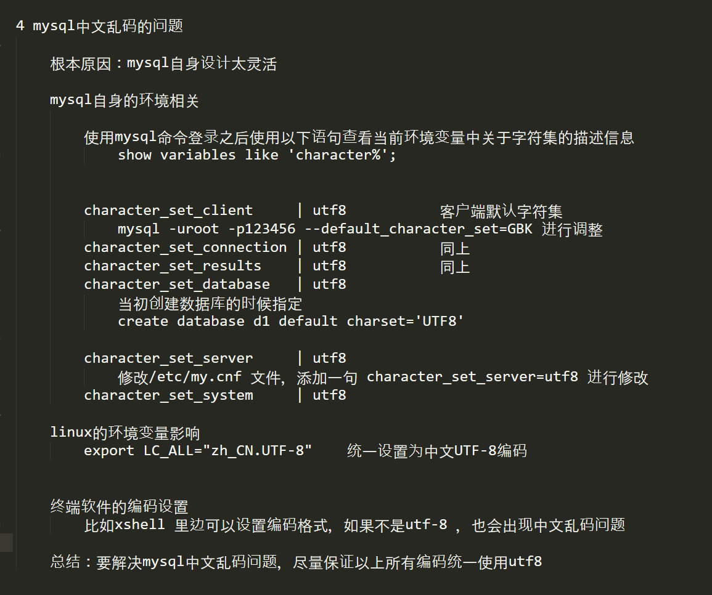

#### 8.2.4.1 sql函数

```mysql
select 3+5*2; 		# 求表达式的值,oracle后面需要加[from dual]mysql可以省略

'时间函数'
select now();		# 获取时间
select date_add(now(), interval-1 day) '昨天', now() '今天', date_add(now(), interval+1 day) '明天';
select now() '当前时间', addtime(now(), '1:00:00') '下一小时', addtime(now, '00:01:00') as '下一分钟';
select str_to_date('2013-06-04 05:14:15' , '%Y-%m-%d %h:%i:%s');	# 将字符串转为时间类型

'字符串'
length(string);						# 求字符串长度
concat(字符串1, 字符串2, ...);		# 字符串拼接
# 大写转小写,小写转大写, ...百度
select concat('hello', 'mysql');
select date_format(now(), '$Y-%m-%d');	# 将时间转换成字符串
```

```mysql
`查询语句`
limit # 限制取几条数据
	SQL> select * from 表单 limit 2; # 从表单中只取2条数据
	SQL> select * from 表单 limit m n; # 跳过m条数据取n条数据
```

8.2.5 MySql 事务

```sql
# mysql默认不打开事务,每次执行一条sql语句都会自动提交, 相当于没有事务
```


### 8.2.2  c调用接口

```cpp
'RedHat/CentOS' 安装mysql开发包:
	$: sudo yum -y install mysql-community-client.x86_64 mysql-community-server.x86_64 mysql-community-devel.x86_64
	$: ...(百度...)	
MYSQL头文件:
	/usr/include/mysql/mysql.h
MYSQL库文件:
	/usr/lib64/mysql/libmysqlclient.a
	
'Ubuntu/DeBian' 安装mysql开发包: 
	$: sudo apt-get install libmysqlclient-dev
MYSQL头文件:
	/usr/include/mysql/mysql.h
MYSQL库文件:
	/usr/lib/x86_64-linux-gnu/libmysqlclient.a
```

```c
'C' 参考<<mysql开发手册>>
    mysql_error(MYSQL* mysql);		// 抛错误
    
	MYSQL* mysql_init(MYSQL* mysql);	// 获取或初始化mysql结构体(传入NULL,系统返回)，初始化的MYSQL*句柄,失败返回NULL
// 连接到mysql服务器,连接成功返回MYSQL*连接句柄(与第1个参数的值相同),如果连接失败返回NULL
	MYSQL *mysql_real_connect(MYSQL *mysql, 			// mysql_init初始化里面有存放句柄
                              const char *host, 		// mysql服务器地址,null或者localhost为本机地址
                              const char *user, 		// mysql服务器登录用户名
                              const char *passwd, 		// mysql服务器登录密码
                              const char *db, 			// 登陆后默认使用哪个数据库
                              unsigned int port, 		// 0使用默认端口: 3306
                              const char *unix_socket, 	//如果服务器是以本地套接字部署的填本地套接字地址,否则填NULL
                              unsigned long client_flag);	// 标志属性,通常默认填0	
	void mysql_close(MYSQL *mysql);		// 关闭服务器连接

	char *mysql_get_server_info（MYSQL *mysql）	//返回代表服务器版本号的字符串。 

// 查询
	int mysql_query(MYSQL* mysql, const char* query);		// 执行以\0终结的字符串的SQL语句
	int mysql_real_query(MYSQL* mysql, const char* query, unsigned long length);	// sql语句中包含二进制数据

// 查看结果集, 如果mysql_query执行的查询语句,用这个函数释放结果集
	// 获取mysql_query执行完的结果集,失败返回null,mysql_errno()返回错误
	MYSQL_RES* mysql_store_result(MYSQL* mysql);	
	mysql_free_result(MYSQL_RES*);		// 释放结果集

	int mysql_num_fields(MYSQL_RES*);				// 查询结果集中有多少列
	MYSQL_FIELD* mysql_fetch_fields(MYSQL_RES* result);		// 获取表头有多少行,返回表头数组,每个元素代表一列的信息


//从结果集种获取下一行
	MYSQL_ROW mysql_fetch_row(MYSQL_RES*);		// MYSQL_ROW==char**,数组中的每一组字符串对应着每一列数据返回的值
	my_ulonglong mysql_affected_rows(MYSQL* mysql);	// 返回上一次受影响的增加更改或删除的数据数量

// 设置与mysql交互使用的字符集, mysql_real_connect()成功建立连接之后设置
	int mysql_set_character_set(MYSQL* mysql, char* csname);	
```

## 8.3 Redis

> Redis: 非关系型缓存数据库
>
> Redis官方使用文档: [https://redis.io/commands](https://redis.io/commands)
>

```shell
# 安装Redis
$: sudo apt-get install redis-server

# 设置允许别的主机连接到本机redis
$: sudo vi /etc/redis/redis.conf

#在末行模式下搜bind
/bind

#在原有的基础上增加新IP
bind 127.0.0.1 192.168.88.128

#重启redis
sudo service redis restart

```

### 8.3.1 常用命令

```shell
# 进入Redis(可以直接使用Linux命令redis-cli xxx查询),也可以进入redis命令行直接查询
# 例:
$: redis-cli set age 123
$: redis-cli get age

# 例
#进入Redis
$: redis-cli
redis> set age 123
redis> get age
redis> del age
```

```shell
redis> SET key value [NX | XX] [GET] [EX seconds | PX milliseconds | EXAT unix-time-seconds | 
								PXAT unix-time-milliseconds | KEEPTTL]
	redis> set age 123
	redis> set age 123 EX 5		# 存入数据,并且设定有效时间5秒
	
redis> GET key					# 查询
	redis>get age
	
redis> DEL key [key ...]		# 删除
	redis> del age
	
redis> LRANGE key start stop		# 遍历list,下标start是正数从前往后查,查询到下标stop, 
									# start是负数从后往前查,stop必须大于当前list下标大小
	redis> LRANGE itlist 0 -1	# 查询所有
redis> LPUSH key element [element ...]	# 在list结构头部插入指定值,同时插入多个从第一个element从开始插入
	redis> 
	
redis> RPUSH key element [element ...]		# 在list结构尾部插入指定值,同时插入多个从第一个element从开始插入

redis> LREM key count element			# 从列表中删除count个等于element的元素,整数从前往后删,负数从后往前删

--raw  #如果是中文字符,查询乱码时候,加----raw 可以用utf-8输出

redis> PUBLISH channel message	# 发布消息  channel:频道名  message：消息
	redis> PUBLISH 1 abc
	redis> PUBLISH ccc abc

redis> SUBSCRIBE channel [channel ...] # 订阅消息, 可同时订阅多个频道
	redis> SUBSCRIBE 1
	redis> SUBSCRIBE 1 ccc

```

### 8.3.2 C API

> Redis开发工具(hiredis): [https://github.com/redis/hiredis](https://github.com/redis/hiredis)

```shell
# Ubuntu安装Redis开发包
	$: sudo git clone https://github.com/redis/hiredis.git
	$: cd hiredis/
	$: sudo make
	$: sudo make install
	
# 依赖项
    头文件: /usr/local/include/hiredis/
    库文件: /usr/local/lib/libhiredis.so
   #运行是若提示找不到共享库,则在ld.so.conf添加库目录 (sudo vi /etc/ld.so.conf) 
   	#  最末端添加一句， include /usr/local/lib
```

```c
#include <hiredis/hiredis.h>

redisContext* redisConnect(const char* ip, int port);		// 连接redis服务器,返回文件描述符
	/* 默认: redisConnect("127.0.0.1", 6379); */
void redisFree(redisContext* c);						// 关闭服务连接

void* redisCommand(redisContext* c, const char* format, ...);	// 需要释放，获取提交redis操作命令,返回命令,
/*一般返回值 redisReply**/
void freeReplyObject(void* reply);						// 释放命令结果


int redisGetReply(redisContext *c, void **reply);	// redisReply**， redis频道订阅阻塞函数,接收正常返回 REDIS_OK
```

#### 8.3.2.2 redis异步处理

> redis异步处理必须配合libevent使用:
>
> ​	1):创建libevent实例: `event_base_new();`
>
> ​	2):创建异步链接:`redisAsyncConnect();`
>
> ​	3):关联libevent实例和异步链接:`redisLibeventAttach();`
>
> ​	4):异步发消息(指定处理回调函数) `redisAsyncCommand();`
>
> ​	4):开始libevent事件循环`event_base_dispatch();`

```cpp
#include <stdlib.h>				// 下面的libevent会用,所以要写在他的前面
#include <hiredis/async.h>
#include <hiredis/adapters/libevent.h>		// redis处理libevent的封装函数库

	redisAsyncContext* redisAsyncConnect(const char* ip, int port);	// 异步处理,链接redis服务器

	void redisAsyncDisconnect(redisAsyncContext* ac);	// 断开链接,不会强制断开,会把已接收的命令处理完再断开
	void redisAsyncFree(redisAsyncConnect* c);			// 强制断开,未处理完的命令直接放弃

//libevent与redis
	int redisLibeventAttach(redisAsyncContext* ac, struct event_base* base);// 设置libevent和redis链接
	int event_base_dispatch(struct event_base *base);	// 断开链接

// 设置异步回调函数
	void(*redisConnectCallback)(redisAsyncContext* c, void* reply, void* privdata);// 回调函数原型

	int redisAsyncSetConnectCallback(redisAsyncContext* ac, redisConnectCallback* fn);
	int redisAsyncSetDisconnectCallback(redisAsyncContext* ac, redisDisconnectCallback* fn);

// 发送命令
	int redisAsyncCommand(redisAsyncContext* ac, redisCallbackFn* fn, void* privdata,
                          const char* format, ...);
	int redisAsyncCommandArgv(redisAsyncContext *ac, redisCallbackFn* fn, void* privdata,
                              int argc, const char** argv, const size_t* argvlen);

// 读取命令
	redisReader *redisReaderCreate(void);
	void redisReaderFree(redisReader* reader);
	int redisReaderFeed(redisReader* reader, const char* buf, size_t len);
	int redisReaderGetReply(redisReader* reader, void** reply);
```

```cpp
/*运行是若提示找不到共享库,则在ld.so.conf添加库目录 (sudo vi /etc/ld.so.conf) 
   	 最末端添加一句， include /usr/local/lib 		*/
#include <hiredis/hiredis.h>
#include <hiredis/async.h>
#include <hiredis/adapters/libevent.h>

int main(int argc, char** argv)
{
	InitRedisAsyncContext();
}

void redisAsyncCallBack(struct redisAsyncContext* c, void* reply, void* privdata)
{
	redisReply* pReply = (redisReply*)reply;
	std::string msgType = pReply->element[0]->str;
	if (0 == msgType.compare("subscribe"))
	{	// 订阅消息
		std::cout << "type:" << msgType.c_str() << std::endl;
		std::cout<< "message from channel:" << pReply->element[1]->str << std::endl;
		std::cout << "message connect number:" << pReply->element[2]->integer << std::endl;
		return;
	}
	if (0 == msgType.compare("message"))
	{
		std::cout << "type:" << msgType.c_str() << std::endl;
		std::cout << "message from channel:" << pReply->element[1]->str << std::endl;
		std::cout << "message data:" << pReply->element[2]->str << std::endl;
		return;
	}
    
    // 在这个异步订阅的回调函数里面再嵌套使用异步发布会出现段错误(可能是因为重复多次执行指定回调函数,而之前回调函数还没处理完消息)
    // 应该使用同步函数再发布
    // result = redisAsyncCommand(asyncRedis, redisAsyncCallBack, NULL, "subscribe channel");
	return;
}

void InitRedisAsyncContext()
{
	int result = 0;
	struct event_base* base = event_base_new();
	if (NULL == base)
		return;
	redisAsyncContext* asyncRedis = redisAsyncConnect("127.0.0.1", 6379);	// 异步链接
	if (NULL == asyncRedis)
	{
		event_base_free(base);
		return;
	}
	result = redisLibeventAttach(asyncRedis, base);		// 关联libevent和reids链接
	result = redisAsyncCommand(asyncRedis, redisAsyncCallBack, NULL, "subscribe 1");	// 订阅频道1
	event_base_dispatch(base);	// 开始事件循环
	return;
}


```


# 9 OpenCV

> 下载地址: [Releases - OpenCV](https://opencv.org/releases/)

```shell
'添加环境变量'
# 1): 将安装目录的opencv\build\x64\vc15\bin目录添加到系统环境变量Path中,方便访问 
# 2): 使用的时候添加包含目录和库目录到项目里,将lib文件添加到附加依赖项
	'D:\opencv\build\include\' 		# 头文件
	'D:\opencv\build\x64\vc15\lib\'			#库文件目录

	'opencv_world460.lib'		# lib库Release版
	'opencv_world460d.lib'		# lib库DeBug版
	
# Waring: 大部分OpenCV的结构体或者函数需要在前面加 cv::  作用域
```

```cpp
'OpenCV窗口'
using namespace cv;	// 使用作用域,下面的函数或者结构体就不用加 cv作用域限定

	void namedWindow(const String& winname, int flags = WINDOW_AUTOSIZE);
  // 创建OpenCV窗口,现代版本由OpenCV自动管理,自动释放,早期版本需要手动调用一个函数释放,百度一下
	/* 参数:
		- winname: 窗口名字
		- flags:
			cv::WINDOW_AUTOSIZE: 会根据图像自动调整窗口,不能人为调整窗口
			CV_WINDOW_NORMAL: 跟Qt集成的时候会使用,允许修改窗口大小
	*/
	
	void imshow(const String& winname, InputArray mat);
	// 根据窗口的名称,将mat对象显示到指定窗口上
	 
```

```cpp
'图片处理'
using namespace cv;	// 使用作用域,下面的函数或者结构体就不用加 cv作用域限定

	Mat imread( const String& filename, int flags=IMREAD_COLOR);		// 加载图片
	/* 参数:
		- filename: 路径和图像文件名字
		- flags:
			cv::IMREAD_UNCHANGED (<0): 加载原图,不作任何改变 
			cv::IMREAD_GRAYSCALE (0): 把原图作为灰度图像加载进来
			cv::IMREAD_COLOR (>0): 把原图作为RGB图像加载进来
	*/
	// OpenCV支持JPG,PNG,TIFF等常见格式图像文件加载
	// 返回值: cv::Mat对象
	
	void cvtColor(InputArray src, OutputArray dst, int code, int dstCn=0);
	// 修改图片,将图像从一个色彩空间转换到另一个色彩空间,具体转换什么空间可以查手册
	/* 参数:
		- src: 图像源mat对象
		- dst: 色彩空间转换之后的mat图像对象
		- dstCn: 	源和目标色彩空间
			CV_BGR2HLS: 转换为彩色空间(调整亮度和饱和度), 老版宏cv::COLOR_BGR2HLS
			CV_BGR2GRAY: 转换为灰度图像 老版宏cv::COLOR_BGR2GRAY
	*/

	bool imwrite(const String& filename, InputArray img, 
                 const std::vector<int>& params=std::vector<int>());
	// 	保存图像,只有8位16位的png,jpg,tiff文件格式而且是单通道或者三通道的BGR的图像才可以通过这种方式保存
	//  可以指定压缩参数, 保存png格式的时候,可以保存透明通道的图片
	/* 参数:
		- filename: 保存的路径和名字
		- img: 保存的图像对象
		- params:
		
	*/
```

connect
